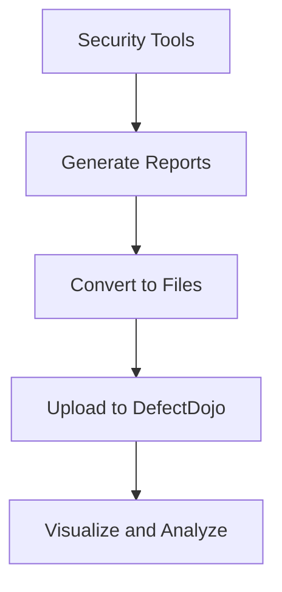

## Introduction to Vulnerability Management and Remediation

Vulnerability management is a critical component of DevSecOps, ensuring that security is integrated throughout the software development lifecycle. In modern applications, especially those deployed in complex environments like cloud infrastructures, vulnerabilities can arise from various sources, including coding errors, misconfigurations, and third-party dependencies. Managing these vulnerabilities effectively requires a systematic approach to identify, prioritize, and remediate security issues.

### Why Centralized Vulnerability Management?

Imagine an application with hundreds of vulnerabilities spread across multiple tools and logs. Analyzing each finding individually would be time-consuming and inefficient. Moreover, some tools may present findings in a less readable format, making it challenging to understand and act upon them. A centralized vulnerability management platform addresses these challenges by consolidating findings from various sources into a single, easily accessible interface.

#### Benefits of Centralized Vulnerability Management

1. **Unified View**: Provides a comprehensive overview of all vulnerabilities across different tools and components.
2. **Efficient Analysis**: Facilitates quicker identification and prioritization of critical issues.
3. **Improved Collaboration**: Enables better communication among team members, as everyone can access the same information.
4. **Automated Reporting**: Simplifies the generation and distribution of security reports.

### Popular Tools for Vulnerability Management

One of the most widely used open-source tools for vulnerability management is **DefectDojo**. DefectDojo is designed to help organizations manage their security findings efficiently by providing a centralized platform for tracking and reporting vulnerabilities.

#### Features of DefectDojo

- **Centralized Dashboard**: Offers a unified view of all security findings.
- **Customizable Reporting**: Allows users to generate detailed reports based on specific criteria.
- **Integration Support**: Supports integration with various security tools and scanners.
- **User Roles and Permissions**: Provides role-based access control to ensure proper authorization.

### Steps to Integrate Findings into DefectDojo

To effectively use DefectDojo, you need to follow these steps:

1. **Convert Findings to Files**: Ensure that the findings from your security tools are stored in files rather than logs. This allows DefectDojo to ingest the data easily.
2. **Upload Reports to DefectDojo**: Use the DefectDojo API or manual upload methods to import the findings into the platform.
3. **Visualize and Analyze**: Utilize DefectDojo’s dashboard to visualize and analyze the findings.

### Example: Integrating Findings from Multiple Tools

Let's consider an example where we have findings from several tools, including secret scans, static analysis tools, and dynamic analysis tools. We will convert these findings into files and then upload them to DefectDojo.

#### Step 1: Convert Findings to Files

Assume we have findings from a secret scan tool that outputs results in JSON format. Here is an example of such a JSON file:

```json
{
  "findings": [
    {
      "file": "src/main.py",
      "line": 42,
      "secret": "abc123",
      "type": "API Key"
    },
    {
      "file": "src/utils.py",
      "line": 105,
      "secret": "def456",
      "type": "Password"
    }
  ]
}
```

Similarly, assume we have findings from a static analysis tool that outputs results in XML format:

```xml
<findings>
  <finding>
    <file>src/main.py</file>
    <line>23</line>
    <description>Use of insecure function</description>
    <severity>High</severity>
  </finding>
  <finding>
    <file>src/utils.py</file>
    <line>78</line>
    <description>Hardcoded password</description>
    <severity>Medium</severity>
  </finding>
</findings>
```

#### Step 2: Upload Reports to DefectDojo

To upload these reports to DefectDojo, you can use the API provided by the platform. Here is an example of how to upload a JSON report using `curl`:

```sh
curl -X POST -H "Content-Type: application/json" -d @secret_scan_report.json http://localhost:8000/api/v2/import-scan/
```

And here is an example of how to upload an XML report:

```sh
curl -X POST -H "Content-Type: application/xml" -d @static_analysis_report.xml http://localhost:8000/api/v2/import-scan/
```

#### Step 3: Visualize and Analyze

Once the reports are uploaded, you can log into DefectDojo and navigate to the dashboard to visualize and analyze the findings. The dashboard provides a comprehensive overview of all vulnerabilities, allowing you to filter and sort based on severity, type, and other criteria.

### Mermaid Diagram: Integration Flow

Here is a mermaid diagram illustrating the integration flow:



### Real-World Examples and Recent Breaches

Recent breaches often highlight the importance of effective vulnerability management. For instance, the SolarWinds breach (CVE-2020-1014) involved a supply chain attack where malicious code was injected into the SolarWinds Orion software. This underscores the need for continuous monitoring and management of vulnerabilities across all components of an application.

### How to Prevent / Defend

#### Detection

- **Regular Scans**: Implement automated scanning tools to regularly check for vulnerabilities.
- **Continuous Monitoring**: Use tools like DefectDojo to continuously monitor and track vulnerabilities.

#### Prevention

- **Secure Coding Practices**: Follow secure coding guidelines to minimize the introduction of vulnerabilities.
- **Dependency Management**: Regularly update and audit third-party dependencies to ensure they are secure.

#### Secure-Coding Fixes

Here is an example of a vulnerable code snippet and its secure version:

**Vulnerable Code:**

```python
import os

def read_file(filename):
    with open(filename, 'r') as f:
        return f.read()
```

**Secure Code:**

```python
import os

def read_file(filename):
    if os.path.isfile(filename):
        with open(filename, 'r') as f:
            return f.read()
    else:
        raise FileNotFoundError("File does not exist")
```

#### Configuration Hardening

Ensure that your environment configurations are hardened against common vulnerabilities. For example, in an Nginx server, you can configure the following settings:

**Insecure Configuration:**

```nginx
server {
    listen 80;
    server_name example.com;

    location / {
        root /var/www/html;
        index index.html;
    }
}
```

**Secure Configuration:**

```nginx
server {
    listen 80;
    server_name example.com;

    location / {
        root /var/www/html;
        index index.html;
        try_files $uri $uri/ =404;
    }

    location ~* \.(js|css|png|jpg|jpeg|gif)$ {
        expires max;
        log_not_found off;
    }
}
```

### Practice Labs

For hands-on practice with vulnerability management, consider the following labs:

- **PortSwigger Web Security Academy**: Offers a variety of labs focused on web application security.
- **OWASP Juice Shop**: A deliberately insecure web application for practicing security testing.
- **DVWA (Damn Vulnerable Web Application)**: Another intentionally vulnerable web app for learning security concepts.

These labs provide practical experience in identifying and managing vulnerabilities, reinforcing the theoretical knowledge gained from this chapter.

### Conclusion

Effective vulnerability management is crucial for maintaining the security of modern applications. By using tools like DefectDojo, you can centralize and streamline the process of identifying, analyzing, and remediating vulnerabilities. This chapter has provided a comprehensive guide to integrating findings from various tools into a centralized platform, along with real-world examples and preventive measures to ensure robust security practices.

---
<!-- nav -->
[[04-Introduction to Vulnerability Management and Remediation Part 3|Introduction to Vulnerability Management and Remediation Part 3]] | [[DevSecOps/DevSecOps Bootcamp/05-Application Security Testing/13-Vulnerability Management and Remediation/Generate Security Scanning Reports/00-Overview|Overview]] | [[06-Common Pitfalls and Best Practices|Common Pitfalls and Best Practices]]
