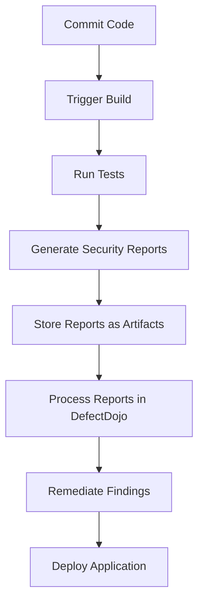

## Processing Security Scanning Reports

Once the reports are generated, they need to be processed further for human consumption or integration into other systems. One common approach is to use a tool like DefectDojo, which can present the findings in a more user-friendly interface.

### DefectDojo

DefectDojo is a tool that aggregates and manages security findings from various sources. It provides a centralized platform for tracking and managing vulnerabilities.

#### How to Integrate Reports into DefectDojo

1. **Upload Reports**: Upload the JSON reports generated by GitLeaks, NJSCAN, and SamGrab into DefectDojo.
2. **Parse Reports**: DefectDojo parses the JSON reports and presents the findings in a user-friendly interface.
3. **Track Findings**: Track the status of each finding (open, in progress, resolved) and assign them to team members for remediation.

### Example of Uploading a Report to DefectDojo

Here is an example of how to upload a report to DefectDojo using the API:

```bash
curl -X POST \
  https://defectdojo.example.com/api/v2/import-scan/ \
  -H 'Authorization: Token <your_api_token>' \
  -F 'file=@/path/to/report.json' \
  -F 'scan_type=Generic Findings Import' \
  -F 'engagement=1' \
  -F 'product=1'
```

### Mermaid Diagram: CI/CD Pipeline with Security Scanning



---
<!-- nav -->
[[DevSecOps/DevSecOps Bootcamp/05-Application Security Testing/13-Vulnerability Management and Remediation/Generate Security Scanning Reports/08-Hands-On Labs|Hands-On Labs]] | [[DevSecOps/DevSecOps Bootcamp/05-Application Security Testing/13-Vulnerability Management and Remediation/Generate Security Scanning Reports/00-Overview|Overview]] | [[DevSecOps/DevSecOps Bootcamp/05-Application Security Testing/13-Vulnerability Management and Remediation/Generate Security Scanning Reports/10-Real-World Examples|Real-World Examples]]
