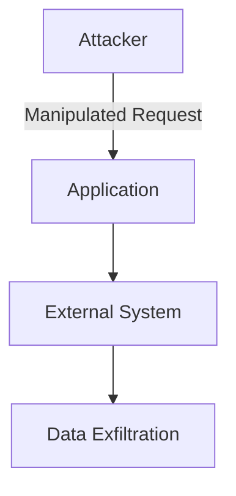
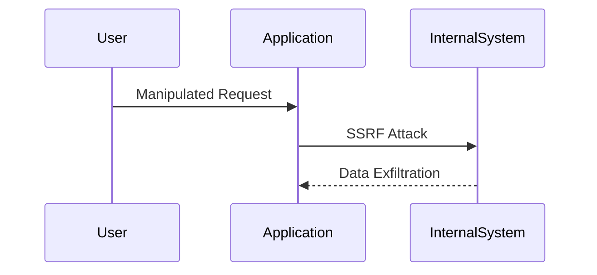
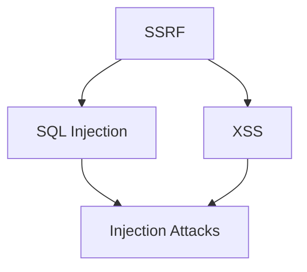

## Introduction to DefectDojo Managing Security Findings CWEs

### Overview of DefectDojo and Security Findings

DefectDojo is an open-source platform designed to manage and track security findings across various applications and systems. It serves as a central repository for security vulnerabilities, allowing teams to integrate security practices into their development workflows. By using DefectDojo, organizations can streamline the process of identifying, tracking, and remediating security issues, ensuring that their applications remain secure throughout their lifecycle.

### Common Weakness Enumeration (CWE)

The Common Weakness Enumeration (CWE) is a standardized dictionary of software weaknesses. Each weakness is assigned a unique identifier (CWE ID) and is described in detail, including its potential impact, likelihood of exploitation, and recommended mitigation strategies. CWEs are categorized into groups based on their characteristics, making it easier to identify and address specific types of vulnerabilities.

### Open Source Security (OS) Top 10 Categories

The Open Source Security (OS) Top 10 is a list of the most critical security risks faced by web applications. This list is updated periodically to reflect the evolving threat landscape. Each category in the OS Top 10 represents a broad class of vulnerabilities, such as injection attacks, broken authentication, and sensitive data exposure. By mapping CWEs to these categories, teams can prioritize their efforts and focus on the most significant threats.

### Mapping CWEs to OS Top 10 Categories

In DefectDojo, CWEs can be mapped to the OS Top 10 categories to provide a structured approach to managing security findings. This mapping helps teams understand the broader context of each vulnerability and its potential impact on the application.

#### Example: Server-Side Request Forgery (SSRF)

One of the CWEs that can be mapped to the OS Top 10 is **Server-Side Request Forgery (SSRF)**, which is identified as CWE-918. SSRF occurs when an attacker can control the URL or parameters used by a server to make external requests. This can lead to unauthorized access to internal systems, data exfiltration, and other malicious activities.



### Detailed Explanation of CWE-918 (SSRF)

#### What is SSRF?

Server-Side Request Forgery (SSRF) is a type of web application vulnerability that allows an attacker to induce the server to send requests to arbitrary domains or IP addresses. This can be exploited to bypass firewalls, access internal systems, and perform other malicious actions.

#### Why Does SSRF Matter?

SSRF is particularly dangerous because it can be used to bypass network security measures and gain unauthorized access to internal systems. For example, an attacker might use SSRF to access a database or internal API that is not exposed to the internet.

#### How Does SSRF Work?

SSRF typically occurs when an application uses user-supplied input to construct a URL or make an HTTP request. If the input is not properly validated, an attacker can manipulate the request to target internal systems.

#### Real-World Example: CVE-2021-21972

A recent example of SSRF is the vulnerability in the Jenkins plugin for Kubernetes, identified as **CVE-2021-21972**. This vulnerability allowed attackers to perform SSRF attacks against internal Kubernetes clusters, potentially leading to unauthorized access and data exfiltration.



### How to Prevent / Defend Against SSRF

#### Detection

To detect SSRF vulnerabilities, teams should use automated tools and manual reviews to identify instances where user-supplied input is used to construct URLs or make HTTP requests. Static analysis tools like SonarQube and dynamic analysis tools like Burp Suite can help identify potential SSRF vulnerabilities.

#### Prevention

To prevent SSRF, developers should follow these best practices:

1. **Validate Input**: Ensure that user-supplied input is properly validated before being used to construct URLs or make HTTP requests.
2. **Whitelist Domains**: Use a whitelist of allowed domains to restrict the destinations of outgoing requests.
3. **Use Secure Libraries**: Utilize libraries and frameworks that have built-in protections against SSRF.

#### Secure Code Fix

Here is an example of how to fix a vulnerable code snippet that could lead to SSRF:

**Vulnerable Code:**

```python
import requests

def fetch_data(url):
    response = requests.get(url)
    return response.text
```

**Fixed Code:**

```python
import requests

ALLOWED_DOMAINS = ["example.com", "api.example.com"]

def fetch_data(url):
    parsed_url = urlparse(url)
    if parsed_url.netloc not in ALLOWED_DOMAINS:
        raise ValueError("Invalid domain")
    response = requests.get(url)
    return response.text
```

### Grouping Related Issues

In DefectDojo, related issues can be grouped together to facilitate the management and remediation process. This grouping can be based on the CWE categories or the OS Top 10 categories. By grouping related issues, teams can address multiple vulnerabilities at once, improving efficiency and reducing the overall risk.

#### Example: Grouping SSRF and Other Injection Attacks

For example, SSRF can be grouped with other injection attacks, such as SQL injection and cross-site scripting (XSS). This grouping allows teams to address common patterns and apply consistent mitigation strategies.



### Conclusion

By using DefectDojo to manage and track security findings, teams can effectively integrate security into their development workflows. Mapping CWEs to the OS Top 10 categories provides a structured approach to prioritizing and addressing the most critical vulnerabilities. Understanding and mitigating SSRF vulnerabilities is crucial for maintaining the security of web applications. By following best practices and using secure coding techniques, teams can significantly reduce the risk of SSRF and other injection attacks.

### Practice Labs

For hands-on practice with vulnerability management and remediation, consider the following labs:

- **PortSwigger Web Security Academy**: Offers interactive labs for learning about various web application vulnerabilities, including SSRF.
- **OWASP Juice Shop**: A deliberately insecure web application for practicing security testing and vulnerability management.
- **DVWA (Damn Vulnerable Web Application)**: A PHP/MySQL web application that is riddled with vulnerabilities for educational purposes.

These labs provide practical experience in identifying and remediating security vulnerabilities, helping teams to become more proficient in managing security findings.

---
<!-- nav -->
[[DevSecOps/DevSecOps Bootcamp/05-Application Security Testing/13-Vulnerability Management and Remediation/Introduction to DefectDojo Managing Security Findings CWEs/00-Overview|Overview]] | [[02-Introduction to DefectDojo Managing Security Findings CWEs Part 2|Introduction to DefectDojo Managing Security Findings CWEs Part 2]]
