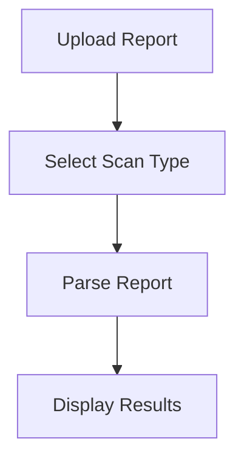
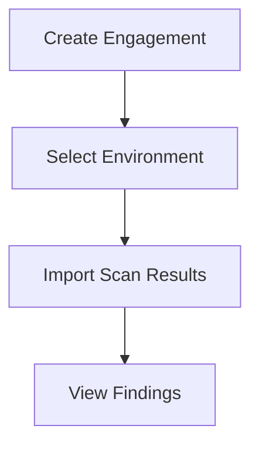
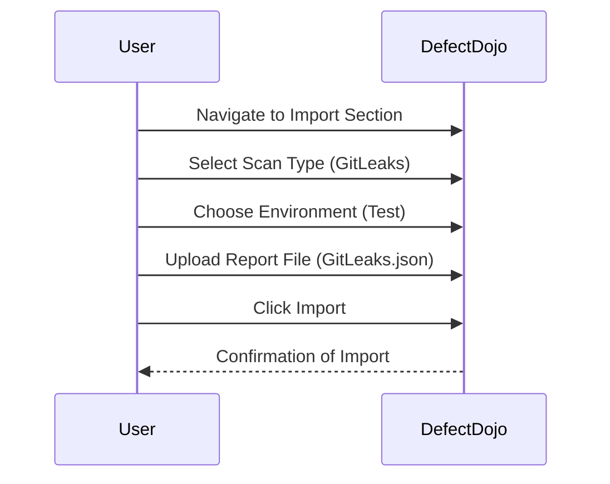
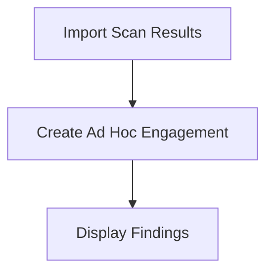
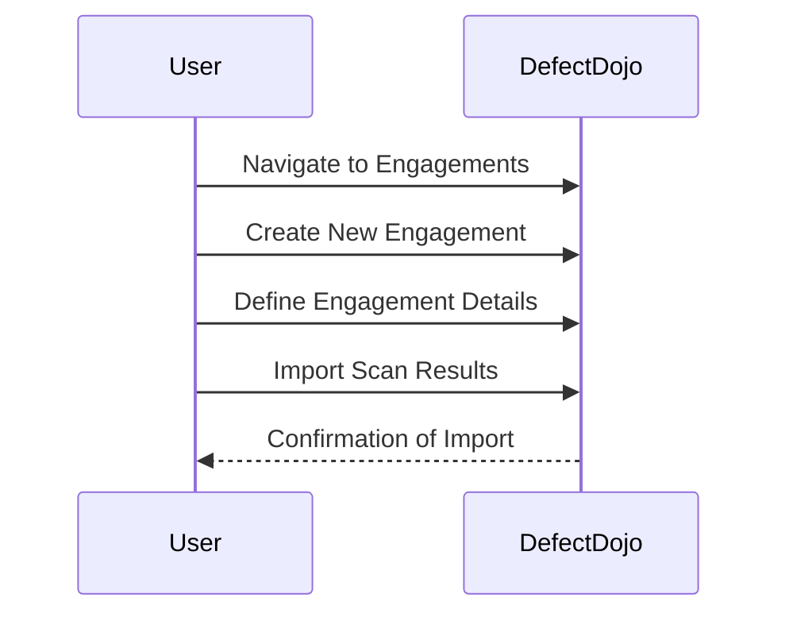
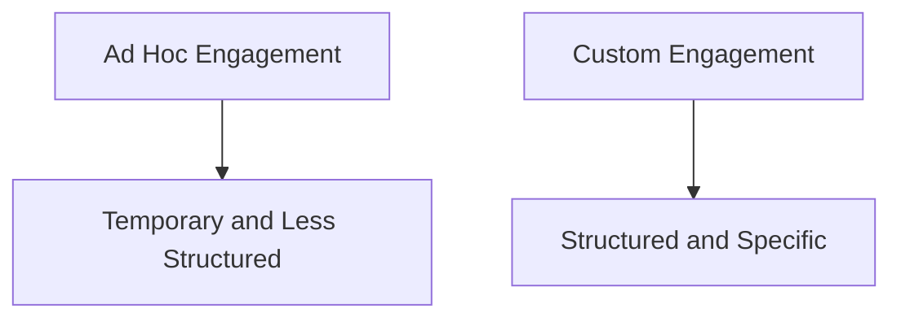

## Introduction to DefectDojo Managing Security Findings CWEs

### Overview of DefectDojo

DefectDojo is an open-source application designed to manage security findings and vulnerabilities across various tools and environments. It serves as a central repository for security data, enabling organizations to track, prioritize, and remediate security issues efficiently. The platform supports a wide range of security tools and integrates seamlessly with continuous integration/continuous deployment (CI/CD) pipelines, making it a valuable asset in the DevSecOps workflow.

### Required Fields in DefectDojo

When managing security findings in DefectDojo, several fields must be filled out correctly to ensure accurate tracking and reporting. The most critical field is the **scan type**, which specifies the tool used to generate the scan results. This information is crucial because it helps DefectDojo interpret the data correctly and apply appropriate rules and configurations.

#### Scan Type

The **scan type** identifies the specific tool that generated the scan results. DefectDojo supports a variety of tools, including static application security testing (SAST), dynamic application security testing (DAST), and dependency scanning tools. Each tool produces different types of reports, and specifying the correct scan type ensures that DefectDo-jo can parse and display the results accurately.

For example, if you are using **GitLeaks** to scan your codebase for secrets and sensitive information, you would select the **GitLeaks scan** type. This tells DefectDojo that the report being uploaded is from the GitLeaks tool, and it should be processed accordingly.



### Environment Selection

Another important field is the **environment** selection. An environment in DefectDojo represents a specific context or stage in the development lifecycle where the code is deployed or tested. Common environments include **development**, **staging**, and **production**.

If you do not have a predefined environment, you can select a default one such as **test**. This choice does not significantly impact the functionality but helps in organizing and categorizing the findings.



### Uploading the Report File

Once the scan type and environment are selected, the next step is to upload the report file. The file format depends on the tool used for scanning. For instance, if you are using GitLeaks, the report file will typically be in JSON format (`GitLeaks.json`).

#### Example Upload Process

1. **Navigate to the Import Section**: Go to the section in DefectDojo where you can import scan results.
2. **Select the Scan Type**: Choose the appropriate scan type (e.g., GitLeaks).
3. **Choose the Environment**: Select the environment where the scan was performed (e.g., test).
4. **Upload the Report File**: Browse and select the `GitLeaks.json` file.
5. **Click Import**: Submit the form to import the scan results.



### Automatic Engagement Creation

When you import a scan result without creating an engagement first, DefectDojo automatically creates an **ad hoc engagement**. An engagement in DefectDojo is a grouping of related activities and findings. Ad hoc engagements are temporary and less structured compared to custom engagements.

#### Example of Ad Hoc Engagement



### Creating Custom Engagements

To gain more control and specificity, you can create custom engagements. These engagements allow you to define the scope, timeline, and other details of the security assessment.

#### Steps to Create a Custom Engagement

1. **Navigate to Engagements**: Go to the engagements section in DefectDojo.
2. **Create New Engagement**: Click on the option to create a new engagement.
3. **Define Engagement Details**: Fill in the necessary details such as the name, start date, end date, and description.
4. **Import Scan Results**: Once the engagement is created, you can import scan results into it.



### Example of Custom Engagement

Let's say you are working on a CI/CD pipeline and want to create an engagement for the release version 1.1. You would follow these steps:

1. **Create Engagement**: Name the engagement "Release version 1.1".
2. **Select Environment**: Choose the appropriate environment (e.g., test).
3. **Import Scan Results**: Upload the `GitLeaks.json` file.


### Comparing Ad Hoc and Custom Engagements

By comparing the ad hoc engagement and the custom engagement, you can see the benefits of creating custom engagements. Custom engagements provide more structure and allow for better organization and prioritization of security findings.



### Real-World Examples

#### Example 1: GitLeaks Finding

Suppose you are using GitLeaks to scan your codebase and find sensitive information. One common finding might be the presence of hardcoded API keys in your code. This is a serious security issue that needs to be addressed immediately.

```json
{
  "filename": "src/main/java/com/example/app/Config.java",
  "line": 15,
  "secret": "abc123xyz",
  "type": "API Key"
}
```

#### Example 2: CVE-2021-44228 (Log4Shell)

In December 2021, the Log4Shell vulnerability (CVE-2021-44228) was discovered in Apache Log4j. This vulnerability allowed attackers to execute arbitrary code on affected systems, leading to widespread exploitation. Using DefectDojo, you can manage and track findings related to this vulnerability.

```json
{
  "cve_id": "CVE-2021-44228",
  "description": "Apache Log4j2 JNDI features do not protect against attacker-controlled LDAP and other JNDI-related URLs.",
  "severity": "Critical",
  "affected_versions": ["2.0-beta9", "2.0", "2.1", "2.2", "2.3", "2.4", "2.5", "2.6", "2.7", "2.8", "2.9", "2.10", "2.11", "2.12", "2.13", "2.14", "2.15"]
}
```

### How to Prevent / Defend

#### Secure Coding Practices

1. **Avoid Hardcoding Secrets**: Ensure that sensitive information such as API keys and passwords are not hardcoded in the codebase. Use environment variables or secure vaults to store such information.
   
   ```java
   // Vulnerable Code
   String apiKey = "abc123xyz";
   
   // Secure Code
   String apiKey = System.getenv("API_KEY");
   ```

2. **Regularly Update Dependencies**: Keep all dependencies up-to-date to mitigate known vulnerabilities. Use tools like Dependabot to automatically update dependencies.

   ```yaml
   # Dependabot Configuration
   version: 2
   updates:
     - package-ecosystem: "maven"
       directory: "/"
       schedule:
         interval: "daily"
   ```

#### Detection and Prevention

1. **Static Application Security Testing (SAST)**: Use SAST tools to identify potential security issues in the codebase. Tools like SonarQube and Fortify can help detect vulnerabilities early in the development process.

2. **Dependency Scanning**: Regularly scan dependencies for known vulnerabilities using tools like OWASP Dependency-Check and Snyk.

   ```bash
   # OWASP Dependency-Check Command
   dependency-check --project MyProject --out ./results --scan .
   ```

3. **Continuous Integration/Continuous Deployment (CI/CD) Pipelines**: Integrate security checks into CI/CD pipelines to ensure that security issues are detected and addressed before code is deployed.

   ```yaml
   # GitHub Actions Workflow
   name: CI/CD Pipeline
   on:
     push:
       branches:
         - main
   jobs:
     build:
       runs-on: ubuntu-latest
       steps:
         - name: Checkout Code
           uses: actions/checkout@v2
         - name: Run SAST Scan
           run: sonar-scanner
         - name: Run Dependency Check
           run: dependency-check --project MyProject --out ./results --scan .
   ```

### Hands-On Labs

To practice and reinforce the concepts learned, consider the following hands-on labs:

- **PortSwigger Web Security Academy**: Offers interactive labs to learn and practice web application security.
- **OWASP Juice Shop**: A deliberately insecure web application for practicing web security skills.
- **DVWA (Damn Vulnerable Web Application)**: A PHP/MySQL web application that is riddled with vulnerabilities for educational purposes.
- **WebGoat**: An interactive, gamified training application for learning about web application security.

These labs provide practical experience in identifying and remediating security vulnerabilities, making them invaluable resources for mastering DevSecOps practices.

### Conclusion

Managing security findings and vulnerabilities is a critical aspect of the DevSecOps workflow. By using tools like DefectDojo, organizations can effectively track, prioritize, and remediate security issues. Understanding the importance of fields such as scan type and environment, and the benefits of creating custom engagements, can significantly enhance the security posture of an organization. Additionally, following secure coding practices and integrating security checks into CI/CD pipelines can help prevent and detect vulnerabilities, ensuring the safety and integrity of applications.

---
<!-- nav -->
[[03-Introduction to DefectDojo Managing Security Findings CWEs Part 3|Introduction to DefectDojo Managing Security Findings CWEs Part 3]] | [[DevSecOps/DevSecOps Bootcamp/05-Application Security Testing/13-Vulnerability Management and Remediation/Introduction to DefectDojo Managing Security Findings CWEs/00-Overview|Overview]] | [[05-Introduction to DefectDojo and Common Weakness Enumeration (CWE)|Introduction to DefectDojo and Common Weakness Enumeration (CWE)]]
