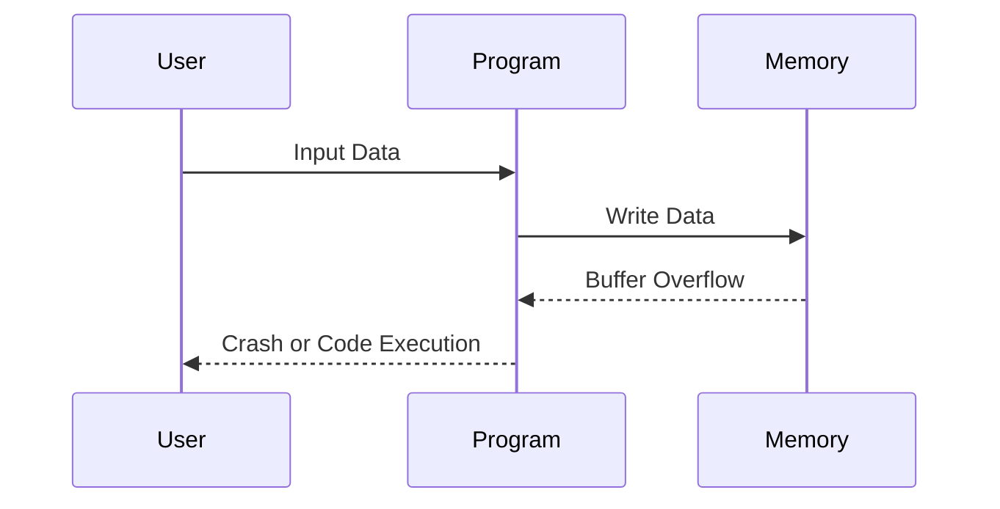
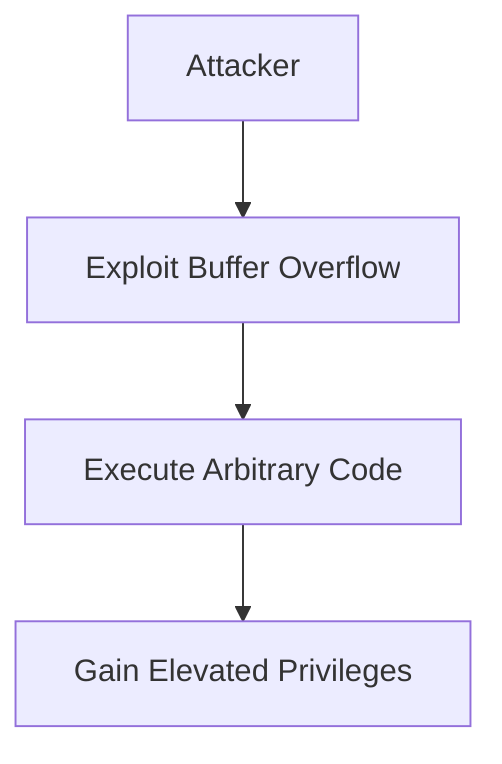

## Introduction to DefectDojo and Common Weakness Enumeration (CWE)

### What is DefectDojo?

DefectDojo is an open-source application designed to manage and track security findings across various stages of the software development lifecycle (SDLC). It serves as a central repository for security vulnerabilities identified through different testing methods such as static analysis, dynamic analysis, and manual penetration testing. By using DefectDojo, organizations can streamline the process of identifying, tracking, and remediating security issues, thereby improving overall software security.

### What is Common Weakness Enumeration (CWE)?

Common Weakness Enumeration (CWE) is a standardized list of common software and hardware weakness types. The primary goal of CWE is to provide developers and engineers with a comprehensive understanding of potential flaws in software and hardware. This knowledge enables them to create automated tools that can identify, fix, and prevent these issues from entering production systems.

#### Why is CWE Important?

CWE is crucial because it provides a standardized framework for discussing and addressing security vulnerabilities. By using a common language and taxonomy, CWE helps ensure that security professionals, developers, and other stakeholders can effectively communicate about security issues. This standardization facilitates better collaboration and more efficient remediation efforts.

#### How Does CWE Work?

CWE categorizes weaknesses into specific types, each assigned a unique numeric identifier. These identifiers allow for precise referencing and discussion of particular vulnerabilities. Each CWE entry includes detailed descriptions of the weakness, including its potential impacts, common causes, and recommended mitigations.

### Independence from Other Standards

It is important to note that CWE is independent of other standards such as the Open Source Security Testing Guide (OSSTMM) or the Open Web Application Security Project (OWASP). Instead, CWE operates as a separate community known as the CWE Community. This community is highly influential and includes major operating system vendors, commercial security tool vendors, government agencies, research institutions, and other stakeholders.

### CWE Community

The CWE Community is a collaborative effort involving various organizations and individuals dedicated to improving software security. Members of this community contribute to the development and maintenance of the CWE list, ensuring that it remains up-to-date and relevant. Some notable members of the CWE Community include:

- **Operating System Vendors**: Companies like Microsoft, Apple, and Linux distributions contribute to the CWE list to improve the security of their products.
- **Commercial Security Tool Vendors**: Organizations such as Veracode, Fortify, and Checkmarx use CWE identifiers in their tools to help customers identify and remediate vulnerabilities.
- **Government Agencies**: Agencies like the National Institute of Standards and Technology (NIST) and the Department of Homeland Security (DHS) support the CWE initiative to enhance national cybersecurity.
- **Research Institutions**: Universities and research centers contribute to the CWE list by conducting studies and providing insights into new and emerging vulnerabilities.

### Using CWE in DefectDojo

In DefectDojo, security findings can be associated with specific CWE identifiers. This association helps in categorizing and prioritizing vulnerabilities based on their severity and potential impact. By clicking on the CWE numeric ID next to an issue in DefectDojo, users can access detailed documentation about the vulnerability on the official CWE website.

#### Example: CWE-119 - Buffer Errors

Let's take a closer look at CWE-119, which refers to buffer errors. Buffer errors occur when a program writes data to a buffer, exceeding the allocated space. This can lead to memory corruption, crashes, and potentially allow attackers to execute arbitrary code.



#### Impact of Buffer Errors

Buffer errors can have severe consequences, including:

- **Data Corruption**: Overwriting adjacent memory locations can corrupt data.
- **Crashes**: Programs may crash due to invalid memory accesses.
- **Code Execution**: Attackers can exploit buffer overflows to execute arbitrary code, leading to unauthorized actions.

#### Real-World Example: CVE-2017-11882

CVE-2017-11882 is a real-world example of a buffer overflow vulnerability in the Windows kernel. This vulnerability allowed attackers to execute arbitrary code with elevated privileges, posing a significant security risk.



### How to Prevent / Defend Against Buffer Errors

To prevent buffer errors, developers should follow best practices such as:

- **Input Validation**: Ensure that input data is within expected bounds.
- **Use Safe Functions**: Replace unsafe functions like `strcpy` with safer alternatives like `strncpy`.
- **Bounds Checking**: Implement runtime checks to verify that data does not exceed buffer limits.

#### Secure Coding Example

Here is an example of insecure code that can lead to a buffer overflow:

```c
#include <stdio.h>
#include <string.h>

void copy_data(char *src, char *dest) {
    strcpy(dest, src);
}

int main() {
    char buffer[10];
    char input[100];
    
    fgets(input, sizeof(input), stdin);
    copy_data(input, buffer);
    
    printf("Copied data: %s\n", buffer);
    
    return 0;
}
```

And here is the secure version using `strncpy`:

```c
#include <stdio.h>
#include <string.h>

void copy_data(char *src, char *dest, size_t dest_size) {
    strncpy(dest, src, dest_size - 1);
    dest[dest_size - 1] = '\0';
}

int main() {
    char buffer[10];
    char input[100];
    
    fgets(input, sizeof(input), stdin);
    copy_data(input, buffer, sizeof(buffer));
    
    printf("Copied data: %s\n", buffer);
    
    return 0;
}
```

### Conclusion

Understanding and utilizing CWE in conjunction with tools like DefectDojo is essential for effective vulnerability management and remediation. By leveraging the standardized framework provided by CWE, organizations can improve communication, prioritize vulnerabilities, and implement robust security measures to protect their software and systems.

### Further Reading and Practice Labs

For hands-on practice with vulnerability management and remediation, consider the following resources:

- **PortSwigger Web Security Academy**: Offers interactive labs covering various web application security topics.
- **OWASP Juice Shop**: A deliberately insecure web application for practicing security testing.
- **DVWA (Damn Vulnerable Web Application)**: Another intentionally vulnerable web application for security training.
- **WebGoat**: An interactive training application for learning web security concepts.

By engaging with these resources, you can gain practical experience in identifying and remediating security vulnerabilities using tools like DefectDojo and the CWE framework.

---
<!-- nav -->
[[04-Introduction to DefectDojo Managing Security Findings CWEs|Introduction to DefectDojo Managing Security Findings CWEs]] | [[DevSecOps/DevSecOps Bootcamp/05-Application Security Testing/13-Vulnerability Management and Remediation/Introduction to DefectDojo Managing Security Findings CWEs/00-Overview|Overview]] | [[06-Introduction to DefectDojo and Managing Security Findings with CWEs|Introduction to DefectDojo and Managing Security Findings with CWEs]]
