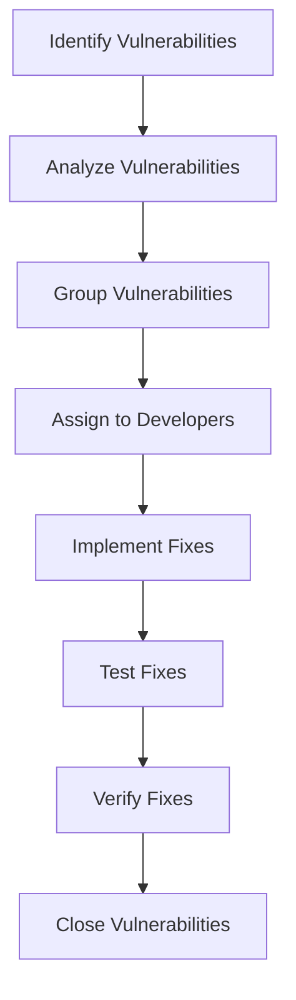

## Introduction to DefectDojo and Managing Security Findings

### Overview of DefectDojo

DefectDojo is an open-source platform designed to manage and track security findings across various applications and systems. It serves as a central repository for security vulnerabilities, enabling teams to collaborate effectively and ensure timely remediation. The platform supports integration with numerous security tools and frameworks, making it a versatile solution for DevSecOps environments.

### Importance of Collaborative Vulnerability Management

In the context of DevSecOps, managing security findings is a collaborative effort involving multiple stakeholders, including developers, security engineers, and DevOps engineers. This collaboration ensures that vulnerabilities are identified, analyzed, and fixed efficiently. The process involves:

- **Identification**: Detecting security vulnerabilities through automated scans and manual reviews.
- **Analysis**: Understanding the nature and severity of the vulnerabilities.
- **Remediation**: Fixing the vulnerabilities and verifying the fixes.
- **Tracking**: Monitoring the status of vulnerabilities throughout their lifecycle.

### Role of Developers in Vulnerability Management

Developers play a crucial role in the vulnerability management process due to their deep understanding of the codebase. They are responsible for:

- **Analyzing Vulnerabilities**: Identifying the root cause of vulnerabilities within the code.
- **Implementing Fixes**: Writing secure code to address identified vulnerabilities.
- **Testing Fixes**: Ensuring that the fixes do not introduce new vulnerabilities.

#### Example: Analyzing a SQL Injection Vulnerability

Consider a scenario where a security scan identifies a SQL injection vulnerability in a web application. The vulnerability might look like this:

```python
# Vulnerable Code
def get_user_data(user_id):
    query = f"SELECT * FROM users WHERE id = {user_id}"
    cursor.execute(query)
    return cursor.fetchall()
```

The developer needs to understand that the `user_id` parameter is directly concatenated into the SQL query, making it susceptible to SQL injection attacks. To fix this, the developer should use parameterized queries:

```python
# Secure Code
def get_user_data(user_id):
    query = "SELECT * FROM users WHERE id = %s"
    cursor.execute(query, (user_id,))
    return cursor.fetchall()
```

### Collaboration Between DevOps and Developers

As a DevOps engineer or DevSecOps engineer, your role is to facilitate the collaboration between security and development teams. You bring in the knowledge of security tools, processes, and best practices, which helps in identifying and prioritizing vulnerabilities. Your responsibilities include:

- **Identifying Vulnerabilities**: Using security tools to identify potential vulnerabilities.
- **Prioritizing Issues**: Determining the severity and impact of vulnerabilities.
- **Facilitating Communication**: Ensuring that developers are aware of the vulnerabilities and their implications.
- **Supporting Fix Implementation**: Assisting developers in implementing and testing fixes.

### Grouping and Analyzing Vulnerabilities

Grouping vulnerabilities based on their nature and impact can streamline the remediation process. For instance, vulnerabilities related to input validation can be grouped together, allowing developers to focus on a specific area of the codebase.

#### Example: Grouping Input Validation Vulnerabilities

Suppose a security scan identifies several input validation vulnerabilities in different parts of the application. These vulnerabilities can be grouped together for analysis and remediation.

```python
# Vulnerable Code
def process_input(input_data):
    if input_data == "admin":
        return "Access granted"
    else:
        return "Access denied"

# Secure Code
def process_input(input_data):
    if isinstance(input_data, str) and input_data.strip() == "admin":
        return "Access granted"
    else:
        return "Access denied"
```

### Real-World Examples and Case Studies

Real-world examples and case studies provide valuable insights into the practical application of vulnerability management techniques. Consider the following recent CVEs and breaches:

- **CVE-2021-44228 (Log4j)**: A critical vulnerability in the Apache Log4j library allowed attackers to execute arbitrary code on affected systems. This vulnerability highlights the importance of regular security updates and patch management.
- **SolarWinds Supply Chain Attack (2020)**: This sophisticated supply chain attack compromised multiple organizations by injecting malicious code into SolarWinds software updates. It underscores the need for robust supply chain security measures.

### Mermaid Diagrams for Vulnerability Management

Mermaid diagrams can help visualize the vulnerability management process, making it easier to understand and communicate.



### How to Prevent and Defend Against Vulnerabilities

Preventing and defending against vulnerabilities requires a multi-faceted approach, including:

- **Secure Coding Practices**: Implementing secure coding guidelines and best practices.
- **Regular Security Audits**: Conducting regular security audits and penetration tests.
- **Patch Management**: Keeping software and libraries up to date with the latest security patches.
- **Security Training**: Providing ongoing security training for developers and other team members.

#### Example: Preventing Cross-Site Scripting (XSS)

Cross-site scripting (XSS) is a common vulnerability that allows attackers to inject malicious scripts into web pages viewed by other users. To prevent XSS, developers should:

- **Sanitize User Inputs**: Ensure that user inputs are properly sanitized and validated.
- **Use Content Security Policy (CSP)**: Implement CSP to restrict the sources of executable scripts.

```http
HTTP/1.1 200 OK
Content-Type: text/html
Content-Security-Policy: default-src 'self'; script-src 'self' https://trustedscripts.example.com;

<!DOCTYPE html>
<html>
<head>
    <title>Example Page</title>
</head>
<body>
    <h1>Welcome, {{ sanitize(user_input) }}</h1>
</body>
</html>
```

### Conclusion

Effective vulnerability management is a collaborative effort that requires the expertise of both developers and DevOps engineers. By leveraging tools like DefectDojo and following best practices, teams can identify, analyze, and remediate vulnerabilities efficiently. This ensures the security and integrity of applications and systems, protecting against potential threats and breaches.

### Practice Labs

For hands-on experience with vulnerability management, consider the following practice labs:

- **PortSwigger Web Security Academy**: Offers interactive labs to practice identifying and fixing web application vulnerabilities.
- **OWASP Juice Shop**: A deliberately insecure web application for practicing security testing and vulnerability management.
- **DVWA (Damn Vulnerable Web Application)**: Provides a variety of web application vulnerabilities for educational purposes.

By engaging with these labs, you can gain practical experience in managing and remediating security findings, enhancing your skills in DevSecOps.

---
<!-- nav -->
[[06-Introduction to DefectDojo and Managing Security Findings with CWEs|Introduction to DefectDojo and Managing Security Findings with CWEs]] | [[DevSecOps/DevSecOps Bootcamp/05-Application Security Testing/13-Vulnerability Management and Remediation/Introduction to DefectDojo Managing Security Findings CWEs/00-Overview|Overview]] | [[08-Introduction to DefectDojo for Managing Security Findings Part 1|Introduction to DefectDojo for Managing Security Findings Part 1]]
