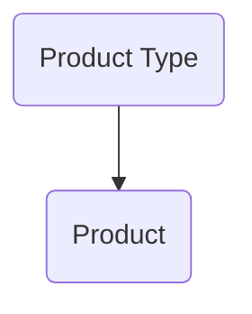
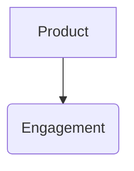
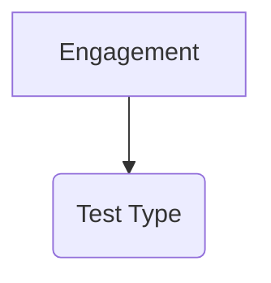

## Introduction to DefectDojo for Managing Security Findings

### Overview of DefectDojo

DefectDojo is an open-source platform designed to manage and track security findings across various applications and environments. It provides a comprehensive framework for integrating different security tools and managing the lifecycle of vulnerabilities. This chapter will delve into the core concepts of DefectDojo, focusing on how it helps in organizing and categorizing security findings effectively.

### Core Concepts of DefectDojo

#### Product Types and Products

At the highest level, DefectDojo organizes security findings using **Product Types** and **Products**. A **Product Type** represents a broad category of applications or services, while a **Product** is a specific instance within that category.

- **Product Type**: This is a high-level classification that groups similar types of applications. For example, if you are working with Google, the **Product Type** might be "Google". Within this **Product Type**, you can have multiple **Products** such as "Google Maps", "Google Docs", and "Gmail".

- **Product**: This represents a specific application or service within a **Product Type**. For instance, if you are a small company developing a microservices-based application like OWASP Juice Shop, the **Product Type** could be "Microservices Application", and each individual microservice would be a **Product**.



#### Customization for Smaller Teams

For smaller teams or companies, the hierarchy can be adjusted to fit their specific needs. For example, if you are developing a microservices-based application like OWASP Juice Shop, you might define:

- **Product Type**: Microservices Application
- **Products**: Each specific microservice within the application

This flexibility allows teams to organize their security findings in a way that makes the most sense for their environment.

### Engagements

An **Engagement** in DefectDojo represents a specific period of time during which security testing is conducted. This could be tied to a particular release version or a specific phase of development.

- **Engagement**: Represents a specific testing period, such as a release version of a microservice. For example, "Release Version 10.2 of Payment Microservice".



### Test Types

Within each engagement, you can define different **Test Types**. These represent the specific types of security tests that are being performed, such as static code analysis, dynamic analysis, penetration testing, etc.

- **Test Type**: Represents the specific type of security test being conducted. For example, "Static Code Analysis", "Dynamic Analysis", "Penetration Testing".



### Example Scenario: Managing Security Findings in a Microservices Application

Let's consider a scenario where a small company is developing a microservices-based application similar to OWASP Juice Shop. Here’s how they might structure their DefectDojo setup:

1. **Product Type**: Microservices Application
2. **Products**:
   - User Service
   - Payment Service
   - Inventory Service
3. **Engagements**:
   - Release Version 1.0 of User Service
   - Release Version 1.1 of Payment Service
4. **Test Types**:
   - Static Code Analysis
   - Dynamic Analysis
   - Penetration Testing

### Raw HTTP Requests and Responses

To illustrate how security findings might be reported and managed, let's look at a hypothetical HTTP request and response for a static code analysis tool integrated with DefectDojo.

#### Example HTTP Request

```http
POST /api/v2/findings/ HTTP/1.1
Host: defectdojo.example.com
Content-Type: application/json
Authorization: Token <your_api_token>

{
    "title": "SQL Injection Vulnerability",
    "date": "2023-10-01",
    "severity": "High",
    "description": "The user input is not properly sanitized, leading to SQL injection.",
    "mitigation": "Implement input validation and parameterized queries.",
    "impact": "An attacker could execute arbitrary SQL commands.",
    "cwe": 89,
    "product": 1,
    "engagement": 2,
    "test": 3
}
```

#### Example HTTP Response

```http
HTTP/1.1 201 Created
Date: Mon, 02 Oct 2023 12:00:00 GMT
Server: Apache/2.4.41 (Ubuntu)
Content-Length: 152
Content-Type: application/json

{
    "id": 456,
    "title": "SQL Injection Vulnerability",
    "date": "2023-10-01",
    "severity": "High",
    "description": "The user input is not properly sanitized, leading to SQL injection.",
    "mitigation": "Implement input validation and parameterized queries.",
    "impact": "An attacker could execute arbitrary SQL commands.",
    "cwe": 89,
    "product": 1,
    "engagement": 2,
    "test": 3
}
```

### Common Pitfalls and Best Practices

#### False Positives

One common issue in vulnerability management is dealing with false positives. DefectDojo allows you to mark findings as false positives, which helps in filtering out noise and focusing on actual security issues.

- **Marking False Positives**: You can mark a finding as a false positive in DefectDojo, which will help in reducing the number of irrelevant findings.

#### Hierarchical Structure

Understanding and correctly setting up the hierarchical structure is crucial for effective management of security findings. Incorrect setup can lead to confusion and mismanagement of vulnerabilities.

- **Hierarchical Structure**: Ensure that the **Product Type**, **Product**, **Engagement**, and **Test Type** are correctly defined and aligned with your organizational structure.

### Real-World Examples

#### Recent CVEs and Breaches

Recent CVEs and breaches often highlight the importance of proper vulnerability management. For example, the Log4j vulnerability (CVE-2021-44228) affected numerous applications and systems globally. Proper management and tracking of such vulnerabilities using tools like DefectDojo can help organizations stay ahead of potential threats.

- **Log4j Vulnerability (CVE-2021-44228)**: This vulnerability affected many applications and systems, emphasizing the need for robust vulnerability management practices.

### How to Prevent / Defend

#### Detection

- **Automated Scanning Tools**: Integrate automated scanning tools with DefectDojo to automatically detect and report vulnerabilities.
- **Regular Audits**: Conduct regular security audits and penetration tests to identify and address vulnerabilities.

#### Prevention

- **Input Validation**: Implement strict input validation to prevent common vulnerabilities like SQL injection and cross-site scripting (XSS).
- **Parameterized Queries**: Use parameterized queries to prevent SQL injection attacks.

#### Secure Coding Fixes

Here’s an example of a vulnerable code snippet and its secure counterpart:

##### Vulnerable Code

```python
# Vulnerable Code
import sqlite3

def get_user_data(user_id):
    conn = sqlite3.connect('database.db')
    cursor = conn.cursor()
    query = f"SELECT * FROM users WHERE id = {user_id}"
    cursor.execute(query)
    result = cursor.fetchone()
    conn.close()
    return result
```

##### Secure Code

```python
# Secure Code
import sqlite3

def get_user_data(user_id):
    conn = sqlite3.connect('database.db')
    cursor = conn.cursor()
    query = "SELECT * FROM users WHERE id = ?"
    cursor.execute(query, (user_id,))
    result = cursor.fetchone()
    conn.close()
    return result
```

### Configuration Hardening

#### Nginx Configuration Example

Here’s an example of securing an Nginx server configuration:

##### Insecure Configuration

```nginx
server {
    listen 80;
    server_name example.com;

    location / {
        root /var/www/html;
        index index.html;
    }
}
```

##### Secure Configuration

```nginx
server {
    listen 80 default_server;
    server_name _;

    location / {
        root /var/www/html;
        index index.html;
        deny all;
    }

    location /secure {
        root /var/www/html;
        index index.html;
        allow 192.168.1.0/24;
        deny all;
    }
}
```

### Hands-On Labs

For practical experience with DefectDojo, consider the following labs:

- **PortSwigger Web Security Academy**: Offers hands-on labs for web application security, which can be integrated with DefectDojo.
- **OWASP Juice Shop**: A deliberately insecure web application for practicing security testing and management.
- **DVWA (Damn Vulnerable Web Application)**: Another popular web application for learning and practicing web security.

### Conclusion

Effective management of security findings is crucial for maintaining the security posture of any organization. DefectDojo provides a robust framework for organizing and tracking vulnerabilities, helping teams stay proactive in addressing security issues. By understanding and implementing the core concepts of DefectDojo, teams can significantly enhance their ability to manage and mitigate security risks.

---
<!-- nav -->
[[07-Introduction to DefectDojo and Managing Security Findings|Introduction to DefectDojo and Managing Security Findings]] | [[DevSecOps/DevSecOps Bootcamp/05-Application Security Testing/13-Vulnerability Management and Remediation/Introduction to DefectDojo Managing Security Findings CWEs/00-Overview|Overview]] | [[09-Introduction to DefectDojo for Managing Security Findings Part 2|Introduction to DefectDojo for Managing Security Findings Part 2]]
