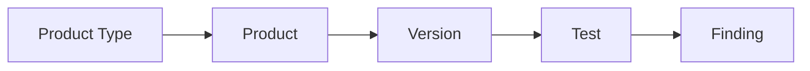

## Introduction to DefectDojo for Managing Security Findings

### What is DefectDojo?

DefectDojo is an open-source platform designed to manage security findings and vulnerabilities across various types of applications and services. It provides a centralized location to track security tests, findings, and remediation efforts. This tool is particularly useful for organizations that need to maintain a comprehensive view of their security posture and ensure that vulnerabilities are addressed in a timely manner.

### Why Use DefectDojo?

The primary reason to use DefectDojo is to streamline the process of managing security findings. By centralizing the tracking of vulnerabilities, organizations can:

- **Improve Visibility:** Gain a clear overview of the security status of their applications and services.
- **Enhance Collaboration:** Facilitate communication between security teams, developers, and other stakeholders.
- **Facilitate Remediation:** Provide a structured approach to addressing vulnerabilities and ensuring that they are resolved.

### How Does DefectDojo Work?

DefectDojo operates on a hierarchical structure, which includes the following key components:

- **Product Type:** A high-level category that defines the type of application or service being tested.
- **Product:** A specific instance of an application or service within a product type.
- **Version:** A particular release version of a product.
- **Test:** A specific security test performed on a product version.
- **Finding:** The results of a test, indicating potential vulnerabilities or issues.

### Example: Setting Up a Product Type in DefectDojo

Let's walk through the process of setting up a product type in DefectDojo. We'll use a hypothetical scenario where we are managing security findings for a microservice-based application called "Juice Shop."

#### Step-by-Step Setup

1. **Create a Product Type:**
   - Navigate to the DefectDojo interface.
   - Click on the "Products" section.
   - Select "Add Product Type."
   - Enter a name for the product type, such as "Microservice Application."
   - Submit the form.

2. **Create a Product:**
   - Once the product type is created, navigate back to the "Products" section.
   - Click on "Add Product."
   - Choose the product type you just created (e.g., "Microservice Application").
   - Enter a name for the product, such as "Juice Shop."
   - Submit the form.

3. **Create a Version:**
   - After creating the product, navigate to the product details page.
   - Click on "Add Version."
   - Enter a version number, such as "1.0.0."
   - Submit the form.

4. **Perform a Test:**
   - With the version created, you can now perform a security test.
   - Click on "Add Test."
   - Choose the appropriate test type (e.g., "API Security Test").
   - Configure the test parameters and run the test.

5. **View Findings:**
   - Once the test is completed, navigate to the "Findings" section.
   - Review the findings generated by the test.
   - Each finding will include details such as the severity, description, and steps to reproduce.

### Visualization of Findings

DefectDojo provides visualization tools to help you understand the distribution and severity of findings. One such tool is a graph that shows the number of findings per test type. Here’s an example of how this might look:



In this diagram:
- `A` represents the product type.
- `B` represents the product.
- `C` represents the version.
- `D` represents the test.
- `E` represents the findings.

### Real-World Examples

To illustrate the practical application of DefectDojo, let's consider a recent breach involving a microservice-based application. In 2021, a major e-commerce platform experienced a data breach due to unpatched vulnerabilities in one of its microservices. By using DefectDojo, the organization could have:

- **Identified Vulnerabilities:** Regularly performed security tests to identify potential vulnerabilities.
- **Prioritized Remediation:** Used the findings to prioritize which vulnerabilities needed immediate attention.
- **Documented Fixes:** Kept a record of the remediation efforts to ensure that similar issues were not overlooked in the future.

### Common Pitfalls and Best Practices

When using DefectDojo, it's important to avoid common pitfalls and follow best practices:

- **Regular Testing:** Ensure that security tests are performed regularly to catch new vulnerabilities.
- **Clear Communication:** Maintain clear communication channels between security teams and developers to ensure that findings are understood and addressed.
- **Documentation:** Keep detailed records of all tests, findings, and remediation efforts to facilitate future audits and reviews.

### How to Prevent / Defend

To effectively use DefectDojo for vulnerability management and remediation, follow these steps:

1. **Set Up a Robust Testing Schedule:**
   - Regularly schedule security tests to ensure that vulnerabilities are identified and addressed in a timely manner.
   - Example:
     ```mermaid
sequenceDiagram
         participant SecurityTeam
         participant Developer
         participant DefectDojo
         
         SecurityTeam->>Developer: Schedule Security Test
         Developer->>DefectDojo: Perform Test
         DefectDojo-->>SecurityTeam: Report Findings
         SecurityTeam->>Developer: Address Findings
```

2. **Prioritize High-Risk Findings:**
   - Focus on addressing high-risk findings first to minimize the potential impact of vulnerabilities.
   - Example:
     ```mermaid
graph TD
         A[High-Risk Finding] --> B[Immediate Action]
         B --> C[Remediation Efforts]
         C --> D[Verification]
```

3. **Implement Secure Coding Practices:**
   - Encourage developers to follow secure coding practices to reduce the likelihood of introducing vulnerabilities.
   - Example:
     ```mermaid
graph TD
         A[Secure Coding Guidelines] --> B[Code Review]
         B --> C[Vulnerability Scanning]
         C --> D[Remediation]
```

4. **Use Automated Tools:**
   - Leverage automated tools to assist in the identification and remediation of vulnerabilities.
   - Example:
     ```mermaid
graph TD
         A[Automated Scanning Tool] --> B[Identify Vulnerabilities]
         B --> C[Report to DefectDojo]
         C --> D[Remediation]
```

5. **Maintain Detailed Documentation:**
   - Keep detailed records of all tests, findings, and remediation efforts to facilitate future audits and reviews.
   - Example:
     ```mermaid
graph TD
         A[Test Execution] --> B[Generate Report]
         B --> C[Store in DefectDojo]
         C --> D[Audit and Review]
```

### Hands-On Demo

To get comfortable with DefectDojo, you can perform a hands-on demo using the following steps:

1. **Create a Product Type:**
   - Navigate to the DefectDojo interface.
   - Click on the "Products" section.
   - Select "Add Product Type."
   - Enter a name for the product type, such as "Secure App."
   - Submit the form.

2. **Create a Product:**
   - Once the product type is created, navigate back to the "Products" section.
   - Click on "Add Product."
   - Choose the product type you just created (e.g., "Secure App").
   - Enter a name for the product, such as "Juice Shop."
   - Submit the form.

3. **Create a Version:**
   - After creating the product, navigate to the product details page.
   - Click on "Add Version."
   - Enter a version number, such as "1.0.0."
   - Submit the form.

4. **Perform a Test:**
   - With the version created, you can now perform a security test.
   - Click on "Add Test."
   - Choose the appropriate test type (e.g., "API Security Test").
   - Configure the test parameters and run the test.

5. **View Findings:**
   - Once the test is completed, navigate to the "Findings" section.
   - Review the findings generated by the test.
   - Each finding will include details such as the severity, description, and steps to reproduce.

### Conclusion

DefectDojo is a powerful tool for managing security findings and vulnerabilities. By following the steps outlined in this chapter, you can effectively use DefectDojo to improve your organization's security posture. Remember to regularly perform security tests, prioritize high-risk findings, implement secure coding practices, use automated tools, and maintain detailed documentation. With these best practices in place, you can ensure that your applications and services remain secure and resilient against potential threats.

---
<!-- nav -->
[[08-Introduction to DefectDojo for Managing Security Findings Part 1|Introduction to DefectDojo for Managing Security Findings Part 1]] | [[DevSecOps/DevSecOps Bootcamp/05-Application Security Testing/13-Vulnerability Management and Remediation/Introduction to DefectDojo Managing Security Findings CWEs/00-Overview|Overview]] | [[10-Introduction to DefectDojo for Managing Security Findings Part 3|Introduction to DefectDojo for Managing Security Findings Part 3]]
