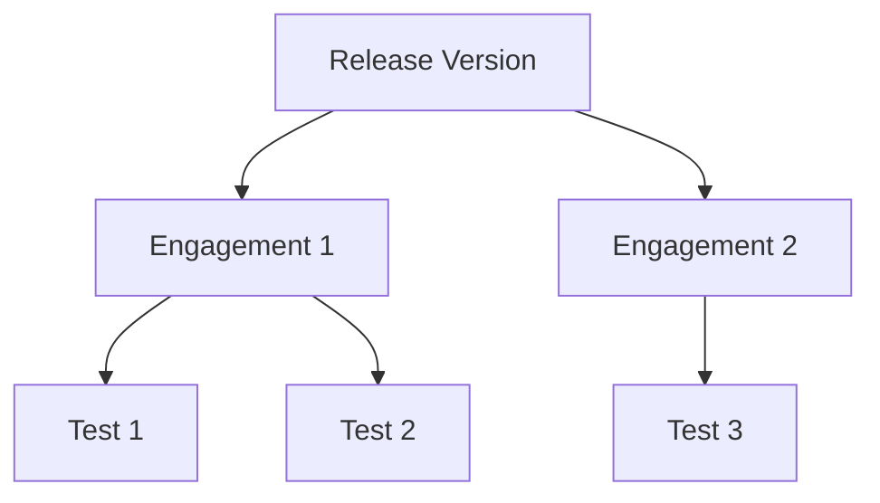
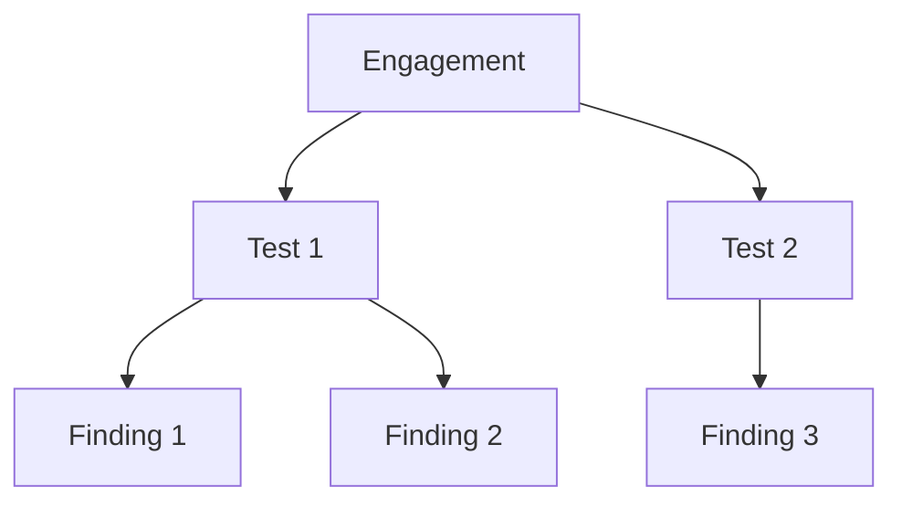
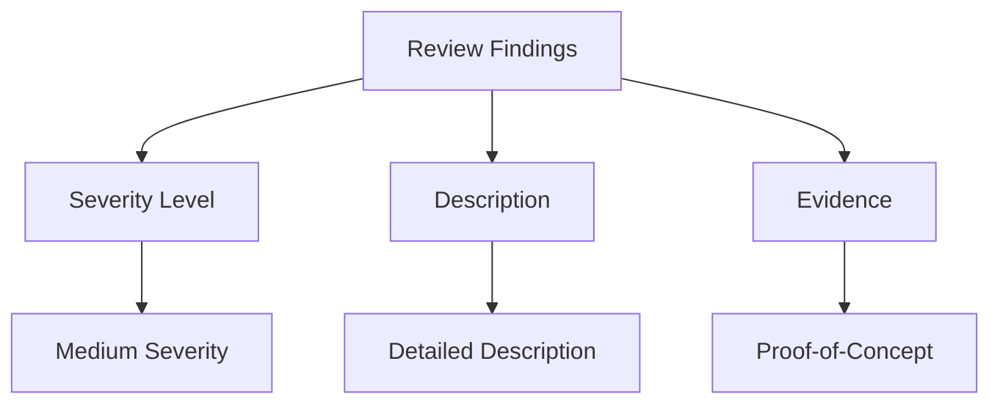

## Introduction to DefectDojo for Managing Security Findings

### Overview of DefectDojo

DefectDojo is an open-source platform designed to manage and track security findings across various stages of the software development lifecycle. It serves as a central repository for security vulnerabilities identified during static analysis, dynamic analysis, manual testing, and other security assessments. By integrating with various security tools, DefectDojo provides a unified view of security findings, enabling teams to prioritize and remediate issues effectively.

### Importance of Centralized Vulnerability Management

Centralizing vulnerability management is crucial for several reasons:

1. **Visibility**: A centralized system ensures that all security findings are visible to the entire team, including developers, security analysts, and project managers.
2. **Prioritization**: With a comprehensive view of all vulnerabilities, teams can prioritize remediation efforts based on severity and business impact.
3. **Efficiency**: Automated integration with security tools reduces manual effort and ensures that findings are up-to-date.
4. **Compliance**: Centralized tracking helps organizations meet regulatory requirements by maintaining a record of all security findings and remediation activities.

### Key Concepts in DefectDojo

#### Release Version

In DefectDojo, a release version represents a specific build or deployment of an application. Each release version can have multiple engagements, which are essentially security assessments conducted on that version.



#### Engagement

An engagement in DefectDojo is a security assessment conducted on a specific release version. Engagements can include various types of tests, such as static analysis, dynamic analysis, and manual testing.



#### Test Type

Each engagement can have multiple test types, which represent the specific security tools or methods used to identify vulnerabilities. Common test types include static analysis tools like SonarQube, dynamic analysis tools like Burp Suite, and manual testing.

#### Finding

A finding is a specific security issue identified during a test. Each finding includes details such as the severity level, description, and any associated evidence or proof-of-concept.

### Importing Scan Results

One of the key features of DefectDojo is its ability to import scan results from various security tools. This allows teams to centralize all security findings in a single platform, making it easier to manage and remediate vulnerabilities.

#### Supported Formats

DefectDojo supports multiple formats for importing scan results, including SARIF (Static Analysis Results Interchange Format), JSON, XML, and others. The choice of format depends on the specific security tool being used.

##### Example: Importing SARIF Results

Let's walk through the process of importing SARIF results from a Node.js scan.

1. **Generate SARIF Report**: Run a static analysis tool on your Node.js application to generate a SARIF report. For example, using ESLint with the `eslint-plugin-security` plugin:

    ```bash
    eslint --format sarif --output report.sarif .
    ```

2. **Import SARIF Report in DefectDojo**:
    - Navigate to the appropriate release version and engagement in DefectDojo.
    - Click on the "Import Scan Results" option.
    - Choose the SARIF format and upload the generated report.

    ```mermaid
sequenceDiagram
        participant User
        participant DefectDojo
        User->>DefectDojo: Navigate to Engagement
        DefectDojo-->>User: Display Import Options
        User->>DefectDojo: Select SARIF Format
        User->>DefectDojo: Upload Report
        DefectDojo-->>User: Display Imported Findings
```

3. **Review Imported Findings**: After importing the SARIF report, review the findings in DefectDojo. Each finding will include details such as the severity level, description, and any associated evidence.

    ```mermaid
graph TD
        A[Imported Findings] --> B[Severity Level]
        A --> C[Description]
        A --> D[Evidence]
```

### Real-World Example: CVE-2021-44228 (Log4j)

The Log4j vulnerability (CVE-2021-44228) is a critical example of why centralized vulnerability management is essential. This vulnerability allowed attackers to execute arbitrary code on affected systems, leading to widespread exploitation.

#### Impact

- **Severity**: Critical (CVSS v3.1 Base Score: 10.0)
- **Affected Systems**: Any system using Apache Log4j versions 2.0-beta9 to 2.14.1
- **Exploitation**: Remote code execution

#### Detection and Remediation

1. **Detection**:
    - Use static analysis tools to scan for vulnerable Log4j versions.
    - Monitor network traffic for signs of exploitation attempts.

2. **Remediation**:
    - Upgrade to Log4j version 2.15.0 or later.
    - Apply security patches and configurations to mitigate the vulnerability.

    ```mermaid
graph TD
        A[Detection] --> B[Static Analysis]
        A --> C[Network Monitoring]
        B --> D[Identify Vulnerable Versions]
        C --> E[Detect Exploitation Attempts]
        A --> F[Remediation]
        F --> G[Upgrade Log4j]
        F --> H[Apply Security Patches]
```

### How to Prevent / Defend

#### Secure Coding Practices

1. **Input Validation**: Always validate user input to prevent injection attacks.
2. **Least Privilege Principle**: Ensure that applications run with the least privileges necessary.
3. **Regular Updates**: Keep all dependencies and libraries up-to-date to mitigate known vulnerabilities.

    ```mermaid
graph TD
        A[Secure Coding] --> B[Input Validation]
        A --> C[Least Privilege]
        A --> D[Regular Updates]
```

#### Configuration Hardening

1. **Disable Unnecessary Features**: Disable any features or services that are not required for the application to function.
2. **Enable Security Features**: Enable security features such as encryption, authentication, and authorization.
3. **Audit Logs**: Configure audit logs to monitor for suspicious activity.

    ```mermaid
graph TD
        A[Configuration Hardening] --> B[Disable Unnecessary Features]
        A --> C[Enable Security Features]
        A --> D[Audit Logs]
```

### Complete Example: Importing Scan Results

Let's walk through a complete example of importing scan results from multiple tools into DefectDojo.

#### Step 1: Generate Scan Reports

1. **Node.js Scan**: Use ESLint to generate a SARIF report.
    ```bash
    eslint --format sarif --output nodejs_report.sarif .
    ```

2. **GitLeaks Scan**: Use GitLeaks to scan for secrets and generate a JSON report.
    ```bash
    gitleaks --report=gitleaks_report.json
    ```

3. **Semgrep Scan**: Use Semgrep to scan for security issues and generate a JSON report.
    ```bash
    semgrep --json semgrep_report.json
    ```

#### Step 2: Import Scan Results in DefectDojo

1. **Navigate to Engagement**: Log in to DefectDojo and navigate to the appropriate release version and engagement.
2. **Import Node.js Scan Results**:
    - Click on "Import Scan Results".
    - Choose the SARIF format and upload the `nodejs_report.sarif` file.
3. **Import GitLeaks Scan Results**:
    - Click on "Import Scan Results".
    - Choose the JSON format and upload the `gitleaks_report.json` file.
4. **Import Semgrep Scan Results**:
    - Click on "Import Scan Results".
    - Choose the JSON format and upload the `semgrep_report.json` file.

#### Step 3: Review and Act on Findings

After importing the scan results, review the findings in DefectDojo. Each finding will include details such as the severity level, description, and any associated evidence.



### Conclusion

Centralized vulnerability management using DefectDojo is essential for effective DevSecOps practices. By integrating with various security tools and providing a unified view of security findings, DefectDojo enables teams to prioritize and remediate vulnerabilities efficiently. Understanding the key concepts and processes involved in managing security findings is crucial for ensuring the security and integrity of software applications.

### Practice Labs

For hands-on experience with DefectDojo, consider the following practice labs:

- **PortSwigger Web Security Academy**: Focuses on web application security and includes exercises related to vulnerability management.
- **OWASP Juice Shop**: A deliberately insecure web application for practicing security assessments and vulnerability management.
- **DVWA (Damn Vulnerable Web Application)**: Another intentionally vulnerable web application for learning security concepts and practices.

These labs provide practical experience in identifying and managing security findings, making them valuable resources for mastering DevSecOps practices.

---
<!-- nav -->
[[10-Introduction to DefectDojo for Managing Security Findings Part 3|Introduction to DefectDojo for Managing Security Findings Part 3]] | [[DevSecOps/DevSecOps Bootcamp/05-Application Security Testing/13-Vulnerability Management and Remediation/Introduction to DefectDojo Managing Security Findings CWEs/00-Overview|Overview]] | [[12-Introduction to DefectDojo for Managing Security Findings Part 5|Introduction to DefectDojo for Managing Security Findings Part 5]]
