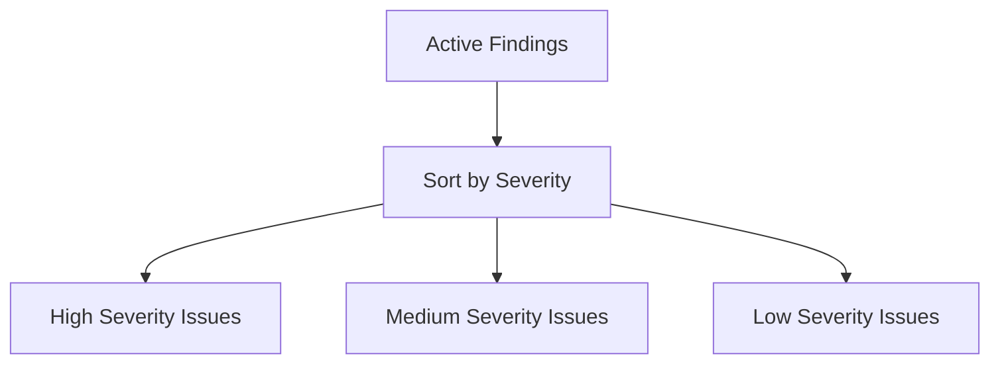

## Introduction to DefectDojo for Managing Security Findings

### Overview of DefectDojo

DefectDojo is an open-source platform designed to manage and track security vulnerabilities across various tools and engagements. It provides a centralized location to aggregate findings from different security testing tools, making it easier to prioritize and remediate issues. In this chapter, we will delve into the core concepts of using DefectDojo to manage security findings, focusing on Common Weakness Enumerations (CWEs).

### Importance of Centralized Finding Management

Centralizing security findings is crucial for several reasons:

1. **Efficiency**: Instead of manually checking each tool's output, DefectDojo aggregates findings from multiple sources, saving time and reducing human error.
2. **Prioritization**: By sorting findings based on severity, teams can focus on the most critical issues first.
3. **Visibility**: A unified view of all findings helps in understanding the overall security posture of an application or system.

### Active Findings in DefectDojo

When navigating to the "findings" section in DefectDojo, you can choose to view "active findings." These are the currently identified vulnerabilities that require attention. The list includes findings from various tools used during the engagement.

#### Severity Sorting

One of the key features of DefectDojo is the ability to sort findings by severity. This allows you to prioritize issues based on their potential impact. For instance, high-severity issues should be addressed immediately, while lower-severity issues can be handled later.



### Tool-Specific Findings

Each finding in DefectDojo is associated with the tool that detected it. This information is valuable because different tools may have varying levels of accuracy and specificity. Some common tools include:

- **SemGrep**: A static analysis tool that checks for coding patterns and security issues.
- **GitLeaks**: A tool that detects sensitive data leaks in Git repositories.
- **NGS Scan**: A network scanning tool that identifies vulnerabilities in network infrastructure.

By knowing which tool reported a finding, you can better understand the context and reliability of the issue.

### Detailed Finding View

Clicking on a specific finding in DefectDojo opens a detailed view that provides more information about the issue. This includes:

- **Location**: The exact file and line number where the issue is located.
- **Description**: A detailed explanation of the issue and its potential impact.
- **Code Snippet**: A portion of the code that led to the finding.

#### Example: SQL Injection

Let's consider an example where DefectDojo reports a SQL injection vulnerability. The detailed view might look like this:

```mermaid
graph TD
    A[Detailed Finding View] --> B[Location]
    B --> C[File: app.py]
    B --> D[Line: 42]
    A --> E[Description]
    E --> F[SQL Injection Vulnerability]
    E --> G[Variable Input Not Sanitized]
    A --> H[Code Snippet]
    H --> I[SELECT * FROM users WHERE username = '{input}']
```

### Code Snippet Analysis

The code snippet provided in the detailed view helps developers quickly identify and fix the issue. For instance, the following code snippet is vulnerable to SQL injection:

```python
# Vulnerable Code
def get_user(username):
    cursor.execute(f"SELECT * FROM users WHERE username = '{username}'")
    return cursor.fetchone()
```

To prevent SQL injection, you should use parameterized queries. Here’s the corrected version:

```python
# Secure Code
def get_user(username):
    cursor.execute("SELECT * FROM users WHERE username = %s", (username,))
    return cursor.fetchone()
```

### How to Prevent / Defend Against SQL Injection

#### Detection

- **Static Analysis Tools**: Tools like SemGrep can detect SQL injection vulnerabilities in code.
- **Dynamic Analysis Tools**: Tools like Burp Suite can test for SQL injection vulnerabilities during runtime.

#### Prevention

- **Parameterized Queries**: Always use parameterized queries to prevent SQL injection.
- **Input Validation**: Validate user inputs to ensure they meet expected formats.
- **Least Privilege Principle**: Ensure database accounts have the least privileges necessary to perform their tasks.

#### Secure Coding Practices

- **Use ORM Libraries**: Object-relational mapping libraries like SQLAlchemy automatically handle SQL injection risks.
- **Escaping User Inputs**: Escape user inputs to ensure they are treated as literal strings.

### Real-World Examples

#### CVE-2021-21972

In 2021, a SQL injection vulnerability was discovered in the WordPress plugin "WP GDPR Compliance." This vulnerability allowed attackers to execute arbitrary SQL commands, leading to potential data theft.

**Vulnerable Code:**
```php
// Vulnerable Code
$query = "SELECT * FROM wp_users WHERE user_login = '" . $_POST['username'] . "'";
```

**Secure Code:**
```php
// Secure Code
$query = $wpdb->prepare("SELECT * FROM wp_users WHERE user_login = %s", $_POST['username']);
```

### Hands-On Practice Labs

For hands-on practice with DefectDojo and managing security findings, consider the following labs:

- **PortSwigger Web Security Academy**: Offers interactive labs to practice identifying and fixing SQL injection vulnerabilities.
- **OWASP Juice Shop**: A deliberately insecure web application for practicing security testing and vulnerability management.

### Conclusion

Managing security findings effectively is crucial for maintaining the security of applications and systems. DefectDojo provides a robust platform for aggregating, prioritizing, and remediating vulnerabilities. By leveraging the detailed views and tool-specific findings, teams can efficiently address security issues and improve overall security posture.

In the next sections, we will explore more advanced features of DefectDojo and dive deeper into specific types of vulnerabilities and their mitigation strategies.

---
<!-- nav -->
[[11-Introduction to DefectDojo for Managing Security Findings Part 4|Introduction to DefectDojo for Managing Security Findings Part 4]] | [[DevSecOps/DevSecOps Bootcamp/05-Application Security Testing/13-Vulnerability Management and Remediation/Introduction to DefectDojo Managing Security Findings CWEs/00-Overview|Overview]] | [[13-Introduction to DefectDojo for Managing Security Findings|Introduction to DefectDojo for Managing Security Findings]]
