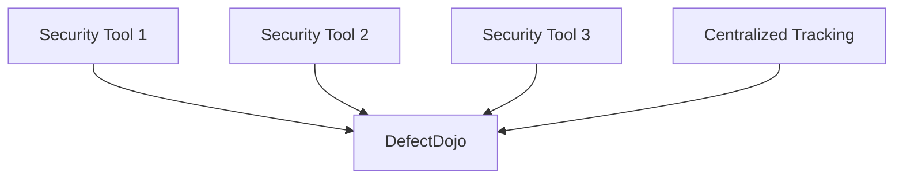
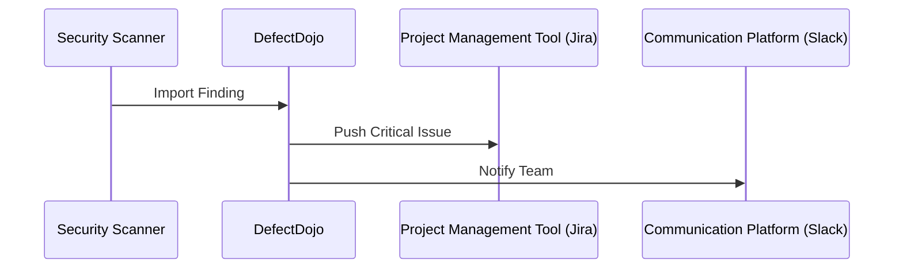
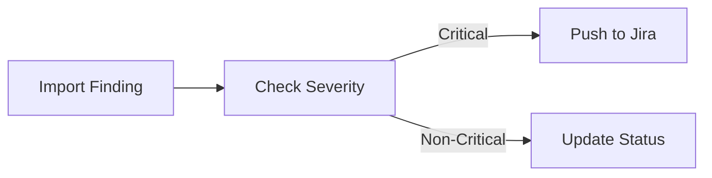
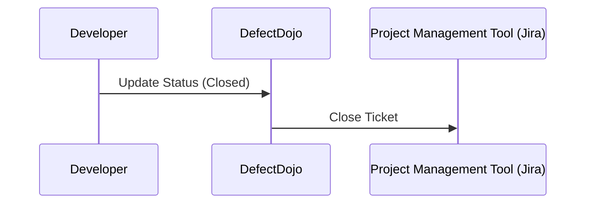

## Introduction to DefectDojo for Managing Security Findings

### Overview of DefectDojo

DefectDojo is an open-source platform designed to manage and track security vulnerabilities across various applications and systems. It serves as a central repository for security findings, enabling organizations to streamline their vulnerability management processes. By integrating with numerous security tools, DefectDojo provides a comprehensive solution for aggregating, tracking, and remediating security issues.

#### Why Focus on Concepts Over Tools?

When learning about vulnerability management and remediation, it is crucial to focus on the underlying concepts rather than specific tools. This approach ensures that you can apply your knowledge to any tool or technology that may come into play. Tools and technologies evolve rapidly, and what is popular today might be obsolete tomorrow. Understanding the core principles allows you to adapt to new tools and methodologies effectively.

### Key Concepts in DefectDojo

To fully grasp how DefectDojo operates, it is essential to understand several key concepts:

1. **Integration with Multiple Tools**: DefectDojo supports integration with a wide range of security tools, allowing you to import findings from various sources.
2. **Configuration for Automated Actions**: You can configure DefectDojo to automatically push critical findings to other tools such as Jira or Slack, ensuring timely action.

#### Integration with Multiple Tools

One of the primary strengths of DefectDojo is its ability to integrate with numerous security tools. This integration enables you to import findings from various scanners and tools, providing a centralized view of all security issues.

**Why Integration Matters**

- **Centralized View**: Having a single platform to aggregate findings from multiple tools simplifies the management process.
- **Consistency**: Ensures that all security findings are tracked uniformly, regardless of the tool used to discover them.
- **Efficiency**: Reduces the time and effort required to manually consolidate findings from different sources.

**Real-World Example: Recent CVEs**

Consider the recent CVE-2021-44228 (Log4j vulnerability). Organizations using various security tools to scan for this vulnerability could import their findings into DefectDojo. This centralized approach would allow the organization to track the status of remediation efforts across all affected systems.



#### Configuration for Automated Actions

DefectDojo allows you to configure automated actions based on the severity of the findings. For instance, critical issues can be automatically pushed to project management tools like Jira or communication platforms like Slack.

**Why Automated Actions Matter**

- **Timely Action**: Ensures that critical issues are addressed promptly without manual intervention.
- **Workflow Integration**: Integrates seamlessly with existing workflows, enhancing overall efficiency.
- **Reduced Overhead**: Minimizes the administrative burden associated with managing security findings.

**Real-World Example: Recent Breach**

In the case of the SolarWinds breach (CVE-2020-1014), organizations could have configured DefectDojo to automatically push critical findings related to this vulnerability to their project management tools. This would ensure that the necessary teams were immediately notified and could take appropriate action.



### Detailed Workflow of DefectDojo

To better understand how DefectDojo operates, let's walk through a detailed workflow:

1. **Import Findings**: Security tools scan applications and systems, generating findings that are then imported into DefectDojo.
2. **Track Findings**: DefectDojo tracks the status of each finding, including its severity, status (open/closed), and assigned owner.
3. **Configure Actions**: Based on the severity of the findings, DefectDojo can be configured to automatically push critical issues to other tools.
4. **Remediate Issues**: Teams work to remediate the identified issues, updating the status in DefectDojo as they progress.

#### Import Findings

The first step in the workflow is importing findings from various security tools into DefectDojo. This can be done manually or through automated integrations.

**Example: Importing Findings from a Scanner**

Suppose you have a scanner that detects vulnerabilities in a web application. The scanner generates a report in a standard format (e.g., JSON, XML). This report can be imported into DefectDojo.

```json
{
  "vulnerabilities": [
    {
      "id": "CVE-2021-44228",
      "severity": "Critical",
      "description": "Log4j vulnerability",
      "affected_systems": ["webapp1", "webapp2"]
    }
  ]
}
```

DefectDojo can parse this report and import the findings into its database.

#### Track Findings

Once the findings are imported, DefectDojo tracks their status. Each finding is assigned a severity level, an owner, and a status (open/closed).

**Example: Tracking Findings in DefectDojo**

```mermaid
table
| ID | Severity | Description | Status | Owner |
|----|----------|-------------|--------|-------|
| 1  | Critical | Log4j vulnerability | Open | John Doe |
| 2  | High     | SQL Injection        | Closed | Jane Smith |
```

#### Configure Actions

Based on the severity of the findings, DefectDojo can be configured to automatically push critical issues to other tools. This can be done via API integrations or webhooks.

**Example: Configuring Automated Actions**



For instance, if a finding is marked as critical, DefectDojo can automatically create a ticket in Jira.

```http
POST /api/v2/issue/ HTTP/1.1
Host: jira.example.com
Content-Type: application/json

{
  "fields": {
    "project": {
      "key": "SEC"
    },
    "summary": "Critical Log4j Vulnerability",
    "description": "A critical vulnerability (CVE-2021-44228) was detected in the web application.",
    "issuetype": {
      "name": "Bug"
    }
  }
}
```

#### Remediate Issues

Teams work to remediate the identified issues, updating the status in DefectDojo as they progress. Once an issue is resolved, the status is updated to "closed."

**Example: Remediating a Finding**



### Common Pitfalls and How to Avoid Them

While using DefectDojo, there are several common pitfalls to be aware of:

1. **Manual Errors**: Manual entry of findings can lead to errors.
2. **Incomplete Integration**: Incomplete or incorrect integration with other tools can result in missed notifications.
3. **Overlooking Low-Severity Issues**: Focusing solely on high-severity issues can lead to overlooking low-severity issues that may still pose risks.

#### How to Prevent / Defend

**Detection**

- **Regular Audits**: Conduct regular audits to ensure that all findings are correctly imported and tracked.
- **Automated Checks**: Implement automated checks to validate the integrity of imported findings.

**Prevention**

- **Standardize Processes**: Standardize the process for importing findings to minimize manual errors.
- **Test Integrations**: Thoroughly test integrations with other tools to ensure they function correctly.

**Secure Coding Fixes**

Show the vulnerable pattern and the corrected secure version side by side.

**Vulnerable Code**

```python
# Vulnerable code snippet
def login(username, password):
    if username == "admin" and password == "password":
        return True
    else:
        return False
```

**Secure Code**

```python
# Secure code snippet
import hashlib

def login(username, password):
    hashed_password = hashlib.sha256(password.encode()).hexdigest()
    if username == "admin" and hashed_password == "hashed_password":
        return True
    else:
        return False
```

### Real-World Examples and Case Studies

#### Recent CVEs and Breaches

**CVE-2021-44228 (Log4j)**

Organizations using DefectDojo could import findings related to this vulnerability from various scanners. DefectDojo would track the status of these findings and automatically push critical issues to project management tools.

**SolarWinds Breach (CVE-2020-1014)**

DefectDojo could be configured to automatically push findings related to this vulnerability to project management tools, ensuring that the necessary teams were immediately notified.

### Hands-On Labs

To gain practical experience with DefectDojo, consider the following hands-on labs:

- **PortSwigger Web Security Academy**: Offers a series of labs that cover various aspects of web application security, including vulnerability management.
- **OWASP Juice Shop**: A deliberately insecure web application that can be used to practice identifying and managing security vulnerabilities.
- **DVWA (Damn Vulnerable Web Application)**: Another intentionally vulnerable web application that can be used to practice vulnerability management techniques.

These labs provide a controlled environment to practice the concepts learned in this chapter.

### Conclusion

Understanding the key concepts and workflow of DefectDojo is essential for effective vulnerability management. By focusing on the underlying principles rather than specific tools, you can adapt to any technology or methodology that comes your way. Through integration with multiple tools, configuration for automated actions, and a robust workflow, DefectDojo provides a comprehensive solution for managing security findings.

---
<!-- nav -->
[[12-Introduction to DefectDojo for Managing Security Findings Part 5|Introduction to DefectDojo for Managing Security Findings Part 5]] | [[DevSecOps/DevSecOps Bootcamp/05-Application Security Testing/13-Vulnerability Management and Remediation/Introduction to DefectDojo Managing Security Findings CWEs/00-Overview|Overview]] | [[14-Introduction to DefectDojo for Vulnerability Management and Remediation|Introduction to DefectDojo for Vulnerability Management and Remediation]]
