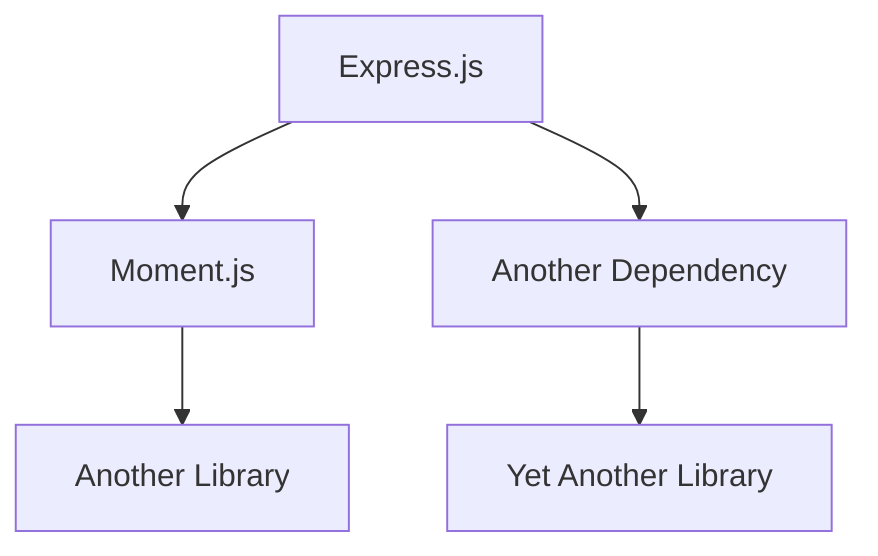

## Introduction to Software Composition Analysis (SCA)

Software Composition Analysis (SCA) is a critical component of modern DevSecOps practices. It involves identifying and managing open-source components and their vulnerabilities within an application. This process helps organizations ensure that their software is built securely and efficiently. One of the key tools used in SCA is **DefectDojo**, which is an open-source platform designed to manage and track vulnerabilities found in software applications.

### What is DefectDojo?

DefectDojo is a web-based application that serves as a central repository for vulnerability data. It allows teams to import scan reports from various tools, such as static application security testing (SAST) tools, dynamic application security testing (DAST) tools, and software composition analysis (SCA) tools. By integrating these tools, DefectDojo provides a comprehensive view of the security posture of an application.

### Why Use DefectDojo?

Using DefectDojo offers several benefits:

- **Centralized Management**: All vulnerability data is stored in one place, making it easier to track and manage.
- **Integration with Multiple Tools**: DefectDojo supports a wide range of security scanning tools, allowing teams to leverage the strengths of different tools.
- **Automated Reporting**: DefectDojo can generate detailed reports that help teams understand the severity and impact of vulnerabilities.
- **Collaboration**: Teams can collaborate on fixing vulnerabilities through the platform, ensuring that everyone is on the same page.

### Example: Express.js Application with Moment.js Dependency

Consider an Express.js application that uses the `moment.js` library. The `moment.js` library is a popular JavaScript library for parsing, validating, manipulating, and displaying dates and times. However, if the application uses a vulnerable version of `moment.js`, it could expose the application to security risks.

```javascript
// app.js
const express = require('express');
const moment = require('moment');

const app = express();

app.get('/date', (req, res) => {
    const currentDate = moment().format('YYYY-MM-DD');
    res.send(currentDate);
});

app.listen(3000, () => {
    console.log('Server is running on port 3000');
});
```

In this example, the application uses `moment.js` to format the current date and return it to the client. If the version of `moment.js` used is vulnerable, it could introduce security issues.

### Identifying Vulnerabilities in Dependencies

To identify vulnerabilities in dependencies, you can use SCA tools like **Snyk** or **WhiteSource**. These tools scan the dependencies of your application and report any known vulnerabilities. Once identified, these vulnerabilities can be imported into DefectDojo for further management.

#### Example: Snyk Scan Report

Here is an example of a Snyk scan report for an Express.js application:

```json
{
  "vulnerabilities": [
    {
      "id": "SNYK-JS-MOMENT-12345",
      "title": "Regular Expression Denial of Service (ReDoS)",
      "severity": "high",
      "packageName": "moment",
      "version": "2.24.0",
      "patchedVersion": "2.29.1"
    }
  ]
}
```

This report indicates that the `moment.js` library version `2.24.0` has a high-severity vulnerability related to Regular Expression Denial of Service (ReDoS).

### Importing SCA Scan Reports into DefectDojo

To import the SCA scan report into DefectDojo, you can use the API provided by DefectDojo. Here is an example of how to import the Snyk scan report:

```bash
curl -X POST \
  http://localhost:8000/api/v2/import-scan/ \
  -H 'Authorization: Token <your_api_token>' \
  -F file=@snyk-report.json \
  -F scan_type=Snyk_Scan \
  -F engagement=1 \
  -F product=1
```

This command imports the Snyk scan report into DefectDojo, associating it with the specified engagement and product.

### Fixing SCA Findings

Once the vulnerabilities are imported into DefectDojo, the next step is to fix them. In the case of the `moment.js` vulnerability, the recommended fix is to update the library to a non-vulnerable version.

#### Updating Dependencies

Updating dependencies is not always straightforward due to the potential for breaking changes. Let's explore this in more detail.

### Challenges in Updating Dependencies

One of the main challenges in updating dependencies is the dependency tree. Modern applications often rely on a complex web of dependencies, and updating one dependency can have cascading effects on other dependencies.

#### Dependency Tree Example

Consider the following dependency tree for an Express.js application:



In this example, updating `moment.js` might affect `Another Library`, which in turn could affect other parts of the application.

### Code Compatibility Issues

Another challenge is ensuring that the updated version of a library is compatible with the existing codebase. Libraries often undergo significant changes between versions, especially when moving from one major version to another.

#### Example: Function Signature Changes

Suppose the `moment.js` library version `1.7.0` had a function `doSomething(param)` with one parameter. In version `1.13.6`, the function signature changed to `fetchSomething(param1, param2)` with two parameters. This change would break any existing code that calls `doSomething`.

```javascript
// Before update
const result = moment.doSomething('someValue');

// After update
const result = moment.fetchSomething('someValue', 'anotherValue');
```

### Major Version Updates

Major version updates often involve significant changes that can break existing functionality. Therefore, it is crucial to thoroughly test the application after updating dependencies.

#### Testing Strategy

When updating dependencies, follow these steps to ensure compatibility:

1. **Review Release Notes**: Check the release notes of the updated library to understand the changes made.
2. **Unit Tests**: Run unit tests to verify that the updated library does not break existing functionality.
3. **Integration Tests**: Perform integration tests to ensure that the updated library works correctly with other parts of the application.
4. **End-to-End Tests**: Conduct end-to-end tests to simulate real-world usage scenarios.

### Real-World Examples

#### CVE-2021-21315: Regular Expression Denial of Service (ReDoS) in Moment.js

CVE-2021-21315 is a ReDoS vulnerability in `moment.js` that can cause a denial of service if an attacker can control the input to the `moment()` function. This vulnerability affects versions of `moment.js` prior to `2.29.1`.

```json
{
  "cve_id": "CVE-2021-21315",
  "description": "Regular Expression Denial of Service (ReDoS) in moment.js",
  "affected_versions": ["< 2.29.1"],
  "fixed_version": "2.29.1"
}
```

To mitigate this vulnerability, update `moment.js` to version `2.29.1` or later.

### How to Prevent / Defend

#### Detection

To detect vulnerabilities in dependencies, regularly run SCA scans using tools like Snyk or WhiteSource. Integrate these scans into your CI/CD pipeline to ensure that vulnerabilities are identified early in the development process.

#### Prevention

To prevent vulnerabilities in dependencies:

1. **Keep Dependencies Updated**: Regularly update dependencies to the latest non-vulnerable versions.
2. **Use Dependency Lock Files**: Use lock files (e.g., `package-lock.json` for npm) to ensure consistent dependency versions across environments.
3. **Automate Dependency Checks**: Integrate SCA tools into your CI/CD pipeline to automatically check for vulnerabilities.

#### Secure Coding Fixes

Compare the vulnerable and fixed versions of the code:

```javascript
// Vulnerable Code
const moment = require('moment');
const result = moment.doSomething('someValue');

// Fixed Code
const moment = require('moment@^2.29.1');
const result = moment.fetchSomething('someValue', 'anotherValue');
```

### Configuration Hardening

Ensure that your application's configuration is hardened against known vulnerabilities. For example, configure your package manager to enforce strict version ranges:

```json
{
  "dependencies": {
    "moment": "^2.29.1"
  }
}
```

### Conclusion

Managing dependencies and their vulnerabilities is a critical aspect of DevSecOps. By using tools like DefectDojo and SCA tools, you can effectively identify and fix vulnerabilities in your application's dependencies. Always test thoroughly after updating dependencies to ensure compatibility and stability.

### Practice Labs

For hands-on practice with SCA and DefectDojo, consider the following labs:

- **PortSwigger Web Security Academy**: Offers interactive labs on web application security, including SCA.
- **OWASP Juice Shop**: A deliberately insecure web application for practicing security testing.
- **DefectDojo Documentation**: Provides detailed guides and examples for setting up and using DefectDojo.

By following these guidelines and practicing with real-world examples, you can become proficient in managing vulnerabilities in application dependencies.

---
<!-- nav -->
[[DevSecOps/DevSecOps Bootcamp/05-Application Security Testing/14-Vulnerability Scanning for Application Dependencies/Import SCA Scan Reports in DefectDojo Fixing SCA Findings CVEs/00-Overview|Overview]] | [[02-Introduction to Software Composition Analysis (SCA)|Introduction to Software Composition Analysis (SCA)]]
