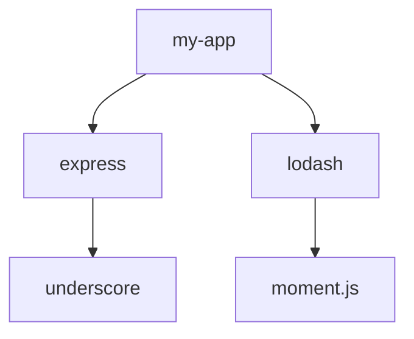

## Introduction to Software Composition Analysis (SCA)

Software Composition Analysis (SCA) is a critical practice in modern software development that helps identify and manage vulnerabilities within third-party libraries and dependencies used in applications. This process is essential because many applications rely heavily on external libraries and frameworks, which can introduce security risks if not properly managed.

### What is SCA?

SCA tools analyze the dependencies of an application to identify known vulnerabilities, such as those listed in the Common Vulnerabilities and Exposures (CVE) database. These tools typically scan the `package.json` (for Node.js applications), `pom.xml` (for Java applications), or other dependency files to determine the versions of libraries being used and compare them against known vulnerabilities.

### Why is SCA Important?

The importance of SCA lies in its ability to help developers and organizations:

- **Identify Vulnerabilities**: Quickly pinpoint known vulnerabilities in third-party libraries.
- **Manage Dependencies**: Keep track of the versions of dependencies used in the application.
- **Mitigate Risks**: Reduce the risk of security breaches caused by outdated or vulnerable libraries.

### How Does SCA Work?

SCA tools work by scanning the dependency files of an application and comparing the versions of the libraries used against a database of known vulnerabilities. This process can be automated as part of a continuous integration/continuous deployment (CI/CD) pipeline to ensure that vulnerabilities are identified and addressed promptly.

### Example Dependency Tree

Consider a simple Node.js application with a `package.json` file that includes several dependencies:

```json
{
  "name": "my-app",
  "version": "1.0.0",
  "dependencies": {
    "express": "^4.17.1",
    "lodash": "^4.17.21"
  }
}
```

In this example, the application depends on `express` and `lodash`. However, these dependencies might themselves depend on other libraries, creating a complex dependency tree.

### Complex Dependency Trees

Dependency trees can become quite complex due to the interdependencies between libraries. For instance, `express` might depend on `underscore`, and `lodash` might depend on `moment.js`.

#### Example Dependency Tree Diagram



In this diagram, `my-app` depends on `express` and `lodash`. `express` depends on `underscore`, and `lodash` depends on `moment.js`.

### Vulnerabilities in Dependencies

Vulnerabilities can exist at any level of the dependency tree. For example, if `underscore` has a known vulnerability, it affects `my-app` even though `underscore` is not a direct dependency.

### Recent Real-World Examples

One notable example is the `moment.js` vulnerability (CVE-2021-21359), which allowed for path traversal attacks. This vulnerability was present in versions up to 2.29.1. Another example is the `lodash` vulnerability (CVE-2021-21358), which allowed for arbitrary code execution.

### Impact of Vulnerable Dependencies

When a dependency has a known vulnerability, it can lead to various security issues, including:

- **Path Traversal**: Allowing attackers to access sensitive files outside the intended directory.
- **Arbitrary Code Execution**: Enabling attackers to execute malicious code on the server.
- **Denial of Service (DoS)**: Causing the application to crash or become unresponsive.

### Detection and Prevention

To effectively manage vulnerabilities in dependencies, organizations should implement the following practices:

- **Regular Scans**: Use SCA tools to regularly scan dependencies for known vulnerabilities.
- **Update Dependencies**: Keep dependencies up-to-date with the latest security patches.
- **Alternative Libraries**: Consider using alternative libraries that do not have known vulnerabilities.

### How to Prevent / Defend

#### Detection

Use SCA tools like Snyk, WhiteSource, or Sonatype Nexus Lifecycle to scan your dependencies for known vulnerabilities. These tools can integrate with your CI/CD pipeline to automatically detect and report vulnerabilities.

#### Prevention

1. **Keep Dependencies Updated**: Regularly update your dependencies to the latest versions.
2. **Use Secure Libraries**: Choose libraries that have a good track record of security and regular updates.
3. **Monitor Vulnerability Databases**: Stay informed about new vulnerabilities by monitoring databases like CVE.

#### Secure Coding Fixes

Here’s an example of how to address a vulnerability in `moment.js`:

**Vulnerable Code**

```javascript
const moment = require('moment');
const date = moment('2023-01-01').format();
console.log(date);
```

**Fixed Code**

```javascript
const dayjs = require('dayjs');
const date = dayjs('2023-01-01').format();
console.log(date);
```

In this example, `moment.js` is replaced with `dayjs`, which is a lightweight alternative with fewer known vulnerabilities.

### Complete Example

Let’s consider a more complete example involving a Node.js application with a complex dependency tree.

#### Dependency Tree

```json
{
  "name": "my-app",
  "version": "1.0.0",
  "dependencies": {
    "express": "^4.17.1",
    "lodash": "^4.17.21"
  }
}
```

#### Dependency Tree Diagram


#### Vulnerability Scanning

Using an SCA tool like Snyk, you can scan the dependencies for known vulnerabilities:

```bash
snyk test --file=package.json
```

This command will output a report detailing any known vulnerabilities in the dependencies.

#### Fixing Vulnerabilities

If a vulnerability is found, you can update the dependencies or replace them with alternatives. For example, if `moment.js` is found to be vulnerable, you can replace it with `dayjs`.

### Conclusion

Software Composition Analysis is a crucial practice for managing vulnerabilities in third-party libraries and dependencies. By regularly scanning dependencies and keeping them updated, organizations can significantly reduce the risk of security breaches. Using tools like Snyk and integrating SCA into CI/CD pipelines ensures that vulnerabilities are detected and addressed promptly.

### Practice Labs

For hands-on experience with SCA, consider the following labs:

- **PortSwigger Web Security Academy**: Offers interactive labs on web application security, including SCA.
- **OWASP Juice Shop**: A deliberately insecure web application for practicing security testing.
- **DVWA (Damn Vulnerable Web Application)**: A PHP/MySQL web application that demonstrates web application vulnerabilities.

These labs provide practical experience in identifying and managing vulnerabilities in application dependencies.

---
<!-- nav -->
[[01-Introduction to Software Composition Analysis (SCA) Part 1|Introduction to Software Composition Analysis (SCA) Part 1]] | [[DevSecOps/DevSecOps Bootcamp/05-Application Security Testing/14-Vulnerability Scanning for Application Dependencies/Import SCA Scan Reports in DefectDojo Fixing SCA Findings CVEs/00-Overview|Overview]] | [[03-Introduction to Vulnerability Scanning for Application Dependencies Part 1|Introduction to Vulnerability Scanning for Application Dependencies Part 1]]
