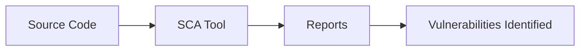

## Introduction to Vulnerability Scanning for Application Dependencies

In the realm of DevSecOps, ensuring the security of application dependencies is paramount. Dependency vulnerabilities can lead to severe security breaches, including data theft, unauthorized access, and system compromise. One of the key tools used to identify these vulnerabilities is Static Code Analysis (SCA) scanning. This process involves analyzing the static code of your application and its dependencies to identify potential security weaknesses.

### What is Static Code Analysis (SCA)?

Static Code Analysis (SCA) is a method of analyzing source code without executing it. The primary goal of SCA is to identify potential security vulnerabilities, coding errors, and other issues that could affect the quality and security of the software. SCA tools scan the codebase and generate reports that highlight areas of concern, such as outdated libraries, insecure configurations, and known vulnerabilities.

### Why is SCA Important?

SCA is crucial because modern applications often rely on numerous third-party libraries and frameworks. These dependencies can introduce vulnerabilities into your application if they are not kept up-to-date or if they contain known security flaws. By performing SCA, you can proactively identify and address these issues before they can be exploited by attackers.

### How Does SCA Work?

SCA tools work by parsing the source code and identifying patterns that match known vulnerabilities or coding practices that are considered insecure. These tools often use databases of Common Vulnerabilities and Exposures (CVEs) and Common Weakness Enumeration (CWE) identifiers to match the code against known vulnerabilities.

### Example of SCA Tools

One popular SCA tool is Semgrep, which is an open-source static analysis tool that helps developers find security vulnerabilities and coding errors in their code. Semgrep uses a powerful pattern-matching engine to identify issues based on rules defined in a simple, human-readable format.

---
<!-- nav -->
[[02-Introduction to Software Composition Analysis (SCA)|Introduction to Software Composition Analysis (SCA)]] | [[DevSecOps/DevSecOps Bootcamp/05-Application Security Testing/14-Vulnerability Scanning for Application Dependencies/Import SCA Scan Reports in DefectDojo Fixing SCA Findings CVEs/00-Overview|Overview]] | [[04-Introduction to Vulnerability Scanning for Application Dependencies Part 2|Introduction to Vulnerability Scanning for Application Dependencies Part 2]]
