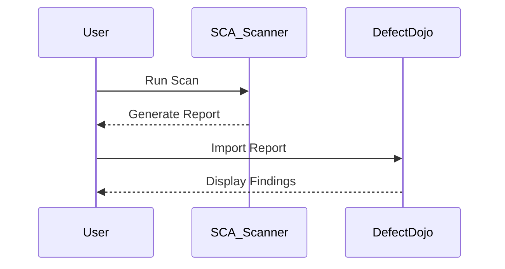

## Introduction to Vulnerability Scanning for Application Dependencies

Vulnerability scanning for application dependencies is a critical aspect of DevSecOps, ensuring that the software components used in applications are free from known vulnerabilities. This process involves identifying and assessing the security posture of third-party libraries and frameworks that your application depends on. One popular tool for managing and tracking these vulnerabilities is DefectDojo, which allows teams to import scan reports and manage findings effectively.

### Understanding Dependency Management

Dependency management refers to the process of managing the external libraries and frameworks that an application relies on. These dependencies are typically managed through package managers like npm (Node Package Manager) for JavaScript applications. Each dependency has a specific version that is installed, and these versions can contain known vulnerabilities.

#### Example: Underscore.js Dependency

In the context of the lecture, we are dealing with a dependency named `underscore.js`. This library provides a set of utility functions for common programming tasks. The specific version being used is `1.7.0`, which is identified as vulnerable to arbitrary code injection.

### Identifying Vulnerabilities

To identify vulnerabilities in dependencies, tools such as Static Code Analysis (SCA) scanners are used. These scanners analyze the dependencies and their versions to determine if any known vulnerabilities exist. The findings are then reported in a format that can be imported into tools like DefectDojo.

#### CVE Description

The Common Vulnerabilities and Exposures (CVE) system assigns unique identifiers to known vulnerabilities. In this case, the CVE description indicates that versions of `underscore.js` up to `1.12` are vulnerable to arbitrary code injection. This means that any version within this range, including `1.7.0`, is at risk.

### Importing SCA Scan Reports in DefectDojo

DefectDojo is a platform designed to manage and track security findings across different types of scans. To integrate SCA scan results, you can import the scan report into DefectDojo. This allows you to view and manage the findings in a centralized location.

#### Steps to Import SCA Scan Reports

1. **Generate the SCA Scan Report**: Use an SCA scanner to generate a report detailing the vulnerabilities found in your dependencies.
2. **Import the Report into DefectDojo**:
    - Log in to DefectDojo.
    - Navigate to the "Engagement" section.
    - Select the engagement where you want to import the report.
    - Click on "Add Finding" and choose the appropriate scanner type.
    - Upload the SCA scan report file.



### Analyzing the Finding

Once the report is imported, you can analyze the findings to understand the nature of the vulnerability. In this case, the finding indicates that the `underscore.js` dependency is vulnerable due to its version `1.7.0`.

#### Vulnerable Component Version

- **Component**: `underscore.js`
- **Version**: `1.7.0`
- **Vulnerability**: Arbitrary code injection
- **CVE**: Specific CVE identifier for this vulnerability

### Upgrading the Dependency

To mitigate the vulnerability, the next step is to upgrade the `underscore.js` dependency to a version that is not vulnerable. According to the CVE description, versions before `1.12` are vulnerable, so upgrading to a version greater than `1.12` is necessary.

#### Searching for Safe Versions

To find the latest safe version, you can search the npm repository:

```bash
npm info underscore
```

This command will provide information about the `underscore.js` package, including the latest version available. As of the latest data, the latest version is `1.13.6`, which is outside the range of insecure versions (`1.13.0-2`).

### Updating the Dependency

To update the dependency, you need to modify the `package.json` file and run the `npm install` command.

#### Before Update

```json
{
  "dependencies": {
    "underscore": "1.7.0"
  }
}
```

#### After Update

```json
{
  "dependencies": {
    "underscore": "^1.13.6"
  }
}
```

Run the following command to update the dependency:

```bash
npm install underscore@^1.13.6
```

### Sub-Dependencies

Often, the problematic dependency is a sub-dependency of another dependency. This means that even if you update the main dependency, the sub-dependency might still be vulnerable. To address this, you need to ensure that all sub-dependencies are also updated to safe versions.

#### Example: Sub-Dependency Update

Suppose `underscore.js` is a sub-dependency of `lodash`. You would need to update both `lodash` and `underscore.js` to ensure that all sub-dependencies are safe.

### How to Prevent / Defend

#### Detection

- **Regular Scans**: Use SCA scanners regularly to detect vulnerabilities in dependencies.
- **Automated Tools**: Integrate automated tools like Snyk or WhiteSource into your CI/CD pipeline to automatically check for vulnerabilities.

#### Prevention

- **Dependency Management**: Use tools like npm-check-updates to keep dependencies up-to-date.
- **Security Policies**: Implement security policies that require dependencies to be updated to the latest safe versions.

#### Secure Coding Fixes

- **Before Fix**

```json
{
  "dependencies": {
    "underscore": "1.7.0"
  }
}
```

- **After Fix**

```json
{
  "dependencies": {
    "underscore": "^1.13.6"
  }
}
```

#### Configuration Hardening

- **Package Lock Files**: Use `package-lock.json` to ensure consistent dependency versions across environments.
- **Security Audits**: Regularly perform security audits to identify and address vulnerabilities.

### Real-World Examples

#### Recent CVEs and Breaches

- **CVE-2021-21315**: A vulnerability in `lodash` led to remote code execution in several applications.
- **Breaches**: Several high-profile breaches have been attributed to outdated dependencies, emphasizing the importance of regular updates.

### Practice Labs

For hands-on practice, consider the following labs:

- **PortSwigger Web Security Academy**: Offers exercises on dependency management and vulnerability scanning.
- **OWASP Juice Shop**: Provides a vulnerable web application to practice identifying and fixing vulnerabilities.
- **DVWA (Damn Vulnerable Web Application)**: Another resource for practicing web application security.

By following these steps and practices, you can effectively manage and mitigate vulnerabilities in your application dependencies, ensuring a more secure development environment.

---
<!-- nav -->
[[03-Introduction to Vulnerability Scanning for Application Dependencies Part 1|Introduction to Vulnerability Scanning for Application Dependencies Part 1]] | [[DevSecOps/DevSecOps Bootcamp/05-Application Security Testing/14-Vulnerability Scanning for Application Dependencies/Import SCA Scan Reports in DefectDojo Fixing SCA Findings CVEs/00-Overview|Overview]] | [[05-Introduction to Vulnerability Scanning for Application Dependencies|Introduction to Vulnerability Scanning for Application Dependencies]]
