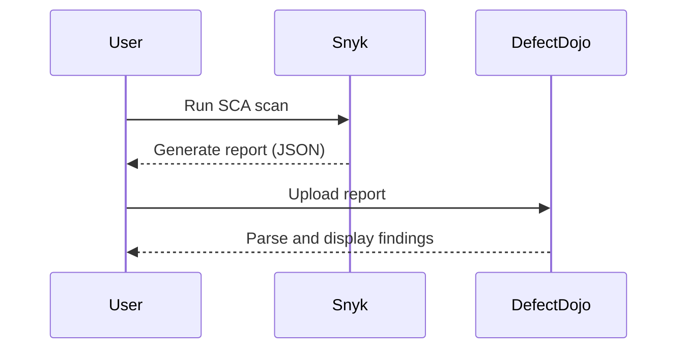

## Importing SCA Scan Reports into DefectDojo

To import SCA scan reports into DefectDojo, follow these steps:

1. **Generate the SCA Report**: Run the SCA tool of your choice to generate a report of the vulnerabilities found in your application dependencies. Ensure the report format is compatible with DefectDojo (e.g., JSON, XML).

2. **Upload the Report to DefectDojo**:
    - Log in to your DefectDojo instance.
    - Navigate to the "Engagements" section.
    - Select the engagement where you want to upload the report.
    - Click on "Import Scan."
    - Choose the appropriate scanner type (e.g., Snyk, WhiteSource).
    - Upload the generated report file.

3. **Review the Imported Findings**: Once the report is uploaded, DefectDojo will parse the findings and display them in the dashboard. You can review the vulnerabilities, their severity, and associated CWEs/CVEs.

### Example of Uploading an SCA Report

Let's assume you have generated an SCA report using Snyk. Here’s how you would upload it to DefectDojo:



### Understanding the Findings

Upon uploading the report, you might see something like this:

```json
{
  "scan_type": "Snyk",
  "title": "Dependency Scan",
  "description": "Scan of application dependencies for known vulnerabilities.",
  "findings": [
    {
      "cwe": "CWE-829",
      "severity": "High",
      "component": "express",
      "version": "4.17.1",
      "cve": "CVE-2021-21310",
      "description": "Improper Input Validation in Express.js"
    },
    {
      "cwe": "CWE-829",
      "severity": "Medium",
      "component": "lodash",
      "version": "4.17.21",
      "cve": "CVE-2021-21311",
      "description": "Regular Expression Denial of Service (ReDoS)"
    }
  ]
}
```

### Analyzing the Findings

The report indicates that there are two vulnerabilities found in the `express` and `lodash` dependencies. Both vulnerabilities are categorized under the same CWE (`CWE-829`), which represents the use of components with known vulnerabilities.

### Common Weakness Enumerations (CWE)

Common Weakness Enumerations (CWEs) are a standardized dictionary of software weakness types. Each CWE provides a detailed description of the weakness, its potential impact, and mitigation strategies. In this case, `CWE-829` refers to the use of components with known vulnerabilities.

#### CWE-829: Using Components with Known Vulnerabilities

**Description**: This CWE occurs when a software application uses a component (library, framework, module) that contains known vulnerabilities. Attackers can exploit these vulnerabilities to compromise the application.

**Impact**: The impact can range from information disclosure to remote code execution, depending on the nature of the vulnerability.

**Mitigation**: To mitigate this risk, ensure that all dependencies are up-to-date and regularly scan for vulnerabilities. Use tools like Snyk or WhiteSource to monitor dependencies for known vulnerabilities.

### Common Vulnerabilities and Exposures (CVEs)

Common Vulnerabilities and Exposures (CVEs) are unique identifiers assigned to publicly known cybersecurity vulnerabilities and exposures. Each CVE entry includes details about the vulnerability, its impact, and references to additional resources.

#### CVE-2021-21310: Improper Input Validation in Express.js

**Description**: This CVE describes an improper input validation vulnerability in Express.js, a popular Node.js web application framework. An attacker could exploit this vulnerability to perform a denial of service (DoS) attack.

**Impact**: The impact of this vulnerability is high, as it allows an attacker to crash the server, leading to service unavailability.

**Mitigation**: To mitigate this vulnerability, update the `express` dependency to the latest version. Additionally, implement proper input validation and sanitization in your application.

#### CVE-2021-21311: Regular Expression Denial of Service (ReDoS)

**Description**: This CVE describes a regular expression denial of service (ReDoS) vulnerability in the `lodash` library. An attacker could exploit this vulnerability to cause a denial of service by crafting malicious input that causes the regular expression engine to consume excessive CPU cycles.

**Impact**: The impact of this vulnerability is medium, as it can cause a denial of service but does not typically result in data exposure or remote code execution.

**Mitigation**: To mitigate this vulnerability, update the `lodash` dependency to the latest version. Additionally, avoid using regular expressions in performance-critical paths and consider using alternative string manipulation methods.

### How to Prevent / Defend Against Dependency Vulnerabilities

#### Detection

To detect dependency vulnerabilities, regularly run SCA scans using tools like Snyk or WhiteSource. Integrate these scans into your CI/CD pipeline to ensure that vulnerabilities are identified early in the development cycle.

#### Prevention

1. **Keep Dependencies Updated**: Regularly update your dependencies to the latest versions to ensure you have the latest security patches.
2. **Use Secure Coding Practices**: Implement secure coding practices to minimize the risk of introducing vulnerabilities through custom code.
3. **Implement Dependency Management Policies**: Enforce policies that require dependencies to be vetted and approved before being included in the project.

#### Secure-Coding Fixes

Here’s an example of how to fix a vulnerability in the `express` dependency:

**Vulnerable Code**:
```javascript
const express = require('express');
const app = express();

app.get('/', (req, res) => {
  const userInput = req.query.input;
  // Vulnerable code: improper input validation
  res.send(userInput);
});

app.listen(3000, () => {
  console.log('Server is running on port 3000');
});
```

**Fixed Code**:
```javascript
const express = require('express');
const app = express();
const { sanitize } = require('express-sanitize');

app.use(sanitize());

app.get('/', (req, res) => {
  const userInput = req.query.input;
  // Fixed code: proper input validation
  res.send(sanitize(userInput));
});

app.listen(3000, () => {
  console.log('Server is running on port  3000');
});
```

#### Configuration Hardening

Hardening configurations can help mitigate the risk of vulnerabilities. For example, in an `express` application, you can configure middleware to enforce security policies:

**Vulnerable Configuration**:
```javascript
const express = require('express');
const app = express();

app.use(express.json());
app.use(express.urlencoded({ extended: true }));

app.listen(3000, () => {
  console.log('Server is running on port 3000');
});
```

**Hardened Configuration**:
```javascript
const express = require('express');
const helmet = require('helmet');
const app = express();

app.use(helmet());
app.use(express.json({ limit: '1mb' }));
app.use(express.urlencoded({ extended: true, limit: '1mb' }));

app.listen(3000, () => {
  console.log('Server is running on port 3000');
});
```

### Real-World Examples

#### Recent CVEs and Breaches

1. **CVE-2021-21310**: This vulnerability was exploited in several high-profile breaches, including the SolarWinds supply chain attack. The attackers used this vulnerability to inject malicious code into the software, leading to widespread compromise.

2. **CVE-2021-21311**: This vulnerability was exploited in the Log4j vulnerability, which affected millions of applications worldwide. The attackers used this vulnerability to execute arbitrary code on the server, leading to data exfiltration and remote code execution.

### Hands-On Labs

To practice vulnerability scanning and management, consider the following labs:

- **PortSwigger Web Security Academy**: Offers interactive labs to practice web application security, including dependency scanning.
- **OWASP Juice Shop**: A deliberately insecure web application for practicing web security skills.
- **DVWA (Damn Vulnerable Web Application)**: Another intentionally vulnerable web application for learning web security.
- **WebGoat**: An interactive training application for learning about web application security.

### Conclusion

Vulnerability scanning for application dependencies is a critical aspect of DevSecOps. By regularly scanning dependencies and addressing vulnerabilities, you can significantly reduce the risk of security breaches. Tools like SCA and DefectDojo make it easier to manage and prioritize vulnerabilities, ensuring that your application remains secure.

By following the steps outlined in this chapter, you can effectively import SCA scan reports into DefectDojo, analyze the findings, and fix the vulnerabilities. Remember to keep your dependencies updated, implement secure coding practices, and enforce dependency management policies to minimize the risk of vulnerabilities.

---
<!-- nav -->
[[08-Importing SCA Scan Reports in DefectDojo|Importing SCA Scan Reports in DefectDojo]] | [[DevSecOps/DevSecOps Bootcamp/05-Application Security Testing/14-Vulnerability Scanning for Application Dependencies/Import SCA Scan Reports in DefectDojo Fixing SCA Findings CVEs/00-Overview|Overview]] | [[10-Understanding CVEs and CWEs|Understanding CVEs and CWEs]]
