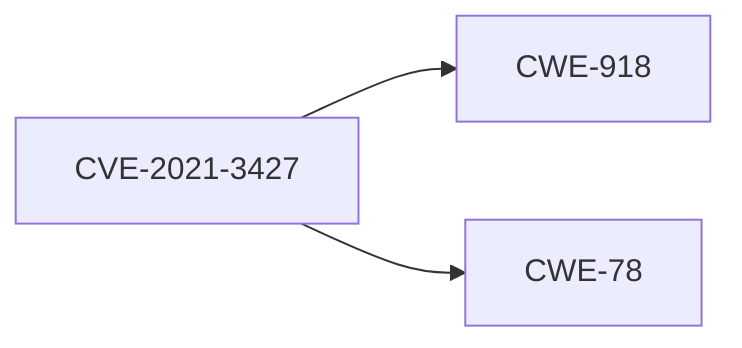

## Understanding CVEs and CWEs

### What are CVEs?

Common Vulnerabilities and Exposures (CVEs) is a list of publicly disclosed cybersecurity vulnerabilities and exposures. Each entry in the CVE list is assigned a unique identifier, which allows for easy tracking and referencing of vulnerabilities. CVEs provide a standardized way to identify and communicate about security vulnerabilities.

### What are CWEs?

Common Weakness Enumeration (CWE) is a list of common software weaknesses that can lead to security vulnerabilities. Each CWE is assigned a unique identifier and provides detailed information about the weakness, including its description, potential consequences, and mitigation strategies. CWEs help developers understand the root causes of vulnerabilities and how to avoid them.

### Relationship Between CVEs and CWEs

CVEs and CWEs are closely related. A CVE typically references one or more CWEs to describe the underlying weakness that led to the vulnerability. For example, a CVE might reference CWE-79 (Cross-Site Scripting) to indicate that the vulnerability is due to improper neutralization of user input.

### Example: CVE-2021-3427

CVE-2021-3427 is a vulnerability in the Apache Log4j library that allows attackers to execute arbitrary code on the server. This vulnerability is associated with CWE-918 (Server-Side Request Forgery) and CWE-78 (10-OS Command Injection).

---
<!-- nav -->
[[09-Importing SCA Scan Reports into DefectDojo|Importing SCA Scan Reports into DefectDojo]] | [[DevSecOps/DevSecOps Bootcamp/05-Application Security Testing/14-Vulnerability Scanning for Application Dependencies/Import SCA Scan Reports in DefectDojo Fixing SCA Findings CVEs/00-Overview|Overview]] | [[11-Vulnerability Scanning for Application Dependencies|Vulnerability Scanning for Application Dependencies]]
