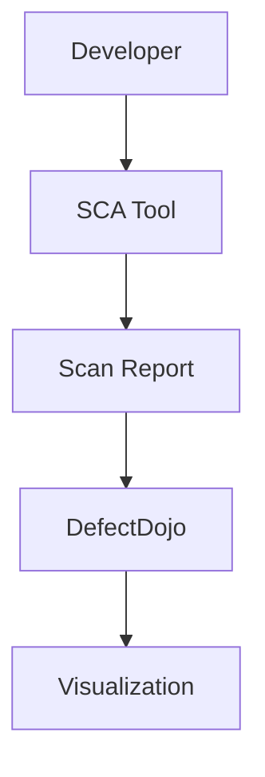

## Vulnerability Scanning for Application Dependencies

### Introduction to Dependency Vulnerabilities

In modern software development, applications often rely on numerous third-party libraries and frameworks. These dependencies can introduce security vulnerabilities if they are not kept up-to-date. A Software Composition Analysis (SCA) scan helps identify these vulnerabilities by analyzing the dependencies used in an application. This process is crucial for maintaining the security posture of an application.

### Importance of Visualizing Dependency Vulnerabilities

One of the primary benefits of conducting an SCA scan is to visualize the dependencies that have known vulnerabilities. This visualization helps developers understand the security risks associated with their dependencies. By making this information visible, developers can prioritize fixing these security issues within their workflow.

#### Visualization Tools

Tools like **DefectDojo** provide a platform for visualizing and managing SCA scan reports. DefectDojo is an open-source application that allows organizations to manage their vulnerability data in a centralized manner. Here’s how you can import SCA scan reports into DefectDojo:



### Steps to Import SCA Scan Reports into DefectDojo

1. **Run an SCA Scan**: Use an SCA tool such as **Snyk**, **WhiteSource**, or **OWASP Dependency-Check** to scan your application dependencies.
   
2. **Generate a Scan Report**: After the scan, generate a report that lists all the dependencies and their associated vulnerabilities.

3. **Import the Report into DefectDojo**:
   - Log in to your DefectDojo instance.
   - Navigate to the **Engagement** section.
   - Create a new engagement or select an existing one.
   - Upload the SCA scan report to the engagement.

Here is an example of how to upload a scan report using the DefectDojo API:

```python
import requests

# Replace with your DefectDojo URL and API key
DD_URL = "https://your-defectdojo-instance.com"
API_KEY = "your-api-key"

# Define the engagement ID
ENGAGEMENT_ID = 1

# Path to the SCA scan report
REPORT_PATH = "/path/to/your/report.json"

# Define the API endpoint
ENDPOINT = f"{DD_URL}/api/v2/import-scan/"

# Define the headers
HEADERS = {
    "Authorization": f"Token {API_KEY}",
    "Content-Type": "application/json",
}

# Define the data payload
DATA = {
    "engagement": ENGAGEMENT_ID,
    "scan_type": "SCA Scan",
    "file": open(REPORT_PATH, "rb"),
}

# Make the POST request
response = requests.post(ENDPOINT, headers=HEADERS, files={"file": DATA["file"]}, data={"engagement": DATA["engagement"], "scan_type": DATA["scan_type"]})

# Check the response
if response.status_code == 201:
    print("Report uploaded successfully.")
else:
    print(f"Failed to upload report: {response.content}")
```

### Prioritizing Security Issues

Once the SCA scan report is imported into DefectDojo, developers can see the list of dependencies with known vulnerabilities. This information helps them prioritize which security issues to address first. Prioritization is typically based on factors such as:

- **Severity of the Vulnerability**: Higher severity vulnerabilities should be addressed first.
- **Criticality of the Dependency**: Dependencies that are more critical to the application should be prioritized.
- **Ease of Fix**: Dependencies that are easier to fix should be addressed sooner.

### Developer Perspective on Updating Dependencies

Developers may not immediately update all library versions when a vulnerability is discovered. There are several reasons for this:

- **Testing Requirements**: Updating a dependency may require extensive testing to ensure that the application continues to function correctly.
- **Compatibility Issues**: Newer versions of a dependency might introduce compatibility issues with other parts of the application.
- **Resource Constraints**: Developers may have limited resources and need to prioritize other tasks.

As a DevSecOps engineer, it is important to understand these perspectives and work collaboratively with developers to find a balance between security and practical constraints.

### Real-World Example: CVE-2021-44228 (Log4j)

The **CVE-2021-44228** (also known as **Log4Shell**) is a critical vulnerability in the Apache Log4j logging framework. This vulnerability allowed attackers to execute arbitrary code on affected systems. Many applications that used Log4j were at risk, leading to widespread updates and patches.

#### Impact of Log4j Vulnerability

- **Severity**: CVSS score of 10 out of 10.
- **Affected Systems**: Any system using Apache Log4j versions 2.0-beta9 to 2.14.1.
- **Exploitation**: Attackers could remotely execute code on the server, leading to full system compromise.

#### Detection and Prevention

To detect and prevent such vulnerabilities, follow these steps:

1. **Conduct Regular SCA Scans**: Ensure that your application dependencies are regularly scanned for vulnerabilities.
2. **Update Dependencies Promptly**: Keep all dependencies up-to-date with the latest security patches.
3. **Use Secure Coding Practices**: Implement secure coding practices to minimize the risk of introducing vulnerabilities.

### Secure Coding Fixes

Here is an example of how to fix a vulnerable dependency in your code:

#### Vulnerable Code

```python
import log4j

logger = log4j.getLogger("myapp")
logger.info("This is a log message")
```

#### Fixed Code

```python
import logging

logger = logging.getLogger("myapp")
logger.setLevel(logging.INFO)
handler = logging.FileHandler("myapp.log")
formatter = logging.Formatter("%(asctime)s - %(name)s - %(levelname)s - %(message)s")
handler.setFormatter(formatter)
logger.addHandler(handler)
logger.info("This is a log message")
```

### How to Prevent / Defend Against Dependency Vulnerabilities

#### Detection

- **Regular SCA Scans**: Use tools like Snyk, WhiteSource, or OWASP Dependency-Check to regularly scan your dependencies.
- **Automated Alerts**: Set up automated alerts in DefectDojo to notify you when new vulnerabilities are detected.

#### Prevention

- **Keep Dependencies Updated**: Regularly update all dependencies to the latest versions.
- **Use Secure Coding Practices**: Follow secure coding guidelines to minimize the risk of introducing vulnerabilities.

#### Secure Configuration Hardening

- **Limit Permissions**: Ensure that dependencies have the minimum necessary permissions.
- **Use Secure Libraries**: Choose libraries that have a good track record for security.

### Hands-On Labs

For hands-on practice with vulnerability scanning and dependency management, consider the following labs:

- **PortSwigger Web Security Academy**: Offers a variety of labs focused on web application security, including dependency management.
- **OWASP Juice Shop**: A deliberately insecure web application for practicing security skills.
- **DVWA (Damn Vulnerable Web Application)**: Another popular web application for learning about web vulnerabilities.

These labs provide real-world scenarios and challenges that help reinforce the concepts learned in this chapter.

### Conclusion

Vulnerability scanning for application dependencies is a critical aspect of DevSecOps. By visualizing and prioritizing security issues, developers can effectively manage the security of their applications. Understanding the perspectives of both developers and DevSecOps engineers is essential for finding a balance between security and practical constraints. Regular SCA scans, prompt updates, and secure coding practices are key to preventing and mitigating dependency vulnerabilities.

---
<!-- nav -->
[[10-Understanding CVEs and CWEs|Understanding CVEs and CWEs]] | [[DevSecOps/DevSecOps Bootcamp/05-Application Security Testing/14-Vulnerability Scanning for Application Dependencies/Import SCA Scan Reports in DefectDojo Fixing SCA Findings CVEs/00-Overview|Overview]] | [[DevSecOps/DevSecOps Bootcamp/05-Application Security Testing/14-Vulnerability Scanning for Application Dependencies/Import SCA Scan Reports in DefectDojo Fixing SCA Findings CVEs/12-Practice Questions & Answers|Practice Questions & Answers]]
