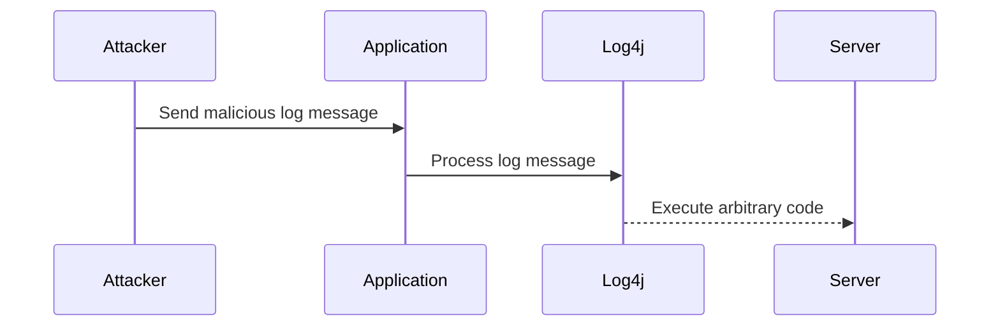

## Introduction to Vulnerability Scanning for Application Dependencies

In modern software development, applications often rely on external libraries and dependencies to provide functionality that would otherwise require significant effort to implement from scratch. These dependencies can come from various sources, such as npm for JavaScript applications, Maven or Gradle for Java applications, and many more. While these dependencies can greatly speed up development, they also introduce potential security risks. This chapter will delve into the concept of Software Composition Analysis (SCA) and how it helps in identifying and mitigating security vulnerabilities in application dependencies.

### What is Software Composition Analysis (SCA)?

Software Composition Analysis (SCA) is a process used to identify open-source components and their associated vulnerabilities within an application. This analysis helps developers understand the security posture of their applications by providing insights into the third-party libraries and frameworks they depend on. SCA tools scan the application's dependency files (such as `package.json` for JavaScript applications or `build.gradle` for Java applications) to determine the versions of the dependencies being used and check them against known vulnerabilities.

#### Dependency Files in Different Languages

- **JavaScript Applications**: Dependencies are typically listed in a `package.json` file. This file contains metadata about the project and its dependencies, including the exact versions of the libraries being used.
  
  ```json
  {
    "name": "my-app",
    "version": "1.0.0",
    "dependencies": {
      "express": "^4.17.1",
      "lodash": "^4.17.21"
    }
  }
  ```

- **Java Applications**: Dependencies can be listed in different files depending on the build system used. For Maven, dependencies are listed in a `pom.xml` file, while for Gradle, they are listed in a `build.gradle` file.

  ```xml
  <!-- pom.xml -->
  <dependencies>
    <dependency>
      <groupId>org.springframework</groupId>
      <artifactId>spring-core</artifactId>
      <version>5.3.10</version>
    </dependency>
  </dependencies>
  ```

  ```groovy
  // build.gradle
  dependencies {
    implementation 'org.springframework:spring-core:5.3.10'
  }
  ```

### Why is SCA Important?

Dependencies can introduce security vulnerabilities into an application. These vulnerabilities can range from minor issues to critical ones that can be exploited by attackers. By performing SCA, developers can:

- Identify known vulnerabilities in the dependencies being used.
- Determine the severity of these vulnerabilities.
- Take action to mitigate the risks by updating to newer, patched versions of the dependencies.

#### Real-World Example: Log4j Vulnerability (CVE-2021-44228)

One of the most notable recent examples of a vulnerability in a widely-used library is the Log4j vulnerability (CVE-2021-44228). This vulnerability affected the Apache Log4j logging framework, which is used in numerous applications across various industries. The vulnerability allowed remote code execution, making it extremely dangerous.



The Log4j vulnerability highlights the importance of regularly scanning dependencies for known vulnerabilities. Many organizations were caught off guard by this vulnerability, emphasizing the need for continuous monitoring and updates.

### How Does SCA Work?

SCA tools work by analyzing the dependency files of an application and comparing the versions of the dependencies against a database of known vulnerabilities. These databases are maintained by various organizations and contain information about vulnerabilities discovered in open-source components.

#### Steps in the SCA Process

1. **Dependency Identification**: The tool scans the dependency files to identify the libraries and their versions.
2. **Vulnerability Check**: The tool compares the identified dependencies against a database of known vulnerabilities.
3. **Reporting**: The tool generates a report detailing the vulnerabilities found, their severity, and recommendations for mitigation.

### Public Databases of Vulnerabilities

There are several public databases that maintain information about vulnerabilities in open-source components. Some of the most popular ones include:

- **National Vulnerability Database (NVD)**: Maintained by the U.S. government, NVD provides a comprehensive list of vulnerabilities with detailed descriptions and severity ratings.
- **Common Vulnerabilities and Exposures (CVE)**: A list of publicly disclosed cybersecurity vulnerabilities and exposures.
- **GitHub Advisory Database**: Provides a list of vulnerabilities in GitHub-hosted repositories.

These databases are constantly updated as new vulnerabilities are discovered, ensuring that SCA tools have the latest information to perform accurate scans.

### Regular and Frequent Security Checks

Given that new vulnerabilities are continuously discovered, it is crucial to perform regular and frequent security checks. This can be achieved through:

- **Automated Scanning**: Integrating SCA tools into the CI/CD pipeline to automatically scan dependencies during each build.
- **Manual Scanning**: Periodically running SCA tools manually to ensure that the application remains secure.

#### Example of Automated Scanning in CI/CD Pipeline

```yaml
# .github/workflows/ci.yml
name: CI

on:
  push:
    branches: [ main ]
  pull_request:
    branches: [ main ]

jobs:
  build:
    runs-on: ubuntu-latest

    steps:
    - name: Checkout code
      uses: actions/checkout@v2

    - name: Install dependencies
      run: npm install

    - name: Run SCA tool
      run: npm audit

    - name: Report vulnerabilities
      if: failure()
      run: |
        echo "Vulnerabilities detected!"
        cat audit-report.json
```

This workflow integrates an SCA tool (`npm audit`) into the CI/CD pipeline, ensuring that dependencies are checked for vulnerabilities during each build.

### How to Prevent / Defend Against Vulnerabilities in Dependencies

To effectively prevent and defend against vulnerabilities in dependencies, developers should follow these best practices:

1. **Regular Updates**: Keep dependencies up to date with the latest versions to ensure that known vulnerabilities are patched.
2. **Use Secure Coding Practices**: Implement secure coding practices to minimize the risk of introducing vulnerabilities through custom code.
3. **Implement Access Controls**: Ensure that access controls are properly configured to limit the exposure of vulnerabilities.
4. **Monitor for New Vulnerabilities**: Continuously monitor for new vulnerabilities and update dependencies accordingly.

#### Example of Secure Dependency Management

```json
{
  "name": "my-app",
  "version": "1.0.0",
  "dependencies": {
    "express": "^4.17.1",
    "lodash": "^4.17.21"
  },
  "devDependencies": {
    "eslint": "^7.32.0"
  }
}
```

In this example, the `package.json` file lists the dependencies and their versions. To ensure security, the `eslint` tool is included as a development dependency to enforce secure coding practices.

### Conclusion

Software Composition Analysis (SCA) is a critical component of DevSecOps, helping developers identify and mitigate security vulnerabilities in application dependencies. By regularly scanning dependencies and keeping them up to date, developers can significantly reduce the risk of security breaches. Continuous monitoring and integration of SCA tools into the CI/CD pipeline are essential for maintaining a secure application environment.

### Practice Labs

For hands-on experience with SCA, consider the following practice labs:

- **PortSwigger Web Security Academy**: Offers modules on dependency management and SCA.
- **OWASP Juice Shop**: A deliberately insecure web application for practicing security testing, including SCA.
- **CloudGoat**: A set of labs for practicing cloud security, including SCA for cloud-native applications.

By engaging with these labs, you can gain practical experience in identifying and mitigating vulnerabilities in application dependencies.

---
<!-- nav -->
[[DevSecOps/DevSecOps Bootcamp/05-Application Security Testing/14-Vulnerability Scanning for Application Dependencies/Software Composition Analysis Security Issues in Application Dependencies/00-Overview|Overview]] | [[02-Introduction to Vulnerability Scanning for Application Dependencies Part 2|Introduction to Vulnerability Scanning for Application Dependencies Part 2]]
