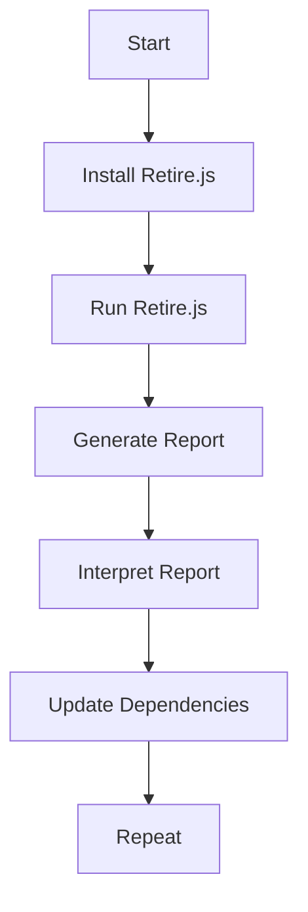

## Introduction to Vulnerability Scanning for Application Dependencies

In the realm of DevSecOps, ensuring the security of application dependencies is paramount. One of the critical steps in this process is conducting a thorough vulnerability scan using tools like Retire.js. This chapter delves into the intricacies of software composition analysis (SCA) and how it helps identify vulnerabilities in third-party libraries and frameworks that an application depends on.

### What is Software Composition Analysis (SCA)?

Software Composition Analysis (SCA) is a process used to identify open-source components and their associated vulnerabilities within an application. This is crucial because many applications rely heavily on third-party libraries and frameworks, which can introduce security risks if they contain known vulnerabilities.

#### Why is SCA Important?

- **Security Risks**: Third-party libraries and frameworks can introduce vulnerabilities that could be exploited by attackers.
- **Compliance Requirements**: Many organizations are required to maintain a list of all open-source components and their associated vulnerabilities for compliance purposes.
- **Dependency Management**: SCA helps in managing dependencies effectively, ensuring that only the latest and most secure versions are used.

### Tools for SCA

There are several tools available for performing SCA, including Retire.js, Black Duck, and WhiteSource. In this chapter, we will focus on Retire.js due to its effectiveness and ease of use.

### Retire.js Overview

Retire.js is a JavaScript library designed to detect vulnerabilities in third-party libraries and frameworks that an application depends on. It maintains a database of known vulnerabilities in popular libraries and frameworks and uses pattern matching and rule-based analysis to identify vulnerable versions of these dependencies.

#### How Retire.js Works

Retire.js operates by scanning the `node_modules` directory, where the code of third-party libraries and frameworks is stored. It then checks for Common Vulnerabilities and Exposures (CVEs) associated with these dependencies.

### Setting Up Retire.js

To set up Retire.js, you first need to install it via npm (Node Package Manager).

```bash
npm install retire -g
```

Once installed, you can run Retire.js to scan your application's dependencies.

```bash
retire --path ./node_modules
```

This command will scan the `node_modules` directory and report any vulnerabilities found.

### Real-World Example: Recent CVEs

Let's consider a recent CVE to illustrate the importance of SCA. One such example is **CVE-2021-21319**, which affected the `lodash` library. This vulnerability allowed remote code execution if an attacker could control the input to certain functions in the `lodash` library.

#### Impact of CVE-2021-21319

- **Remote Code Execution**: An attacker could execute arbitrary code on the server if they controlled the input to certain functions in the `lodash` library.
- **Widespread Usage**: `lodash` is one of the most widely used libraries in JavaScript applications, making this vulnerability particularly dangerous.

#### Detection and Prevention

Using Retire.js, you can detect if your application is using a vulnerable version of `lodash`. Here’s how you can set up Retire.js to scan for this specific vulnerability:

```bash
retire --path ./node_modules --output json > retire_report.json
```

This command will generate a JSON report containing details about any vulnerabilities found. You can then parse this report to identify specific issues.

### Detailed Scan Example

Let's walk through a detailed example of how to use Retire.js to scan an application and interpret the results.

#### Step 1: Install Retire.js

```bash
npm install retire -g
```

#### Step 2: Run Retire.js

```bash
retire --path ./node_modules --output json > retire_report.json
```

#### Step 3: Interpret the Report

The `retire_report.json` file contains a detailed report of any vulnerabilities found. Here’s an example of what the report might look like:

```json
{
  "results": [
    {
      "component": "lodash",
      "version": "4.17.20",
      "vulnerabilities": [
        {
          "id": "CVE-2021-21319",
          "title": "lodash: Remote Code Execution",
          "severity": "high",
          "description": "lodash versions prior to 4.17.21 are vulnerable to remote code execution.",
          "references": [
            "https://nvd.nist.gov/vuln/detail/CVE-2021-21319"
          ]
        }
      ]
    }
  ]
}
```

### How to Prevent / Defend

#### Detection

To detect vulnerabilities in your application, regularly run Retire.js as part of your build pipeline. This ensures that any new vulnerabilities are identified promptly.

#### Prevention

To prevent vulnerabilities, ensure that you are using the latest and most secure versions of all third-party libraries and frameworks. This can be achieved by:

1. **Updating Dependencies**: Regularly update your dependencies to the latest versions.
2. **Using Dependency Lock Files**: Use dependency lock files (e.g., `package-lock.json`) to ensure consistent versions across environments.
3. **Automated Scanning**: Integrate automated scanning tools like Retire.js into your CI/CD pipeline.

#### Secure Coding Fixes

Here’s an example of how to fix a vulnerable dependency:

**Vulnerable Code**

```javascript
const _ = require('lodash');
const userInput = req.body.input;
const result = _.template(userInput)();
```

**Secure Code**

```javascript
const _ = require('lodash');
const userInput = req.body.input;
const result = _.template(userInput, { variable: 'data' })(data);
```

By specifying the `variable` option, you can mitigate the risk of remote code execution.

### Complete Example: Full HTTP Request and Response

When integrating Retire.js into your CI/CD pipeline, you might want to automate the scanning process and report the results. Here’s an example of how you can achieve this using a simple HTTP request.

#### HTTP Request

```http
POST /api/scan HTTP/1.1
Host: localhost:3000
Content-Type: application/json

{
  "path": "./node_modules",
  "tool": "retire"
}
```

#### HTTP Response

```http
HTTP/1.1 200 OK
Content-Type: application/json

{
  "status": "success",
  "report": {
    "results": [
      {
        "component": "lodash",
        "version": "4.17.20",
        "vulnerabilities": [
          {
            "id": "CVE-2-21319",
            "title": "lodash: Remote Code Execution",
            "severity": "high",
            "description": "lodash versions prior to 4.17.21 are vulnerable to remote code execution.",
            "references": [
              "https://nvd.nist.gov/vuln/detail/CVE-2021-21319"
            ]
          }
        ]
      }
    ]
  }
}
```

### Mermaid Diagrams

#### Dependency Scanning Workflow



### Hands-On Labs

For hands-on practice, you can use the following labs:

- **PortSwigger Web Security Academy**: Offers a comprehensive set of labs covering various aspects of web security, including SCA.
- **OWASP Juice Shop**: A deliberately insecure web application for security training.

These labs provide practical experience in identifying and fixing vulnerabilities in third-party libraries and frameworks.

### Conclusion

In conclusion, vulnerability scanning for application dependencies is a critical aspect of DevSecOps. By using tools like Retire.js, you can effectively identify and mitigate security risks associated with third-party libraries and frameworks. Regular scanning and updating of dependencies are essential practices to ensure the security of your applications.

---
<!-- nav -->
[[02-Introduction to Vulnerability Scanning for Application Dependencies Part 2|Introduction to Vulnerability Scanning for Application Dependencies Part 2]] | [[DevSecOps/DevSecOps Bootcamp/05-Application Security Testing/14-Vulnerability Scanning for Application Dependencies/Software Composition Analysis Security Issues in Application Dependencies/00-Overview|Overview]] | [[04-Introduction to Vulnerability Scanning for Application Dependencies Part 4|Introduction to Vulnerability Scanning for Application Dependencies Part 4]]
