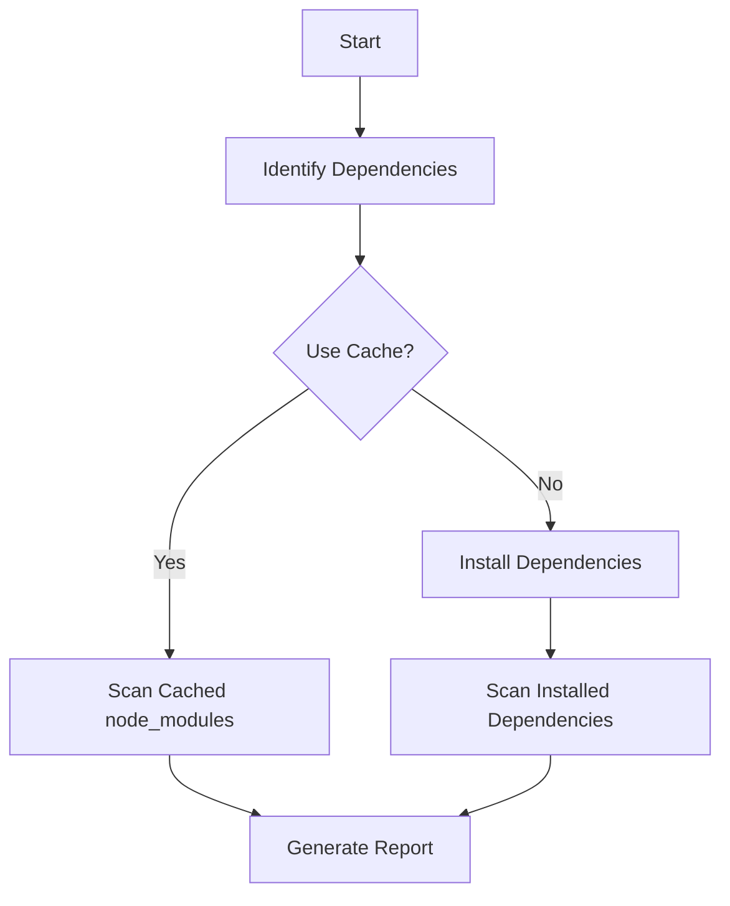
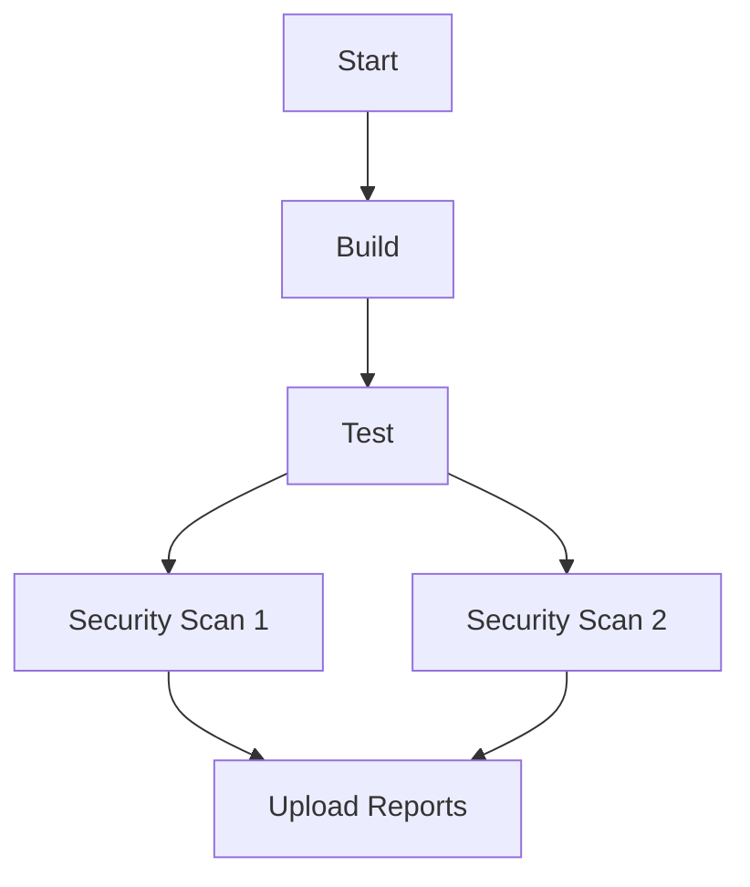

## Introduction to Vulnerability Scanning for Application Dependencies

In the realm of DevSecOps, one critical aspect is ensuring the security of application dependencies. This involves identifying vulnerabilities within third-party libraries and frameworks that your application relies on. One effective method to achieve this is through **Software Composition Analysis (SCA)**. SCA tools help in identifying and managing open-source components and their associated vulnerabilities. This chapter delves into the process of integrating SCA into your continuous integration/continuous deployment (CI/CD) pipeline using a specific tool, `Retire.js`.

### What is Retire.js?

**Retire.js** is an open-source tool designed to scan JavaScript files and libraries for known vulnerabilities. It leverages a database of known vulnerabilities to identify potential issues in your project's dependencies. By integrating Retire.js into your CI/CD pipeline, you can automate the process of detecting and addressing security weaknesses in your application's dependencies.

### Why Use Retire.js?

Using Retire.js offers several benefits:

1. **Automated Vulnerability Detection**: Retire.js automates the process of scanning your project's dependencies for known vulnerabilities, reducing the manual effort required to maintain security.
   
2. **Comprehensive Coverage**: Retire.js covers a wide range of JavaScript libraries and frameworks, ensuring that your project is thoroughly analyzed for potential security risks.

3. **Integration with CI/CD Pipelines**: Retire.js can be easily integrated into CI/CD pipelines, allowing you to automatically scan your dependencies during the build process.

### How Retire.js Works Under the Hood

Retire.js operates by analyzing the JavaScript files and libraries used in your project. It compares these files against a database of known vulnerabilities to identify any potential security issues. Here’s a step-by-step breakdown of how Retire.js works:

1. **Dependency Identification**: Retire.js first identifies the dependencies used in your project. This typically involves scanning the `node_modules` directory, which contains all the installed npm packages.

2. **Vulnerability Database**: Retire.js uses a database of known vulnerabilities to compare against the identified dependencies. This database is regularly updated to ensure that the latest vulnerabilities are included.

3. **Comparison and Reporting**: Retire.js compares the identified dependencies against the vulnerability database. If any matches are found, Retire.js generates a report detailing the vulnerabilities and their severity.

### Leveraging the Cache of Node Modules

To optimize the scanning process, Retire.js can leverage the cache of `node_modules`. This means that instead of reinstalling all the dependencies, Retire.js can simply scan the existing `node_modules` directory. This approach significantly reduces the time required for the scanning process.



### Producing Artifacts for Visualization

One of the key aspects of integrating Retire.js into your CI/CD pipeline is producing artifacts that can be visualized in a tool like **DefectDojo**. DefectDojo is a popular open-source platform for managing and tracking software vulnerabilities. By generating artifacts in a specific format, you can easily import the results into DefectDojo for further analysis and management.

#### Output Format and Path

To produce artifacts that can be visualized in DefectDojo, you need to specify the output format and path for the report generated by Retire.js. The following steps outline how to configure Retire.js to generate a JSON report:

1. **Output Format**: Specify the output format as JSON. This is done using the `--output-format` parameter.

2. **Output Path**: Specify the path where the JSON report should be saved. This is done using the `--output-path` parameter.

Here’s an example of how to configure Retire.js to generate a JSON report:

```bash
retire --output-format json --output-path ./reports/retire.json
```

This command tells Retire.js to generate a JSON report and save it to the `./reports/retire.json` file.

### Full Example of Retire.js Configuration

Let’s walk through a complete example of configuring Retire.js to scan your project’s dependencies and generate a JSON report that can be imported into DefectDojo.

#### Step 1: Install Retire.js

First, you need to install Retire.js globally using npm:

```bash
npm install -g retire
```

#### Step 2: Configure Retire.js Scan

Next, configure Retire.js to scan your project’s dependencies and generate a JSON report. You can do this by adding the following command to your CI/CD pipeline:

```bash
retire --output-format json --output-path ./reports/retire.json
```

#### Step 3: Generate and Save the Report

When you run the above command, Retire.js will scan the `node_modules` directory and generate a JSON report at the specified path (`./reports/retire.json`). This report can then be imported into DefectDojo for further analysis.

### Complete Example of Retire.js Integration

Here’s a complete example of integrating Retire.js into a CI/CD pipeline using a tool like Jenkins:

```yaml
pipeline {
    agent any
    stages {
        stage('Build') {
            steps {
                sh 'npm install'
            }
        }
        stage('Test') {
            steps {
                sh 'npm test'
            }
        }
        stage('Security Scan') {
            steps {
                sh 'retire --output-format json --output-path ./reports/retire.json'
            }
        }
        stage('Upload Report') {
            steps {
                sh 'curl -X POST -H "Content-Type: application/json" -d @./reports/retire.json http://defectdojo/api/v2/import-scan/'
            }
        }
    }
}
```

In this example, the pipeline includes stages for building, testing, performing a security scan with Retire.js, and uploading the report to DefectDojo.

### Handling Multiple Jobs and Stages

If your CI/CD pipeline includes multiple jobs or stages, you may need to manage the execution order carefully. For example, if you have multiple security scans, you might want to group them together and then upload the reports in a separate stage.



In this diagram, the `Security Scan 1` and `Security Scan 2` stages run concurrently after the `Test` stage. The `Upload Reports` stage runs after both security scans are completed.

### How to Prevent / Defend Against Vulnerabilities

To effectively prevent and defend against vulnerabilities in your application dependencies, follow these best practices:

1. **Regularly Update Dependencies**: Keep your dependencies up-to-date with the latest versions to ensure you have the latest security patches.

2. **Use SCA Tools**: Integrate SCA tools like Retire.js into your CI/CD pipeline to automate the process of detecting vulnerabilities.

3. **Import Reports into DefectDojo**: Import the reports generated by Retire.js into DefectDojo for centralized management and tracking of vulnerabilities.

4. **Secure Coding Practices**: Follow secure coding practices to minimize the risk of introducing vulnerabilities in your codebase.

### Real-World Examples and Recent CVEs

Recent vulnerabilities in JavaScript libraries highlight the importance of using SCA tools like Retire.js. For example, the **CVE-2021-21315** vulnerability in the `lodash` library was identified and patched due to the efforts of SCA tools.

### Conclusion

Integrating Retire.js into your CI/CD pipeline is a crucial step in ensuring the security of your application dependencies. By leveraging the cache of `node_modules`, producing artifacts for visualization, and following best practices for preventing and defending against vulnerabilities, you can significantly enhance the security posture of your application.

### Practice Labs

For hands-on practice with integrating Retire.js into your CI/CD pipeline, consider the following labs:

- **PortSwigger Web Security Academy**: Offers interactive labs on web application security, including dependency scanning.
- **OWASP Juice Shop**: A deliberately insecure web application for practicing web security skills, including dependency scanning.
- **DVWA (Damn Vulnerable Web Application)**: Another popular web application for practicing web security skills, including dependency scanning.

By completing these labs, you can gain practical experience in integrating Retire.js and other SCA tools into your CI/CD pipeline.

---
<!-- nav -->
[[04-Introduction to Vulnerability Scanning for Application Dependencies Part 4|Introduction to Vulnerability Scanning for Application Dependencies Part 4]] | [[DevSecOps/DevSecOps Bootcamp/05-Application Security Testing/14-Vulnerability Scanning for Application Dependencies/Software Composition Analysis Security Issues in Application Dependencies/00-Overview|Overview]] | [[06-Introduction to Vulnerability Scanning for Application Dependencies Part 6|Introduction to Vulnerability Scanning for Application Dependencies Part 6]]
