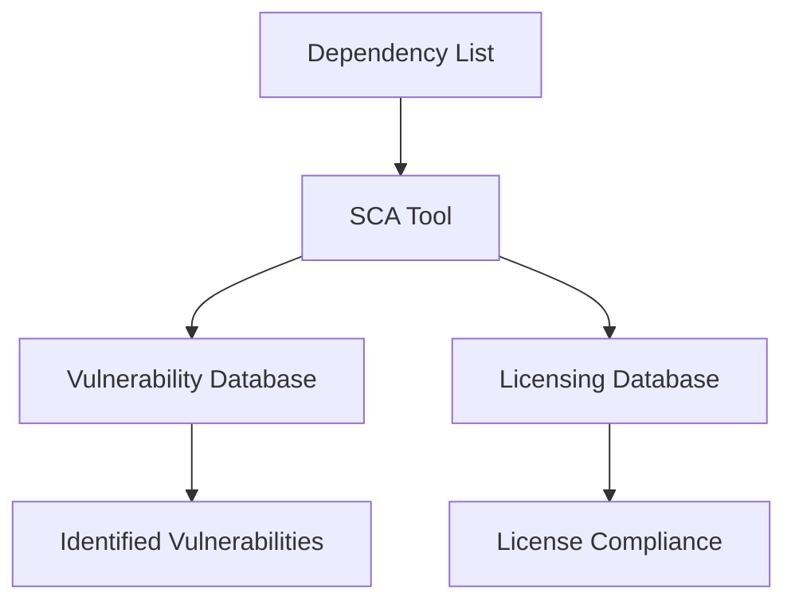

## Introduction to Vulnerability Scanning for Application Dependencies

When developing applications, it is crucial to understand that your own code is only a small part of the overall codebase. A significant portion of the code comes from external dependencies—libraries, frameworks, and modules developed by other engineers. These dependencies are integrated into your application during the build and deployment processes, becoming an integral part of your application's functionality. This means that any vulnerabilities present in these third-party components can be exploited by attackers, just as if they were part of your own code.

### Importance of Testing Third-Party Code

The primary concern is ensuring that these third-party components are secure. While it might seem reasonable to assume that well-known libraries and frameworks have been thoroughly tested and are free of vulnerabilities, this is not always the case. Recent high-profile breaches and vulnerabilities have highlighted the risks associated with relying solely on the security practices of third-party developers.

#### Real-World Examples

One notable example is the **Log4j vulnerability (CVE-2021-44228)**, which affected the widely used Apache Log4j logging utility. This vulnerability allowed remote code execution through specially crafted log messages, leading to widespread exploitation across various industries. Another example is the **Heartbleed bug (CVE-2014-0160)**, which affected OpenSSL, a popular cryptographic library, allowing attackers to steal sensitive information from memory.

These examples underscore the importance of performing thorough security assessments on all components of your application, including third-party dependencies.

### Software Composition Analysis (SCA)

To address the security concerns associated with third-party dependencies, organizations employ **Software Composition Analysis (SCA)**. SCA tools help identify and manage the components used in an application, providing insights into potential vulnerabilities and licensing issues.

#### How SCA Works

SCA tools typically work by analyzing the dependencies listed in your project's manifest files (such as `package.json` for Node.js applications). They compare these dependencies against a database of known vulnerabilities and licensing information. This process helps in identifying any insecure or non-compliant components.



### Example: Analyzing Dependencies in a Node.js Application

Let's consider a Node.js application with a `package.json` file containing numerous dependencies. We will use an SCA tool to analyze these dependencies and identify any potential vulnerabilities.

#### Sample `package.json` File

```json
{
  "name": "my-app",
  "version": "1.0.0",
  "dependencies": {
    "express": "^4.17.1",
    "lodash": "^4.17.21",
    "axios": "^0.21.1",
    "moment": "^2.29.1"
  }
}
```

#### Running an SCA Tool

We can use a tool like **Snyk** to analyze the dependencies listed in `package.json`.

```bash
npm install -g snyk
snyk test --file=package.json
```

This command will scan the dependencies and report any known vulnerabilities.

#### Example Output

```plaintext
Test summary
=============
Introduced  vulnerabilities: 2
Licenses: 0

Vulnerabilities found in 2 out of 4 direct dependencies.
```

The output indicates that two of the dependencies have known vulnerabilities. Let's examine one of these vulnerabilities in detail.

### Detailed Example: Express.js Vulnerability

Suppose the SCA tool identifies a vulnerability in the `express` dependency. The tool might report something like:

```plaintext
express@4.17.1 is vulnerable to Prototype Pollution (CVE-2021-21310)
```

#### Understanding the Vulnerability

**Prototype Pollution** occurs when an attacker can modify the prototype of an object, affecting all instances of that object. In the context of `express`, this could allow an attacker to inject malicious code into the application.

#### Exploit Scenario

An attacker could craft a request that modifies the prototype of an object used by `express`. For example:

```http
POST /vulnerable-endpoint HTTP/1.1
Host: example.com
Content-Type: application/json

{
  "__proto__": {
    "polluted": "malicious code"
  }
}
```

This request would modify the prototype of objects used by `express`, potentially leading to arbitrary code execution.

#### Detection and Prevention

To prevent such vulnerabilities, it is essential to keep dependencies up-to-date and to use SCA tools regularly. Additionally, implementing secure coding practices and using input validation can mitigate the risk.

##### Secure Coding Fix

Here is an example of how to securely handle user input to prevent prototype pollution:

```javascript
const express = require('express');
const app = express();

app.use((req, res, next) => {
  // Sanitize user input to prevent prototype pollution
  Object.defineProperty(req.body, '__proto__', {
    writable: false,
    configurable: false,
    enumerable: false,
  });
  next();
});

app.post('/vulnerable-endpoint', (req, res) => {
  // Safe to use req.body now
  console.log(req.body);
  res.send('Received data');
});

app.listen(3000, () => {
  console.log('Server listening on port 3000');
});
```

In this example, we define the `__proto__` property as non-writable and non-configurable, preventing any modifications to the prototype.

### Comprehensive SCA Workflow

To ensure continuous security of your application, it is recommended to integrate SCA into your DevSecOps pipeline. This involves automating the scanning process and integrating it with your CI/CD workflow.

#### Example CI/CD Pipeline

```yaml
# .github/workflows/ci.yml
name: CI

on:
  push:
    branches: [ main ]
  pull_request:
    branches: [ main ]

jobs:
  build:
    runs-on: ubuntu-latest

    steps:
    - name: Checkout code
      uses: actions/checkout@v2

    - name: Install dependencies
      run: npm install

    - name: Run SCA
      run: snyk test --file=package.json
      env:
        SNYK_TOKEN: ${{ secrets.SNYK_TOKEN }}

    - name: Build and test
      run: npm run build && npm test
```

This pipeline includes steps to checkout the code, install dependencies, run SCA, and build/test the application. The SCA step uses the `SNYK_TOKEN` to authenticate with Snyk and perform the analysis.

### Hands-On Practice

To gain practical experience with SCA, you can use the following labs:

- **PortSwigger Web Security Academy**: Offers interactive labs on various security topics, including SCA.
- **OWASP Juice Shop**: A deliberately insecure web application for practicing security testing.
- **DVWA (Damn Vulnerable Web Application)**: Another intentionally vulnerable web application for security training.

These labs provide real-world scenarios where you can apply SCA techniques and learn from practical examples.

### Conclusion

In conclusion, ensuring the security of third-party dependencies is a critical aspect of modern application development. By using SCA tools and integrating them into your DevSecOps pipeline, you can identify and mitigate vulnerabilities in your dependencies, thereby enhancing the overall security posture of your application. Regularly updating dependencies, validating user input, and maintaining a robust security testing process are key to achieving this goal.

---
<!-- nav -->
[[06-Introduction to Vulnerability Scanning for Application Dependencies Part 6|Introduction to Vulnerability Scanning for Application Dependencies Part 6]] | [[DevSecOps/DevSecOps Bootcamp/05-Application Security Testing/14-Vulnerability Scanning for Application Dependencies/Software Composition Analysis Security Issues in Application Dependencies/00-Overview|Overview]] | [[08-Setting Up Retire.js for Dependency Scanning|Setting Up Retire.js for Dependency Scanning]]
