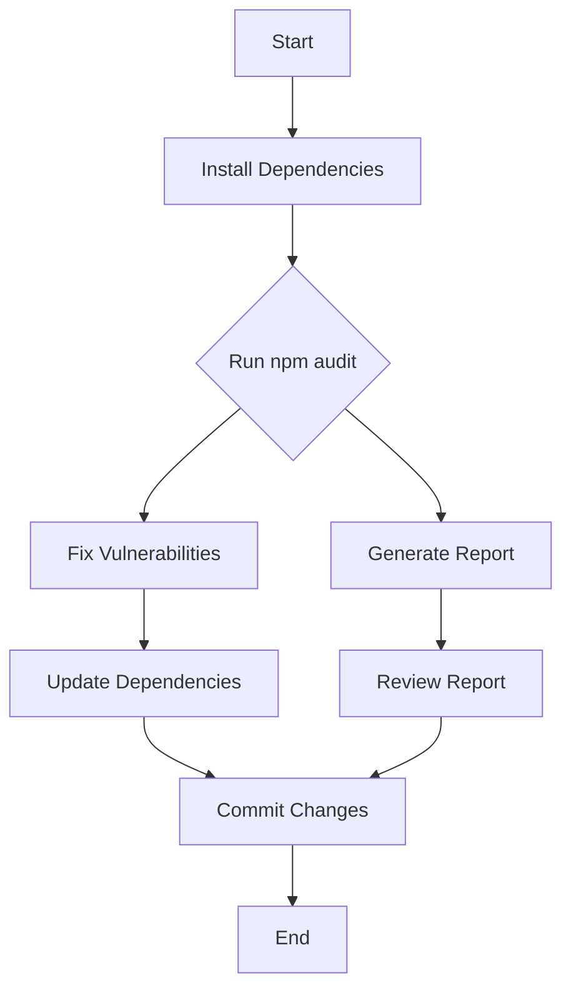
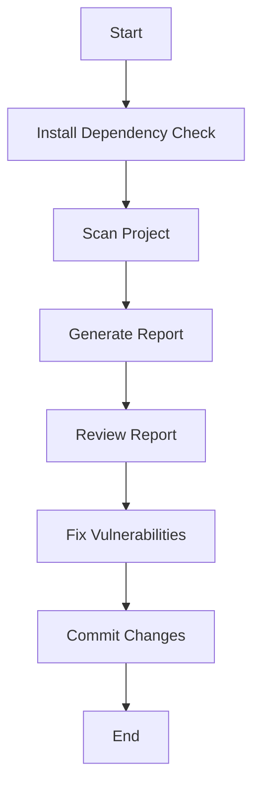

## Vulnerability Scanning for Application Dependencies

### Introduction to Dependency Scanning

Dependency scanning is a critical aspect of DevSecOps, particularly when dealing with software composition analysis (SCA). In modern software development, applications often rely on numerous third-party libraries and frameworks. These dependencies can introduce vulnerabilities if they are not properly managed and monitored. This chapter will focus on the specific context of Node.js applications and the tools available for scanning these dependencies.

### Node.js Dependency Management

Node.js applications typically manage their dependencies through the `npm` (Node Package Manager). `npm` is a powerful tool that allows developers to easily install, update, and manage packages. However, these packages can sometimes contain vulnerabilities that could be exploited by attackers.

#### Built-in NPM Audit Command

Starting from `npm` version 6.0.0, `npm` includes a built-in command called `audit`. This command scans the project's dependencies for known vulnerabilities and provides a report detailing any issues found.

```bash
npm audit
```

This command performs the following steps:

1. **Fetches the package-lock.json**: This file contains a detailed list of all the dependencies and their versions.
2. **Checks for vulnerabilities**: `npm` compares the dependencies listed in `package-lock.json` against a database of known vulnerabilities.
3. **Generates a report**: The report lists any vulnerabilities found, along with severity levels and potential fixes.

#### Example of npm audit

Consider a simple Node.js project with the following `package.json`:

```json
{
  "name": "example-project",
  "version": "1.0.0",
  "dependencies": {
    "express": "^4.17.1",
    "lodash": "^4.17.21"
  }
}
```

Running `npm audit` might produce the following output:

```plaintext
# npm audit report

lodash  <=4.17.21
Severity: high
Prototype Pollution - https://npmjs.com/advisories/1600
fix available via `npm audit fix`
node_modules/lodash
  express  <=4.17.1
  Depends on vulnerable versions of lodash
  node_modules/express

2 vulnerabilities (2 high) detected
```

This report indicates that both `lodash` and `express` have known vulnerabilities. The `npm audit` command suggests fixing these vulnerabilities by running `npm audit fix`.

### Third-Party SCA Tools

While `npm audit` is a built-in tool, there are several third-party SCA tools that provide more comprehensive scanning capabilities. Two popular tools for JavaScript dependencies are `OWASP Dependency Check` and `Retired.js`.

#### OWASP Dependency Check

OWASP Dependency Check is a tool designed to identify project dependencies that have known vulnerabilities. It supports various programming languages and frameworks, including Node.js.

To use OWASP Dependency Check, you first need to install it:

```bash
wget https://github.com/jeremylong/DependencyCheck/releases/download/v6.5.0/dependency-check.sh
chmod +x dependency-check.sh
```

Then, you can run it against your project:

```bash
./dependency-check.sh --project "Example Project" --scan . --out ./report.html
```

This command generates an HTML report (`report.html`) that details any vulnerabilities found in your project's dependencies.

#### Retired.js

Retired.js is another popular tool specifically designed for scanning JavaScript dependencies. It can be used as a command-line tool or integrated into a browser extension.

To use Retired.js from the command line, you first need to install it globally:

```bash
npm install -g retired
```

Then, you can scan your project:

```bash
retired .
```

This command will scan the current directory and report any vulnerable dependencies.

### Browser Extension for Retired.js

Retired.js also offers a browser extension that can be used to scan websites for vulnerable dependencies. This is particularly useful for identifying vulnerabilities in third-party applications.

To install the Retired.js browser extension, follow these steps:

1. Visit the Retired.js website and download the extension.
2. Install the extension in your browser.
3. Navigate to any website and click on the Retired.js icon to scan the site for vulnerable dependencies.

### Security Implications and Mitigation Strategies

While tools like `npm audit`, OWASP Dependency Check, and Retired.js are invaluable for identifying vulnerabilities, they also pose a risk if misused. Attackers can use these tools to identify vulnerabilities in applications and potentially exploit them.

#### How to Prevent / Defend

To mitigate the risks associated with dependency scanning tools, consider the following strategies:

1. **Regular Scanning**: Regularly scan your dependencies using tools like `npm audit` and OWASP Dependency Check.
2. **Automate Scanning**: Integrate dependency scanning into your CI/CD pipeline to ensure that vulnerabilities are identified and addressed early in the development process.
3. **Keep Dependencies Updated**: Ensure that all dependencies are kept up-to-date to minimize the risk of known vulnerabilities.
4. **Use Secure Coding Practices**: Implement secure coding practices to reduce the likelihood of introducing vulnerabilities in your codebase.
5. **Monitor for New Vulnerabilities**: Stay informed about new vulnerabilities by subscribing to security advisories and regularly updating your dependencies.

### Real-World Examples

#### Recent CVEs and Breaches

Several recent CVEs and breaches highlight the importance of dependency scanning:

1. **CVE-2021-21315**: A vulnerability in the `lodash` library allowed attackers to execute arbitrary code. This vulnerability was identified and fixed through regular dependency scanning.
2. **SolarWinds Supply Chain Attack**: This attack involved the compromise of software supply chains, highlighting the importance of verifying the integrity of dependencies.

### Complete Example with Code and Diagrams

Consider a Node.js application with the following `package.json`:

```json
{
  "name": "example-app",
  "version": "1.0.0",
  "dependencies": {
    "express": "^4.17.1",
    "lodash": "^4.17.21"
  }
}
```

#### Running npm audit

```bash
npm audit
```

This command might produce the following output:

```plaintext
# npm audit report

lodash  <=4.17.21
Severity: high
Prototype Pollution - https://npmjs.com/advisories/1600
fix available via `npm audit fix`
node_modules/lodash
  express  <=4.17.1
  Depends on vulnerable versions of lodash
  node_modules/express

2 vulnerabilities (2 high) detected
```

#### Fixing Vulnerabilities

To fix the vulnerabilities, run:

```bash
npm audit fix
```

This command updates the `package.json` and `package-lock.json` files to use the latest versions of the dependencies:

```json
{
  "name": "example-app",
  "version": "1.0.0",
  "dependencies": {
    "express": "^4.18.2",
    "lodash": "^4.17.22"
  }
}
```

#### Running OWASP Dependency Check

First, install OWASP Dependency Check:

```bash
wget https://github.com/jeremylong/DependencyCheck/releases/download/v6.5.0/dependency-check.sh
chmod +x dependency-check.sh
```

Then, run it against your project:

```bash
./dependency-check.sh --project "Example Project" --scan . --out ./report.html
```

This command generates an HTML report (`report.html`) that details any vulnerabilities found in your project's dependencies.

#### Running Retired.js

First, install Retired.js globally:

```bash
npm install -g retired
```

Then, scan your project:

```bash
retired .
```

This command will scan the current directory and report any vulnerable dependencies.

### Mermaid Diagrams

#### Dependency Scanning Workflow



#### OWASP Dependency Check Workflow



### Conclusion

Dependency scanning is a crucial component of DevSecOps, helping to identify and mitigate vulnerabilities in third-party dependencies. By using tools like `npm audit`, OWASP Dependency Check, and Retired.js, developers can ensure that their applications are secure and free from known vulnerabilities. Regular scanning, keeping dependencies updated, and implementing secure coding practices are essential strategies for maintaining the security of your applications.

### Practice Labs

For hands-on practice with dependency scanning, consider the following labs:

- **PortSwigger Web Security Academy**: Offers interactive labs on web application security, including dependency scanning.
- **OWASP Juice Shop**: A deliberately insecure web application for practicing web security skills.
- **DVWA (Damn Vulnerable Web Application)**: A PHP/MySQL web application that is riddled with vulnerabilities for educational purposes.

These labs provide practical experience in identifying and mitigating vulnerabilities in application dependencies.

---
<!-- nav -->
[[08-Setting Up Retire.js for Dependency Scanning|Setting Up Retire.js for Dependency Scanning]] | [[DevSecOps/DevSecOps Bootcamp/05-Application Security Testing/14-Vulnerability Scanning for Application Dependencies/Software Composition Analysis Security Issues in Application Dependencies/00-Overview|Overview]] | [[DevSecOps/DevSecOps Bootcamp/05-Application Security Testing/14-Vulnerability Scanning for Application Dependencies/Software Composition Analysis Security Issues in Application Dependencies/10-Conclusion|Conclusion]]
