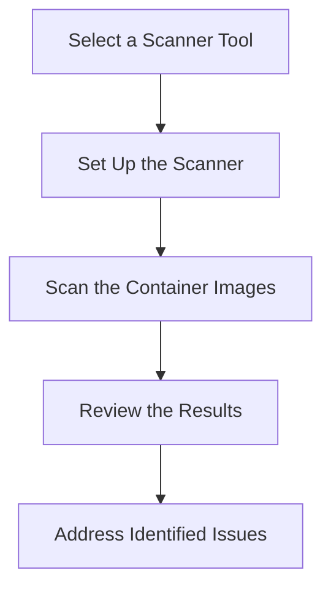

## Introduction to Container Security Testing

Welcome to the module on Automating Container Security Testing. In this comprehensive guide, we will delve deep into the world of container security, focusing on how to automate the process of ensuring your containers are secure. Our journey begins with a scenario involving Maeve, who is concerned about the security of the containers her organization uses. She seeks advice from Jennifer, a security consultant, who suggests implementing automated security testing through container security scanning.

### What is Container Security Scanning?

Container security scanning is the process of automatically analyzing container images to identify potential security vulnerabilities, compliance issues, and other risks. This is crucial because containers are often built from base images that may contain known vulnerabilities, outdated components, or configurations that do not adhere to organizational security policies.

#### Why is Container Security Scanning Important?

1. **Identifying Vulnerabilities**: Containers can inherit vulnerabilities from their base images. These vulnerabilities can be exploited by attackers to gain unauthorized access or cause damage.
   
2. **Ensuring Compliance**: Organizations often have specific security policies that must be adhered to. Container security scanning helps ensure that these policies are followed by identifying non-compliant configurations.

3. **Maintaining Up-to-Date Components**: Outdated components within containers can pose significant security risks. Regular scanning helps identify and address these outdated components.

4. **Automating Security Checks**: Manual security checks are time-consuming and prone to human error. Automated container security scanning provides a consistent and reliable method for identifying security issues.

### Background Theory

To understand container security scanning, it is essential to grasp the basics of containerization and the underlying technologies.

#### Containerization Basics

Containers are lightweight, portable, and self-sufficient units of software that package code and dependencies together. They run consistently across different computing environments. Containers are built from Dockerfiles, which define the steps required to create the container image.

#### Dockerfile Example

```Dockerfile
# Use an official Python runtime as a parent image
FROM python:3.8-slim

# Set the working directory in the container
WORKDIR /app

# Copy the current directory contents into the container at /app
COPY . /app

# Install any needed packages specified in requirements.txt
RUN pip install --no-cache-dir -r requirements.txt

# Make port 80 available to the world outside this container
EXPOSE 80

# Define environment variable
ENV NAME World

# Run app.py when the container launches
CMD ["python", "app.py"]
```

This Dockerfile creates a container image based on the `python:3.8-slim` base image, copies the application files into the container, installs the necessary Python packages, and sets up the entry point for the application.

### Container Security Scanning Tools

Several tools are available for container security scanning. Some popular ones include:

1. **Clair**: An open-source project by CoreOS that scans container images for vulnerabilities.
2. **Trivy**: A simple and comprehensive vulnerability scanner for containers.
3. **Anchore Engine**: A container image analysis engine that provides detailed insights into container images.
4. **Snyk**: A cloud-native security platform that includes container security scanning capabilities.

#### Clair Example

Clair is a popular open-source tool for container security scanning. Here’s how you can set up and use Clair:

1. **Install Clair**:
   ```sh
   docker pull quay.io/coreos/clair
   docker run -d -p 5432:5432 postgres:9.6
   docker run -d -p 6060:6060 --link postgres:postgres quay.io/coreos/clair:latest
   ```

2. **Scan a Container Image**:
   ```sh
   curl -X POST http://localhost:6060/v1/layers
   ```

3. **View Scan Results**:
   ```sh
   curl http://localhost:6060/v1/namespaces/default/feeds
   ```

### Real-World Examples and Recent CVEs

Recent breaches and CVEs highlight the importance of container security scanning. For instance:

- **CVE-2021-21315**: A vulnerability in the `nginx` web server allowed attackers to execute arbitrary code. This vulnerability could be present in container images that use outdated versions of `nginx`.
  
- **CVE-2021-44228 (Log4Shell)**: This critical vulnerability in the Apache Log4j library affected numerous applications, including those packaged in containers. Regular scanning would help identify and mitigate such vulnerabilities.

### How to Perform Container Security Scanning

Performing container security scanning involves several steps:

1. **Select a Scanner Tool**: Choose a tool that suits your needs. Popular options include Clair, Trivy, Anchore Engine, and Snyk.

2. **Set Up the Scanner**: Configure the scanner according to the documentation provided by the tool.

3. **Scan the Container Images**: Use the scanner to analyze the container images for vulnerabilities and compliance issues.

4. **Review the Results**: Analyze the results to identify and address any issues found.

### Detailed Example Using Trivy

Trivy is a simple and comprehensive vulnerability scanner for containers. Here’s a step-by-step guide to using Trivy:

1. **Install Trivy**:
   ```sh
   wget https://github.com/aquasecurity/trivy/releases/download/v0.24.1/trivy_0.24.1_Linux-64bit.deb
   sudo dpkg -i trivy_0.24.1_Linux-64bit.deb
   ```

2. **Scan a Container Image**:
   ```sh
   trivy image nginx:latest
   ```

3. **Review the Results**:
   ```sh
   trivy image nginx:latest > results.txt
   cat results.txt
   ```

### Mermaid Diagrams

Let’s visualize the process of container security scanning using a mermaid diagram:



### Common Pitfalls and Best Practices

#### Common Pitfalls

1. **Ignoring Outdated Components**: Failing to update components can leave your containers vulnerable to known exploits.
   
2. **Skipping Compliance Checks**: Not adhering to organizational security policies can lead to compliance issues and potential legal ramifications.

3. **Manual Scanning**: Relying solely on manual scanning is time-consuming and prone to human error.

#### Best Practices

1. **Regular Scanning**: Implement regular scanning as part of your CI/CD pipeline to catch vulnerabilities early.
   
2. **Automate Security Checks**: Use automated tools to perform security checks consistently and reliably.

3. **Update Components**: Keep all components up-to-date to mitigate known vulnerabilities.

### How to Prevent / Defend

#### Detection

1. **Use Automated Scanners**: Regularly use automated scanners like Clair, Trivy, or Anchore Engine to detect vulnerabilities and compliance issues.

2. **Monitor Logs**: Monitor logs for suspicious activity that might indicate a security breach.

#### Prevention

1. **Keep Components Updated**: Ensure all components used in your containers are up-to-date to mitigate known vulnerabilities.

2. **Adhere to Security Policies**: Follow organizational security policies to ensure compliance.

3. **Implement Secure Coding Practices**: Use secure coding practices to minimize the risk of introducing vulnerabilities.

#### Secure-Coding Fixes

Here’s an example of a vulnerable Dockerfile and its secure counterpart:

**Vulnerable Dockerfile**:
```Dockerfile
FROM python:3.8-slim

WORKDIR /app
COPY . /app
RUN pip install --no-cache-dir -r requirements.txt
EXPOSE 80
CMD ["python", "app.py"]
```

**Secure Dockerfile**:
```Dockerfile
FROM python:3.8-slim

WORKDIR /app
COPY requirements.txt /app/
RUN pip install --no-cache-dir -r requirements.txt
COPY . /app
EXPOSE 80
CMD ["python", "app.py"]
```

In the secure version, the `requirements.txt` file is copied first and then installed separately to reduce the attack surface.

### Complete Example: Scanning a Container Image

Let’s walk through a complete example of scanning a container image using Trivy:

1. **Build a Docker Image**:
   ```sh
   docker build -t my-app .
   ```

2. **Scan the Docker Image**:
   ```sh
   trivy image my-app
   ```

3. **Review the Results**:
   ```sh
   trivy image my-app > results.txt
   cat results.txt
   ```

### Integration with Build Pipelines

Integrating container security scanning into your build pipelines ensures that security checks are performed automatically and consistently. Here’s an example of integrating Trivy into a CI/CD pipeline using GitHub Actions:

```yaml
name: Container Security Scan

on:
  push:
    branches: [ main ]
  pull_request:
    branches: [ main ]

jobs:
  build:
    runs-on: ubuntu-latest

    steps:
    - name: Checkout Code
      uses: actions/checkout@v2

    - name: Build Docker Image
      run: |
        docker build -t my-app .

    - name: Scan Docker Image
      run: |
        trivy image my-app
```

### Conclusion

In this module, we have explored the concept of container security scanning, its importance, and how to perform it effectively. By automating container security testing, organizations can ensure that their containers are secure, compliant, and up-to-date. Regular scanning and adherence to best practices are key to maintaining a secure container environment.

### Practice Labs

For hands-on experience with container security scanning, consider the following practice labs:

- **Kubernetes Goat**: A hands-on lab for learning Kubernetes security.
- **OWASP WrongSecrets**: A series of challenges for learning about web security.
- **kube-hunter**: A tool for discovering and exploiting misconfigurations in Kubernetes clusters.

These labs provide practical experience in securing containers and integrating security scanning into your workflows.

---
<!-- nav -->
[[DevSecOps/DevSecOps Bootcamp/06-Container & Kubernetes Security/01-Automating Container Security Testing/01-Introduction/00-Overview|Overview]] | [[DevSecOps/DevSecOps Bootcamp/06-Container & Kubernetes Security/01-Automating Container Security Testing/01-Introduction/02-Practice Questions & Answers|Practice Questions & Answers]]
