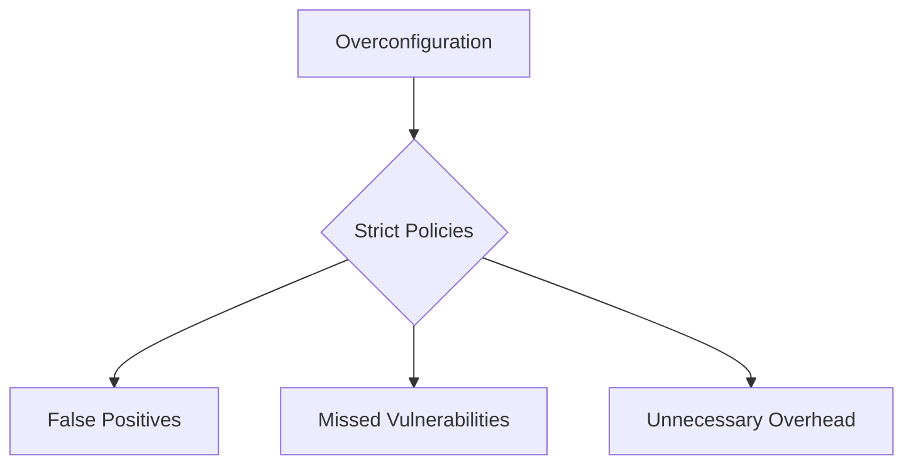
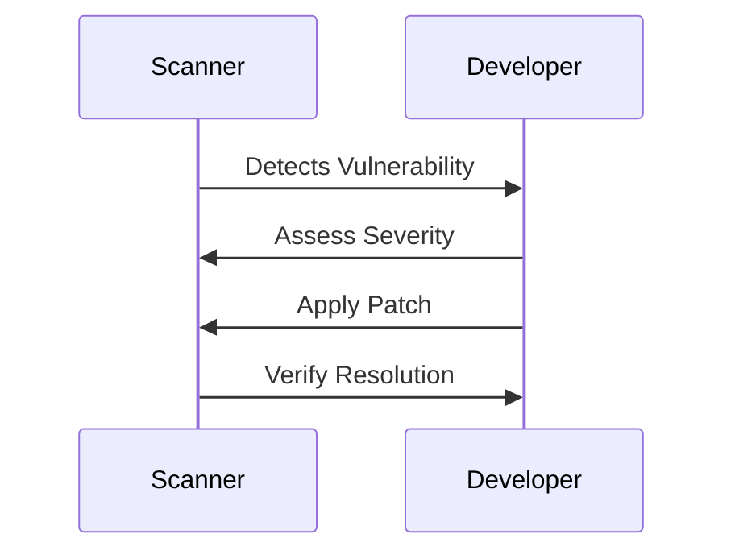
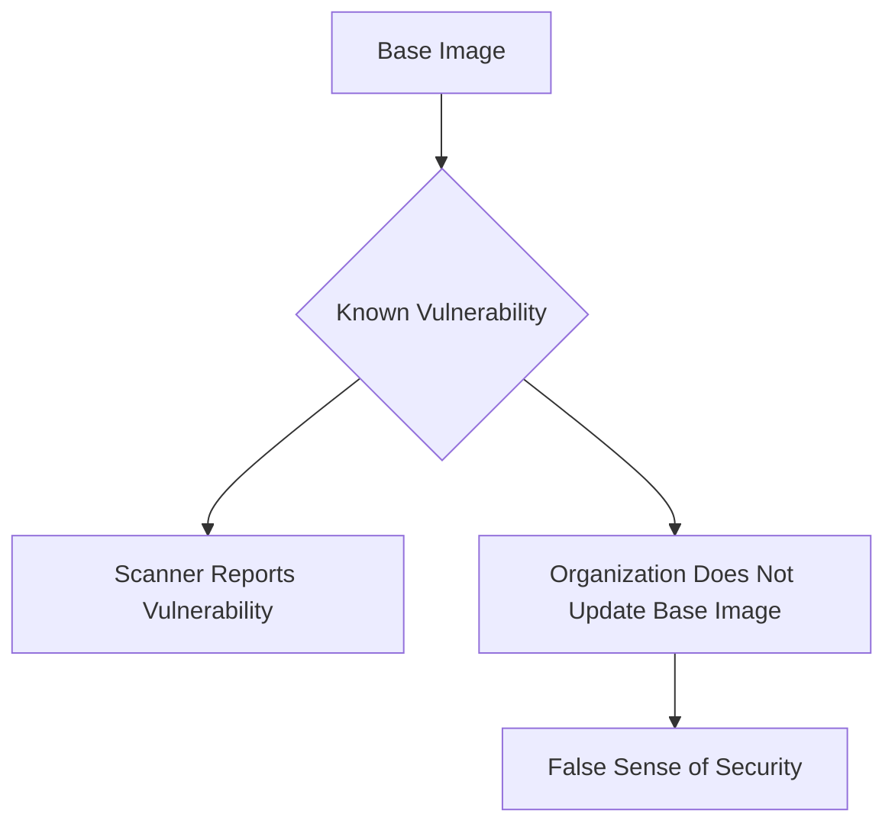
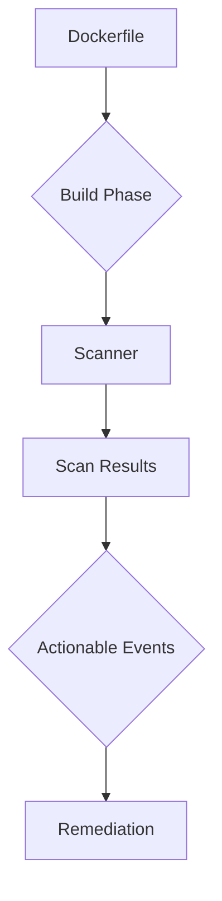

## Introduction to Container Security Scanners

Container security scanners are essential tools in the DevSecOps pipeline, designed to identify vulnerabilities and ensure the integrity of container images. These tools analyze container images to detect known vulnerabilities, misconfigurations, and other security issues. However, the effectiveness of these scanners largely depends on the specific tool being used and how it is configured.

### Why Container Security Scanners Matter

Containers have become a ubiquitous part of modern software development and deployment practices. They provide a lightweight, portable environment for applications, but they also introduce unique security challenges. Container images can contain vulnerabilities inherited from base images, dependencies, or even the runtime environment itself. Container security scanners help mitigate these risks by providing insights into the security posture of container images.

### Types of Container Security Scanners

There are several types of container security scanners available, each with its own strengths and weaknesses:

1. **Static Analysis Tools**: These tools analyze the static content of container images, such as the filesystem and metadata, to identify known vulnerabilities and misconfigurations.
2. **Dynamic Analysis Tools**: These tools run container images in a controlled environment to observe their behavior and detect runtime vulnerabilities.
3. **Compliance and Policy Enforcement Tools**: These tools check container images against predefined security policies and compliance standards.

### Depth of Analysis

The depth of analysis provided by container security scanners varies widely based on the tool. Some tools offer a shallow analysis, focusing primarily on known vulnerabilities, while others provide a more comprehensive analysis, including dynamic behavior and compliance checks.

### Configuration Pitfalls

One of the most significant challenges with container security scanners is the potential for overconfiguration. Many tools allow extensive customization of settings, which can lead to overly complex configurations that may not align with the actual security needs of the organization. Overconfiguration can result in false positives, missed vulnerabilities, or unnecessary overhead.

#### Example: Overconfiguration Scenario

Consider a scenario where an organization configures a container security scanner to enforce strict policies on every aspect of the container image, including minor dependencies and runtime configurations. This approach might lead to numerous false positives, making it difficult to prioritize and address actual security issues.



### Actionable Events from Scan Results

The primary goal of container security scanners is to generate actionable events that can be addressed by the development and operations teams. These events could include:

- **Vulnerability Reports**: Detailed reports of known vulnerabilities found in the container image.
- **Misconfiguration Alerts**: Notifications about misconfigured settings that could pose security risks.
- **Policy Violations**: Alerts when the container image violates predefined security policies.

#### Example: Actionable Event Workflow

When a container security scanner identifies a vulnerability, the workflow might involve:

1. **Detection**: The scanner detects a known vulnerability in a container image.
2. **Notification**: The development team is notified of the vulnerability.
3. **Assessment**: The development team assesses the severity and impact of the vulnerability.
4. **Remediation**: The development team applies a patch or updates the affected component.
5. **Verification**: The scanner re-runs to verify that the vulnerability has been resolved.



### Base Images and Security Scanners

Base images are pre-built container images that serve as the foundation for custom container images. Using base images can simplify the development process, but it also introduces the risk of inheriting vulnerabilities from the base image. If an organization is not willing to change the base images, the utility of a container security scanner may be limited.

#### Example: Base Image Vulnerability

Suppose an organization uses a base image that contains a known vulnerability. If the organization is not willing to update the base image, the scanner will continue to report the same vulnerability, leading to a false sense of security.



### When to Use Container Scanners

Container security scanners can be used at various stages of the container lifecycle:

1. **Build Phase**: During the build phase, when a Dockerfile is being built and the resulting image is created.
2. **Push to Registry**: When a container image is pushed to a container registry.
3. **Pull from Registry**: When a container image is pulled from a container registry.

#### Example: Build Phase Scanning

During the build phase, a container security scanner can be integrated into the CI/CD pipeline to automatically scan the container image as it is being built.



### Tool Demonstration: Anchor Engine

Anchor Engine is a Docker container analysis and compliance tool that will be demonstrated in this module. It is an open-source tool that provides comprehensive analysis of container images.

#### Example: Anchor Engine Usage

To demonstrate Anchor Engine, consider the following steps:

1. **Install Anchor Engine**:
    ```sh
    git clone https://github.com/aquasecurity/anchor-engine.git
    cd anchor-engine
    make install
    ```

2. **Run Anchor Engine**:
    ```sh
    anchor-engine scan --image <your-image-name>
    ```

3. **Review Scan Results**:
    ```json
    {
        "image": "<your-image-name>",
        "vulnerabilities": [
            {
                "id": "CVE-2021-44228",
                "severity": "CRITICAL",
                "description": "Log4j vulnerability",
                "affected_packages": ["log4j"]
            }
        ],
        "misconfigurations": [
            {
                "id": "MISCONF-001",
                "severity": "HIGH",
                "description": "Insecure permissions on sensitive files",
                "affected_files": ["/etc/passwd"]
            }
        ]
    }
    ```

### How to Prevent / Defend

To effectively use container security scanners and mitigate the associated risks, follow these best practices:

1. **Choose the Right Tool**: Select a container security scanner that aligns with your organization's needs and provides the appropriate level of analysis.
2. **Configure Properly**: Avoid overconfiguration by setting up the scanner with a balanced set of policies and rules that reflect your organization's security requirements.
3. **Regular Updates**: Keep the base images and dependencies up to date to minimize the risk of inheriting known vulnerabilities.
4. **Automate Scanning**: Integrate container security scanning into your CI/CD pipeline to ensure that container images are scanned at critical points in the development lifecycle.
5. **Address Findings Promptly**: Act on the findings generated by the scanner to remediate vulnerabilities and misconfigurations.

#### Example: Secure Configuration vs. Vulnerable Configuration

Consider a scenario where a container image is configured with insecure permissions on sensitive files. The vulnerable configuration might look like this:

```Dockerfile
# Vulnerable Dockerfile
FROM ubuntu:latest
COPY . /app
RUN chmod 777 /etc/passwd
CMD ["python", "/app/app.py"]
```

The secure configuration would involve ensuring that sensitive files have appropriate permissions:

```Dockerfile
# Secure Dockerfile
FROM ubuntu:latest
COPY . /app
RUN chmod 644 /etc/passwd
CMD ["python", "/app/app.py"]
```

### Real-World Examples

Recent real-world examples highlight the importance of container security:

- **CVE-2021-44228 (Log4j)**: This vulnerability affected many container images that included the Log4j library. Organizations that used container security scanners were able to quickly identify and remediate this vulnerability.
- **CVE-2022-22965 (Spring Framework)**: This vulnerability affected Spring Framework-based applications. Container security scanners helped organizations identify and patch this vulnerability in their container images.

### Conclusion

Container security scanners are crucial tools in the DevSecOps pipeline, helping organizations identify and mitigate security risks in container images. By choosing the right tool, configuring it properly, and integrating it into the CI/CD pipeline, organizations can significantly enhance the security of their containerized applications.

### Practice Labs

For hands-on practice with container security scanning, consider the following labs:

- **Kubernetes Goat**: A hands-on lab for learning Kubernetes security.
- **OWASP WrongSecrets**: A series of challenges to learn about secrets management and security.
- **kube-hunter**: A tool for hunting security issues in Kubernetes clusters.

These labs provide practical experience with container security scanning and help reinforce the concepts covered in this chapter.

---
<!-- nav -->
[[DevSecOps/DevSecOps Bootcamp/06-Container & Kubernetes Security/01-Automating Container Security Testing/02-Container Security Scanning/00-Overview|Overview]] | [[02-Introduction to Container Security Scanning|Introduction to Container Security Scanning]]
