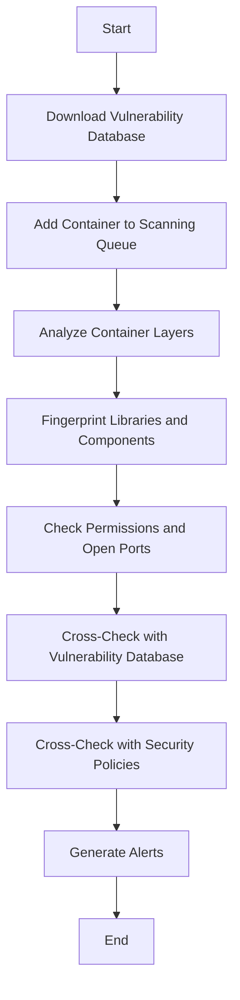
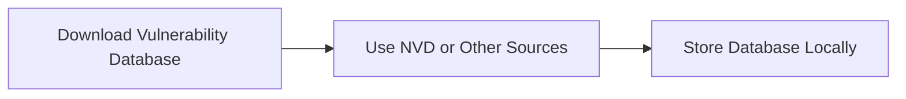
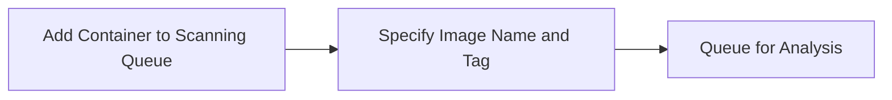
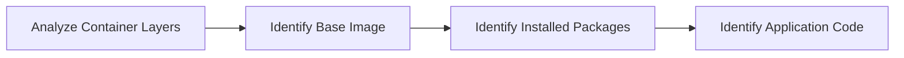
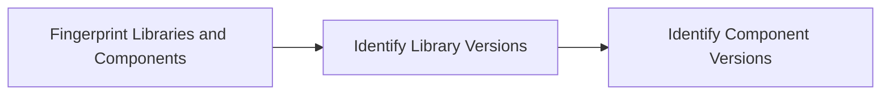
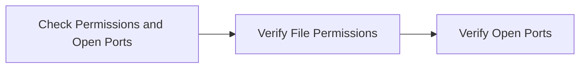
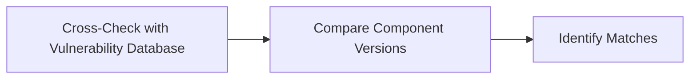
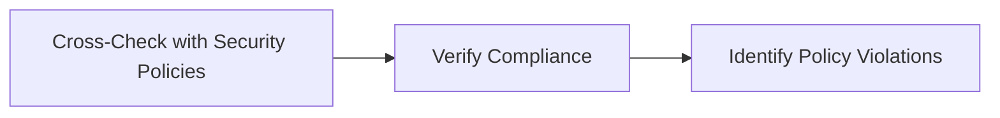
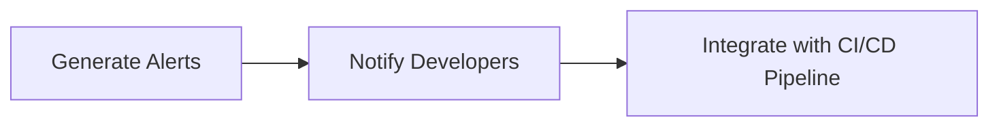

## Introduction to Container Security Scanning

Container security scanning is a critical component of DevSecOps, ensuring that containers are free from vulnerabilities and comply with organizational policies. This process involves analyzing container images to identify potential security issues, such as outdated libraries, misconfigurations, and compliance violations. By automating this process, organizations can integrate security testing into their continuous integration and delivery (CI/CD) pipelines, thereby reducing the risk of deploying insecure applications.

### What Can Container Security Scanning Do?

Container security scanning can detect various types of security issues within container images:

1. **Outdated Libraries**: Identifying libraries that have known vulnerabilities.
2. **Incorrectly Configured Containers**: Detecting misconfigurations that could lead to security risks.
3. **Outdated Operating Systems or Base Images**: Ensuring that the underlying OS and base images are up-to-date.
4. **Compliance Validations**: Checking if the container adheres to predefined security policies.
5. **Best Practices Suggestions**: Recommending improvements based on industry standards and best practices.

### Why Is Container Security Scanning Important?

Container security scanning is essential because it helps organizations mitigate the following risks:

- **Vulnerability Exploitation**: Outdated libraries and components can be exploited by attackers.
- **Misconfiguration Risks**: Incorrect configurations can expose sensitive data or allow unauthorized access.
- **Non-compliance Penalties**: Failure to meet regulatory requirements can result in legal and financial penalties.
- **Reputation Damage**: Security breaches can severely damage an organization's reputation.

### Real-World Examples

Recent breaches and CVEs highlight the importance of container security scanning:

- **CVE-2021-44228 (Log4j)**: Many container images were found to contain vulnerable versions of Log4j, leading to widespread exploitation.
- **CVE-2022-22965 (Spring Framework)**: Vulnerable Spring Framework versions were identified in numerous container images, posing significant risks.

### How Does Container Security Scanning Work?

Container security scanning operates similarly to dependency scanning for third-party libraries. Here’s a detailed breakdown of the process:

1. **Vulnerability Database**: The scanning system maintains a database of known vulnerabilities in operating systems and third-party libraries.
2. **Container Analysis**: The scanner analyzes each layer of the container image, fingerprinting all libraries and components.
3. **Cross-Checking**: The scanner compares the identified components against the vulnerability database and the defined security policies.
4. **Alert Generation**: If any matches are found, alerts are generated, indicating the presence of vulnerabilities or policy violations.

### Detailed Workflow

Let's dive deeper into the workflow of container security scanning using a mermaid diagram:



### Step-by-Step Mechanics

#### Step 1: Download Vulnerability Database

The first step involves downloading a comprehensive database of known vulnerabilities. This database includes information about vulnerabilities in various operating systems, libraries, and frameworks. For example, the National Vulnerability Database (NVD) provides a rich source of vulnerability information.



#### Step 2: Add Container to Scanning Queue

Once the vulnerability database is downloaded, the next step is to add the container image to the scanning queue. This typically involves specifying the container image name and tag.



#### Step 3: Analyze Container Layers

The scanner then analyzes each layer of the container image. Each layer contains different components, such as the base image, installed packages, and application code.



#### Step 4: Fingerprint Libraries and Components

The scanner fingerprints all libraries and components within the container image. This involves identifying the specific versions of each library and component.



#### Step 5: Check Permissions and Open Ports

In addition to identifying vulnerabilities, the scanner checks for misconfigurations such as incorrect permissions and open ports.



#### Step 6: Cross-Check with Vulnerability Database

The scanner cross-checks the identified components against the vulnerability database to determine if any known vulnerabilities are present.



#### Step 7: Cross-Check with Security Policies

The scanner also cross-checks the container image against predefined security policies. These policies may include requirements for certain libraries to be up-to-date or for specific configurations to be enforced.



#### Step 8: Generate Alerts

If any vulnerabilities or policy violations are identified, the scanner generates alerts. These alerts can be integrated into the CI/CD pipeline to halt deployment if necessary.



### Complete Example: Full HTTP Request and Response

Here is a complete example of a container security scan request and response:

#### HTTP Request

```http
POST /api/v1/scans HTTP/1.1
Host: scanner.example.com
Content-Type: application/json
Authorization: Bearer <token>

{
  "image": "myapp:v1",
  "policy": "strict"
}
```

#### HTTP Response

```http
HTTP/1.1 200 OK
Content-Type: application/json

{
  "scan_id": "12345",
  "status": "completed",
  "results": [
    {
      "component": "log4j",
      "version": "2.14.1",
      "vulnerability": "CVE-2021-44228",
      "severity": "high"
    },
    {
      "component": "spring-framework",
      "version": "5.3.10",
      "vulnerability": "CVE-2022-22965",
      "severity": "critical"
    }
  ],
  "policy_violations": [
    {
      "rule": "no_outdated_libraries",
      "description": "Library log4j is outdated"
    }
  ]
}
```

### Common Mistakes and Pitfalls

When implementing container security scanning, several common mistakes can occur:

- **Incomplete Vulnerability Database**: Using an incomplete or outdated vulnerability database can lead to false negatives.
- **Ignoring Misconfigurations**: Focusing solely on vulnerabilities and ignoring misconfigurations can leave significant security gaps.
- **Manual Integration**: Manually integrating scan results into the CI/CD pipeline can introduce human error and delays.

### How to Prevent / Defend

To effectively prevent and defend against security issues identified through container security scanning, follow these steps:

#### Detection

- **Regular Scans**: Schedule regular scans to catch new vulnerabilities as they emerge.
- **Real-time Monitoring**: Implement real-time monitoring to detect and respond to security issues quickly.

#### Prevention

- **Automated Scanning**: Integrate automated scanning into the CI/CD pipeline to ensure that all container images are scanned before deployment.
- **Policy Enforcement**: Enforce strict security policies to ensure that all container images meet the required security standards.

#### Secure Coding Fixes

Here is an example of a vulnerable and secure version of a Dockerfile:

##### Vulnerable Dockerfile

```dockerfile
FROM python:3.8-slim
COPY . /app
WORKDIR /app
RUN pip install --no-cache-dir -r requirements.txt
EXPOSE 8000
CMD ["python", "app.py"]
```

##### Secure Dockerfile

```dockerfile
FROM python:3.8-slim
COPY . /app
WORKDIR /app
RUN pip install --no-cache-dir -r requirements.txt && \
    apt-get update && apt-get upgrade -y && \
    apt-get clean
EXPOSE 8000
CMD ["python", "app.py"]
```

#### Configuration Hardening

Ensure that the container runtime is hardened by configuring it securely. For example, using Docker, you can enforce security policies using `seccomp` and `apparmor`.

##### Docker Security Configuration

```yaml
version: '3'
services:
  app:
    image: myapp:v1
    security_opt:
      - seccomp:unconfined
      - apparmor:unconfined
    cap_drop:
      - ALL
```

### Hands-On Labs

For hands-on practice with container security scanning, consider the following labs:

- **Kubernetes Goat**: A hands-on lab for learning Kubernetes security.
- **OWASP WrongSecrets**: A series of challenges to learn about web security.
- **kube-hunter**: A tool for hunting down security issues in Kubernetes clusters.

These labs provide practical experience in identifying and mitigating security issues in containerized environments.

### Conclusion

Container security scanning is a vital component of DevSecOps, helping organizations to identify and mitigate security risks in container images. By automating this process and integrating it into the CI/CD pipeline, organizations can ensure that their applications are secure and compliant with organizational policies. Through regular scanning, real-time monitoring, and strict policy enforcement, organizations can significantly reduce the risk of deploying insecure applications.

---
<!-- nav -->
[[01-Introduction to Container Security Scanners|Introduction to Container Security Scanners]] | [[DevSecOps/DevSecOps Bootcamp/06-Container & Kubernetes Security/01-Automating Container Security Testing/02-Container Security Scanning/00-Overview|Overview]] | [[DevSecOps/DevSecOps Bootcamp/06-Container & Kubernetes Security/01-Automating Container Security Testing/02-Container Security Scanning/03-Practice Questions & Answers|Practice Questions & Answers]]
