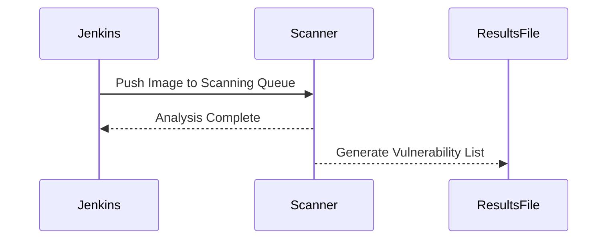
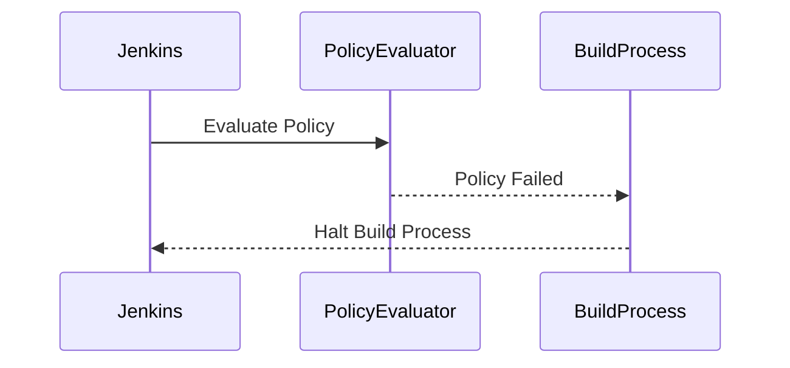

## Automating Container Security Testing in a Pipeline

### Introduction to Container Security Testing

Container security testing is a critical component of DevSecOps practices, ensuring that applications deployed in containers are free from vulnerabilities and adhere to security policies. Containers provide a lightweight and portable environment for applications, but they also introduce unique security challenges. By integrating container security testing into the continuous integration/continuous deployment (CI/CD) pipeline, organizations can catch and address security issues early in the development lifecycle.

### Key Concepts and Terminology

#### Docker Image
A Docker image is a lightweight, standalone, executable package that includes everything needed to run a piece of software, including the code, runtime, libraries, environment variables, and configuration files. Docker images are built using a `Dockerfile`, which contains instructions for creating the image.

#### Dockerfile
The `Dockerfile` is a text file that contains all the commands a user could call on the command line to assemble an image. Using `docker build` users can create an automated build that executes several command-line instructions in succession.

#### Jenkins
Jenkins is an open-source automation server that provides hundreds of plugins to support building, deploying, and automating any project. Jenkins is widely used in CI/CD pipelines to automate the testing and deployment processes.

#### GitLab
GitLab is a DevOps platform that provides a Git-repository manager providing wiki, issue-tracking, and CI/CD pipeline features. It integrates seamlessly with Jenkins to manage code repositories and trigger builds.

### Steps in the Container Security Testing Pipeline

#### Step 1: Scan Container Stage
In the scan container stage, the Docker image is analyzed for vulnerabilities and compliance with security policies. This stage involves several key steps:

1. **Check System Status**: Before performing any operations, it is essential to ensure that the system is in a stable state. This can involve checking the status of the Docker daemon, network connectivity, and other dependencies.

2. **Push Image to Scanning Queue**: Once the system is verified, the freshly built Docker image is pushed to a scanning queue. This queue is managed by a container security scanner such as Clair, Trivy, or Aqua Security.

3. **Wait for Analysis Completion**: The scanning process can take some time, depending on the size of the image and the complexity of the analysis. During this period, the pipeline waits for the analysis to complete.

4. **Generate Vulnerability List**: Upon completion of the analysis, a list of vulnerabilities is generated and stored in a file named `results.txt`. This file contains details about the vulnerabilities found, such as their severity, description, and potential impact.



#### Step 2: Evaluate Check Stage
In the evaluate check stage, the Docker image is evaluated against predefined security policies. This ensures that the image complies with organizational security standards and best practices.

1. **Policy Evaluation**: The policy evaluation involves checking the image against a set of predefined rules and conditions. These policies can cover various aspects such as allowed packages, restricted configurations, and compliance with regulatory requirements.

2. **Policy Failure Handling**: If the policy evaluation fails, the pipeline stage is marked as failed, and the build process is halted. This prevents the deployment of insecure images to production environments.



### Example of Container Security Testing in a Pipeline

Let's walk through a complete example of implementing container security testing in a Jenkins pipeline. We'll use Trivy as the container security scanner and demonstrate how to integrate it into the pipeline.

#### Jenkinsfile Configuration

First, we need to configure the Jenkins pipeline using a `Jenkinsfile`. This file defines the stages and steps of the pipeline.

```yaml
pipeline {
    agent any

    stages {
        stage('Lint Dockerfile') {
            steps {
                sh 'docker run --rm hadolint/hadolint hadolint Dockerfile'
            }
        }

        stage('Build Docker Image') {
            steps {
                script {
                    dockerImage = docker.build("myapp:${env.BUILD_ID}")
                }
            }
        }

        stage('Scan Container') {
            steps {
                script {
                    // Push the image to the scanning queue
                    sh 'docker tag myapp:${env.BUILD_ID} localhost:5000/myapp:${env.BUILD_ID}'
                    sh 'docker push localhost:5000/myapp:${env.BUILD_ID}'

                    // Wait for the analysis to complete
                    timeout(time: 10, unit: 'MINUTES') {
                        waitForQualityGate()
                    }

                    // Generate vulnerability list
                    sh 'trivy image --format template --template "{{.VulnerabilityID}} {{.Severity}} {{.Title}}" localhost:5000/myapp:${env.BUILD_ID} > results.txt'
                }
            }
        }

        stage('Evaluate Check') {
            steps {
                script {
                    // Evaluate policy
                    sh 'policy-evaluator --image=localhost:5000/myapp:${env.BUILD_ID}'

                    // Handle policy failure
                    if (currentBuild.result == 'FAILURE') {
                        error 'Policy evaluation failed'
                    }
                }
            }
        }
    }

    post {
        always {
            archiveArtifacts artifacts: 'results.txt', allowEmptyArchive: true
        }
    }
}
```

#### Explanation of the Jenkinsfile

- **Lint Dockerfile**: This stage uses Hadolint to lint the `Dockerfile` and ensure it adheres to best practices.
- **Build Docker Image**: This stage builds the Docker image using the `docker.build` command.
- **Scan Container**: This stage pushes the image to a local registry, waits for the analysis to complete, and generates a vulnerability list.
- **Evaluate Check**: This stage evaluates the image against predefined policies and halts the build if the policy evaluation fails.

### Real-World Examples and Recent Breaches

Recent breaches have highlighted the importance of container security testing. For example, the Log4j vulnerability (CVE-2021-44228) affected numerous applications, including those running in containers. By integrating container security testing into the CI/CD pipeline, organizations can catch and mitigate such vulnerabilities early.

### How to Prevent / Defend

#### Detection
To detect vulnerabilities in container images, organizations should use container security scanners like Trivy, Clair, or Aqua Security. These tools analyze the images and identify known vulnerabilities.

#### Prevention
To prevent vulnerabilities, organizations should:

1. **Use Secure Base Images**: Use base images from trusted sources and regularly update them.
2. **Implement Security Policies**: Define and enforce security policies using tools like Open Policy Agent (OPA) or Aqua Security.
3. **Regularly Update Dependencies**: Keep all dependencies up-to-date to avoid known vulnerabilities.
4. **Automate Security Testing**: Integrate container security testing into the CI/CD pipeline to catch vulnerabilities early.

#### Secure Coding Fixes

Here is an example of a vulnerable Dockerfile and its secure version:

**Vulnerable Dockerfile**
```Dockerfile
FROM python:3.8-slim
RUN pip install flask==1.0.2
COPY . /app
WORKDIR /app
CMD ["python", "app.py"]
```

**Secure Dockerfile**
```Dockerfile
FROM python:3.8-slim
RUN pip install --upgrade pip && pip install flask==2.0.1
COPY . /app
WORKDIR /app
CMD ["python", "app.py"]
```

### Common Pitfalls and Best Practices

#### Common Pitfalls
- **Ignoring Vulnerabilities**: Failing to address vulnerabilities identified by the scanner can lead to security breaches.
- **Incomplete Policy Coverage**: Not covering all aspects of security in the policies can leave gaps in the security posture.
- **Manual Processes**: Relying on manual processes for security testing can introduce human errors and delays.

#### Best Practices
- **Automate Everything**: Automate the entire pipeline to ensure consistency and reduce human errors.
- **Regular Updates**: Regularly update the base images and dependencies to patch known vulnerabilities.
- **Continuous Monitoring**: Continuously monitor the pipeline and the deployed applications for security issues.

### Conclusion

Integrating container security testing into the CI/CD pipeline is crucial for maintaining the security of applications deployed in containers. By following best practices and using tools like Trivy and Jenkins, organizations can catch and address vulnerabilities early, ensuring the security of their applications.

### Practice Labs

For hands-on practice with container security testing, consider the following labs:

- **Kubernetes Goat**: A hands-on lab for learning Kubernetes security.
- **OWASP WrongSecrets**: A series of challenges to learn about secrets management and security.
- **kube-hunter**: A tool for finding security issues in Kubernetes clusters.

These labs provide practical experience in securing containerized applications and integrating security testing into the CI/CD pipeline.

---
<!-- nav -->
[[01-Introduction to Container Security Testing in a Pipeline|Introduction to Container Security Testing in a Pipeline]] | [[DevSecOps/DevSecOps Bootcamp/06-Container & Kubernetes Security/01-Automating Container Security Testing/03-Demo Implementing Container Security Testing in a Pipeline/00-Overview|Overview]] | [[DevSecOps/DevSecOps Bootcamp/06-Container & Kubernetes Security/01-Automating Container Security Testing/03-Demo Implementing Container Security Testing in a Pipeline/03-Practice Questions & Answers|Practice Questions & Answers]]
