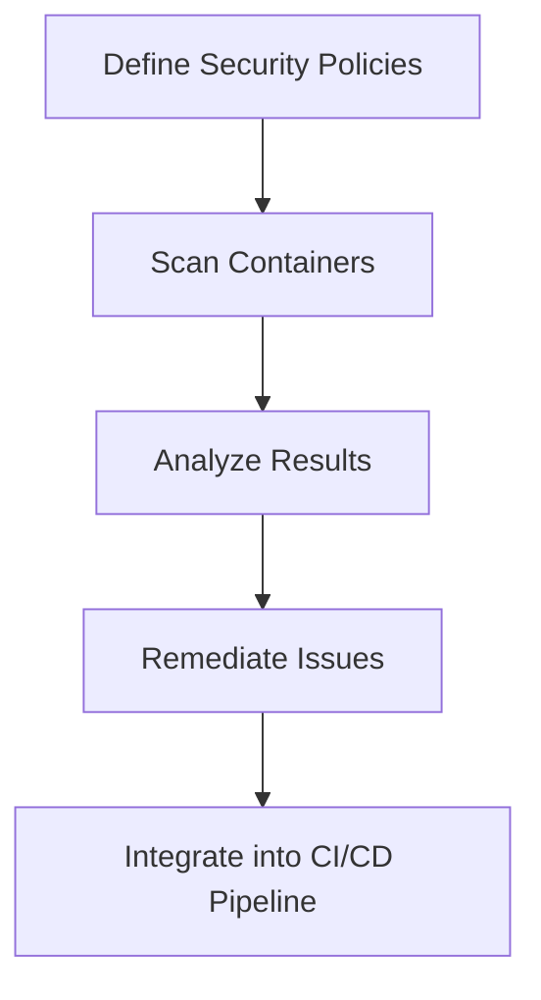

## Introduction to Container Security Testing

Container security testing is a critical component of modern DevSecOps practices. Containers encapsulate applications and their dependencies, making them portable and scalable. However, this portability comes with inherent security risks, such as outdated operating systems, insecure third-party libraries, misconfigured file system permissions, and open ports. To mitigate these risks, automated container security testing tools are employed to scan and validate the security posture of containers.

### Importance of Container Security Testing

Before diving into the details, it is essential to understand why container security testing is crucial. Containers are often built using base images that may contain vulnerabilities. These vulnerabilities can be exploited by attackers, leading to data breaches, service disruptions, and other malicious activities. Automated container security testing helps identify and remediate these issues before containers are deployed into production environments.

### Key Components of Container Security Testing

Container security testing involves several key components:

1. **Operating System Updates**: Ensuring that the underlying operating system is up-to-date with the latest security patches.
2. **Third-Party Libraries**: Checking for insecure or outdated third-party libraries that could introduce vulnerabilities.
3. **File System Permissions**: Verifying that file system permissions are correctly configured to prevent unauthorized access.
4. **Open Ports**: Identifying and securing open ports to minimize attack surfaces.
5. **Health Checks**: Ensuring that containers are healthy and functioning as expected.

### Workflow of Container Security Testing

The workflow of container security testing typically includes the following steps:

1. **Define Security Policies**: Establish clear security policies that specify what needs to be tested.
2. **Scan Containers**: Use automated tools to scan containers for vulnerabilities.
3. **Analyze Results**: Review the results of the scans to identify potential security issues.
4. **Remediate Issues**: Address identified issues by updating, modifying, or rebuilding containers.
5. **Integrate into CI/CD Pipeline**: Integrate container security testing into the continuous integration and continuous deployment (CI/CD) pipeline to ensure ongoing security.

### Questions to Consider Before Implementing Container Security Scanning

Before implementing container security scanning, it is crucial to consider the following questions:

1. **Can You Do Something with the Output?**
   - Ensure that the team has the capability to act on the findings of the security scans.
   
2. **Will You Do Something with the Output?**
   - Determine if the team is committed to addressing the identified security issues.

### Example of Container Security Scanning

Let's consider a real-world example to illustrate the importance of container security testing. In 2021, a vulnerability was discovered in the Docker daemon, which allowed attackers to execute arbitrary code on the host machine (CVE-2021-29923). This vulnerability highlights the importance of keeping container-related software up-to-date and performing regular security scans.



### Detailed Steps of Container Security Testing

#### Step 1: Define Security Policies

Defining security policies is the first step in container security testing. These policies should specify what needs to be tested, such as:

- Outdated operating systems
- Insecure third-party libraries
- Misconfigured file system permissions
- Open ports

For example, a security policy might require that all containers use the latest version of the operating system and that no insecure third-party libraries are included.

#### Step 2: Scan Containers

Once the security policies are defined, the next step is to scan the containers using automated tools. There are several popular container security scanning tools available, such as:

- **Clair**: An open-source project that identifies vulnerabilities in application containers.
- **Trivy**: A simple and comprehensive vulnerability scanner for containers.
- **Snyk**: A cloud-native security platform that provides container security scanning.

Here is an example of using Trivy to scan a container image:

```bash
trivy image my-container-image:latest
```

This command will scan the `my-container-image` container image and report any vulnerabilities found.

#### Step 3: Analyze Results

After scanning the containers, the next step is to analyze the results. The output of the scan will provide information about any vulnerabilities found, including:

- Vulnerable packages
- Severity of the vulnerabilities
- Recommendations for remediation

For example, the output of a Trivy scan might look like this:

```plaintext
2023-10-01T12:00:00Z        INFO    Detected OS: alpine
2023-10-01T12:00:00Z        INFO    Number of vulnerable packages: 2
2023-10-01T12:00:00Z        INFO    Vulnerable packages:
2023-10-01T12:00:00Z        INFO      - libcurl: CVE-2023-1234
2023-10-01T12:00:00Z        INFO      - openssl: CVE-2023-5678
```

In this example, two vulnerable packages (`libcurl` and `openssl`) were found in the container image.

#### Step 4: Remediate Issues

Once the vulnerabilities are identified, the next step is to remediate the issues. This can involve:

- Updating the operating system to the latest version
- Replacing insecure third-party libraries with secure alternatives
- Correcting file system permissions
- Closing unnecessary open ports

For example, if the scan identified an outdated version of `openssl`, the remediation step would involve updating `openssl` to the latest version.

#### Step 5: Integrate into CI/CD Pipeline

Finally, it is essential to integrate container security testing into the CI/CD pipeline to ensure ongoing security. This can be achieved by adding security scanning steps to the build process.

For example, using GitHub Actions, you can add a step to scan the container image during the build process:

```yaml
name: Container Security Test

on:
  push:
    branches: [ main ]
  pull_request:
    branches: [ main ]

jobs:
  build:
    runs-on: ubuntu-latest

    steps:
    - name: Checkout code
      uses: actions/checkout@v3

    - name: Build container image
      run: docker build -t my-container-image .

    - name: Scan container image
      run: trivy image my-container-image
```

This GitHub Actions workflow will build the container image and then scan it using Trivy.

### How to Prevent / Defend Against Container Security Risks

To prevent and defend against container security risks, it is essential to implement the following measures:

#### Detection

- **Regular Scans**: Perform regular security scans of container images to identify vulnerabilities.
- **Automated Tools**: Use automated tools like Clair, Trivy, and Snyk to scan container images.

#### Prevention

- **Keep Software Updated**: Ensure that the operating system and all installed packages are up-to-date with the latest security patches.
- **Use Secure Base Images**: Use secure base images that have been vetted for vulnerabilities.
- **Limit Privileges**: Limit the privileges of processes running inside containers to minimize the attack surface.

#### Secure Coding Fixes

Here is an example of a vulnerable code snippet and its secure counterpart:

**Vulnerable Code:**

```python
import subprocess

def execute_command(command):
    subprocess.run(command, shell=True)
```

**Secure Code:**

```python
import subprocess

def execute_command(command):
    subprocess.run(command.split(), check=True)
```

In the secure code, the `shell=True` parameter is removed, and the command is split into a list of arguments to avoid shell injection attacks.

#### Configuration Hardening

Hardening the configuration of container images can help prevent security risks. Here is an example of a Dockerfile with hardened configurations:

**Vulnerable Dockerfile:**

```Dockerfile
FROM python:3.9-slim

WORKDIR /app

COPY . .

RUN pip install -r requirements.txt

CMD ["python", "app.py"]
```

**Hardened Dockerfile:**

```Dockerfile
FROM python:3.9-slim

WORKDIR /app

COPY requirements.txt .
RUN pip install --no-cache-dir -r requirements.txt

COPY . .

USER appuser

CMD ["python", "app.py"]
```

In the hardened Dockerfile, the `--no-cache-dir` option is used to prevent caching of downloaded packages, and a non-root user (`appuser`) is specified to run the application.

### Real-World Examples and Breaches

Several real-world examples and breaches highlight the importance of container security testing:

- **CVE-2021-29923**: A vulnerability in the Docker daemon allowed attackers to execute arbitrary code on the host machine.
- **CVE-2022-22965**: A vulnerability in the Kubernetes API server allowed attackers to bypass authentication and gain unauthorized access.

These examples demonstrate the need for regular security scans and updates to prevent such vulnerabilities.

### Hands-On Labs

To practice container security testing, you can use the following hands-on labs:

- **PortSwigger Web Security Academy**: Offers a variety of labs focused on web application security, including container security.
- **OWASP Juice Shop**: A deliberately insecure web application that can be used to practice container security testing.
- **Kubernetes Goat**: A Kubernetes-based lab environment designed to teach Kubernetes security concepts.

By following these steps and using the recommended tools and resources, you can effectively implement container security testing in your DevSecOps workflow.

### Conclusion

Container security testing is a critical aspect of modern DevSecOps practices. By defining clear security policies, scanning containers for vulnerabilities, analyzing the results, remediating issues, and integrating security testing into the CI/CD pipeline, you can ensure the security of your containerized applications. Regular security scans and updates are essential to prevent vulnerabilities and protect against potential breaches.

---
<!-- nav -->
[[DevSecOps/DevSecOps Bootcamp/06-Container & Kubernetes Security/01-Automating Container Security Testing/05-Workflow Conclusion and Summary/00-Overview|Overview]] | [[02-Automating Infrastructure Security Testing in Containers|Automating Infrastructure Security Testing in Containers]]
