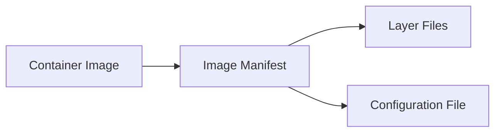

## Docker's Open Container Initiative (OCI) Image Format

The Open Container Initiative (OCI) is an industry-standard specification for container images and runtime environments. The OCI image format is widely adopted and serves as the de facto standard for containerization. This format ensures interoperability across different container runtimes and orchestrators, making it the default choice for containerized applications.

### Background Theory

Containers encapsulate applications along with their dependencies, providing a consistent environment across development, testing, and production stages. The OCI image format defines the structure of these container images, ensuring that they can be reliably built, transported, and executed.

#### Key Components of OCI Images

- **Image Manifest**: Describes the layers of the image and metadata about the image itself.
- **Layer Files**: Compressed filesystem layers that make up the image.
- **Configuration File**: Contains metadata about the image, including entrypoint, environment variables, and other settings.

### Real-World Examples

Recent breaches involving container images highlight the importance of securing these images. For instance, the discovery of malicious images in Docker Hub, such as the `busybox` image containing backdoors, underscores the need for robust container security practices.



### Pitfalls and Detection

One common pitfall is the use of untrusted or outdated container images. This can lead to vulnerabilities being introduced into the application stack. Tools like `clair` and `trivy` can scan container images for known vulnerabilities and misconfigurations.

#### Example Vulnerability Scan

Consider a scenario where a container image is scanned using `trivy`. The following is an example of a `trivy` scan output:

```bash
$ trivy image myapp:latest
2023-09-01T12:00:00Z    INFO    Detecting OS packages in myapp:latest
2023-09-01T12:00:00Z    INFO    Number of language-specific files: 0
2023-09-01T12:00:00Z    INFO    Detecting locally installed packages
2023-09-01T12:00:00Z    INFO    Analyzing myapp:latest (type: OS)
2023-09-01T12:00:00Z    INFO    Checking for vulnerabilities...
2023-09-01T12:00:00Z    INFO    [myapp:latest] Detected Alpine Linux 3.14
2023-09-01T12:00:00Z    INFO    [myapp:latest] Vulnerable packages: 3
2023-09-01T12:00:00Z    INFO    [myapp:latest] Total: 3 (UNKNOWN: 0, LOW: 1, MEDIUM: 2, HIGH: 0, CRITICAL: 0)
```

### How to Prevent / Defend

To prevent the use of vulnerable container images, implement a CI/CD pipeline that includes automated scanning of images before deployment. Use tools like `trivy`, `clair`, or `anchore` to scan images for known vulnerabilities.

#### Secure Code Fix

Compare the vulnerable and secure versions of a Dockerfile:

**Vulnerable Dockerfile**

```dockerfile
FROM alpine:3.14
RUN apk add --no-cache curl
CMD ["curl", "-v"]
```

**Secure Dockerfile**

```dockerfile
FROM alpine:3.15
RUN apk add --no-cache curl
CMD ["curl", "-v"]
```

### Infrastructure Requirements for Container Scanning

Implementing container security scanning requires substantial infrastructure. This includes setting up a CI/CD pipeline, integrating scanning tools, and managing the results.

#### Example CI/CD Pipeline

A typical CI/CD pipeline might include the following steps:

1. **Build Stage**: Build the container image.
2. **Scan Stage**: Use a tool like `trivy` to scan the image for vulnerabilities.
3. **Deploy Stage**: Deploy the image if it passes the scan.

```yaml
stages:
  - build
  - scan
  - deploy

build:
  stage: build
  script:
    - docker build -t myapp:latest .

scan:
  stage: scan
  script:
    - trivy image myapp:latest
  when: on_success

deploy:
  stage: deploy
  script:
    - docker push myapp:latest
  when: on_success
```

### Rapidly Changing Landscape

The container security landscape is rapidly evolving. New tools and techniques emerge frequently, and staying updated is crucial. Frameworks like `anchore` provide comprehensive solutions for container security.

#### Example Framework: Anchore Engine

Anchore Engine is an open-source tool for scanning and managing container images. It provides detailed analysis and compliance checks.

```bash
$ anchore-cli analyze myapp:latest
$ anchore-cli image content myapp:latest
```

### Summary

Container security scanning is essential for maintaining the integrity and security of containerized applications. While it requires significant setup and ongoing management, the benefits in terms of detecting and mitigating vulnerabilities are substantial.

### Hands-On Labs

For practical experience with container security testing, consider the following labs:

- **Kubernetes Goat**: Focuses on Kubernetes security and includes container security scenarios.
- **OWASP WrongSecrets**: Offers challenges related to container security and other DevSecOps topics.
- **Pacu**: Provides a set of modules for testing and exploiting AWS services, including container-related security.

These labs offer real-world scenarios and hands-on experience to reinforce the concepts learned in this module.

---

This expanded section covers the core concepts of container security, the importance of the OCI image format, real-world examples, infrastructure requirements, and practical labs. It provides a comprehensive guide to automating container security testing, ensuring readers have a deep understanding of the topic.

---
<!-- nav -->
[[02-Automating Infrastructure Security Testing in Containers|Automating Infrastructure Security Testing in Containers]] | [[DevSecOps/DevSecOps Bootcamp/06-Container & Kubernetes Security/01-Automating Container Security Testing/05-Workflow Conclusion and Summary/00-Overview|Overview]] | [[DevSecOps/DevSecOps Bootcamp/06-Container & Kubernetes Security/01-Automating Container Security Testing/05-Workflow Conclusion and Summary/04-Practice Questions & Answers|Practice Questions & Answers]]
