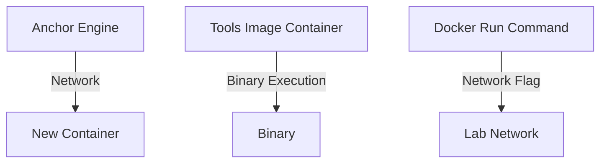
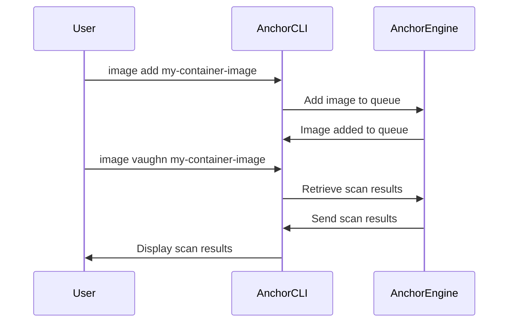

## Automating Container Security Testing on the Command Line

### Introduction to Container Security Testing

Container security testing is a critical aspect of DevSecOps practices, ensuring that applications deployed within containers are free from vulnerabilities and adhere to security policies. Containers provide a lightweight and portable environment for applications, but they also introduce unique security challenges. These challenges include ensuring that the base images used are secure, preventing unauthorized access, and detecting vulnerabilities within the application code.

### Network Configuration for Container Communication

When running containers, it is essential to understand how they communicate with each other and with external services. By default, containers run in their own isolated network namespaces, which means they cannot communicate with other containers unless explicitly configured to do so.

#### Example: Configuring Network for Container Communication

Consider a scenario where you have a container named `Anchor Engine` that needs to communicate with another container. Without proper network configuration, the new container will not be able to communicate with `Anchor Engine`.

To resolve this issue, you can use the `--network` flag with the `docker run` command to specify the network in which the container should run. For instance, if you want the new container to run in the `Lab` network, you would use the following command:

```bash
docker run --network Lab <image-name>
```

This command ensures that the new container is placed in the `Lab` network, allowing it to communicate with `Anchor Engine`.

### Using Tools Image Container for Binary Execution

Another technique for container security testing involves executing binaries from a tools image container. This approach is particularly useful when implementing container scanning in your pipeline. The tools image container contains the necessary binaries and utilities required for security testing.

#### Example: Running Binaries from a Tools Image Container

Suppose you have a tools image container named `tools-image`. You can execute a binary from this container using the `docker run` command. For example:

```bash
docker run --rm tools-image /path/to/binary
```

This command runs the specified binary from the `tools-image` container. The `--rm` flag ensures that the container is removed after execution.

### Interacting with the Anchor CLI

The Anchor CLI provides a command-line interface to interact with the Anchor Engine, which is responsible for vulnerability scanning and analysis. The CLI allows you to manage vulnerability feeds, add images for analysis, and retrieve scan results.

#### Example: Listing Vulnerability Feeds

To list all the vulnerability feeds that the Anchor Engine has downloaded, you can use the following command:

```bash
anchor-cli system feeds list
```

This command displays a list of all the vulnerability feeds that the engine has downloaded. These feeds contain the latest vulnerability information for various operating systems and third-party libraries.

### Adding Images for Analysis

To perform a security scan on a container image, you need to add the image to the analysis queue using the `image add` command. Once added, the image will be analyzed and graded based on its security posture.

#### Example: Adding an Image for Analysis

To add an image named `my-container-image` to the analysis queue, you would use the following command:

```bash
anchor-cli image add my-container-image
```

This command adds the specified image to the analysis queue. The image will then be analyzed by the Anchor Engine, and the results will be stored for retrieval.

### Retrieving Scan Results

Once an image has been added to the analysis queue, you can retrieve the scan results using the `image vaughn` command. This command fetches the results of the analysis performed on the specified image.

#### Example: Retrieving Scan Results

To retrieve the scan results for the image `my-container-image`, you would use the following command:

```bash
anchor-cli image vaughn my-container-image
```

This command retrieves the scan results for the specified image. The results will indicate whether the image contains any known vulnerabilities and provide a security grade.

### Mermaid Diagrams for Understanding Container Security Testing

To better visualize the process of container security testing, consider the following mermaid diagrams:

#### Network Topology Diagram



#### Sequence Diagram for Adding and Analyzing an Image



### Real-World Examples and Recent CVEs

Recent breaches and CVEs highlight the importance of container security testing. For example, the Log4j vulnerability (CVE-2021-44228) affected numerous applications, including those running in containers. Ensuring that container images are regularly scanned for such vulnerabilities is crucial.

#### Example: Log4j Vulnerability in Containers

Consider a scenario where a container image is built using a vulnerable version of Log4j. To mitigate this vulnerability, you would need to update the image and ensure that it is re-scanned for vulnerabilities.

### Common Pitfalls and How to Avoid Them

#### Pitfall: Outdated Vulnerability Feeds

One common pitfall is using outdated vulnerability feeds, which may not contain the latest vulnerability information. To avoid this, ensure that the Anchor Engine is configured to continuously download the latest vulnerability feeds.

#### Pitfall: Incomplete Scan Results

Another pitfall is relying on incomplete scan results. Ensure that the scan results are comprehensive and cover all aspects of the container image, including the base image and any dependencies.

### How to Prevent / Defend

#### Detection

To detect vulnerabilities in container images, regularly scan them using tools like the Anchor CLI. Ensure that the scans are comprehensive and cover all aspects of the image.

#### Prevention

To prevent vulnerabilities, ensure that the base images used are secure and up-to-date. Regularly update the images and dependencies to patch known vulnerabilities.

#### Secure-Coding Fixes

Compare the vulnerable and secure versions of the code to identify and fix vulnerabilities. For example, if a container image uses a vulnerable version of Log4j, update the image to use a secure version.

#### Configuration Hardening

Harden the configuration of the container images to minimize the attack surface. For example, disable unnecessary services and configure the container to run with the least privileges possible.

### Complete Example: Scanning a Container Image

#### Full HTTP Request and Response

Here is a complete example of adding an image to the analysis queue and retrieving the scan results:

```bash
# Add the image to the analysis queue
anchor-cli image add my-container-image

# Retrieve the scan results
anchor-cli image vaughn my-container-image
```

#### Expected Result

The expected result is a set of scan results indicating whether the image contains any known vulnerabilities and providing a security grade.

### Hands-On Labs

For hands-on practice with container security testing, consider the following labs:

- **PortSwigger Web Security Academy**: Offers interactive labs for web application security, including container security.
- **OWASP Juice Shop**: A deliberately insecure web application for practicing security testing.
- **Kubernetes Goat**: A Kubernetes-based security training platform for practicing container security.

These labs provide practical experience in container security testing and help reinforce the concepts covered in this chapter.

### Conclusion

Automating container security testing is a critical component of DevSecOps practices. By understanding the network configuration, using tools image containers, interacting with the Anchor CLI, and regularly scanning container images, you can ensure that your applications are secure and free from vulnerabilities. Regularly updating and hardening the configurations of your container images is essential for maintaining a secure environment.

---
<!-- nav -->
[[03-Automating Container Security Testing Using Anchore Engine|Automating Container Security Testing Using Anchore Engine]] | [[DevSecOps/DevSecOps Bootcamp/06-Container & Kubernetes Security/01-Automating Container Security Testing/Demo Performing Container Security Testing on the Command Line/00-Overview|Overview]] | [[05-Automating Container Security Testing|Automating Container Security Testing]]
