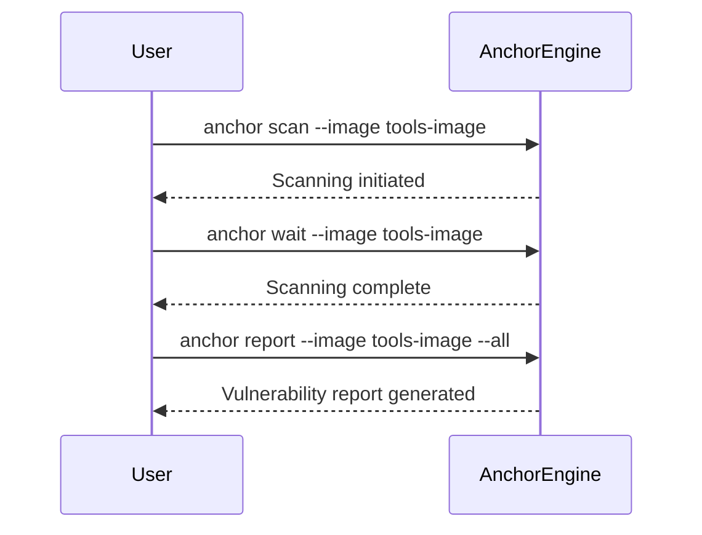

## Automating Container Security Testing

### Introduction to Container Security Testing

Container security testing is a critical component of DevSecOps practices. Containers encapsulate applications along with their dependencies, making them portable and consistent across different environments. However, this portability also introduces potential security risks, especially if the base images or layers within the container are compromised. Automated container security testing helps identify these vulnerabilities early in the development lifecycle, ensuring that the deployed containers are secure.

### Understanding the Context

Before diving into the specifics of automated container security testing, it’s essential to understand the context and the tools involved. One such tool is **Anchor Engine**, which is designed to perform comprehensive security scans on container images. These scans help identify vulnerabilities, misconfigurations, and other security issues that could potentially be exploited.

### Setting Up the Environment

To demonstrate the process of performing container security testing using Anchor Engine, let’s set up a basic environment. First, ensure that you have Anchor Engine installed and configured properly. The installation process typically involves downloading the necessary binaries and setting up the required environment variables.

```bash
# Install Anchor Engine
curl -s https://get.anchor.run | sh

# Configure environment variables
export ANCHOR_API_KEY=<your_api_key>
```

### Performing Initial Scan

Once the environment is set up, you can start by scanning a container image. For this demonstration, let’s assume we have a Docker image named `tools-image`.

```bash
# Perform initial scan
anchor scan --image tools-image
```

This command initiates the scanning process. However, the scanning process might take some time, especially for complex images or when running on less powerful infrastructure.

### Waiting for the Scanning Process to Complete

The scanning process can take a significant amount of time depending on the complexity of the container and the underlying infrastructure. To handle this, Anchor Engine provides a `wait` command that locks the terminal until the scanning process is complete.

```bash
# Wait for the scanning process to complete
anchor wait --image tools-image
```

This command ensures that the terminal remains locked until the image has been fully scanned. Once the scanning process is complete, the analysis status changes to `analyzed`.

### Retrieving Vulnerability Reports

After the scanning process is complete, you can retrieve the vulnerability reports. The `all` parameter can be added to the command to get detailed information about the vulnerabilities detected.

```bash
# Retrieve detailed vulnerability reports
anchor report --image tools-image --all
```

This command provides a comprehensive overview of all vulnerabilities detected in the container image. In our case, the report indicates that the `tools-image` does not contain any vulnerabilities, which is expected since we just built the image and used a base image that is known to be vulnerability-free.

### Detailed Explanation of the Commands

Let’s break down the commands used in the demonstration:

1. **Initial Scan Command**:
    ```bash
    anchor scan --image tools-image
    ```
    This command initiates the scanning process for the specified container image. The scanning process checks for vulnerabilities, misconfigurations, and other security issues.

2. **Wait Command**:
    ```bash
    anchor wait --image tools-image
    ```
    This command waits for the scanning process to complete. It locks the terminal until the image has been fully scanned, ensuring that subsequent commands are executed only after the scanning is complete.

3. **Retrieve Vulnerability Reports**:
    ```bash
    anchor report --image tools-image --all
    ```
    This command retrieves detailed vulnerability reports for the specified container image. The `--all` parameter ensures that all detected vulnerabilities are included in the report.

### Mermaid Diagrams

To better visualize the process, let’s use a mermaid diagram to illustrate the flow of commands and the scanning process.



### Real-World Examples and Recent CVEs

Automated container security testing is crucial in preventing security breaches. Here are a few recent examples and CVEs that highlight the importance of such testing:

1. **CVE-2021-44228 (Log4j)**:
    - **Description**: A critical vulnerability in the Apache Log4j library allowed remote code execution.
    - **Impact**: Many containerized applications were affected, leading to widespread exploitation.
    - **Mitigation**: Regularly scanning container images for known vulnerabilities and keeping base images updated can help mitigate such risks.

2. **CVE-2022-22965 (Spring Framework)**:
    - **Description**: A vulnerability in the Spring Framework allowed unauthorized access to sensitive data.
    - **Impact**: Many containerized applications using the Spring Framework were vulnerable.
    - **Mitigation**: Scanning container images for known vulnerabilities and updating dependencies can help prevent such exploits.

### Common Pitfalls and Best Practices

#### Common Pitfalls

1. **Ignoring Base Images**:
    - **Issue**: Using outdated or vulnerable base images can introduce security risks.
    - **Solution**: Always use the latest and most secure base images.

2. **Incomplete Scans**:
    - **Issue**: Not waiting for the scanning process to complete can result in incomplete vulnerability reports.
    - **Solution**: Use the `wait` command to ensure the scanning process is complete before retrieving the reports.

3. **Neglecting Regular Updates**:
    - **Issue**: Failing to regularly update the scanning tool and its definitions can lead to missed vulnerabilities.
    - **Solution**: Keep the scanning tool and its definitions up-to-date.

#### Best Practices

1. **Regular Scanning**:
    - **Practice**: Integrate regular scanning into the CI/CD pipeline to ensure that all container images are scanned before deployment.
    - **Example**:
        ```yaml
        # Example Jenkinsfile snippet
        pipeline {
            agent any
            stages {
                stage('Build') {
                    steps {
                        script {
                            docker.build("tools-image")
                        }
                    }
                }
                stage('Scan') {
                    steps {
                        script {
                            sh 'anchor scan --image tools-image'
                            sh 'anchor wait --image tools-image'
                            sh 'anchor report --image tools-image --all'
                        }
                    }
                }
            }
        }
        ```

2. **Use Secure Base Images**:
    - **Practice**: Use base images from trusted sources and ensure they are regularly updated.
    - **Example**:
        ```Dockerfile
        FROM alpine:latest
        ```

3. **Keep Definitions Updated**:
    - **Practice**: Regularly update the scanning tool and its definitions to ensure that all known vulnerabilities are detected.
    - **Example**:
        ```bash
        # Update Anchor Engine definitions
        anchor update
        ```

### How to Prevent / Defend

#### Detection

1. **Regular Scanning**:
    - **Tool**: Anchor Engine
    - **Command**:
        ```bash
        anchor scan --image <image_name>
        anchor wait --image <image_name>
        anchor report --image <image_name> --all
        ```

2. **Monitoring**:
    - **Tool**: Continuous Integration/Continuous Deployment (CI/CD) pipelines
    - **Example**:
        ```yaml
        # Example Jenkinsfile snippet
        pipeline {
            agent any
            stages {
                stage('Build') {
                    steps {
                        script {
                            docker.build("tools-image")
                        }
                    }
                }
                stage('Scan') {
                    steps {
                        script {
                            sh 'anchor scan --image tools-image'
                            sh 'anchor wait --image tools-image'
                            sh 'anchor report --image tools-image --all'
                        }
                    }
                }
            }
        }
        ```

#### Prevention

1. **Use Secure Base Images**:
    - **Vulnerable Code**:
        ```Dockerfile
        FROM alpine:3.10
        ```
    - **Secure Code**:
        ```Dockerfile
        FROM alpine:latest
        ```

2. **Keep Dependencies Updated**:
    - **Vulnerable Code**:
        ```Dockerfile
        RUN apk add --no-cache log4j=2.14.1
        ```
    - **Secure Code**:
        ```Dockerfile
        RUN apk add --no-cache log4j=2.17.1
        ```

3. **Regular Updates**:
    - **Vulnerable Code**:
        ```bash
        # Outdated definitions
        anchor scan --image tools-image
        ```
    - **Secure Code**:
        ```bash

### Hands-On Labs

To gain practical experience with container security testing, consider the following hands-on labs:

1. **PortSwigger Web Security Academy**:
    - **URL**: [https://portswigger.net/web-security](https://portswigger.net/web-security)
    - **Description**: Offers a variety of labs focused on web application security, including container security.

2. **OWASP Juice Shop**:
    - **URL**: [https://owasp.org/www-project-juice-shop/](https://owasp.org/www-project-juice-shop/)
    - **Description**: A deliberately insecure web application for security training purposes, including container security.

3. **DVWA (Damn Vulnerable Web Application)**:
    - **URL**: [https://github.com/ethicalhack3r/DVWA](https://github.com/ethicalhack3r/DVWA)
    - **Description**: A PHP/MySQL web application that is riddled with vulnerabilities, useful for learning about container security.

4. **WebGoat**:
    - **URL**: [https://github.com/WebGoat/WebGoat](https://github.com/WebGoat/WebGoat)
    - **Description**: An interactive, gamified security training application that teaches web application security lessons.

### Conclusion

Automating container security testing is a vital practice in DevSecOps. By integrating tools like Anchor Engine into your CI/CD pipeline, you can ensure that your container images are free from vulnerabilities and misconfigurations. Regular scanning, using secure base images, and keeping dependencies updated are key best practices to follow. Through hands-on labs and real-world examples, you can gain a deeper understanding of container security and apply these principles effectively in your development processes.

---
<!-- nav -->
[[04-Automating Container Security Testing on the Command Line|Automating Container Security Testing on the Command Line]] | [[DevSecOps/DevSecOps Bootcamp/06-Container & Kubernetes Security/01-Automating Container Security Testing/Demo Performing Container Security Testing on the Command Line/00-Overview|Overview]] | [[DevSecOps/DevSecOps Bootcamp/06-Container & Kubernetes Security/01-Automating Container Security Testing/Demo Performing Container Security Testing on the Command Line/06-Practice Questions & Answers|Practice Questions & Answers]]
