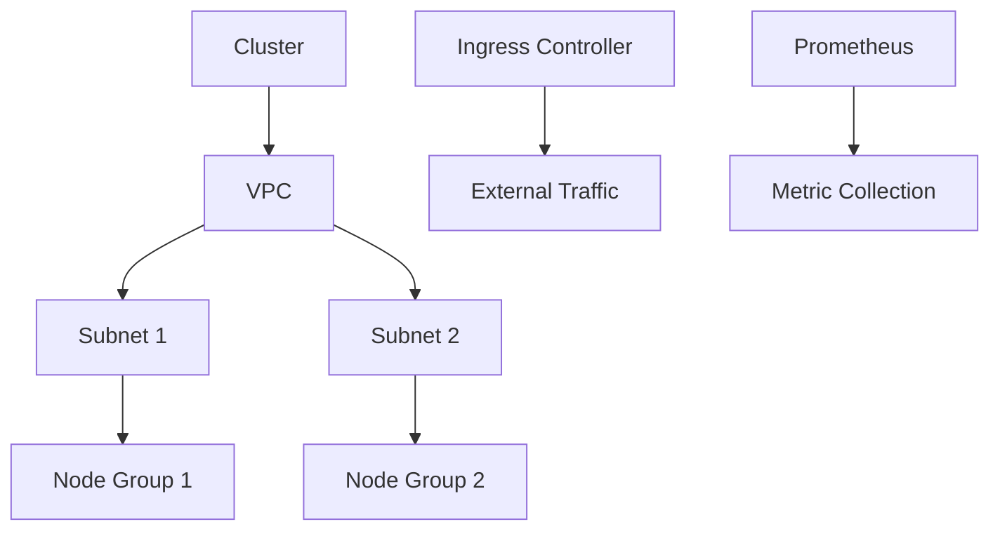
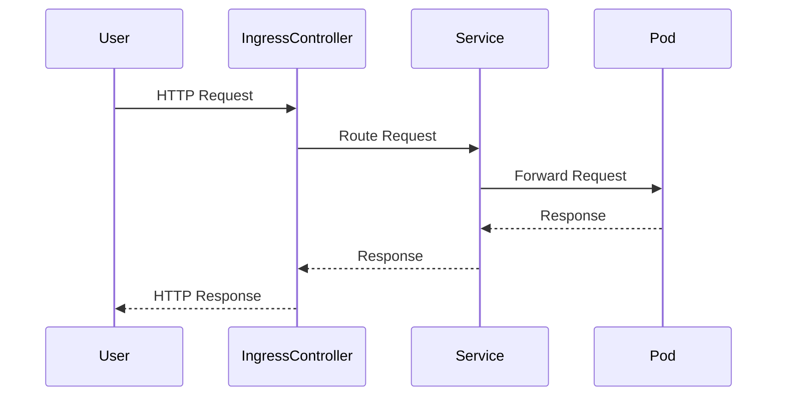

## Introduction to EKS Blueprints

### Background Theory

EKS (Elastic Kubernetes Service) Blueprints is an open-source project developed by AWS to simplify the deployment and management of Kubernetes clusters. Kubernetes is a powerful orchestration tool for containerized applications, but setting up a fully functional cluster can be complex and time-consuming. EKS Blueprints aims to streamline this process by providing pre-configured templates that include essential services and configurations.

### What Are EKS Blueprints?

EKS Blueprints are a set of predefined configurations that help users quickly deploy a fully functional Kubernetes cluster on AWS. These blueprints include various services and configurations that are typically required for a production-grade cluster, such as:

- **Monitoring Services**: Tools like Prometheus for monitoring and alerting.
- **Ingress Controllers**: Components like NGINX Ingress Controller for routing external traffic to internal services.
- **Security Policies**: Configurations to enforce security policies and best practices.

### Why Use EKS Blueprints?

Using EKS Blueprints offers several advantages:

1. **Time-Saving**: Reduces the time and effort required to set up a fully functional Kubernetes cluster.
2. **Consistency**: Ensures consistency across deployments, making it easier to manage multiple clusters.
3. **Best Practices**: Incorporates best practices and security configurations out-of-the-box.
4. **Scalability**: Designed to scale easily as your application grows.

### How EKS Blueprints Work

EKS Blueprints leverage Infrastructure as Code (IaC) tools like Terraform to define and deploy the cluster. Here’s a high-level overview of the process:

1. **Define the Blueprint**: Create a blueprint definition using Terraform modules.
2. **Deploy the Cluster**: Use Terraform to deploy the cluster based on the blueprint.
3. **Configure Services**: Automatically configure and deploy essential services like monitoring and ingress controllers.

### Example Blueprint Definition

Here’s an example of a Terraform configuration for an EKS Blueprint:

```hcl
provider "aws" {
  region = "us-west-2"
}

module "eks_blueprint" {
  source = "terraform-aws-modules/eks/aws"

  cluster_name = "my-cluster"
  version      = "1.21"

  vpc_id     = "vpc-12345678"
  subnet_ids = ["subnet-12345678", "subnet-23456789"]

  node_groups = [{
    name            = "ng-1"
    instance_type   = "t3.medium"
    desired_capacity = 2
  }]

  additional_security_group_ids = ["sg-12345678"]
}
```

### Deploying the Cluster

To deploy the cluster, run the following commands:

```sh
terraform init
terraform apply
```

### Essential Services Included in EKS Blueprints

#### Monitoring Services

**Prometheus**

Prometheus is a popular monitoring system that collects and stores metrics from configured targets at regular intervals and then processes them through user-defined rules. Here’s an example of how to deploy Prometheus using Helm:

```sh
helm repo add prometheus-community https://prometheus-community.github.io/helm-charts
helm install prometheus prometheus-community/prometheus
```

#### Ingress Controllers

**NGINX Ingress Controller**

The NGINX Ingress Controller routes external traffic to internal services. Here’s how to deploy it using Helm:

```sh
helm repo add ingress-nginx https://kubernetes.github.io/ingress-nginx
helm install ingress-nginx ingress-nginx/ingress-nginx
```

### Real-World Examples

#### Recent CVEs and Breaches

One notable breach involving Kubernetes was the **CVE-2021-25741**, which affected the Kubernetes API server. This vulnerability allowed attackers to bypass authentication and gain unauthorized access to the cluster. Using EKS Blueprints helps mitigate such risks by ensuring that the cluster is configured with the latest security patches and best practices.

### Pitfalls and Common Mistakes

#### Misconfigurations

One common mistake is misconfiguring security settings, such as leaving default credentials unchanged or failing to enable encryption for sensitive data. Always review and customize the blueprint configurations to match your specific security requirements.

### How to Prevent / Defend

#### Detection

Regularly monitor your cluster for unusual activity using tools like Prometheus and Grafana. Set up alerts for critical events and ensure that your monitoring stack is configured to detect potential security incidents.

#### Prevention

1. **Enable RBAC**: Ensure Role-Based Access Control (RBAC) is enabled and properly configured.
2. **Use Network Policies**: Implement network policies to restrict communication between pods.
3. **Secure Secrets**: Use Kubernetes secrets to store sensitive information securely.

#### Secure-Coding Fixes

Here’s an example of a vulnerable configuration and its secure counterpart:

**Vulnerable Configuration:**
```yaml
apiVersion: v1
kind: Pod
metadata:
  name: my-pod
spec:
  containers:
  - name: my-container
    image: my-image
    env:
    - name: DB_PASSWORD
      valueFrom:
        secretKeyRef:
          name: db-secret
          key: password
```

**Secure Configuration:**
```yaml
apiVersion: v1
kind: Pod
metadata:
  name: my-pod
spec:
  containers:
  - name: my-container
    image: my-image
    env:
    - name: DB_PASSWORD
      valueFrom:
        secretKeyRef:
          name: db-secret
          key: password
  securityContext:
    runAsUser: 1000
    runAsGroup: 3000
    fsGroup: 2000
```

### Complete Example

Here’s a complete example of deploying a fully configured EKS cluster using EKS Blueprints:

#### Terraform Configuration

```hcl
provider "aws" {
  region = "us-west-2"
}

module "eks_blueprint" {
  source = "terraform-aws-modules/eks/aws"

  cluster_name = "my-cluster"
  version      = "1.21"

  vpc_id     = "vpc-11111111"
  subnet_ids = ["subnet-22222222", "subnet-33333333"]

  node_groups = [{
    name            = "ng-1"
    instance_type   = "t3.medium"
    desired_capacity = 2
  }]

  additional_security_group_ids = ["sg-44444444"]
}
```

#### Deploying the Cluster

```sh
terraform init
terraform apply
```

#### Monitoring Setup

```sh
helm repo add prometheus-community https://prometheus-community.github.io/helm-charts
helm install prometheus prometheus-community/prometheus
```

#### Ingress Controller Setup

```sh
helm repo add ingress-nginx https://kubernetes.github.io/ingress-nginx
helm install ingress-nginx ingress-nginx/ingress-nginx
```

### Mermaid Diagrams

#### Cluster Architecture



#### Request/Response Flow



### Hands-On Labs

For hands-on practice with EKS Blueprints, consider the following labs:

- **CloudGoat**: A cloud security training platform that includes exercises for deploying and securing EKS clusters.
- **AWS Well-Architected Labs**: Official AWS labs that cover best practices for deploying and managing EKS clusters.

By leveraging EKS Blueprints, you can significantly reduce the complexity and time required to set up a fully functional Kubernetes cluster on AWS, while ensuring that it is configured with essential services and best practices for security and monitoring.

---
<!-- nav -->
[[DevSecOps/DevSecOps Bootcamp/06-Container & Kubernetes Security/02-EKS Blueprints/01-Introduction to EKS Blueprints/00-Overview|Overview]] | [[DevSecOps/DevSecOps Bootcamp/06-Container & Kubernetes Security/02-EKS Blueprints/01-Introduction to EKS Blueprints/02-Practice Questions & Answers|Practice Questions & Answers]]
