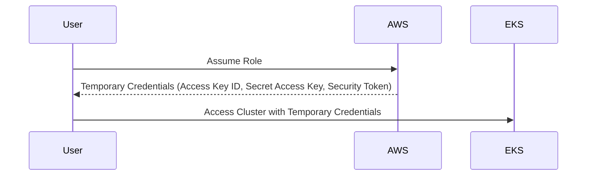

## Understanding Temporary Access Tokens in EKS Blueprints

When working with Amazon Elastic Kubernetes Service (EKS), you often encounter scenarios where access tokens expire, leading to unauthorized access errors. This issue arises due to the nature of temporary credentials used in EKS clusters. Let's delve into the details of how these temporary access tokens work, their implications, and how to manage them effectively.

### Background Theory

#### What Are Temporary Access Tokens?

Temporary access tokens are short-lived credentials that provide limited-time access to resources within an AWS environment. These tokens are commonly used in scenarios where you need to grant temporary access to a resource without permanently altering the permissions. In the context of EKS, these tokens are used to authenticate users and services to the Kubernetes API server.

#### Why Use Temporary Access Tokens?

Using temporary access tokens enhances security by limiting the exposure window for sensitive credentials. Instead of using permanent credentials that could be compromised, temporary tokens ensure that even if a token is stolen, it will only be valid for a short period. This reduces the potential damage that can be caused by unauthorized access.

### How Temporary Access Tokens Work

#### Role Assumption in AWS

In AWS, temporary access tokens are typically obtained through role assumption. When you assume a role, AWS generates a set of temporary credentials that can be used to access resources associated with that role. These credentials include an access key ID, a secret access key, and a security token.



#### Integration with EKS

When working with EKS, the `kubeconfig` file is configured to use the AWS IAM Authenticator. This authenticator uses the temporary credentials to authenticate with the EKS cluster. Here’s a typical `kubeconfig` setup:

```yaml
apiVersion: v1
clusters:
- cluster:
    certificate-authority-data: <base64-encoded-ca>
    server: https://<cluster-endpoint>
  name: arn:aws:eks:<region>:<account-id>:cluster/<cluster-name>
contexts:
- context:
    cluster: arn:aws:eks:<region>:<account-id>:cluster/<cluster-name>
    user: arn:aws:eks:<region>:<account-id>:cluster/<cluster-name>
  name: arn:aws:eks:<region>:<account-id>:cluster/<cluster-name>
current-context: arn:aws:eks:<region>:<account-id>:cluster/<cluster-name>
kind: Config
preferences: {}
users:
- name: arn:aws:eks:<region>:<account-id>:cluster/<cluster-name>
  user:
    exec:
      apiVersion: client.authentication.k8s.io/v1alpha1
      args:
      - token
      - -i
      - <cluster-name>
      command: aws-iam-authenticator
```

### Implications of Expired Tokens

#### Unauthorized Access Errors

When the temporary access token expires, any subsequent attempts to interact with the EKS cluster will result in unauthorized access errors. For example, running a `kubectl` command might produce the following error:

```plaintext
$ kubectl get nodes
error: You must be logged in to the server (Unauthorized)
```

This error occurs because the security token included in the request is no longer valid.

#### Example of Expired Token

To illustrate, consider the following scenario where you attempt to list the nodes in an EKS cluster:

```bash
$ kubectl get nodes
error: You must be logged in to the server (Unauthorized)
```

Checking the security token reveals that it has expired:

```bash
$ aws sts get-caller-identity
{
    "UserId": "<user-id>",
    "Account": "<account-id>",
    "Arn": "arn:aws:sts::<account-id>:assumed-role/<role-name>/<session-name>"
}
```

### Managing Temporary Access Tokens

#### Repeating Authentication Steps

To regain access to the EKS cluster, you need to repeat the authentication steps to obtain new temporary credentials. This involves assuming the role again and updating the `kubeconfig` file.

```bash
# Assume the role
$ export AWS_ACCESS_KEY_ID=$(aws sts assume-role --role-arn arn:aws:iam::<account-id>:role/<role-name> --role-session-name <session-name> --query 'Credentials.AccessKeyId' --output text)
$ export AWS_SECRET_ACCESS_KEY=$(aws sts assume-role --role-arn arn:aws:iam::<account-id>:role/<role-name> --role-session-name <session-name> --query 'Credentials.SecretAccessKey' --output text)
$ export AWS_SESSION_TOKEN=$(aws sts assume-role --role-arn arn:aws:iam::<account-id>:role/<role-name> --role-session-name <session-name> --query 'Credentials.SessionToken' --output text)

# Update kubeconfig
$ aws eks update-kubeconfig --name <cluster-name> --region <region>
```

### Real-World Examples

#### Recent Breaches and CVEs

Temporary access tokens have been involved in several high-profile breaches. For instance, in the Capital One breach (CVE-2019-11510), unauthorized access was gained through misconfigured AWS IAM roles, which allowed the attacker to assume roles and gain temporary access to sensitive data.

### How to Prevent / Defend

#### Detection

To detect unauthorized access attempts due to expired tokens, monitor AWS CloudTrail logs for failed authentication attempts. Additionally, configure AWS CloudWatch Alarms to notify you when such events occur.

```json
{
  "Records": [
    {
      "eventVersion": "1.05",
      "userIdentity": {
        "type": "AssumedRole",
        "principalId": "<principal-id>",
        "arn": "arn:aws:sts::<account-id>:assumed-role/<role-name>/<session-name>",
        "accountId": "<account-id>",
        "accessKeyId": "<access-key-id>",
        "sessionContext": {
          "attributes": {
            "mfaAuthenticated": false,
            "creationDate": "2023-01-01T00:00:00Z"
          }
        }
      },
      "eventTime": "2023-01-01T00:00:00Z",
      "eventSource": "sts.amazonaws.com",
      "eventName": "AssumeRole",
      "awsRegion": "<region>",
      "sourceIPAddress": "<ip-address>",
      "userAgent": "aws-cli/2.0.0 Python/3.7.3 Linux/4.15.0-106-generic botocore/2.0.0",
      "requestParameters": {
        "roleArn": "arn:aws:iam::<account-id>:role/<role-name>",
        "roleSessionName": "<session-name>"
      },
      "responseElements": null,
      "errorCode": "ExpiredToken",
      "errorMessage": "The security token included in the request is expired"
    }
  ]
}
```

#### Prevention

To prevent unauthorized access due to expired tokens, implement the following best practices:

1. **Short-Lived Tokens**: Ensure that temporary access tokens have a short expiration time (e.g., 1 hour).
2. **Automated Renewal**: Implement automated mechanisms to renew temporary credentials before they expire.
3. **Least Privilege Principle**: Grant temporary access tokens the minimum necessary permissions required for the task.

#### Secure Coding Fixes

Here’s an example of how to securely handle temporary access tokens in a script:

**Vulnerable Code:**

```bash
export AWS_ACCESS_KEY_ID=$(aws sts assume-role --role-arn arn:aws:iam::<account-id>:role/<role-name> --role-session-name <session-name> --query 'Credentials.AccessKeyId' --output text)
export AWS_SECRET_ACCESS_KEY=$(aws sts assume-role --role-arn arn:aws:iam::<account-id>:role/<role-name> --role-session-name <session-name> --query 'Credentials.SecretAccessKey' --output text)
export AWS_SESSION_TOKEN=$(aws sts assume-role --role-arn arn:aws:iam::<account-Id>:role/<role-name> --role-session-name <session-name> --query 'Credentials.SessionToken' --output text)
```

**Secure Code:**

```bash
# Function to refresh credentials
refresh_credentials() {
  local role_arn="arn:aws:iam::<account-id>:role/<role-name>"
  local session_name="<session-name>"
  
  AWS_ACCESS_KEY_ID=$(aws sts assume-role --role-arn $role_arn --role-session-name $session_name --query 'Credentials.AccessKeyId' --output text)
  AWS_SECRET_ACCESS_KEY=$(aws sts assume-role --role-arn $role_arn --role-session-name $session_name --query 'Credentials.SecretAccessKey' --output text)
  AWS_SESSION_TOKEN=$(aws sts assume-role --role-arn $role_arn --role-session-name $session_name --query 'Credentials.SessionToken' --output text)
}

# Initial credential refresh
refresh_credentials

# Periodic refresh
while true; do
  sleep 3600 # Sleep for 1 hour
  refresh_credentials
done
```

### Conclusion

Understanding and managing temporary access tokens in EKS is crucial for maintaining secure access to your Kubernetes clusters. By implementing best practices and automating the renewal process, you can minimize the risk of unauthorized access due to expired tokens. Regular monitoring and logging of authentication events will help you detect and respond to any suspicious activity promptly.

### Practice Labs

For hands-on practice with EKS and temporary access tokens, consider the following labs:

- **PortSwigger Web Security Academy**: Offers interactive labs on AWS IAM roles and temporary credentials.
- **OWASP Juice Shop**: Provides a simulated environment to test and understand IAM roles and temporary access tokens.
- **CloudGoat**: A cloud security training platform that includes exercises on managing temporary access tokens in EKS.

By completing these labs, you can gain practical experience in handling temporary access tokens and securing your EKS clusters.

---
<!-- nav -->
[[01-Introduction to EKS Blueprints and Secure CICD Practices|Introduction to EKS Blueprints and Secure CICD Practices]] | [[DevSecOps/DevSecOps Bootcamp/06-Container & Kubernetes Security/02-EKS Blueprints/03-Access Token Expiration/00-Overview|Overview]] | [[DevSecOps/DevSecOps Bootcamp/06-Container & Kubernetes Security/02-EKS Blueprints/03-Access Token Expiration/03-Practice Questions & Answers|Practice Questions & Answers]]
