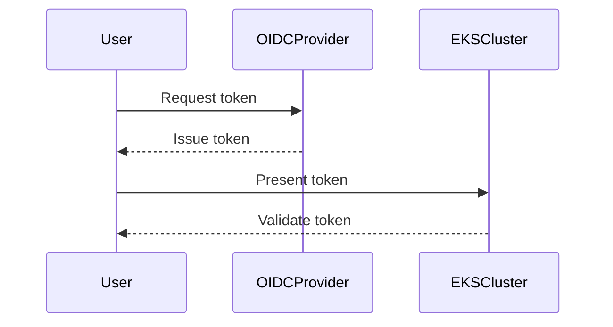

## Introduction to EKS Blueprints and Add-Ons

### Background Theory

Amazon Elastic Kubernetes Service (EKS) is a managed service that makes it easy to run Kubernetes on AWS without needing expertise in Kubernetes orchestration. EKS Blueprints are pre-configured templates that simplify the deployment of EKS clusters with specific configurations and add-ons. These add-ons provide additional functionality and services to enhance the capabilities of your EKS cluster.

### What Are EKS Add-Ons?

EKS Add-Ons are pre-built, managed services that extend the functionality of your EKS cluster. They are designed to integrate seamlessly with your cluster and provide additional features such as load balancing, monitoring, and scaling. Some common add-ons include:

- **AWS Load Balancer Controller**: Manages load balancing for your applications.
- **Metric Server**: Provides resource metrics to the Kubernetes API server.
- **Cluster Autoscaler**: Automatically scales the number of nodes in your cluster based on demand.

### Why Use EKS Add-Ons?

Using EKS Add-Ons simplifies the management and operation of your Kubernetes cluster. They handle complex configurations and maintenance tasks, allowing you to focus on developing and deploying your applications. Additionally, these add-ons are managed by AWS, ensuring they are up-to-date and secure.

### How EKS Add-Ons Work

When you create an EKS cluster using EKS Blueprints, you can specify which add-ons to enable. These add-ons are then deployed and managed by AWS, reducing the burden on the cluster administrator. The add-ons are typically installed as Kubernetes resources (such as Deployments, DaemonSets, and ConfigMaps) within the cluster.

### OIDC Provider in EKS

#### What Is an OIDC Provider?

An OpenID Connect (OIDC) provider is a service that issues identity tokens to clients. In the context of EKS, the OIDC provider is used to authenticate and authorize access to the Kubernetes API server. It ensures that only trusted entities can interact with the cluster.

#### Why Is It Important?

The OIDC provider is crucial for securing access to the Kubernetes API server. Without it, unauthorized entities could potentially gain access to your cluster, leading to security vulnerabilities. By using an OIDC provider, you can ensure that only authenticated and authorized entities can communicate with the cluster.

#### How Does It Work?

When you create an EKS cluster, an OIDC provider is automatically created and associated with the cluster. This provider is used to issue identity tokens to entities that need to access the Kubernetes API server. The tokens are then validated by the API server to ensure that the entity is trusted.



### Enabling Default Add-Ons

#### What Are Default Add-Ons?

Default add-ons are pre-configured services that are enabled by default when you create an EKS cluster using EKS Blueprints. These add-ons include essential services such as Kord DNS, VPC Network Interface (VPCNI), and others.

#### Why Enable Default Add-Ons?

Enabling default add-ons ensures that your cluster has the basic services required for optimal performance and security. These add-ons handle critical tasks such as DNS resolution, network configuration, and other foundational aspects of the cluster.

#### How to Enable Default Add-Ons

To enable default add-ons, you can use the `eksctl` command-line tool or the AWS Management Console. Here’s an example using `eksctl`:

```bash
eksctl create cluster --name my-cluster --region us-west-2 --with-oidc --with-addon vpc-cni --with-addon coredns
```

This command creates an EKS cluster named `my-cluster` in the `us-west-2` region and enables the OIDC provider and default add-ons such as `vpc-cni` and `coredns`.

### Customizing Add-Ons with EKS Blueprints

#### What Are Custom Add-Ons?

Custom add-ons are additional services that you can enable on top of the default add-ons. These add-ons provide extended functionality and can be tailored to meet specific requirements.

#### Why Customize Add-Ons?

Customizing add-ons allows you to extend the capabilities of your EKS cluster according to your specific needs. You can enable additional services such as the AWS Load Balancer Controller, Metric Server, and Cluster Autoscaler.

#### How to Customize Add-Ons

To customize add-ons, you can modify the EKS Blueprint configuration. Here’s an example of a configuration file (`blueprint.yaml`) that enables custom add-ons:

```yaml
apiVersion: eks.amazonaws.com/v1alpha1
kind: Cluster
metadata:
  name: my-cluster
spec:
  version: "1.21"
  addons:
    - name: aws-load-balancer-controller
      version: "v2.4.1"
      enabled: true
    - name: metric-server
      version: "v0.6.1"
      enabled: true
    - name: cluster-autoscaler
      version: "v1.21.2"
      enabled: true
```

This configuration file enables the AWS Load Balancer Controller, Metric Server, and Cluster Autoscaler add-ons.

### Installing Specific Add-Ons

#### AWS Load Balancer Controller

The AWS Load Balancer Controller manages load balancing for your applications running on EKS. It integrates with AWS Elastic Load Balancing (ELB) to provide scalable and resilient load balancing.

##### Configuration Example

Here’s an example of how to configure the AWS Load Balancer Controller:

```yaml
apiVersion: v1
kind: Namespace
metadata:
  name: kube-system
---
apiVersion: apps/v1
kind: Deployment
metadata:
  name: aws-load-balancer-controller
  namespace: kube-system
spec:
  replicas: 2
  selector:
    matchLabels:
      app: aws-load-balancer-controller
  template:
    metadata:
      labels:
        app: aws-load-balancer-controller
    spec:
      containers:
      - name: aws-load-balancer-controller
        image: public.ecr.aws/eks/aws-load-balancer-controller:v2.4.1
        args:
          - --webhook-port=9443
          - --leader-election-namespace=kube-system
```

##### How to Prevent / Defend

To secure the AWS Load Balancer Controller, ensure that it is properly configured and monitored. Use IAM roles and policies to restrict access to the controller and its resources. Regularly review and update the controller configuration to address any security vulnerabilities.

#### Metric Server

The Metric Server provides resource metrics to the Kubernetes API server. It collects and aggregates metrics from nodes and pods, making them available for monitoring and analysis.

##### Configuration Example

Here’s an example of how to configure the Metric Server:

```yaml
apiVersion: v1
kind: Namespace
metadata:
  name: kube-system
---
apiVersion: apps/v1
kind: Deployment
metadata:
  name: metrics-server
  namespace: kube-system
spec:
  replicas: 1
  selector:
    matchLabels:
      k8s-app: metrics-server
  template:
    metadata:
      labels:
        k8s-app: metrics-server
    spec:
      containers:
      - name: metrics-server
        image: k8s.gcr.io/metrics-server/metrics-server:v0.6.1
        args:
          - --kubelet-insecure-tls
          - --kubelet-preferred-address-types=InternalIP,ExternalIP,Hostname
```

##### How to Prevent / Defend

To secure the Metric Server, ensure that it is properly configured and monitored. Use network policies to restrict access to the server and its resources. Regularly review and update the server configuration to address any security vulnerabilities.

#### Cluster Autoscaler

The Cluster Autoscaler automatically scales the number of nodes in your cluster based on demand. It helps optimize resource utilization and cost efficiency.

##### Configuration Example

Here’s an example of how to configure the Cluster Autoscaler:

```yaml
apiVersion: v1
kind: Namespace
metadata:
  name: kube-system
---
apiVersion: apps/v1
kind: Deployment
metadata:
  name: cluster-autoscaler
  namespace: kube-system
spec:
  replicas: 1
  selector:
    matchLabels:
      app: cluster-autoscaler
  template:
    metadata:
      labels:
        app: cluster-autoscaler
    spec:
      containers:
      - name: cluster-autoscaler
        image: k8s.gcr.io/autoscaling/cluster-autoscaler:v1.21.2
        args:
          - --v=4
          - --stderrthreshold=info
          - --cloud-provider=aws
          - --skip-nodes-with-local-storage=false
          - --expander=random
```

##### How to Prevent / Defend

To secure the Cluster Autoscaler, ensure that it is properly configured and monitored. Use IAM roles and policies to restrict access to the autoscaler and its resources. Regularly review and update the autoscaler configuration to address any security vulnerabilities.

### Conclusion

In this chapter, we covered the fundamentals of EKS Blueprints and add-ons, including the OIDC provider, default add-ons, and custom add-ons. We explored how to configure and manage these add-ons to enhance the capabilities of your EKS cluster. We also provided detailed examples and configurations for specific add-ons such as the AWS Load Balancer Controller, Metric Server, and Cluster Autoscaler. Finally, we discussed how to secure these add-ons to protect your cluster from potential threats.

### Practice Labs

For hands-on experience with EKS Blueprints and add-ons, consider the following labs:

- **CloudGoat**: A cloud security training platform that includes exercises for managing EKS clusters and add-ons.
- **flaws.cloud**: A cloud security training platform that offers scenarios for configuring and securing EKS clusters.
- **AWS Official Workshops**: AWS provides official workshops and labs that cover various aspects of EKS, including the use of Blueprints and add-ons.

These labs will help you gain practical experience in configuring and managing EKS clusters with add-ons, ensuring that you can effectively deploy and secure your Kubernetes applications on AWS.

---
<!-- nav -->
[[DevSecOps/DevSecOps Bootcamp/06-Container & Kubernetes Security/02-EKS Blueprints/Configure EKS Add ons/00-Overview|Overview]] | [[02-Introduction to EKS Blueprints and Add-Ons Part 2|Introduction to EKS Blueprints and Add-Ons Part 2]]
