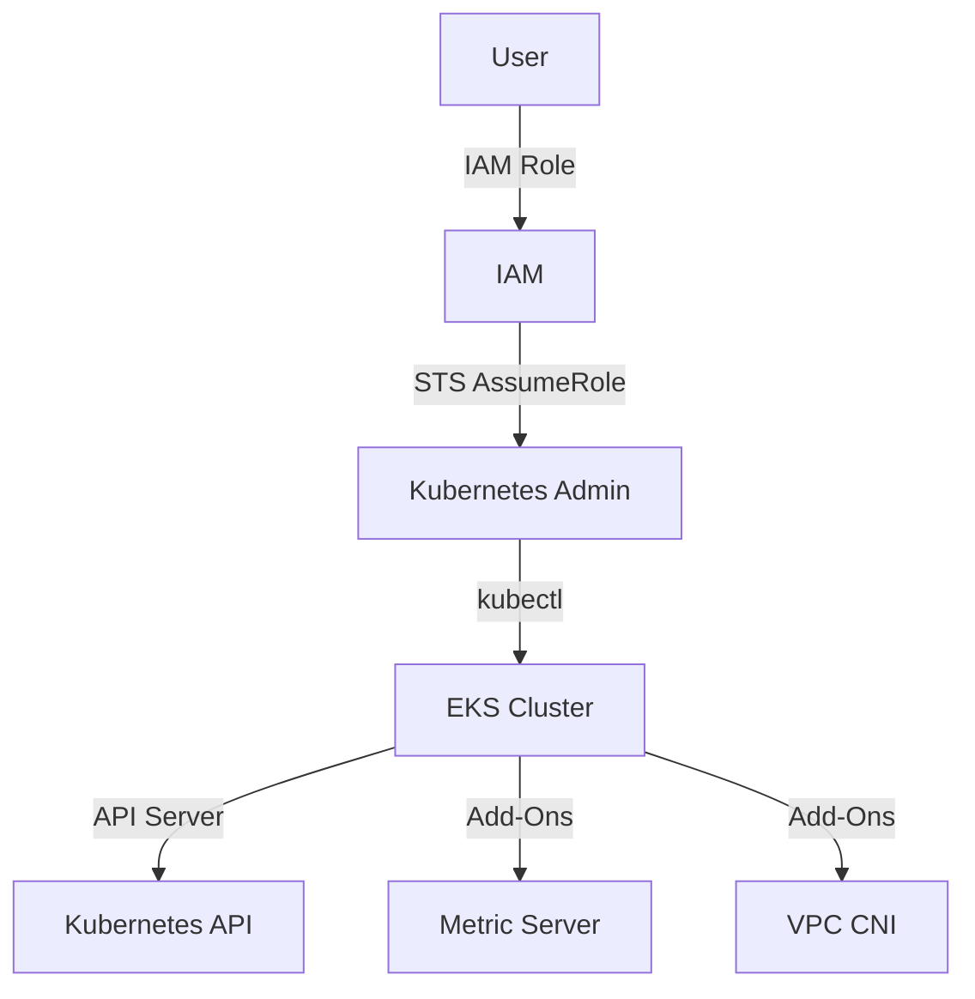

## Introduction to EKS Blueprints and Add-Ons

### Background Theory

EKS (Elastic Kubernetes Service) is a managed service provided by AWS that makes it easy to run Kubernetes on AWS without needing to install and operate your own Kubernetes control plane. EKS allows you to focus on deploying and managing applications rather than managing the underlying infrastructure.

One of the key features of EKS is the ability to configure and manage add-ons. These add-ons provide additional functionality to your Kubernetes cluster, such as monitoring, logging, and security enhancements. Configuring these add-ons correctly is crucial for maintaining a secure and efficient environment.

### Key Concepts

#### EKS Cluster Metadata

An EKS cluster has several pieces of metadata associated with it, including:

- **API Server Endpoint**: The URL through which you interact with the Kubernetes API.
- **Add-Ons**: Additional services that enhance the functionality of the cluster.
- **Namespaces**: Logical partitions within the cluster to isolate different sets of resources.

#### Role-Based Access Control (RBAC)

RBAC is a method of controlling access to resources based on roles assigned to users. In the context of EKS, RBAC ensures that only authorized users can perform certain actions within the cluster. This is critical for maintaining security and preventing unauthorized access.

### Detailed View of EKS Cluster

When you look at the detailed view of an EKS cluster, you will see various pieces of metadata and resources. Here’s a breakdown of what you might see:

- **Cluster-Specific Information**:
  - **API Server Endpoint**: The endpoint used to communicate with the Kubernetes API.
  - **Add-Ons**: Services like metrics-server, VPC CNI, etc.
  - **Node Groups**: Information about the worker nodes in the cluster.

- **Resources**:
  - **Pods**: Individual containers running in the cluster.
  - **Deployments**: Definitions of how many replicas of a pod should be running.
  - **Services**: Network endpoints that expose pods to the internet or other services.

### Permissions and Access Control

In the given transcript, it is mentioned that an admin on AWS does not have direct access to the EKS cluster. This is a fundamental security principle known as least privilege. By ensuring that users have only the permissions necessary to perform their tasks, you minimize the risk of accidental or malicious misuse of privileges.

#### Example Scenario

Consider a scenario where an AWS admin needs to deploy a new application to the EKS cluster. Instead of giving them direct access to the cluster, you would create a separate Kubernetes admin user with the necessary permissions. This separation ensures that the AWS admin cannot accidentally or intentionally modify the cluster in ways that could compromise security.

### Configuring EKS Add-Ons

To configure EKS add-ons, you typically use the AWS Management Console, AWS CLI, or Kubernetes CLI (`kubectl`). Here’s a step-by-step guide to configuring an add-on:

#### Step 1: Identify Required Add-Ons

Determine which add-ons are necessary for your cluster. Common add-ons include:

- **Metrics Server**: Provides resource usage metrics for pods and nodes.
- **VPC CNI**: Manages network interfaces for pods.
- **Cluster Autoscaler**: Automatically scales the number of nodes in the cluster based on demand.

#### Step 2: Configure Add-Ons Using AWS CLI

You can use the AWS CLI to enable or disable add-ons. Here’s an example of enabling the Metrics Server add-on:

```bash
aws eks update-cluster-config --name <cluster-name> --resources-vpc-config subnetIds=<subnet-id>,securityGroupIds=<security-group-id> --region <region>
```

#### Step 3: Verify Configuration

After configuring the add-ons, verify that they are running correctly. You can check the status of the add-ons using `kubectl`:

```bash
kubectl get pods -n kube-system
```

### Role Assumption for Kubernetes Admin

The transcript mentions assuming the role of a Kubernetes admin. This is done using AWS IAM roles and the `sts:AssumeRole` action. Here’s how you can set this up:

#### Step 1: Create IAM Roles

Create an IAM role for the Kubernetes admin with the necessary permissions. For example, you might create a role named `KubernetesAdmin`.

#### Step 2: Assume the Role

Use the AWS CLI to assume the role:

```bash
aws sts assume-role --role-arn arn:aws:iam::<account-id>:role/KubernetesAdmin --role-session-name KubernetesAdminSession
```

This command returns temporary credentials that you can use to authenticate with the Kubernetes cluster.

#### Step 3: Access the Cluster

Use the `kubectl` command with the assumed role credentials to access the cluster:

```bash
export AWS_ACCESS_KEY_ID=<access-key-id>
export AWS_SECRET_ACCESS_KEY=<secret-access-key>
export AWS_SESSION_TOKEN=<session-token>

kubectl get pods -n kube-system
```

### Secure Access to the Cluster

Ensuring secure access to the EKS cluster is critical. Here are some best practices:

- **Use IAM Roles**: Always use IAM roles to grant access to the cluster.
- **Least Privilege**: Ensure that users have only the permissions necessary to perform their tasks.
- **Regular Audits**: Regularly audit access logs to detect any unauthorized access attempts.

### Real-World Examples

#### CVE-2021-25741: Kubernetes API Server Vulnerability

CVE-2021-25741 is a vulnerability in the Kubernetes API server that allows attackers to bypass authentication and authorization checks. This highlights the importance of securing access to the API server.

#### Example Exploit

An attacker could exploit this vulnerability by sending a specially crafted request to the API server:

```http
POST /api/v1/namespaces/default/pods HTTP/1.1
Host: <api-server-endpoint>
Authorization: Bearer <invalid-token>
Content-Type: application/json

{
  "metadata": {
    "name": "attacker-pod"
  },
  "spec": {
    "containers": [
      {
        "image": "nginx",
        "name": "nginx-container"
      }
    ]
  }
}
```

#### How to Prevent / Defend

To prevent such attacks, ensure that:

- **RBAC Policies**: Implement strict RBAC policies to limit access.
- **Network Policies**: Use network policies to restrict traffic to the API server.
- **Regular Updates**: Keep the Kubernetes version up to date to patch known vulnerabilities.

### Complete Example

Here’s a complete example of configuring an EKS cluster with add-ons and securing access:

#### Step 1: Create EKS Cluster

```bash
aws eks create-cluster --name my-cluster --role-arn arn:aws:iam::<account-id>:role/EKSAdminRole --resources-vpc-config subnetIds=<subnet-id>,securityGroupIds=<security-group-id> --region <region>
```

#### Step 2: Enable Add-Ons

```bash
aws eks update-cluster-config --name my-cluster --resources-vpc-config subnetIds=<subnet-id>,securityGroupIds=<security-group-id> --region <region>
```

#### Step 3: Assume Role and Access Cluster

```bash
aws sts assume-role --role-arn arn:aws:iam::<account-id>:role/KubernetesAdmin --role-session-name KubernetesAdminSession

export AWS_ACCESS_KEY_ID=<access-key-id>
export AWS_SECRET_ACCESS_KEY=<secret-access-key>
export AWS_SESSION_TOKEN=<session-token>

kubectl get pods -n kube-system
```

### Diagrams

#### EKS Architecture Diagram



### Common Pitfalls

- **Insufficient RBAC Policies**: Not implementing strict RBAC policies can lead to unauthorized access.
- **Outdated Kubernetes Version**: Running an outdated version of Kubernetes can expose you to known vulnerabilities.
- **Incorrect Network Policies**: Incorrectly configured network policies can allow unauthorized traffic to the API server.

### Detection and Prevention

#### Detection

- **Audit Logs**: Regularly review audit logs to detect any unauthorized access attempts.
- **Security Tools**: Use tools like AWS CloudTrail and Kubernetes Audit Logs to monitor activity.

#### Prevention

- **Strict RBAC Policies**: Implement strict RBAC policies to limit access.
- **Network Policies**: Use network policies to restrict traffic to the API server.
- **Regular Updates**: Keep the Kubernetes version up to date to patch known vulnerabilities.

### Secure Coding Fixes

#### Vulnerable Code

```yaml
apiVersion: v1
kind: Pod
metadata:
  name: nginx-pod
spec:
  containers:
  - name: nginx
    image: nginx
```

#### Fixed Code

```yaml
apiVersion: v1
kind: Pod
metadata:
  name: nginx-pod
  namespace: default
spec:
  containers:
  - name: nginx
    image: nginx
    securityContext:
      runAsNonRoot: true
      runAsUser: 1000
```

### Conclusion

Configuring EKS add-ons and securing access to the cluster is crucial for maintaining a secure and efficient environment. By following best practices and regularly auditing access, you can minimize the risk of unauthorized access and ensure the integrity of your Kubernetes cluster.

### Hands-On Labs

For hands-on practice, consider the following labs:

- **CloudGoat**: A cloud security training platform that includes scenarios for EKS and Kubernetes.
- **AWS Well-Architected Labs**: Official AWS labs that cover various aspects of EKS and Kubernetes security.

These labs provide practical experience in configuring EKS clusters and securing access, helping you to master the concepts covered in this chapter.

---
<!-- nav -->
[[02-Introduction to EKS Blueprints and Add-Ons Part 2|Introduction to EKS Blueprints and Add-Ons Part 2]] | [[DevSecOps/DevSecOps Bootcamp/06-Container & Kubernetes Security/02-EKS Blueprints/Configure EKS Add ons/00-Overview|Overview]] | [[04-Introduction to EKS Blueprints and Add-Ons Part 4|Introduction to EKS Blueprints and Add-Ons Part 4]]
