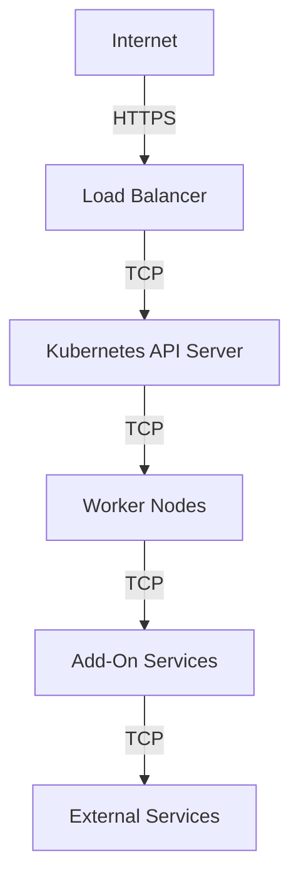
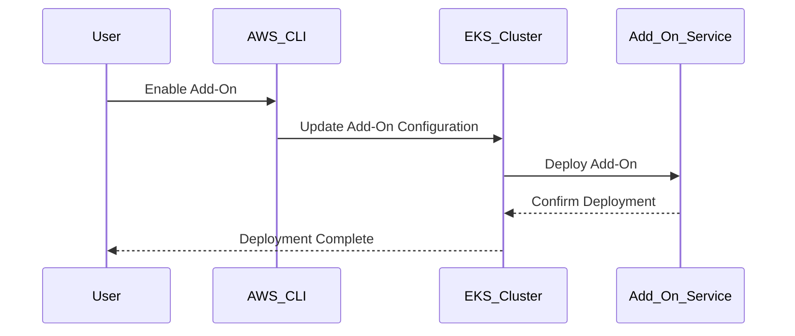

## Introduction to EKS Blueprints and Add-Ons

### Background Theory

Amazon Elastic Kubernetes Service (EKS) is a managed service that makes it easy to run Kubernetes on AWS without needing expertise in Kubernetes orchestration. EKS Blueprints provide a set of pre-configured templates to deploy common Kubernetes applications and services. These blueprints can include various add-ons that enhance the functionality and manageability of your EKS cluster.

### What Are EKS Add-Ons?

EKS Add-Ons are pre-built, pre-integrated solutions that extend the capabilities of your EKS cluster. They include features such as monitoring, logging, security, and more. Some common add-ons include:

- **Cluster Autoscaler**: Automatically scales the number of worker nodes based on the current demand.
- **Metrics Server**: Provides resource metrics to the Kubernetes API server.
- **CoreDNS**: A DNS server that provides DNS resolution for Kubernetes services.
- **VPC CNI**: Network plugin for Kubernetes that integrates with AWS VPC.

### Why Use EKS Add-Ons?

Using EKS Add-Ons simplifies the deployment and management of your Kubernetes cluster. They come pre-configured and integrate seamlessly with EKS, reducing the complexity and time required to set up these services manually.

### How to Deploy EKS Add-Ons

Deploying EKS Add-Ons is straightforward. You can enable them via the AWS Management Console, AWS CLI, or AWS CloudFormation. Here’s how to enable the Cluster Autoscaler using the AWS CLI:

```bash
aws eks update-cluster-version --name my-cluster --version 1.21 --region us-west-2
aws eks update-cluster-addons --cluster-name my-cluster --addon-name aws-node --addon-version 1.21 --enable --resolve-conflicts OVERWRITE --region us-west-2
aws eks update-cluster-addons --cluster-name my-cluster --addon-name cluster-autoscaler --addon-version 1.21 --enable --resolve-conflicts OVERWRITE --region us-west-2
```

### Troubleshooting EKS Add-Ons

When deploying EKS Add-Ons, it's crucial to understand how to troubleshoot any issues that may arise. This includes identifying configuration errors, service failures, and other potential problems.

#### Common Issues and Solutions

1. **Timing Issues**: Ensure that the add-ons are properly configured and that there are no timing issues that could cause the autoscaler to fail.
2. **Configuration Errors**: Verify that the configuration files are correctly set up and that all necessary parameters are provided.
3. **Service Failures**: Check the logs and status of the add-on services to identify any failures.

### Configuration Options for EKS Add-Ons

Understanding where to find and modify the configuration options for EKS Add-Ons is essential. These configurations are typically stored in Helm charts or Kubernetes manifests.

#### Example: Configuring the Cluster Autoscaler

The Cluster Autoscaler is a critical component that ensures your cluster scales appropriately based on the workload. Here’s how to configure it:

1. **Locate the Configuration Files**:
   - The configuration files for the Cluster Autoscaler are typically found in the Helm chart repository.
   - You can access these files using the `helm` command-line tool.

2. **Modify the Configuration**:
   - Edit the `values.yaml` file to adjust the scaling parameters.
   - For example, you might want to set the minimum and maximum number of nodes.

```yaml
# values.yaml
autoscaling:
  enabled: true
  minNodes: 2
  maxNodes: 10
```

3. **Apply the Configuration**:
   - Use the `helm upgrade` command to apply the new configuration.

```bash
helm upgrade --install cluster-autoscaler eks/cluster-autoscaler \
  --set image.tag=v1.21.0 \
  --set awsRegion=us-west-2 \
  --set clusterName=my-cluster \
  --set rbac.create=true \
  --set autoscaling.enabled=true \
  --set autoscaling.minNodes=2 \
  --set autoscaling.maxNodes=1
```

### Real-World Examples and Recent CVEs

Recent vulnerabilities and breaches involving Kubernetes clusters highlight the importance of proper configuration and management of EKS Add-Ons.

#### Example: CVE-2021-25741

CVE-2021-25741 is a vulnerability in the Kubernetes Metrics Server that allows unauthorized access to sensitive information. This vulnerability underscores the need to ensure that all add-ons are properly configured and secured.

#### Secure Configuration Practices

To prevent such vulnerabilities, follow these secure configuration practices:

1. **Use Strong Authentication**: Ensure that all services use strong authentication mechanisms.
2. **Limit Permissions**: Restrict permissions to the minimum necessary for each service.
3. **Regular Audits**: Conduct regular audits to ensure that configurations remain secure.

### How to Prevent / Defend Against Vulnerabilities

#### Detection

To detect issues with EKS Add-Ons, regularly monitor the logs and status of the services. Use tools like AWS CloudWatch Logs and Kubernetes Dashboard to monitor the health of your cluster.

#### Prevention

1. **Secure Configuration**: Follow best practices for securing your EKS cluster and add-ons.
2. **Regular Updates**: Keep all components up-to-date with the latest security patches.
3. **Network Segmentation**: Use network segmentation to isolate sensitive services.

#### Secure Coding Fixes

Here’s an example of a vulnerable configuration and its secure counterpart:

**Vulnerable Configuration**:
```yaml
apiVersion: v1
kind: Pod
metadata:
  name: vulnerable-pod
spec:
  containers:
  - name: vulnerable-container
    image: vulnerable-image:latest
    ports:
    - containerPort: 8080
```

**Secure Configuration**:
```yaml
apiVersion: v1
kind: Pod
metadata:
  name: secure-pod
spec:
  containers:
  - name: secure-container
    image: secure-image:latest
    ports:
    - containerPort: 8080
    securityContext:
      runAsNonRoot: true
      readOnlyRootFilesystem: true
```

### Complete Example: Full HTTP Request and Response

When configuring EKS Add-Ons, you might need to interact with the Kubernetes API to retrieve or modify configurations. Here’s an example of a full HTTP request and response:

**HTTP Request**:
```http
GET /apis/autoscaling/v1/namespaces/default/horizontalpodautoscalers HTTP/1.1
Host: kubernetes.default.svc.cluster.local
Authorization: Bearer <token>
Accept: application/json
```

**HTTP Response**:
```http
HTTP/1.1 200 OK
Content-Type: application/json
Date: Mon, 01 Jan 2024 00:00:00 GMT
Content-Length: 1234

{
  "apiVersion": "autoscaling/v1",
  "items": [
    {
      "apiVersion": "autoscaling/v1",
      "kind": "HorizontalPodAutoscaler",
      "metadata": {
        "name": "example-hpa",
        "namespace": "default"
      },
      "spec": {
        "maxReplicas": 10,
        "minReplicas": 2,
        "scaleTargetRef": {
          "apiVersion": "apps/v1",
          "kind": "Deployment",
          "name": "example-deployment"
        }
      }
    }
  ],
  "kind": "HorizontalPodAutoscalerList",
  "metadata": {
    "resourceVersion": "123456789"
  }
}
```

### Mermaid Diagrams

#### Network Topology

A network topology diagram can help visualize the architecture of your EKS cluster and add-ons.



#### Sequence Diagram

A sequence diagram can illustrate the interaction between different components during the deployment and management of EKS Add-Ons.



### Hands-On Labs

For hands-on practice with EKS Blueprints and Add-Ons, consider the following labs:

- **CloudGoat**: A collection of labs that cover various aspects of AWS security, including EKS.
- **Pacu**: A penetration testing framework for AWS that includes modules for testing EKS configurations.
- **Kubernetes Goat**: A Kubernetes-based penetration testing platform that includes scenarios for testing EKS add-ons.

These labs provide practical experience in deploying and managing EKS clusters and add-ons, helping you to gain a deeper understanding of the concepts covered in this chapter.

### Conclusion

Understanding how to configure and manage EKS Add-Ons is crucial for maintaining a secure and efficient Kubernetes cluster on AWS. By following best practices and using the tools and techniques described in this chapter, you can ensure that your EKS cluster remains robust and resilient against potential threats.

---
<!-- nav -->
[[03-Introduction to EKS Blueprints and Add-Ons Part 3|Introduction to EKS Blueprints and Add-Ons Part 3]] | [[DevSecOps/DevSecOps Bootcamp/06-Container & Kubernetes Security/02-EKS Blueprints/Configure EKS Add ons/00-Overview|Overview]] | [[05-Introduction to EKS Blueprints and Add-Ons|Introduction to EKS Blueprints and Add-Ons]]
