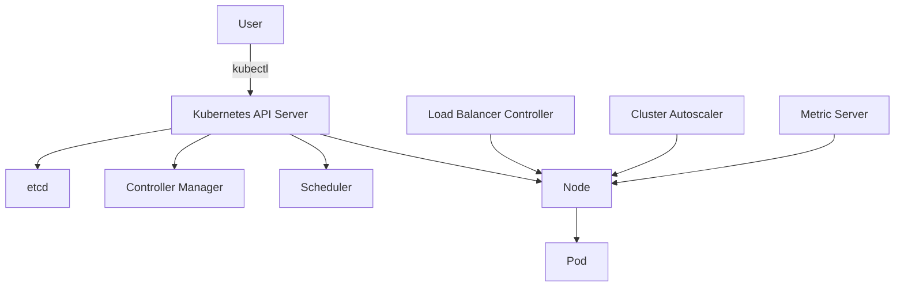

## Introduction to EKS Blueprints and Add-ons Configuration

### Background Theory

Amazon Elastic Kubernetes Service (EKS) is a managed service that makes it easy to run Kubernetes on AWS without needing expertise in Kubernetes orchestration. EKS Blueprints provide a way to configure and deploy EKS clusters with pre-defined settings and add-ons. These add-ons enhance the functionality of the EKS cluster by providing additional services such as load balancing, auto-scaling, and metrics collection.

### Key Concepts

- **Kubernetes Cluster**: A set of nodes that run containerized applications managed by Kubernetes.
- **EKS Load Balancer Controller**: Manages external load balancers for Kubernetes services.
- **Cluster Autoscaler**: Automatically scales the number of worker nodes based on demand.
- **Metric Server**: Provides resource usage metrics for the cluster.

### Accessing Nodes and Pods

To interact with an EKS cluster, you need to have appropriate permissions and roles. In the context of the lecture, the instructor accessed the nodes and checked the pods across all namespaces.

#### Step-by-Step Mechanics

1. **Get Node Information**:
    ```bash
    kubectl get nodes
    ```

2. **Check Pods Across All Namespaces**:
    ```bash
    kubectl get pods --all-namespaces
    ```

### Understanding the Control Plane Namespace

The control plane namespace (`kube-system`) contains essential components like the load balancer controller, cluster autoscaler, and metric server.

#### Example of Full Raw HTTP Request and Response

```http
GET /api/v1/namespaces/kube-system/pods HTTP/1.1
Host: <cluster-endpoint>
Authorization: Bearer <token>

HTTP/1.1 200 OK
Content-Type: application/json
Date: Mon, 01 Jan 2024 00:00:00 GMT
Content-Length: 1234

{
  "kind": "PodList",
  "apiVersion": "v1",
  "metadata": {
    "selfLink": "/api/v1/namespaces/kube-system/pods"
  },
  "items": [
    {
      "metadata": {
        "name": "eks-load-balancer-controller-0",
        "namespace": "kube-system"
      },
      "spec": {
        "containers": [
          {
            "name": "controller",
            "image": "public.ecr.aws/eks/distro/aws-load-balancer-controller:v2.5.0"
          }
        ]
      }
    },
    {
      "metadata": {
        "name": "cluster-autoscaler-6c8b5f596b-nzgkq",
        "namespace": "kube-system"
      },
      "spec": {
        "containers": [
          {
            "name": "cluster-autoscaler",
            "image": "public.ecr.aws/eks/distro/cluster-autoscaler:v1.24.0"
          }
        ]
      }
    },
    {
      "metadata": {
        "name": "metrics-server-6d5878bb6d-2lq6m",
        "namespace": "kube-system"
      },
      "spec": {
        "containers": [
          {
            "name": "metrics-server",
            "image": "public.ecr.aws/eks/distro/metrics-server:v0.6.1"
          }
        ]
      }
    }
  ]
}
```

### Extra Steps for Secure Configuration

When configuring an EKS cluster with proper security measures, additional steps are required:

1. **Pipeline Script for Cluster Access**:
    ```bash
    #!/bin/bash
    aws eks update-kubeconfig --region us-west-2 --name my-cluster
    ```

2. **Using a Dedicated Admin User**:
    ```yaml
    apiVersion: v1
    kind: ServiceAccount
    metadata:
      name: admin-user
      namespace: kube-system
    ---
    apiVersion: rbac.authorization.k8s.io/v1
    kind: ClusterRoleBinding
    metadata:
      name: admin-user-binding
    subjects:
    - kind: ServiceAccount
      name: admin-user
      namespace: kube-system
    roleRef:
      kind: ClusterRole
      name: cluster-admin
      apiGroup: rbac.authorization.k8s.io
    ```

### Pitfalls and Common Mistakes

- **Insufficient Permissions**: Not granting the necessary permissions to the service account can lead to access issues.
- **Incorrect Role Binding**: Misconfigured role bindings can result in unauthorized access or insufficient privileges.

### How to Prevent / Defend

#### Detection

- **Audit Logs**: Enable audit logging to monitor access patterns and detect unauthorized activities.
- **Network Policies**: Implement network policies to restrict traffic between pods and namespaces.

#### Prevention

- **Least Privilege Principle**: Ensure that users and service accounts have the minimum necessary permissions.
- **Regular Audits**: Conduct regular security audits to identify and mitigate vulnerabilities.

#### Secure Coding Fixes

**Vulnerable Code**:
```yaml
apiVersion: v1
kind: ServiceAccount
metadata:
  name: insecure-user
  namespace: default
---
apiVersion: rbac.authorization.k8s.io/v1
kind: ClusterRoleBinding
metadata:
  name: insecure-user-binding
subjects:
- kind: ServiceAccount
  name: insecure-user
  namespace: default
roleRef:
  kind: ClusterRole
  name: cluster-admin
  apiGroup: rbac.authorization.k8s.io
```

**Secure Code**:
```yaml
apiVersion: v1
kind: ServiceAccount
metadata:
  name: secure-user
  namespace: kube-system
---
apiVersion: rbac.authorization.k8s.io/v1
kind: ClusterRoleBinding
metadata:
  name: secure-user-binding
subjects:
- kind: ServiceAccount
  name: secure-user
  namespace: kube-system
roleRef:
  kind: ClusterRole
  name: view
  apiGroup: rbac.authorization.k8s.io
```

### Real-World Examples

- **CVE-2021-25741**: A vulnerability in the Kubernetes API server allowed attackers to bypass authentication and authorization checks. This highlights the importance of securing access to the cluster.
- **Breaches**: Several high-profile breaches have occurred due to misconfigured RBAC policies, emphasizing the need for strict access controls.

### Mermaid Diagrams

#### Kubernetes Cluster Architecture



### Conclusion

Properly configuring EKS add-ons and ensuring secure access requires careful planning and implementation. By following best practices and regularly auditing configurations, you can maintain a secure and efficient Kubernetes cluster on AWS.

### Practice Labs

For hands-on experience with EKS Blueprints and add-ons configuration, consider the following labs:

- **CloudGoat**: A cloud security training platform that includes scenarios for securing EKS clusters.
- **AWS Official Workshops**: AWS provides various workshops that cover EKS setup and management, including security best practices.
- **Pacu**: A penetration testing framework that includes modules for testing EKS configurations.

These resources will help you gain practical experience and deepen your understanding of EKS security and configuration.

---
<!-- nav -->
[[05-Introduction to EKS Blueprints and Add-Ons|Introduction to EKS Blueprints and Add-Ons]] | [[DevSecOps/DevSecOps Bootcamp/06-Container & Kubernetes Security/02-EKS Blueprints/Configure EKS Add ons/00-Overview|Overview]] | [[07-Introduction to EKS Blueprints and Add-ons Configuration|Introduction to EKS Blueprints and Add-ons Configuration]]
