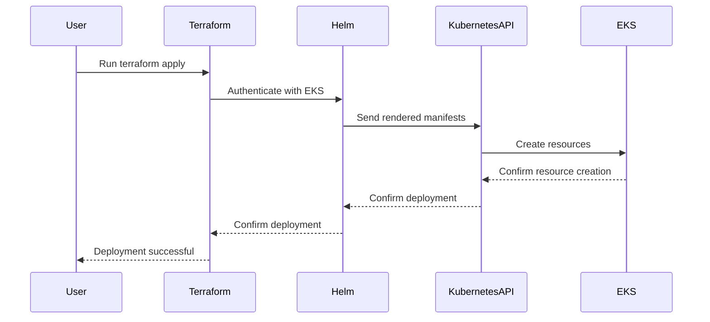

## Introduction to EKS Blueprints and Helm Charts

EKS (Amazon Elastic Kubernetes Service) Blueprints are pre-configured templates that simplify the deployment of common Kubernetes applications and services. These blueprints are essentially Helm charts, which are package managers for Kubernetes that help manage and deploy applications onto Kubernetes clusters. Understanding how these Helm charts are deployed and authenticated within an EKS cluster is crucial for effective DevSecOps practices.

### What Are Helm Charts?

Helm charts are collections of files that describe a related set of Kubernetes resources. They provide a convenient way to package, configure, and install applications on Kubernetes clusters. A Helm chart consists of:

- **Chart.yaml**: Metadata about the chart.
- **values.yaml**: Default values for parameters that can be customized during installation.
- **templates/**: Directory containing Kubernetes manifest files (YAML) that define the resources to be created.

### Why Use Helm Charts in EKS?

Using Helm charts in EKS offers several advantages:

- **Consistency**: Ensures that applications are deployed consistently across different environments.
- **Reusability**: Allows teams to reuse and share charts across projects.
- **Customization**: Provides flexibility through configurable parameters.
- **Version Control**: Enables versioning and rollback capabilities.

### How Helm Charts Work Under the Hood

When a Helm chart is deployed, Helm performs the following steps:

1. **Template Rendering**: Helm reads the `values.yaml` and `Chart.yaml` files and renders the Kubernetes manifests in the `templates/` directory.
2. **Resource Creation**: Helm sends the rendered manifests to the Kubernetes API server to create the resources.
3. **Release Management**: Helm tracks the deployment as a release and manages updates and rollbacks.

### Authentication Mechanism for Helm in EKS

For Helm to interact with an EKS cluster, it needs to authenticate and authorize itself. This is achieved using the same mechanisms that Kubernetes uses, primarily through the Kubernetes API server.

#### Kubernetes Authentication Methods

Kubernetes supports several authentication methods:

- **Service Account Tokens**: Used by pods to authenticate with the API server.
- **X509 Client Certificates**: Used by users and administrators.
- **Webhook Token Authentication**: Customizable authentication backend.
- **Bearer Token Authentication**: Used for API calls.

### Helm Provider in Terraform

Terraform is a popular infrastructure-as-code tool that can be used to manage Kubernetes resources, including Helm charts. To deploy Helm charts via Terraform, a `helm_provider` is required to authenticate Helm with the EKS cluster.

#### Configuring the Helm Provider in Terraform

The `helm_provider` in Terraform is defined similarly to the `kubernetes_provider`. Here’s how to configure it:

```hcl
provider "helm" {
  kubernetes {
    host                   = var.kubernetes_host
    cluster_ca_certificate = base64decode(var.cluster_ca_certificate)
    token                  = var.token
  }
}
```

### Example: Deploying a Helm Chart Using Terraform

Let's walk through a complete example of deploying a Helm chart using Terraform.

#### Step 1: Define the Helm Provider

First, define the `helm_provider` in your Terraform configuration:

```hcl
provider "helm" {
  kubernetes {
    host                   = var.kubernetes_host
    cluster_ca_certificate = base64decode(var.cluster_ca_certificate)
    token                  = var.token
  }
}
```

#### Step 2: Define the Helm Release

Next, define the Helm release:

```hcl
resource "helm_release" "example" {
  name       = "example"
  repository = "https://charts.bitnami.com/bitnami"
  chart      = "nginx"
  version    = "8.10.0"
  namespace  = "default"

  set {
    name  = "service.type"
    value = "LoadBalancer"
  }
}
```

#### Step 3: Apply the Configuration

Run `terraform init` to initialize the Terraform environment, then `terraform apply` to deploy the Helm chart.

### Mermaid Diagram: Helm Deployment Flow

Here’s a mermaid diagram illustrating the flow of deploying a Helm chart via Terraform:



### Common Pitfalls and Best Practices

#### Pitfall: Incorrect Authentication Configuration

One common pitfall is incorrect configuration of the authentication parameters. Ensure that the `host`, `cluster_ca_certificate`, and `token` are correctly specified.

#### Best Practice: Securely Manage Credentials

Use secret management tools like AWS Secrets Manager or HashiCorp Vault to securely store and manage credentials.

### Real-World Example: CVE-2021-25741

CVE-2021-25741 is a critical vulnerability in Kubernetes that allows attackers to bypass RBAC (Role-Based Access Control) restrictions. This highlights the importance of securing your authentication mechanisms.

#### How to Prevent / Defend

1. **Secure Authentication Mechanisms**:
   - Use strong, unique tokens.
   - Rotate credentials regularly.
   - Implement multi-factor authentication (MFA).

2. **RBAC Configuration**:
   - Define strict role bindings.
   - Regularly audit and review RBAC policies.

3. **Monitoring and Logging**:
   - Enable detailed logging for Kubernetes API server.
   - Monitor for unauthorized access attempts.

### Secure Code Fix Example

#### Vulnerable Code

```yaml
apiVersion: v1
kind: Secret
metadata:
  name: my-secret
type: Opaque
data:
  username: dXNlcm5hbWU=
  password: cGFzc3dvcmQ=
```

#### Fixed Code

```yaml
apiVersion: v1
kind: Secret
metadata:
  name: my-secret
type: Opaque
data:
  username: dXNlcm5hbWU=
  password: cGFzc3dvcmQ=
---
apiVersion: rbac.authorization.k8s.io/v1
kind: RoleBinding
metadata:
  name: my-role-binding
subjects:
- kind: ServiceAccount
  name: my-service-account
roleRef:
  apiGroup: rbac.authorization.k8s.io
  kind: ClusterRole
  name: my-cluster-role
```

### Conclusion

Understanding and properly configuring Helm charts and their authentication mechanisms in EKS is essential for effective DevSecOps practices. By following best practices and securing your authentication mechanisms, you can ensure that your Kubernetes deployments are both efficient and secure.

### Hands-On Labs

To practice these concepts, consider the following labs:

- **CloudGoat**: A cloud security training platform that includes exercises for EKS and Helm.
- **AWS Well-Architected Labs**: Official AWS labs that cover various aspects of EKS and Kubernetes security.

By completing these labs, you can gain practical experience in deploying and securing Helm charts in an EKS environment.

---
<!-- nav -->
[[07-Introduction to EKS Blueprints and Add-ons Configuration|Introduction to EKS Blueprints and Add-ons Configuration]] | [[DevSecOps/DevSecOps Bootcamp/06-Container & Kubernetes Security/02-EKS Blueprints/Configure EKS Add ons/00-Overview|Overview]] | [[09-Cluster Autoscaler in Amazon EKS|Cluster Autoscaler in Amazon EKS]]
