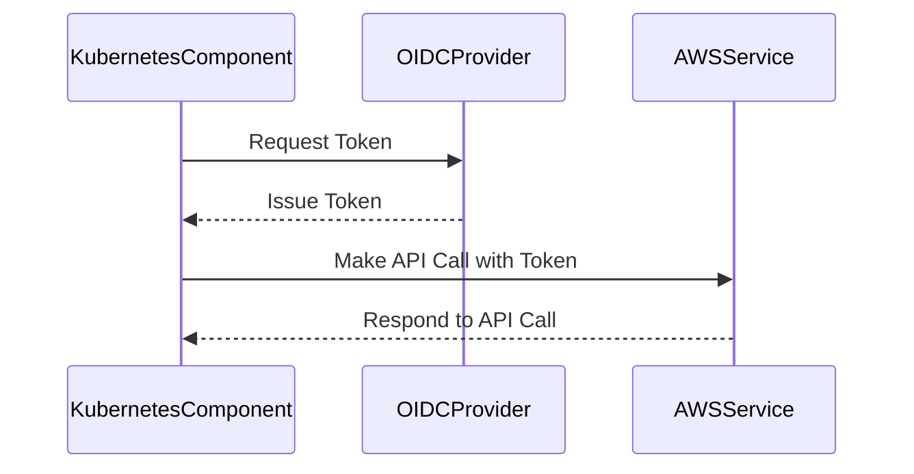

## Understanding EKS and OIDC Providers

### Background Theory

Amazon Elastic Kubernetes Service (EKS) is a managed service that makes it easy to run Kubernetes on AWS without needing to install and operate your own Kubernetes control plane. EKS is designed to help you focus on running your applications on Kubernetes, rather than managing the underlying infrastructure.

One of the key challenges in integrating Kubernetes clusters with AWS services is ensuring that the components within the Kubernetes cluster can securely communicate with AWS services. This is where OpenID Connect (OIDC) providers come into play.

OpenID Connect (OIDC) is an authentication protocol that provides identity layer on top of the OAuth 2.0 framework. It allows clients to verify the identity of the end-user based on the authentication performed by an authorization server, as well as to obtain basic profile information about the end-user in an interoperable and REST-like fashion.

In the context of EKS, an OIDC provider is used to establish trust between the Kubernetes cluster and AWS services. This trust relationship enables Kubernetes components to authenticate and authorize themselves when making API calls to AWS services.

### Why OIDC Providers Matter

Without an OIDC provider, Kubernetes components would be treated as anonymous entities by AWS services. This would prevent them from accessing AWS resources securely. By using an OIDC provider, Kubernetes components can be authenticated and authorized, allowing them to interact with AWS services in a secure manner.

For example, consider the AWS Load Balancer Controller, which is a Kubernetes controller that manages Elastic Load Balancers (ELBs) in AWS. Without an OIDC provider, the Load Balancer Controller would not be able to communicate with the AWS API to create or manage ELBs. However, with an OIDC provider, the Load Balancer Controller can authenticate itself and perform these operations securely.

### How OIDC Providers Work

The OIDC provider in EKS works by creating a trusted relationship between the Kubernetes cluster and AWS services. Here’s a step-by-step breakdown of how this works:

1. **OIDC Provider Configuration**: An OIDC provider is configured in AWS Identity and Access Management (IAM). This provider is associated with the EKS cluster and is responsible for issuing tokens that can be used to authenticate Kubernetes components.

2. **Token Issuance**: When a Kubernetes component needs to access an AWS service, it requests a token from the OIDC provider. This token contains information about the identity of the component, such as its namespace and name.

3. **Token Validation**: The AWS service validates the token using the OIDC provider. If the token is valid, the AWS service trusts the Kubernetes component and allows it to perform the requested operation.

4. **Access Control**: The OIDC provider can also be used to enforce access control policies. For example, you can configure the OIDC provider to allow only certain namespaces or pods to access specific AWS services.

### Real-World Example: AWS Load Balancer Controller

Let's take a closer look at how the AWS Load Balancer Controller uses an OIDC provider to communicate with AWS services.

#### Full HTTP Request and Response

Here is an example of a full HTTP request and response when the Load Balancer Controller communicates with the AWS API:

```http
POST / HTTP/1.1
Host: elasticloadbalancing.us-west-2.amazonaws.com
Content-Type: application/x-amz-json-1.1
Authorization: Bearer <oidc_token>
X-Amz-Target: ElasticLoadBalancingv2.CreateLoadBalancer

{
    "Name": "my-load-balancer",
    "Scheme": "internet-facing",
    "Type": "application",
    "IpAddressType": "ipv4"
}
```

```http
HTTP/1.1 200 OK
Content-Type: application/x-amz-json-1.1
Date: Tue, 20 Mar 2023 12:00:00 GMT
x-amzn-RequestId: abcdefgh-ijkl-mnop-qrst-uvwxyz123456

{
    "LoadBalancers": [
        {
            "LoadBalancerArn": "arn:aws:elasticloadbalancing:us-west-2:123456789012:loadbalancer/app/my-load-balancer/abcdef123456",
            "DNSName": "my-load-balancer-1234567890.us-west-2.elb.amazonaws.com",
            "CanonicalHostedZoneId": "Z2FDTNDATAQYW2",
            "CreatedTime": "2023-03-20T12:00:00Z",
            "LoadBalancerName": "my-load-balancer",
            "Scheme": "internet-facing",
            "Type": "application",
            "IpAddressType": "ipv4"
        }
    ]
}
```

#### Explanation of Headers

- **Authorization**: This header contains the OIDC token issued by the OIDC provider. The token is used to authenticate the Load Balancer Controller.
- **X-Amz-Target**: This header specifies the target API action, in this case `ElasticLoadBalancingv2.CreateLoadBalancer`.
- **Content-Type**: This header specifies the format of the request body, which is `application/x-amz-json-1.1`.

### Mermaid Diagram: OIDC Provider Flow

A mermaid diagram can help visualize the flow of the OIDC provider process:



### Common Pitfalls and How to Prevent Them

#### Pitfall: Insecure Token Handling

One common pitfall is insecure handling of OIDC tokens. If tokens are stored in plaintext or transmitted over unsecured channels, they can be intercepted and used maliciously.

**How to Prevent / Defend**

- **Secure Storage**: Store OIDC tokens securely using encryption. Avoid storing tokens in plaintext files or environment variables.
- **Secure Transmission**: Ensure that tokens are transmitted over secure channels using HTTPS. Avoid transmitting tokens over unencrypted channels.
- **Short-Lived Tokens**: Use short-lived tokens to minimize the window of opportunity for attackers to intercept and use the tokens.

#### Vulnerable Code Example

Here is an example of insecure token handling:

```python
# Vulnerable code
import os

token = os.getenv('OIDC_TOKEN')
headers = {'Authorization': f'Bearer {token}'}
response = requests.post('https://api.example.com', headers=headers)
```

#### Secure Code Example

Here is the corrected secure version:

```python
# Secure code
import os
from cryptography.fernet import Fernet

key = b'your-secret-key'
cipher_suite = Fernet(key)

encrypted_token = os.getenv('ENCRYPTED_OIDC_TOKEN')
decrypted_token = cipher_suite.decrypt(encrypted_token.encode()).decode()
headers = {'Authorization': f'Bearer {decrypted_token}'}
response = requests.post('https://api.example.com', headers=headers)
```

### Recent Real-World Examples

#### CVE-2021-20225: AWS IAM Roles Anywhere

CVE-2021-20225 is a critical vulnerability in AWS IAM Roles Anywhere, which is a feature that allows external workloads to assume IAM roles. This vulnerability could allow unauthorized access to AWS resources if the OIDC provider is misconfigured.

**Impact**: An attacker could potentially gain unauthorized access to AWS resources by exploiting this vulnerability.

**Mitigation**: Ensure that the OIDC provider is properly configured and that only authorized entities can assume IAM roles.

### Hands-On Labs

To practice configuring EKS add-ons and OIDC providers, you can use the following labs:

- **CloudGoat**: A cloud security training platform that includes exercises on configuring EKS and OIDC providers.
- **flaws.cloud**: A cloud security training platform that includes exercises on securing EKS clusters and configuring OIDC providers.

These labs provide a hands-on experience to reinforce the concepts learned in this chapter.

### Conclusion

Understanding how EKS and OIDC providers work together is crucial for securing Kubernetes clusters on AWS. By configuring an OIDC provider, you can ensure that Kubernetes components can securely communicate with AWS services. This chapter covered the background theory, real-world examples, and practical steps to configure and secure EKS add-ons using OIDC providers.

---
<!-- nav -->
[[09-Cluster Autoscaler in Amazon EKS|Cluster Autoscaler in Amazon EKS]] | [[DevSecOps/DevSecOps Bootcamp/06-Container & Kubernetes Security/02-EKS Blueprints/Configure EKS Add ons/00-Overview|Overview]] | [[DevSecOps/DevSecOps Bootcamp/06-Container & Kubernetes Security/02-EKS Blueprints/Configure EKS Add ons/11-Practice Questions & Answers|Practice Questions & Answers]]
