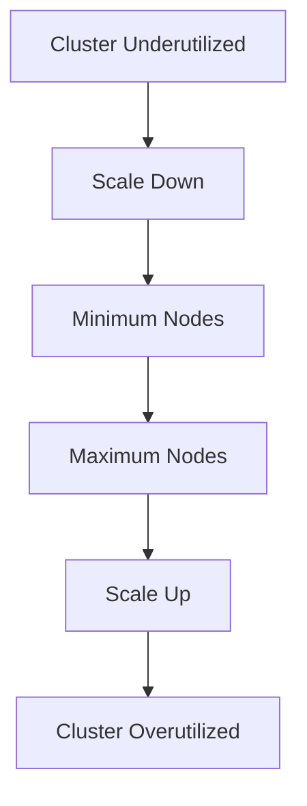

## Introduction to EKS Blueprints and Auto-Scaling

In the context of DevSecOps, managing Kubernetes clusters efficiently is crucial for both performance and cost optimization. Amazon Elastic Kubernetes Service (EKS) provides a managed service for running Kubernetes clusters in the AWS environment. One of the key features of EKS is its ability to handle auto-scaling of worker nodes, which can significantly improve resource utilization and reduce costs.

### What is Auto-Scaling?

Auto-scaling refers to the dynamic adjustment of computing resources based on demand. In the context of EKS, auto-scaling allows the cluster to automatically add or remove worker nodes based on the current workload. This ensures that the cluster can handle varying levels of traffic without manual intervention, leading to better performance and cost efficiency.

### Why Auto-Scaling Matters

Auto-scaling is essential for several reasons:

1. **Cost Efficiency**: By scaling down when the cluster is underutilized, you can avoid paying for idle resources. Conversely, scaling up during peak times ensures that your application remains responsive and available.
   
2. **Performance Optimization**: Auto-scaling helps maintain optimal performance by ensuring that the number of worker nodes matches the current workload. This prevents bottlenecks and ensures smooth operation.

3. **Scalability**: As your application grows, auto-scaling allows you to handle increased load without manual intervention, making it easier to scale out as needed.

### How Auto-Scaling Works in EKS

To enable auto-scaling in EKS, you need to configure the cluster to use an auto-scaling group for worker nodes. This involves setting up the necessary services and configurations to manage the scaling logic.

#### Setting Up Auto-Scaling Boundaries

When configuring auto-scaling, you typically set minimum and maximum boundaries for the number of worker nodes. These boundaries ensure that the cluster maintains a certain level of capacity while also preventing excessive scaling.



For example, you might set the minimum number of nodes to 2 and the maximum to 20. This means that the cluster will automatically scale down to at least 2 nodes and scale up to a maximum of 20 nodes based on demand.

#### Configuring Auto-Scaling in EKS

To configure auto-scaling in EKS, you need to set up an auto-scaling group for the worker nodes. This involves creating an ASG (Auto Scaling Group) and associating it with the EKS cluster.

Here is an example of how to create an ASG using AWS CLI:

```bash
aws autoscaling create-auto-scaling-group \
    --auto-scaling-group-name eks-worker-asg \
    --launch-template LaunchTemplateName=eks-launch-template,Version=1 \
    --min-size 2 \
    --max-size 20 \
    --desired-capacity 4 \
    --vpc-zone-identifier subnet-12345678,subnet-87654321
```

This command creates an ASG named `eks-worker-asg` with a minimum size of 2, a maximum size of 20, and a desired capacity of 4 nodes. The ASG uses a launch template (`eks-launch-template`) to specify the instance type and other configurations.

### Real-World Examples and Case Studies

#### Example: Netflix Auto-Scaling

Netflix is a well-known example of a company that heavily relies on auto-scaling to handle its massive user base. They use a combination of custom scripts and AWS services to dynamically adjust their infrastructure based on demand. This ensures that their streaming service remains highly available and performs well even during peak usage times.

#### Example: AWS EKS Auto-Scaling in Practice

Consider a scenario where a company deploys a microservices-based application on EKS. During off-peak hours, the application runs smoothly with minimal resources. However, during peak hours, the number of requests increases significantly, causing the cluster to scale up to handle the additional load.

Here is an example of how the auto-scaling process might look in practice:

1. **Initial Configuration**:
   - Minimum nodes: 2
   - Maximum nodes: 20
   - Desired capacity: 4

2. **Underutilization**:
   - At night, the cluster is underutilized, and the number of active pods decreases.
   - The auto-scaling group detects this and scales down to 2 nodes.

3. **Peak Usage**:
   - During the day, the number of requests increases, and the cluster needs more resources.
   - The auto-scaling group detects this and scales up to 10 nodes.

### Common Pitfalls and Best Practices

#### Pitfall: Incorrect Scaling Boundaries

One common pitfall is setting incorrect scaling boundaries. If the minimum boundary is too high, you may end up paying for more resources than you need. Conversely, if the maximum boundary is too low, you may not be able to handle sudden spikes in demand.

#### Best Practice: Monitor and Adjust

It is important to monitor the auto-scaling behavior and adjust the boundaries as needed. You can use tools like AWS CloudWatch to monitor the cluster's performance and make data-driven decisions about scaling.

### How to Prevent / Defend

#### Detection

To detect issues with auto-scaling, you can use monitoring tools like AWS CloudWatch. Set up alarms to notify you when the cluster scales beyond expected boundaries or when there are unexpected changes in resource utilization.

#### Prevention

To prevent issues with auto-scaling, follow these best practices:

1. **Set Reasonable Boundaries**: Ensure that the minimum and maximum boundaries are set based on historical data and expected usage patterns.
   
2. **Monitor Performance**: Regularly monitor the cluster's performance and adjust the scaling boundaries as needed.

3. **Use Proper Metrics**: Use appropriate metrics to trigger scaling events. For example, you can use CPU utilization, memory usage, or request rate to determine when to scale.

#### Secure Coding Fixes

Here is an example of how to configure auto-scaling boundaries securely:

**Vulnerable Code**:
```yaml
apiVersion: autoscaling/v2beta2
kind: HorizontalPodAutoscaler
metadata:
  name: my-app-autoscaler
spec:
  scaleTargetRef:
    apiVersion: apps/v1
    kind: Deployment
    name: my-app-deployment
  minReplicas: 1
  maxReplicas: 100
  metrics:
  - type: Resource
    resource:
      name: cpu
      target:
        type: Utilization
        averageUtilization: 50
```

**Secure Code**:
```yaml
apiVersion: autoscaling/v2beta2
kind: HorizontalPodAutoscaler
metadata:
  name: my-app-autoscaler
spec:
  scaleTargetRef:
    apiVersion: apps/v1
    kind: Deployment
    name: my-app-deployment
  minReplicas: 2
  maxReplicas: 20
  metrics:
  - type: Resource
    resource:
      name: cpu
      target:
        type: Utilization
        averageUtilization: 50
```

In the secure version, the minimum and maximum replicas are set to reasonable values based on historical data and expected usage patterns.

### Conclusion

Auto-scaling is a critical feature for managing Kubernetes clusters in EKS. By setting up proper auto-scaling boundaries and monitoring the cluster's performance, you can ensure that your application remains highly available and performs well under varying loads. Additionally, following best practices and securing your configurations can help prevent common pitfalls and ensure a robust and efficient system.

### Hands-On Labs

For hands-on experience with EKS auto-scaling, consider the following labs:

- **CloudGoat**: A series of labs designed to teach cloud security concepts, including auto-scaling in EKS.
- **AWS Official Workshops**: AWS offers various workshops that cover EKS and auto-scaling, providing practical experience with real-world scenarios.
- **Pacu**: A tool for testing and auditing AWS environments, which includes exercises related to EKS and auto-scaling.

These labs provide a comprehensive learning experience and help you master the concepts covered in this chapter.

---
<!-- nav -->
[[DevSecOps/DevSecOps Bootcamp/06-Container & Kubernetes Security/02-EKS Blueprints/Overview of EKS Add ons we install/00-Overview|Overview]] | [[DevSecOps/DevSecOps Bootcamp/06-Container & Kubernetes Security/02-EKS Blueprints/Overview of EKS Add ons we install/02-Introduction to EKS Blueprints and Cluster Operations|Introduction to EKS Blueprints and Cluster Operations]]
