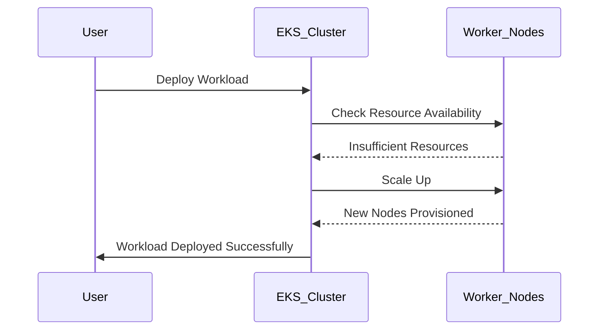

## Introduction to EKS Blueprints and Cluster Operations

In this chapter, we will delve into the installation and configuration of essential services for Amazon Elastic Kubernetes Service (EKS) clusters using EKS Blueprints. These services are crucial for both cluster operations and application deployment. We will explore how to set up these services using Infrastructure as Code (IaC) tools like Terraform, ensuring that the process is efficient and scalable.

### Creating a Feature Branch for EKS Blueprints

Before diving into the specifics of the services, let's first create a new feature branch in our Git repository to manage the changes related to EKS Blueprints. This ensures that our codebase remains organized and that we can easily track the changes made during this process.

```bash
# Navigate to your repository
cd path/to/repository

# Create a new feature branch
git checkout -b EKS-Blueprints

# Verify the creation of the branch
git branch
```

### Understanding the Cluster Configuration

The main configuration for an EKS cluster includes defining a managed node group, which specifies the minimum, maximum, and desired sizes of the worker nodes. This setup is critical for enabling automatic scaling of the cluster based on workload demands.

#### Managed Node Group Configuration

A managed node group in EKS allows you to define a pool of EC2 instances that serve as worker nodes for your Kubernetes cluster. The configuration parameters include:

- **Minimum Size**: The minimum number of worker nodes that should always be available in the cluster.
- **Maximum Size**: The maximum number of worker nodes that can be provisioned in the cluster.
- **Desired Size**: The initial number of worker nodes that the cluster will start with.

This configuration enables the cluster to automatically scale up or down based on the current workload, ensuring optimal resource utilization.

```terraform
resource "aws_eks_node_group" "example" {
  cluster_name    = aws_eks_cluster.example.name
  node_group_name = "example"
  node_role_arn   = aws_iam_role.node.arn
  subnet_ids      = [aws_subnet.example.id]

  scaling_config {
    desired_size = 3
    max_size     = 6
    min_size     = 1
  }

  tags = {
    Environment = "Production"
  }
}
```

### Auto-scaling Mechanism

When the cluster is initially created, it starts with the desired number of worker nodes. As more services and workloads are deployed, the cluster may become overloaded. In such scenarios, the auto-scaling mechanism kicks in, automatically provisioning additional worker nodes to handle the increased load.

#### How Auto-scaling Works

Auto-scaling in EKS is managed through the `scaling_config` block in the Terraform configuration. When the cluster detects that the current number of worker nodes is insufficient to handle the workload, it triggers the scaling process to add more nodes until the maximum size is reached.



### Benefits of Automated Operations

By automating the scaling process, Kubernetes administrators and DevOps engineers can focus on higher-level tasks rather than constantly monitoring the cluster's resource usage. This leads to more efficient management and reduces the risk of human error.

#### Monitoring and Alerting

To ensure that the auto-scaling mechanism is functioning correctly, it is essential to set up monitoring and alerting systems. Tools like Prometheus and Grafana can be used to monitor the cluster's resource usage and trigger alerts when certain thresholds are exceeded.

```yaml
# Example Prometheus configuration for monitoring EKS cluster
scrape_configs:
  - job_name: 'eks-cluster'
    static_configs:
      - targets: ['<cluster-endpoint>:<port>']
```

### Recent Real-World Examples

Recent breaches and vulnerabilities in Kubernetes clusters highlight the importance of proper configuration and monitoring. For instance, the CVE-2021-25741, which affected Kubernetes versions prior to 1.21.1, allowed unauthorized access to the API server due to improper RBAC configurations.

#### Secure Configuration Practices

To prevent such vulnerabilities, it is crucial to follow secure configuration practices. This includes:

- **RBAC Configuration**: Ensure that Role-Based Access Control (RBAC) is properly configured to restrict access to sensitive resources.
- **Network Policies**: Implement network policies to control traffic between pods and external networks.
- **Node Security**: Harden the security of worker nodes by disabling unnecessary services and applying strict security policies.

```yaml
# Example RBAC configuration
apiVersion: rbac.authorization.k8s.io/v1
kind: Role
metadata:
  namespace: default
  name: pod-reader
rules:
- apiGroups: [""] # "" indicates the core API group
  resources: ["pods"]
  verbs: ["get", "watch", "list"]
---
apiVersion: rbac.authorization.k8s.io/v1
kind: RoleBinding
metadata:
  name: read-pods
  namespace: default
subjects:
- kind: Group
  name: manager
  apiGroup: rbac.authorization.k8s.io
roleRef:
  kind: Role
  name: pod-reader
  apiGroup: rbac.authorization.k8s.io
```

### Detection and Prevention Strategies

To detect and prevent potential issues, it is important to implement continuous monitoring and regular audits of the cluster configuration. Tools like kube-bench can be used to perform compliance checks against the CIS Kubernetes Benchmark.

#### Secure Coding Practices

Secure coding practices involve writing robust and secure code that adheres to best practices. This includes:

- **Input Validation**: Validate all inputs to prevent injection attacks.
- **Error Handling**: Properly handle errors to avoid exposing sensitive information.
- **Least Privilege Principle**: Grant the minimum necessary permissions to users and processes.

```python
# Example of secure input validation in Python
def validate_input(input_str):
    if not isinstance(input_str, str):
        raise ValueError("Input must be a string")
    if len(input_str) > 100:
        raise ValueError("Input too long")
    return input_str

# Usage
try:
    user_input = validate_input("example input")
except ValueError as e:
    print(f"Validation failed: {e}")
```

### Conclusion

In this chapter, we have explored the installation and configuration of essential services for EKS clusters using EKS Blueprints. We have covered the creation of a feature branch, the configuration of a managed node group, and the auto-scaling mechanism. Additionally, we have discussed the benefits of automated operations, recent real-world examples, and secure configuration practices. By following these guidelines, you can ensure that your EKS cluster is secure, efficient, and scalable.

### Practice Labs

For hands-on experience with EKS Blueprints and cluster operations, consider the following practice labs:

- **Kubernetes Goat**: A hands-on lab for learning Kubernetes security.
- **OWASP WrongSecrets**: A series of challenges to learn about secure coding practices.
- **Pacu**: A collection of AWS security tools for penetration testing.

These labs provide practical experience in setting up and securing EKS clusters, helping you master the concepts discussed in this chapter.

---
<!-- nav -->
[[DevSecOps/DevSecOps Bootcamp/06-Container & Kubernetes Security/02-EKS Blueprints/Overview of EKS Add ons we install/01-Introduction to EKS Blueprints and Auto-Scaling|Introduction to EKS Blueprints and Auto-Scaling]] | [[DevSecOps/DevSecOps Bootcamp/06-Container & Kubernetes Security/02-EKS Blueprints/Overview of EKS Add ons we install/00-Overview|Overview]] | [[DevSecOps/DevSecOps Bootcamp/06-Container & Kubernetes Security/02-EKS Blueprints/Overview of EKS Add ons we install/03-Kubernetes Metric Server Overview|Kubernetes Metric Server Overview]]
