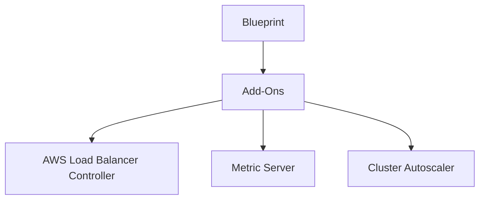

## Introduction to EKS Blueprints and Add-Ons

EKS (Elastic Kubernetes Service) Blueprints are pre-configured templates provided by AWS that help users set up and manage their Kubernetes clusters more efficiently. These blueprints come with a variety of add-ons that can be easily integrated into your EKS cluster. The add-ons are designed to provide additional functionality and improve the overall management and performance of your Kubernetes environment.

### What Are EKS Blueprints?

EKS Blueprints are essentially a collection of predefined configurations and settings that simplify the process of setting up an EKS cluster. They include various add-ons that can be selected during the cluster creation process. These add-ons are pre-packaged solutions that address common requirements such as load balancing, monitoring, and scaling.

### Why Use EKS Blueprints?

Using EKS Blueprints offers several benefits:

- **Ease of Setup**: Simplifies the initial setup of your EKS cluster by providing pre-configured settings.
- **Consistency**: Ensures consistency across different environments, reducing the likelihood of configuration errors.
- **Time-Saving**: Reduces the time required to configure and deploy common components, allowing you to focus on application development.

### Key Components of EKS Blueprints

#### Add-Ons

Add-ons are additional services that can be integrated into your EKS cluster. Some of the commonly available add-ons include:

- **AWS Load Balancer Controller**: Manages load balancing for your applications.
- **Metric Server**: Provides resource usage metrics for your cluster.
- **Cluster Autoscaler**: Automatically scales the number of nodes in your cluster based on demand.

### Exploring the Add-Ons Folder

When you create an EKS cluster using a blueprint, you can select from a list of available add-ons. These add-ons are stored in a specific folder within the blueprint configuration. Let’s explore the structure of this folder.



### Understanding the Add-Ons

Each add-on in the folder represents a specific service that can be integrated into your EKS cluster. Let’s delve into the details of each add-on:

#### AWS Load Balancer Controller

The AWS Load Balancer Controller is responsible for managing load balancing for your applications. It integrates with AWS Elastic Load Balancing (ELB) to distribute traffic across your pods.

##### Chart Definition

The chart definition for the AWS Load Balancer Controller is stored in a `chart.yaml` file. This file contains metadata about the chart, including its name, version, and dependencies.

```yaml
# chart.yaml
name: aws-load-balancer-controller
version: 1.2.3
description: AWS Load Balancer Controller for Kubernetes
dependencies:
  - name: cert-manager
    version: 1.5.4
```

##### Values Configuration

The `values.yaml` file contains the configuration settings for the add-on. These settings can be customized to meet your specific requirements.

```yaml
# values.yaml
serviceAccount:
  create: true
  name: aws-load-balancer-controller
resources:
  requests:
    cpu: 100m
    memory: 128Mi
  limits:
    cpu: 200m
    memory: 256Mi
```

#### Metric Server

The Metric Server provides resource usage metrics for your cluster. It collects data from the nodes and makes it available to other components like the Kubernetes Dashboard.

##### Chart Definition

The `chart.yaml` file for the Metric Server contains metadata about the chart.

```yaml
# chart.yaml
name: metric-server
version: 0.5.0
description: Metric Server for Kubernetes
```

##### Values Configuration

The `values.yaml` file contains the configuration settings for the Metric Server.

```yaml
# values.yaml
image:
  repository: k8s.gcr.io/metrics-server/metrics-server
  tag: v0.5.0
  pullPolicy: IfNotPresent
resources:
  requests:
    cpu: 100m
    memory: 128Mi
  limits:
    cpu: 200m
    memory: 256Mi
```

#### Cluster Autoscaler

The Cluster Autoscaler automatically scales the number of nodes in your cluster based on demand. It ensures that your cluster has enough resources to handle the workload without wasting resources.

##### Chart Definition

The `chart.yaml` file for the Cluster Autoscaler contains metadata about the chart.

```yaml
# chart.yaml
name: cluster-autoscaler
version: 1.21.0
description: Cluster Autoscaler for Kubernetes
```

##### Values Configuration

The `values.yaml` file contains the configuration settings for the Cluster Autoscaler.

```yaml
# values.yaml
autoscaling:
  minReplicas: 1
  maxReplicas: 10
  scaleDownDelayAfterAdd: 10m
  scaleDownDelayAfterDelete: 10m
  scaleDownDelayAfterFailure: 5m
  scaleDownUnneededTime: 10m
  scaleDownUtilizationThreshold: 0.5
  scaleUpThreshold: 0.8
  scaleDownThreshold: 0.2
```

### How Add-Ons Work Behind the Scenes

When you specify an add-on to be installed in your cluster, certain configurations need to be applied in the background. These configurations are defined in the chart and values files associated with each add-on.

#### Chart References

The chart files reference the actual Helm charts that get deployed in the cluster. For example, the Cluster Autoscaler chart references the official Kubernetes Cluster Autoscaler Helm chart.

```yaml
# chart.yaml
name: cluster-autoscaler
version: 1.21.0
sources:
  - https://charts.helm.sh/stable
```

#### Value Overrides

The values files allow you to override default settings for the add-ons. This customization ensures that the add-ons work optimally in your specific environment.

### Real-World Examples and Case Studies

Let’s look at some real-world examples where these add-ons have been used effectively.

#### Example: AWS Load Balancer Controller

In a recent deployment, a company used the AWS Load Balancer Controller to manage load balancing for their microservices-based application. By integrating this add-on, they were able to distribute traffic evenly across their pods, ensuring high availability and performance.

#### Example: Metric Server

Another company utilized the Metric Server to monitor resource usage in their Kubernetes cluster. This helped them identify and resolve issues related to resource exhaustion, improving the overall stability of their environment.

#### Example: Cluster Autoscaler

A startup leveraged the Cluster Autoscaler to dynamically scale their node pool based on demand. This allowed them to handle sudden spikes in traffic without manually adjusting the number of nodes, leading to significant cost savings and improved scalability.

### Pitfalls and Common Mistakes

While using EKS Blueprints and add-ons can greatly simplify the setup and management of your Kubernetes cluster, there are some common pitfalls to be aware of:

- **Over-customization**: Avoid over-customizing the add-ons, as this can lead to configuration drift and make it harder to maintain consistency across different environments.
- **Security Risks**: Ensure that the add-ons are properly configured and secured. For example, the AWS Load Balancer Controller should be configured to use TLS for secure communication.
- **Resource Management**: Properly configure the resources allocated to the add-ons to avoid performance issues. Over-provisioning can lead to wasted resources, while under-provisioning can cause performance bottlenecks.

### How to Prevent / Defend

To ensure the security and reliability of your EKS cluster, follow these best practices:

#### Secure Configuration

Ensure that the add-ons are configured securely. For example, the AWS Load Balancer Controller should be configured to use TLS for secure communication.

```yaml
# values.yaml
serviceAccount:
  create: true
  name: aws-load-balancer-controller
resources:
  requests:
    cpu: 100m
    memory: 128Mi
  limits:
    cpu: 200m
    memory: 256Mi
tls:
  enabled: true
```

#### Monitoring and Logging

Implement monitoring and logging to track the performance and health of your add-ons. This will help you quickly identify and resolve any issues.

```yaml
# values.yaml
monitoring:
  enabled: true
logging:
  enabled: true
```

#### Regular Audits

Regularly audit the configurations of your add-ons to ensure they remain secure and optimized. This includes reviewing the values files and chart definitions to ensure they align with your current requirements.

### Conclusion

EKS Blueprints and add-ons provide a powerful and efficient way to set up and manage your Kubernetes cluster. By leveraging these pre-configured templates and services, you can simplify the setup process, ensure consistency, and improve the overall performance and security of your environment.

### Practice Labs

For hands-on experience with EKS Blueprints and add-ons, consider the following practice labs:

- **PortSwigger Web Security Academy**: Focuses on web application security but can provide valuable insights into securing your Kubernetes environment.
- **OWASP Juice Shop**: A deliberately insecure web application for security training. While not directly related to EKS, it can help you understand common security vulnerabilities.
- **Kubernetes Goat**: A hands-on lab specifically designed for learning Kubernetes security and best practices.

By combining theoretical knowledge with practical experience, you can become proficient in using EKS Blueprints and add-ons to manage your Kubernetes cluster effectively.

---
<!-- nav -->
[[DevSecOps/DevSecOps Bootcamp/06-Container & Kubernetes Security/02-EKS Blueprints/Troubleshooting and Tuning Autoscaler/00-Overview|Overview]] | [[02-Introduction to EKS Blueprints and Cluster Autoscaler Part 1|Introduction to EKS Blueprints and Cluster Autoscaler Part 1]]
