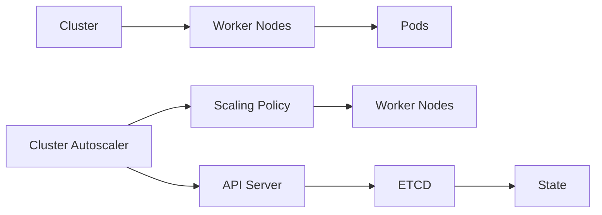

## Introduction to EKS Blueprints and Cluster Autoscaler

EKS (Amazon Elastic Kubernetes Service) Blueprints provide a framework for deploying and managing Kubernetes clusters on AWS. One of the key components of an EKS cluster is the **Cluster Autoscaler**, which dynamically scales the number of worker nodes based on the demand for resources. This ensures optimal utilization of resources and cost efficiency.

### Key Concepts

- **Remote Storage**: All storage should be remote to ensure high availability and scalability.
- **Terraform Configuration**: Terraform is used to manage infrastructure as code. It allows you to define and provision resources in a consistent and repeatable manner.
- **Add-ons**: Add-ons are additional services or components that enhance the functionality of the Kubernetes cluster. Examples include the AWS Load Balancer Controller, Metric Server, and Cluster Autoscaler.

### Enabling and Configuring Add-ons

To enable and configure add-ons in EKS Blueprints, you need to understand the following concepts:

- **Enable Flag**: A boolean flag (`true` or `false`) that determines whether an add-on is enabled.
- **Add-on Name**: The name of the add-on, such as `aws-load-balancer-controller`, `metrics-server`, or `cluster-autoscaler`.
- **Chart Values**: Configuration settings for the add-on, defined as key-value pairs.

### Setting Chart Values

The process of setting chart values is common across all add-ons. You use the `set` command to define key-value pairs, which are then applied on top of the default values.

#### Example: Configuring Cluster Autoscaler

Let's walk through an example of configuring the Cluster Autoscaler using Terraform.

```hcl
resource "aws_eks_cluster" "example" {
  name     = "example-cluster"
  role_arn = aws_iam_role.example.arn

  vpc_config {
    subnet_ids = [aws_subnet.example.id]
  }
}

resource "helm_release" "cluster_autoscaler" {
  name       = "cluster-autoscaler"
  repository = "https://charts.helm.sh/stable"
  chart      = "cluster-autoscaler"

  set {
    name  = "autoscaling.enabled"
    value = "true"
  }

  set {
    name  = "autoscaling.minReplicas"
    value = "2"
  }

  set {
    name  = "autoscaling.maxReplicas"
    value = "5"
  }

  depends_on = [aws_eks_cluster.example]
}
```

### Explanation

- **`aws_eks_cluster` Resource**: Defines the EKS cluster.
- **`helm_release` Resource**: Manages the Helm release for the Cluster Autoscaler.
- **`set` Block**: Defines key-value pairs for the chart values.

### Diagram: Cluster Autoscaler Architecture



### Remote Storage

Remote storage is crucial for ensuring high availability and scalability. In the context of EKS, this typically involves using Amazon EBS (Elastic Block Store) or Amazon EFS (Elastic File System).

#### Example: Configuring Remote Storage

```hcl
resource "aws_ebs_volume" "example" {
  availability_zone = "us-west-2a"
  size              = 20
  type              = "gp2"
}

resource "aws_efs_file_system" "example" {
  creation_token = "example-token"
}
```

### Enabling and Disabling Add-ons

To enable or disable an add-on, you modify the `enable` flag in the Terraform configuration.

#### Example: Disabling Metrics Server

```hcl
resource "helm_release" "metrics_server" {
  name       = "metrics-server"
  repository = "https://charts.helm.sh/stable"
  chart      = "metrics-server"

  set {
    name  = "enabled"
    value = "false"
  }
}
```

### Common Pitfalls

- **Incorrect Configuration**: Ensure that the chart values are correctly set. Incorrect values can lead to unexpected behavior.
- **Resource Constraints**: Ensure that the cluster has sufficient resources to handle scaling operations.
- **Network Issues**: Network connectivity issues can affect the performance of the Cluster Autoscaler.

### How to Prevent / Defend

#### Detection

- **Monitoring**: Use tools like Prometheus and Grafana to monitor the health and performance of the Cluster Autoscaler.
- **Logging**: Enable detailed logging to track scaling events and identify potential issues.

#### Prevention

- **Secure Configuration**: Follow best practices for securing the Cluster Autoscaler configuration.
- **Regular Audits**: Conduct regular audits to ensure compliance with security policies.

#### Secure Coding Fixes

##### Vulnerable Code

```hcl
resource "helm_release" "cluster_autoscaler" {
  name       = "cluster-autoscaler"
  repository = "https://charts.helm.sh/stable"
  chart      = "cluster-autoscaler"

  set {
    name  = "autoscaling.enabled"
    value = "true"
  }

  set {
    name  = "autoscaling.minReplicas"
    value = "1"
  }

  set {
    name  = "autoscaling.maxReplicas"
    value = "10"
  }
}
```

##### Fixed Code

```hcl
resource "helm_release" "cluster_autoscaler" {
  name       = "cluster-autoscaler"
  repository = "https://charts.helm.sh/stable"
  chart      = "cluster-autoscaler"

  set {
    name  = "autoscaling.enabled"
    value = "true"
  }

  set {
    name  = "autoscaling.minReplicas"
    value = "2"
  }

  set {
    name  = "autoscaling.maxReplicas"
    value = "5"
  }
}
```

### Real-World Examples

#### Recent CVEs/Breaches

- **CVE-2021-25741**: A vulnerability in the Kubernetes API server allowed unauthorized access to sensitive information. This highlights the importance of securing the API server and ensuring proper authentication and authorization mechanisms are in place.

#### Complete Example: Full HTTP Request and Response

```http
POST /api/v1/namespaces/default/pods HTTP/1.1
Host: localhost:8080
Content-Type: application/json
Authorization: Bearer <token>

{
  "apiVersion": "v1",
  "kind": "Pod",
  "metadata": {
    "name": "example-pod"
  },
  "spec": {
    "containers": [
      {
        "name": "example-container",
        "image": "nginx:latest"
      }
    ]
  }
}
```

```http
HTTP/1.1 201 Created
Date: Tue, 01 Mar 2022 12:00:00 GMT
Content-Type: application/json
Content-Length: 1234

{
  "kind": "Pod",
  "apiVersion": "v1",
  "metadata": {
    "name": "example-pod",
    "namespace": "default",
    "selfLink": "/api/v1/namespaces/default/pods/example-pod",
    "uid": "abcd1234-abcd-1234-abcd-1234abcd1234",
    "resourceVersion": "123456789",
    "creationTimestamp": "2022-03-01T12:00:00Z"
  },
  "spec": {
    "containers": [
      {
        "name": "example-container",
        "image": "nginx:latest"
      }
    ]
  },
  "status": {
    "phase": "Pending",
    "conditions": [
      {
        "type": "Initialized",
        "status": "True",
        "lastProbeTime": null,
        "lastTransitionTime": "2022-03-01T12:00:00Z"
      }
    ],
    "containerStatuses": [
      {
        "name": "example-container",
        "state": {
          "waiting": {
            "reason": "ContainerCreating"
          }
        },
        "lastState": {},
        "ready": false,
        "restartCount": 0,
        "image": "nginx:latest",
        "imageID": "",
        "containerID": ""
      }
    ],
    "qosClass": "Guaranteed"
  }
}
```

### Hands-On Labs

For hands-on practice, consider the following labs:

- **PortSwigger Web Security Academy**: Focuses on web application security.
- **OWASP Juice Shop**: An intentionally insecure web application for learning security concepts.
- **DVWA (Damn Vulnerable Web Application)**: Another intentionally insecure web application for learning security.
- **WebGoat**: A deliberately insecure Java web application maintained by OWASP.
- **CloudGoat**: A series of labs designed to help you learn about cloud security on AWS.
- **flaws.cloud**: A collection of labs for practicing cloud security on AWS.
- **flaws2.cloud**: Another collection of labs for practicing cloud security on AWS.
- **AWS Official Workshops/Well-Architected Labs**: Official AWS resources for learning and practicing cloud security.
- **Pacu**: A Python-based tool for testing AWS security.
- **Kubernetes Goat**: A deliberately insecure Kubernetes environment for learning security concepts.
- **OWASP WrongSecrets**: A series of challenges for learning about secrets management.
- **kube-hunter**: A tool for discovering and exploiting misconfigurations in Kubernetes clusters.

By following these guidelines and examples, you can effectively troubleshoot and tune the Cluster Autoscaler in your EKS cluster, ensuring optimal performance and security.

---
<!-- nav -->
[[DevSecOps/DevSecOps Bootcamp/06-Container & Kubernetes Security/02-EKS Blueprints/Troubleshooting and Tuning Autoscaler/01-Introduction to EKS Blueprints and Add-Ons|Introduction to EKS Blueprints and Add-Ons]] | [[DevSecOps/DevSecOps Bootcamp/06-Container & Kubernetes Security/02-EKS Blueprints/Troubleshooting and Tuning Autoscaler/00-Overview|Overview]] | [[03-Introduction to EKS Blueprints and Cluster Autoscaler|Introduction to EKS Blueprints and Cluster Autoscaler]]
