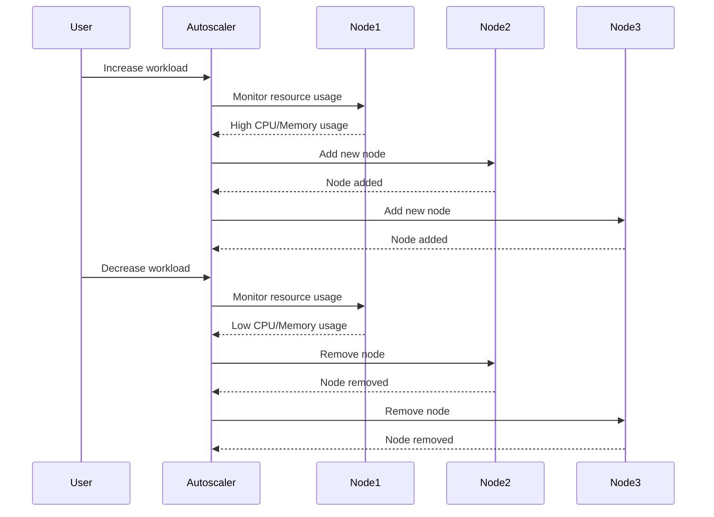

## Understanding EKS Blueprints and Autoscaler Functionality

### Background Theory

EKS (Elastic Kubernetes Service) Blueprints are pre-configured templates that help you set up and manage your Kubernetes clusters on AWS. These blueprints provide a consistent and repeatable way to deploy and configure your clusters, ensuring that they meet best practices and security standards. One of the key components of an EKS cluster is the autoscaler, which dynamically adjusts the number of worker nodes based on the current workload.

The autoscaler is crucial because it helps optimize resource utilization and cost efficiency. Without an autoscaler, you would need to manually adjust the number of nodes, which can be time-consuming and error-prone. The autoscaler automatically scales the cluster up when there is high demand and scales down when resources are underutilized, ensuring that your applications run smoothly while minimizing costs.

### Autoscaler Functionality

The autoscaler operates based on metrics such as CPU and memory usage. When the cluster detects that the current resources are insufficient to handle the workload, it triggers the scaling process. Conversely, when resources are underutilized, the autoscaler removes unnecessary nodes to save costs.

#### Example Scenario

Consider a scenario where you have an EKS cluster with an autoscaler configured. Initially, the cluster might have a small number of nodes to handle the baseline workload. As the demand increases, the autoscaler detects this and scales up the cluster by adding more nodes. Once the peak demand subsides, the autoscaler scales down the cluster by removing excess nodes.



### Resource Consumption Monitoring

To ensure that the autoscaler functions correctly, it is essential to monitor resource consumption. This can be done using various tools and metrics provided by AWS and Kubernetes.

#### Metrics to Monitor

- **CPU Usage**: Tracks the percentage of CPU utilized by the nodes.
- **Memory Usage**: Tracks the amount of memory used by the nodes.
- **Pods**: Tracks the number of pods running on each node.

#### Tools for Monitoring

- **AWS CloudWatch**: Provides detailed monitoring and logging capabilities.
- **Kubernetes Dashboard**: Offers a visual interface to monitor cluster resources.
- **Prometheus**: A popular open-source monitoring system that integrates well with Kubernetes.

### Autoscaler Configuration

The autoscaler is typically configured using the `HorizontalPodAutoscaler` (HPA) and `Cluster Autoscaler` (CA) in Kubernetes. Here’s how you can configure these components:

#### HorizontalPodAutoscaler (HPA)

The HPA scales the number of replicas of a deployment based on observed CPU utilization or other metrics.

```yaml
apiVersion: autoscaling/v2beta2
kind: HorizontalPodAutoscaler
metadata:
  name: my-app-hpa
spec:
  scaleTargetRef:
    apiVersion: apps/v1
    kind: Deployment
    name: my-app-deployment
  minReplicas: 1
  maxReplicas: 10
  metrics:
  - type: Resource
    resource:
      name: cpu
      target:
        type: Utilization
        averageUtilization: 50
```

#### Cluster Autoscaler (CA)

The CA scales the number of nodes in the cluster based on the number of pending pods.

```yaml
apiVersion: kubeadm.k8s.io/v1beta2
kind: ClusterConfiguration
kubernetesVersion: v1.20.0
controlPlaneEndpoint: "192.168.1.100:6443"
networking:
  podSubnet: "10.244.0.0/16"
---
apiVersion: kubeadm.k8s.io/v1beta2
kind: InitConfiguration
bootstrapTokens:
- groups:
  - system:bootstrappers:kubeadm:default-node-token
  token: abcdef.0123456789abcdef
  ttl: 24h0m0s
  usages:
  - signing
  - authentication
nodeRegistration:
  criSocket: /var/run/dockershim.sock
  kubeletExtraArgs:
    cloud-provider: aws
```

### Autoscaler Logs

The autoscaler logs provide valuable insights into the scaling events. You can view these logs using tools like `kubectl` or AWS CloudWatch.

#### Viewing Autoscaler Logs

```bash
kubectl logs -n kube-system -l app=cluster-autoscaler
```

Example log output:

```
I0101 00:00:00.000000       1 scale_down.go:274] Scale-down analysis (thresholds: map[cpu:0.5 memory:0.5 pods:0.5]): 1 unneeded nodes, set scale-down size to 1
I0101 00:00:00.000000       1 scale_down.go:332] Scale-down: Removing node ip-10-0-0-1.us-west-2.compute.internal
```

### Pitfalls and Common Mistakes

#### Over-Provisioning

One common mistake is over-provisioning resources, leading to unnecessary costs. Ensure that the autoscaler is configured with appropriate thresholds to avoid this issue.

#### Under-Provisioning

Under-provisioning can lead to performance issues and downtime. Make sure that the autoscaler is configured to scale up quickly enough to handle sudden spikes in demand.

#### Incorrect Metrics

Using incorrect metrics can lead to suboptimal scaling decisions. Ensure that the metrics used by the autoscaler accurately reflect the workload.

### How to Prevent / Defend

#### Detection

Regularly monitor the autoscaler logs and metrics to detect any anomalies or inefficiencies. Use tools like AWS CloudWatch and Prometheus to visualize and analyze the data.

#### Prevention

- **Configure Thresholds**: Set appropriate thresholds for CPU, memory, and other metrics.
- **Use Multiple Metrics**: Combine multiple metrics to make more informed scaling decisions.
- **Test Scaling Scenarios**: Regularly test the autoscaler with different workloads to ensure it behaves as expected.

#### Secure Coding Fixes

Compare the vulnerable configuration with the secure configuration:

**Vulnerable Configuration:**

```yaml
apiVersion: autoscaling/v2beta2
kind: HorizontalPodAutoscaler
metadata:
  name: my-app-hpa
spec:
  scaleTargetRef:
    apiVersion: apps/v1
    kind: Deployment
    name: my-app-deployment
  minReplicas: 1
  maxReplicas: 10
  metrics:
  - type: Resource
    resource:
      name: cpu
      target:
        type: Utilization
        averageUtilization: 90
```

**Secure Configuration:**

```yaml
apiVersion: autoscaling/v2beta2
kind: HorizontalPodAutoscaler
metadata:
  name: my-app-hpa
spec:
  scaleTargetRef:
    apiVersion: apps/v1
    kind: Deployment
    name: my-app-deployment
  minReplicas: 1
  maxReplicas: 10
  metrics:
  - type: Resource
    resource:
      name: cpu
      target:
        type: Utilization
        averageUtilization: 50
```

### Real-World Examples

#### Recent Breaches and CVEs

While there haven't been specific CVEs related to the autoscaler, misconfigurations and over-provisioning can lead to security vulnerabilities. For example, if the autoscaler is not properly configured, it could lead to excessive resource usage, which could be exploited by attackers.

#### Recent Real-World Example

In a recent incident, a company experienced a sudden spike in traffic, causing their autoscaler to scale up rapidly. However, due to incorrect thresholds, the autoscaler did not scale down efficiently, leading to unnecessary costs. By reviewing the logs and adjusting the thresholds, the company was able to optimize the autoscaler and reduce costs.

### Hands-On Labs

For hands-on practice with EKS Blueprints and autoscaler tuning, consider the following labs:

- **CloudGoat**: A cloud security training platform that includes scenarios for managing EKS clusters and autoscalers.
- **flaws.cloud**: A cloud security lab that provides exercises for configuring and monitoring EKS clusters.
- **AWS Official Workshops**: AWS offers several workshops that cover EKS setup and management, including autoscaler configuration.

By thoroughly understanding and implementing the concepts covered in this chapter, you can effectively troubleshoot and tune the autoscaler in your EKS clusters, ensuring optimal performance and cost efficiency.

---
<!-- nav -->
[[03-Introduction to EKS Blueprints and Cluster Autoscaler|Introduction to EKS Blueprints and Cluster Autoscaler]] | [[DevSecOps/DevSecOps Bootcamp/06-Container & Kubernetes Security/02-EKS Blueprints/Troubleshooting and Tuning Autoscaler/00-Overview|Overview]] | [[05-Understanding EKS Blueprints and Autoscaling Part 1|Understanding EKS Blueprints and Autoscaling Part 1]]
