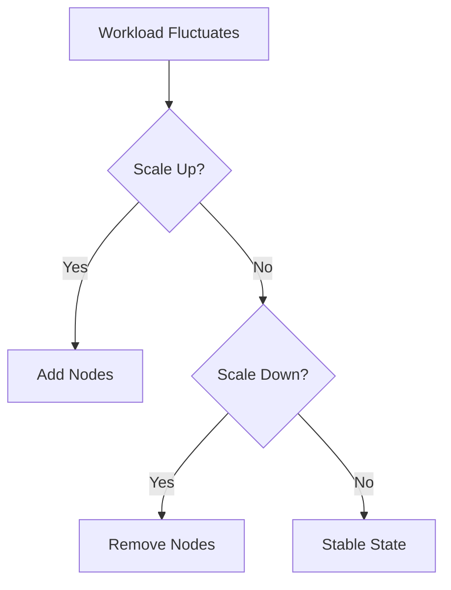
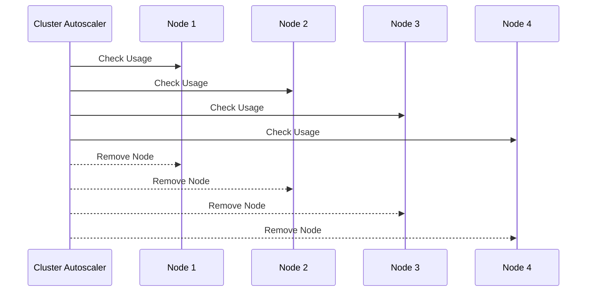

## Understanding EKS Blueprints and Autoscaling

### Background Theory

Amazon Elastic Kubernetes Service (EKS) is a managed service that makes it easy to run Kubernetes on AWS without needing to stand up or maintain your own Kubernetes control plane. EKS Blueprints are pre-configured templates that help you quickly deploy and manage EKS clusters with specific configurations.

Autoscaling is a critical feature in Kubernetes that allows the cluster to automatically adjust the number of nodes based on the workload. This ensures optimal resource utilization and cost efficiency. However, configuring autoscaling correctly is crucial to avoid issues such as timing problems and unnecessary resource consumption.

### Configuration Options for Autoscaling

#### Scale Down Timing Issue

One of the key configuration options for the Kubernetes Horizontal Pod Autoscaler (HPA) and Cluster Autoscaler (CA) is the `scale-down-unneeded-time` parameter. This parameter specifies the duration after which an unused node is considered for scaling down.

```yaml
# Example configuration snippet for Cluster Autoscaler
apiVersion: autoscaling/v1
kind: HorizontalPodAutoscaler
metadata:
  name: my-autoscaler
spec:
  scaleTargetRef:
    apiVersion: apps/v1
    kind: Deployment
    name: my-deployment
  minReplicas: 1
  maxReplicas: 10
  scaleDown:
    unneededTime: 1m
```

In the provided example, the `unneededTime` is set to 1 minute. This means that if a node remains unused for 1 minute, it will be considered for scaling down. This is particularly useful in scenarios where the workload fluctuates rapidly, and you want to ensure that resources are freed up quickly.

**Why This Matters:**
- **Cost Efficiency:** Reducing the time to scale down helps in minimizing the idle resources, thereby saving costs.
- **Resource Utilization:** Ensures that the cluster is always at an optimal level of resource usage, avoiding wastage.

**Real-World Example:**
Consider a scenario where a company deploys a microservices architecture on EKS. During off-peak hours, the workload significantly reduces. By setting the `unneededTime` to a lower value, the company can ensure that the nodes are scaled down quickly, reducing the overall compute costs.

### Skipping Nodes with System Pods

Another important configuration option is the ability to skip nodes that are running system pods. This is controlled by the `skipNodesWithSystemPods` parameter.

```yaml
# Example configuration snippet for Cluster Autoscaler
apiVersion: autoscaling/v1
kind: HorizontalPodAutoscaler
metadata:
  name: my-autoscaler
spec:
  scaleTargetRef:
    apiVersion: apps/v1
    kind: Deployment
    name: my-deployment
  minReplicas: 1
  maxReplicas: 10
  scaleDown:
    unneededTime: 1m
  skipNodesWithSystemPods: false
```

By default, this parameter is set to `true`, meaning that nodes running system pods will not be removed during scaling down. However, in certain scenarios, you might want to override this behavior.

**Why This Matters:**
- **Cluster Stability:** System pods are essential for the functioning of the cluster. Removing these pods can lead to instability.
- **Flexibility:** In some cases, you might want to remove nodes even if they are running system pods, especially if the system pods can be redeployed elsewhere.

**Real-World Example:**
Imagine a scenario where a company has a large EKS cluster with multiple nodes running system pods. During a maintenance window, the company decides to scale down the cluster aggressively. By setting `skipNodesWithSystemPods` to `false`, the company can ensure that all non-essential nodes are removed, even if they are running system pods.

### Skipping Nodes with Local Storage

The `skipNodesWithLocalStorage` parameter controls whether nodes with local storage should be skipped during scaling down.

```yaml
# Example configuration snippet for Cluster Autoscaler
apiVersion: autoscaling/v1
kind: HorizontalPodAutoscaler
metadata:
  name: my-autoscaler
spec:
  scaleTargetRef:
    apiVersion: apps/v1
    kind: Deployment
    name: my-deployment
  minReplicas: 1
  maxReplicas: 10
  scaleDown:
    unneededTime: 1m
  skipNodesWithSystemPods: false
  skipNodesWithLocalStorage: true
```

By default, this parameter is set to `true`, meaning that nodes with local storage will not be removed during scaling down. This is generally recommended because local storage is often used for persistent data that cannot be easily moved.

**Why This Matters:**
- **Data Integrity:** Removing nodes with local storage can lead to data loss if the data is not replicated elsewhere.
- **Operational Best Practices:** Using local storage in Kubernetes is generally discouraged due to the challenges in managing data across multiple nodes.

**Real-World Example:**
Consider a scenario where a company uses EKS for a database application that relies heavily on local storage. By setting `skipNodesWithLocalStorage` to `true`, the company ensures that nodes with local storage are not removed during scaling down, preserving the integrity of the data.

### How to Prevent / Defend

#### Detection

To detect issues related to autoscaling, you can monitor the following:

- **Logs:** Check the logs of the Cluster Autoscaler for any errors or warnings.
- **Metrics:** Monitor metrics such as CPU and memory usage to ensure that the autoscaler is working as expected.

```bash
# Example command to check logs
kubectl logs -n kube-system -l app=cluster-autoscaler --tail=100
```

#### Prevention

To prevent issues related to autoscaling, follow these best practices:

- **Configure Parameters Correctly:** Ensure that parameters such as `unneededTime`, `skipNodesWithSystemPods`, and `skipNodesWithLocalStorage` are configured appropriately.
- **Use Persistent Volumes:** Instead of relying on local storage, use persistent volumes that can be easily managed across multiple nodes.

#### Secure Coding Fixes

Here is an example of a vulnerable configuration and its secure counterpart:

**Vulnerable Configuration:**

```yaml
apiVersion: autoscaling/v1
kind: HorizontalPodAutoscaler
metadata:
  name: my-autoscaler
spec:
  scaleTargetRef:
    apiVersion: apps/v1
    kind: Deployment
    name: my-deployment
  minReplicas: 1
  maxReplicas: 10
  scaleDown:
    unneededTime: 10m
  skipNodesWithSystemPods: true
  skipNodesWithLocalStorage: false
```

**Secure Configuration:**

```yaml
apiVersion: autoscaling/v1
kind: HorizontalPodAutoscaler
metadata:
  name: my-autoscaler
spec:
  scaleTargetRef:
    apiVersion: apps/v1
    kind: Deployment
    name: my-deployment
  minReplicas: 1
  maxReplicas: 10
  scaleDown:
    unneededTime: 1m
  skipNodesWithSystemPods: false
  skipNodesWithLocalStorage: true
```

### Mermaid Diagrams

#### Autoscaling Flow



#### Node Removal Process



### Hands-On Labs

For hands-on practice with EKS Blueprints and autoscaling, consider the following labs:

- **PortSwigger Web Security Academy:** Focuses on web application security but can provide insights into securing applications deployed on EKS.
- **OWASP Juice Shop:** Another web application security lab that can help understand the broader context of deploying and securing applications on EKS.
- **CloudGoat:** Provides practical scenarios for learning and practicing cloud security, including EKS configurations.

These labs will help you gain practical experience in configuring and troubleshooting autoscaling in EKS environments.

### Conclusion

Understanding and configuring autoscaling in EKS is crucial for maintaining optimal resource utilization and cost efficiency. By carefully configuring parameters such as `unneededTime`, `skipNodesWithSystemPods`, and `skipNodesWithLocalStorage`, you can ensure that your cluster operates smoothly and securely. Regular monitoring and adherence to best practices will help you avoid common pitfalls and ensure a robust autoscaling setup.

---
<!-- nav -->
[[06-Understanding EKS Blueprints and Autoscaling Part 2|Understanding EKS Blueprints and Autoscaling Part 2]] | [[DevSecOps/DevSecOps Bootcamp/06-Container & Kubernetes Security/02-EKS Blueprints/Troubleshooting and Tuning Autoscaler/00-Overview|Overview]] | [[08-Understanding EKS Blueprints and Helm Charts|Understanding EKS Blueprints and Helm Charts]]
