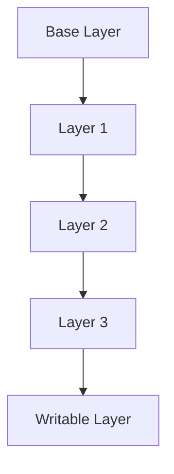

## Introduction to Docker Image Security

In the realm of DevSecOps, ensuring the security of Docker images is paramount. Docker images are the building blocks of containerized applications, and their integrity directly impacts the security of the entire application stack. This chapter delves into the intricacies of Docker image security, covering the theoretical foundations, practical implementation, recent real-world examples, and comprehensive defense mechanisms.

### What is Docker Image Security?

Docker image security refers to the practices and tools used to ensure that Docker images are free from vulnerabilities, malware, and unauthorized modifications. These images are essentially packages that contain all the necessary components to run an application, including the code, libraries, and dependencies. Ensuring the security of these images is crucial because any vulnerabilities within them can be exploited once the containers are deployed.

### Why Does Docker Image Security Matter?

Security is inherently layered, meaning that vulnerabilities can exist at every level of the application lifecycle. From development to deployment, each stage introduces potential security issues. While extensive code scanning is performed during the development phase, the continuous deployment (CD) process opens up new avenues for security threats and misconfigurations. Therefore, securing the CD process, particularly the image-building phase, is essential to maintaining overall application security.

### The Continuous Deployment Pipeline

The continuous deployment pipeline encompasses several stages, including code commit, build, test, and deploy. Each of these stages presents unique security challenges. In particular, the build stage, where Docker images are created, is a critical point of focus. By securing this stage, we can mitigate risks associated with deploying potentially compromised images.

### Docker Image Security Categories

We can categorize Docker image security into two main areas:

1. **Docker Image Security**: This focuses on the security of the Docker images themselves, including the contents, dependencies, and build processes.
2. **AWS Security**: This includes the security of the deployment environment, such as the AWS account and infrastructure, as well as the security measures surrounding the deployment process.

This chapter will primarily focus on Docker image security, providing a deep dive into the various aspects of securing Docker images.

### Background Theory

To understand Docker image security, it is essential to grasp the underlying concepts of Docker and containerization. Docker uses a layered filesystem to create images, which are composed of layers. Each layer represents a specific change made to the image, such as adding a package or modifying a configuration file. This layered approach allows for efficient storage and distribution of images.

#### Docker Image Layers

A Docker image consists of multiple layers, each representing a specific operation performed during the build process. These layers are stacked on top of each other, forming a final image. The layers are read-only, except for the topmost writable layer, which is used to store runtime data.



Each layer is identified by a unique hash, which ensures the integrity of the image. Any modification to a layer results in a new hash, indicating that the image has changed.

### Common Vulnerabilities in Docker Images

Several types of vulnerabilities can be found in Docker images, including:

- **CVEs (Common Vulnerabilities and Exposures)**: These are publicly disclosed vulnerabilities that can be exploited to compromise the security of an application.
- **Malware**: Malicious software can be embedded within Docker images, leading to unauthorized access or data theft.
- **Unauthorized Modifications**: Changes made to the image without proper authorization can introduce security risks.

### Recent Real-World Examples

Recent breaches and vulnerabilities highlight the importance of Docker image security. For instance, the Log4j vulnerability (CVE-2021-44228) affected numerous Docker images, leading to widespread exploitation. Similarly, the discovery of malicious Docker images in popular repositories underscores the need for robust security measures.

### Practical Implementation

To secure Docker images, several steps can be taken during the build process. These include:

1. **Using Secure Base Images**: Base images should be sourced from trusted repositories and regularly updated to patch known vulnerabilities.
2. **Minimizing Image Size**: Smaller images reduce the attack surface by limiting the number of dependencies and libraries included.
3. **Removing Unnecessary Packages**: Unused packages and tools should be removed to minimize the risk of exploitation.
4. **Using Multi-Stage Builds**: Multi-stage builds allow for the creation of smaller, more secure images by separating the build process into distinct stages.

### Example: Building a Secure Docker Image

Let's walk through an example of building a secure Docker image using a multi-stage build process.

#### Dockerfile Example

```dockerfile
# Stage 1: Build the application
FROM node:14 AS builder
WORKDIR /app
COPY package*.json ./
RUN npm install
COPY . .
RUN npm run build

# Stage 2: Create the final image
FROM node:14-alpine
WORKDIR /dist
COPY --from=builder /app/dist .
EXPOSE 3000
CMD ["node", "server.js"]
```

In this example, the first stage (`builder`) uses the `node:14` base image to build the application. The second stage (`final image`) uses a minimal `node:14-alpine` image to run the application, reducing the attack surface.

### How to Prevent / Defend

#### Detection

Detecting vulnerabilities in Docker images can be achieved through automated scanning tools. These tools analyze the image layers and identify known vulnerabilities, malware, and unauthorized modifications.

##### Example: Using Trivy for Image Scanning

Trivy is an open-source vulnerability scanner that can be used to scan Docker images. Here’s how to use Trivy to scan a Docker image:

```bash
trivy image my-docker-image:latest
```

This command scans the specified Docker image and outputs any detected vulnerabilities.

#### Prevention

Preventing vulnerabilities in Docker images involves implementing best practices during the build process and using secure base images.

##### Example: Using a Secure Base Image

```dockerfile
FROM alpine:3.14
```

Using a minimal base image like Alpine reduces the number of potential vulnerabilities.

#### Secure-Coding Fixes

Secure coding practices can help prevent vulnerabilities in Docker images. For example, removing unnecessary packages and tools can reduce the attack surface.

##### Example: Removing Unnecessary Packages

```dockerfile
RUN apk del <package-name>
```

This command removes the specified package from the image, reducing the risk of exploitation.

#### Configuration Hardening

Hardening the Docker image configuration can further enhance security. This includes setting appropriate permissions, disabling unnecessary services, and configuring logging and monitoring.

##### Example: Setting Permissions

```dockerfile
RUN chmod 600 /path/to/file
```

This command sets the permissions of the specified file to restrict access.

### Complete Example: Full HTTP Request and Response

When working with Docker images, it is often necessary to interact with Docker registries via HTTP requests. Here is an example of a full HTTP request and response for pushing a Docker image to a registry.

#### HTTP Request

```http
POST /v2/my-repo/my-image/blobs/uploads/ HTTP/1.1
Host: my-registry.com
Authorization: Bearer <token>
Content-Length: 1024
Content-Type: application/octet-stream

<binary data>
```

#### HTTP Response

```http
HTTP/1.1 201 Created
Date: Mon, 01 Jan 2024 00:00:00 GMT
Content-Length: 0
Location: https://my-registry.com/v2/my-repo/my-image/blobs/sha256:<hash>
```

### Pitfalls and Common Mistakes

Several common mistakes can lead to insecure Docker images:

- **Using Outdated Base Images**: Failing to update base images can leave known vulnerabilities unpatched.
- **Including Development Tools**: Including development tools in the final image increases the attack surface.
- **Ignoring Image Scanning**: Failing to scan images for vulnerabilities can result in undetected risks.

### Conclusion

Securing Docker images is a critical component of the DevSecOps pipeline. By understanding the theoretical foundations, implementing best practices, and using robust detection and prevention mechanisms, organizations can significantly reduce the risk of deploying compromised images. Regularly updating base images, minimizing image size, and using multi-stage builds are key strategies for building secure Docker images.

### Practice Labs

For hands-on practice, consider the following labs:

- **PortSwigger Web Security Academy**: Offers exercises on securing Docker images and containerized applications.
- **OWASP Juice Shop**: Provides a vulnerable web application that can be containerized and secured using Docker.
- **Kubernetes Goat**: Focuses on securing Kubernetes clusters, including Docker images.

By engaging with these labs, you can gain practical experience in securing Docker images and apply the knowledge gained in this chapter to real-world scenarios.

---
<!-- nav -->
[[DevSecOps/DevSecOps Bootcamp/06-Container & Kubernetes Security/03-Image Scanning - Build Secure Docker Images/02-Overview of Image Security/00-Overview|Overview]] | [[DevSecOps/DevSecOps Bootcamp/06-Container & Kubernetes Security/03-Image Scanning - Build Secure Docker Images/02-Overview of Image Security/02-Practice Questions & Answers|Practice Questions & Answers]]
