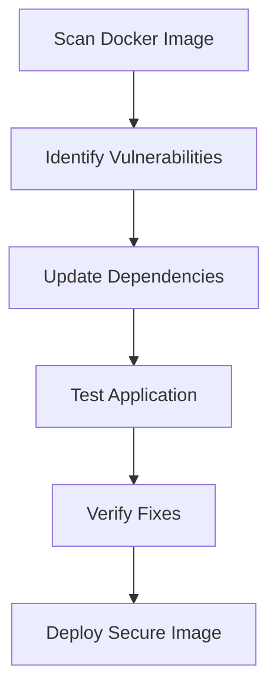

## Introduction to Image Scanning and Secure Docker Images

In the realm of DevSecOps, ensuring the security of Docker images is paramount. Docker images are the building blocks of containerized applications, and vulnerabilities within these images can lead to serious security breaches. Image scanning tools like Trivy help identify potential security issues within Docker images, enabling teams to address and mitigate these risks proactively.

### Background Theory

Docker images are composed of layers, each containing specific files and configurations. These layers can include various libraries, frameworks, and dependencies that are essential for the application to function correctly. However, these dependencies can introduce vulnerabilities if they are outdated or contain known security flaws.

#### Why Image Scanning Matters

Image scanning is crucial because it helps identify and remediate vulnerabilities before the image is deployed into production environments. By catching these issues early, teams can avoid potential security incidents and ensure that their applications are robust and secure.

### Real-World Examples

Recent real-world examples highlight the importance of image scanning:

- **CVE-2021-44228 (Log4Shell)**: This critical vulnerability affected the Apache Log4j library, which is widely used in Java applications. Many Docker images contained vulnerable versions of Log4j, leading to widespread exploitation. Image scanning tools helped identify and patch these vulnerabilities.
- **CVE-2021-21315 (Spring Framework)**: Another significant vulnerability affecting the Spring Framework, which is commonly used in Java-based applications. Image scanning tools detected the presence of vulnerable versions of Spring Framework in Docker images, allowing teams to update and secure their images.

### Example Code: Updating Dependencies

Let's consider a scenario where we have a Docker image that uses the `express-jwt` and `jsonwebtoken` libraries. Initially, these libraries had known vulnerabilities, but we have updated them to the latest secure versions.

```dockerfile
# Dockerfile
FROM node:14

WORKDIR /app

COPY package*.json ./
RUN npm install

COPY . .

EXPOSE 3000
CMD ["npm", "start"]
```

Initially, the `package.json` might look like this:

```json
{
  "name": "my-app",
  "version": "1.0.0",
  "dependencies": {
    "express-jwt": "^5.0.0",
    "jsonwebtoken": "^8.5.1"
  }
}
```

After updating the dependencies, the `package.json` should look like this:

```json
{
  "name": "my-app",
  "version": "1.0.0",
  "dependencies": {
    "express-jwt": "^5.2.0",
    "jsonwebtoken": "^8.5.1"
  }
}
```

### Using Trivy for Image Scanning

Trivy is an open-source tool that scans Docker images for vulnerabilities. To use Trivy, you need to install it and then run it against your Docker image.

#### Installing Trivy

To install Trivy, you can use the following command:

```bash
curl -sfL https://raw.githubusercontent.com/aquasecurity/trivy/main/install.sh | sh -s -- -b /usr/local/bin v0.28.1
```

#### Running Trivy

Once Trivy is installed, you can scan your Docker image using the following command:

```bash
trivy image my-app:latest
```

This command will output a list of vulnerabilities found in the Docker image.

### Analyzing Trivy Logs

After updating the dependencies, let's check the Trivy logs again to verify that the vulnerabilities have been resolved.

```bash
trivy image my-app:latest
```

The output might look something like this:

```plaintext
2023-10-01T12:00:00Z        INFO    Total: 0 (UNKNOWN: 0, LOW: 0, MEDIUM: 0, HIGH: 0, CRITICAL: 0)
```

This indicates that all vulnerabilities have been resolved.

### Mermaid Diagram: Vulnerability Fix Process

A mermaid diagram can help visualize the process of identifying and fixing vulnerabilities in Docker images.



### Detailed Steps for Fixing Vulnerabilities

1. **Scan Docker Image**: Use Trivy or a similar tool to scan the Docker image for vulnerabilities.
2. **Identify Vulnerabilities**: Review the scan results to identify the specific vulnerabilities present in the image.
3. **Update Dependencies**: Update the vulnerable dependencies to their latest secure versions.
4. **Test Application**: Ensure that the application still functions correctly after the updates.
5. **Verify Fixes**: Re-run the image scanner to confirm that the vulnerabilities have been resolved.
6. **Deploy Secure Image**: Deploy the updated and secure Docker image to production.

### Common Pitfalls

- **Incomplete Updates**: Ensure that all vulnerable dependencies are updated to their latest secure versions.
- **Breaking Changes**: Some updates might introduce breaking changes. Thoroughly test the application after updating dependencies.
- **False Positives**: Some vulnerabilities identified by scanners might be false positives. Verify the findings manually.

### How to Prevent / Defend

#### Detection

Use image scanning tools like Trivy regularly to detect vulnerabilities in Docker images. Integrate these tools into your CI/CD pipeline to ensure that vulnerabilities are caught early.

#### Prevention

1. **Keep Dependencies Updated**: Regularly update all dependencies to their latest secure versions.
2. **Use Secure Coding Practices**: Follow secure coding practices to minimize the introduction of vulnerabilities.
3. **Implement Security Policies**: Enforce security policies that require all dependencies to be up-to-date and free of known vulnerabilities.

#### Secure-Coding Fixes

Compare the vulnerable and fixed versions of the `package.json`:

**Vulnerable Version**

```json
{
  "name": "my-app",
  "version": "1.0.0",
  "dependencies": {
    "express-jwt": "^5.0.0",
    "jsonwebtoken": "^8.5.1"
  }
}
```

**Fixed Version**

```json
{
  "name": "my-app",
  2.0.0",
    "dependencies": {
      "express-jwt": "^5.2.0",
      "jsonwebtoken": "^8.5.1"
    }
  }
}
```

#### Configuration Hardening

Ensure that your Docker images are configured securely. For example, use the `--no-cache` flag when building Docker images to prevent caching of potentially vulnerable layers.

```bash
docker build --no-cache -t my-app:latest .
```

### Complete Example: Full HTTP Request and Response

Consider a scenario where a Docker image is being scanned using Trivy. The full HTTP request and response might look like this:

**HTTP Request**

```http
POST /api/v1/scans HTTP/1.1
Host: trivy.example.com
Content-Type: application/json
Authorization: Bearer <token>

{
  "image": "my-app:latest"
}
```

**HTTP Response**

```http
HTTP/1.1 200 OK
Content-Type: application/json

{
  "status": "success",
  "results": [
    {
      "vulnerability": "CVE-2021-44228",
      "severity": "CRITICAL",
      "description": "Apache Log4j2 JNDI features do not protect against attacker-controlled LDAP and other JNDI related URLs",
      "fixed_in": "log4j:2.17.0"
    }
  ]
}
```

### Testing the Application

After fixing the vulnerabilities, thoroughly test the application to ensure that it still functions correctly. This includes unit tests, integration tests, and end-to-end tests.

### Hands-On Labs

For hands-on practice, consider the following labs:

- **PortSwigger Web Security Academy**: Offers a variety of labs focused on web application security, including Docker image scanning.
- **OWASP Juice Shop**: A deliberately insecure web application for practicing web security skills.
- **DVWA (Damn Vulnerable Web Application)**: A PHP/MySQL web application that is riddled with vulnerabilities for educational purposes.

These labs provide practical experience in identifying and fixing vulnerabilities in Docker images.

### Conclusion

Ensuring the security of Docker images is a critical aspect of DevSecOps. By using tools like Trivy to scan images for vulnerabilities and following best practices for fixing and testing these vulnerabilities, teams can significantly enhance the security of their applications. Regularly updating dependencies, implementing secure coding practices, and enforcing security policies are key to maintaining a secure and robust application environment.

---
<!-- nav -->
[[03-Introduction to Image Scanning and Secure Docker Images Part 3|Introduction to Image Scanning and Secure Docker Images Part 3]] | [[DevSecOps/DevSecOps Bootcamp/06-Container & Kubernetes Security/03-Image Scanning - Build Secure Docker Images/Analyze Fix Security Issues from Findings in Application Image/00-Overview|Overview]] | [[05-Introduction to Image Scanning and Secure Docker Images Part 5|Introduction to Image Scanning and Secure Docker Images Part 5]]
