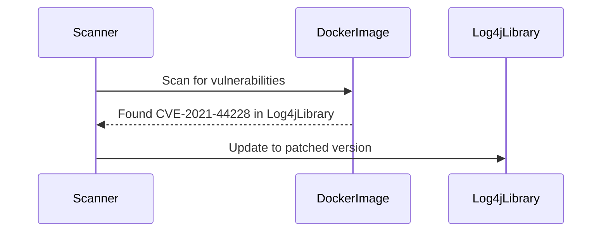
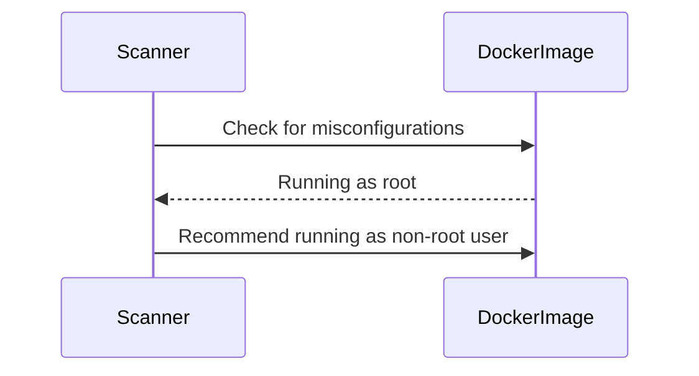
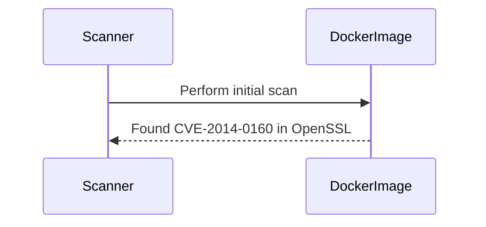
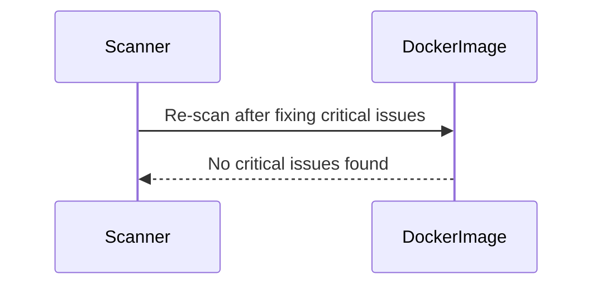

## Introduction to Image Scanning and Secure Docker Images

### What is Image Scanning?

Image scanning is the process of analyzing Docker images to identify potential security vulnerabilities, misconfigurations, and other issues that could compromise the security of the application running within the container. This process is crucial because Docker images can contain various components such as operating system libraries, application dependencies, and even sensitive data. By scanning these images, we can ensure that the final deployed application is secure and free from known vulnerabilities.

### Why is Image Scanning Important?

Image scanning is essential for several reasons:

1. **Security Vulnerabilities**: Docker images can contain known vulnerabilities, such as those listed in the Common Vulnerabilities and Exposures (CVE) database. These vulnerabilities can be exploited by attackers to gain unauthorized access to the system or to execute malicious code.

2. **Misconfigurations**: Misconfigured images can lead to security issues. For example, running a container with elevated privileges (such as root) can increase the attack surface and allow an attacker to gain more control over the system.

3. **Sensitive Data Exposure**: Docker images can inadvertently include sensitive data such as API keys, passwords, or private keys. Scanning helps identify and remove such data from the images.

4. **Compliance Requirements**: Many organizations are required to comply with regulatory standards such as PCI-DSS, HIPAA, or GDPR. Image scanning helps ensure that the images meet these compliance requirements.

### How Does Image Scanning Work?

Image scanning typically involves the following steps:

1. **Image Analysis**: The scanner analyzes the contents of the Docker image, including the base OS, installed packages, and application dependencies.

2. **Vulnerability Detection**: The scanner checks for known vulnerabilities in the identified components using databases such as the National Vulnerability Database (NVD).

3. **Configuration Review**: The scanner reviews the configuration settings of the image to identify any misconfigurations that could lead to security issues.

4. **Report Generation**: The scanner generates a report detailing the findings, including the severity of the issues and recommendations for remediation.

### Real-World Examples of Image Scanning

#### Example 1: CVE-2021-44228 (Log4j)

In December 2021, a critical vulnerability was discovered in the Apache Log4j library, which is widely used in Java applications. This vulnerability, known as CVE-2021-44228, allowed attackers to execute arbitrary code on the server. Many Docker images containing Java applications were affected by this vulnerability.

**Impact**: Organizations that had Docker images with vulnerable versions of Log4j were at risk of being exploited. Attackers could gain remote code execution capabilities, leading to data theft, system compromise, or denial of service.

**Mitigation**: Image scanning tools helped organizations identify Docker images containing the vulnerable Log4j version. By updating the Log4j library to a patched version, organizations could mitigate the risk.



#### Example 2: Misconfigured Docker Images

A common misconfiguration issue is running containers with elevated privileges. For example, running a container with the `root` user can expose the system to unnecessary risks.

**Impact**: An attacker who gains access to a container running as `root` can potentially escalate their privileges and take control of the entire host system.

**Mitigation**: Image scanning tools can identify containers running with elevated privileges and recommend running containers with non-root users. This reduces the attack surface and limits the damage an attacker can cause.



### Setting Up the Process for Identifying Security Issues

To effectively identify and fix security issues in Docker images, you need to set up a comprehensive process that includes the following steps:

1. **Define Security Policies**: Establish clear security policies that define what is considered a security issue and how it should be addressed. This includes defining the severity levels (critical, high, medium, low) and the remediation steps for each level.

2. **Integrate Scanning Tools**: Integrate image scanning tools into your CI/CD pipeline. This ensures that every Docker image is scanned before it is deployed to production.

3. **Train Application Engineers**: Educate application engineers about the importance of security and how to interpret the findings from the scanning tools. This helps them understand the issues and take appropriate actions to fix them.

4. **Prioritize Issues**: Start by addressing the most critical issues first. This ensures that the highest-risk vulnerabilities are fixed promptly.

5. **Continuous Improvement**: Image scanning is an ongoing process. Regularly review the findings and update the security policies and scanning tools to address new vulnerabilities and misconfigurations.

### Step-by-Step Improvement Process

The improvement process is iterative and involves the following steps:

1. **Initial Scan**: Perform an initial scan of all Docker images to get a baseline of the security posture.

2. **Identify Critical Issues**: Identify and prioritize the critical issues based on their severity and potential impact.

3. **Fix Critical Issues**: Address the critical issues by updating the vulnerable components, fixing misconfigurations, and removing sensitive data.

4. **Repeat for High-Risk Issues**: Once the critical issues are fixed, move on to the high-risk issues and repeat the process.

5. **Monitor and Improve**: Continuously monitor the Docker images and perform regular scans to identify new issues. Use the findings to improve the security policies and scanning tools.

### Real-World Example: Initial Scan and Fixing Critical Issues

Consider a scenario where a Docker image contains a vulnerable version of the OpenSSL library, which is known to be affected by the Heartbleed vulnerability (CVE-2014-0160).

**Initial Scan**:



**Fixing Critical Issues**:

1. **Update OpenSSL Library**: Update the OpenSSL library to a patched version that addresses the Heartbleed vulnerability.

```bash
# Vulnerable Dockerfile
FROM ubuntu:18.04
RUN apt-get update && apt-get install -y openssl=1.1.0g-2ubuntu4.1

# Fixed Dockerfile
FROM ubuntu:18.04
RUN apt-get update && apt-get install -y openssl=1.1.0g-2ubuntu4.3
```

2. **Re-scan the Image**: After fixing the critical issue, re-scan the Docker image to ensure that the vulnerability has been resolved.



### Continuous Improvement

Continuous improvement involves regularly reviewing the findings from the image scanning process and updating the security policies and scanning tools accordingly. This ensures that the Docker images remain secure and compliant with the latest security standards.

### Real-World Example: Continuous Improvement

Consider a scenario where a new vulnerability is discovered in the Apache HTTP Server (CVE-2022-24470). To ensure that the Docker images are protected against this vulnerability, the following steps can be taken:

1. **Update Scanning Tools**: Ensure that the image scanning tools are updated to include the latest vulnerability databases.

2. **Scan Existing Images**: Perform a scan of all existing Docker images to identify any instances of the vulnerable Apache HTTP Server.

3. **Fix Identified Issues**: Update the Apache HTTP Server to a patched version that addresses the vulnerability.

4. **Regular Scans**: Schedule regular scans of the Docker images to identify any new vulnerabilities or misconfigurations.

### Real-World Example: Regular Scans

Consider a scenario where a Docker image contains a vulnerable version of the Apache HTTP Server (CVE-2022-24470). To ensure that the image remains secure, regular scans can be performed using a tool like Trivy.

```bash
# Install Trivy
curl -sfL https://raw.githubusercontent.com/aquasecurity/trivy/main/install.sh | sh -s -- -b /usr/local/bin v0.29.1

# Scan Docker image
trivy image my-docker-image:latest
```

### How to Prevent / Defend

#### Detection

Detection involves identifying security issues in Docker images using scanning tools. This can be achieved by integrating scanning tools into the CI/CD pipeline and performing regular scans of the images.

#### Prevention

Prevention involves taking steps to avoid introducing security issues into Docker images. This can be achieved by:

1. **Using Secure Base Images**: Use base images that are known to be secure and free from vulnerabilities.

2. **Minimizing Image Size**: Keep the Docker images as small as possible by only including the necessary components. This reduces the attack surface and makes it easier to manage the security of the images.

3. **Running Containers as Non-Root Users**: Avoid running containers with elevated privileges. Instead, run containers as non-root users to limit the damage an attacker can cause.

4. **Removing Sensitive Data**: Ensure that sensitive data such as API keys, passwords, and private keys are not included in the Docker images. Use environment variables or secrets management tools to securely manage sensitive data.

#### Secure Coding Fixes

Here is an example of a vulnerable Dockerfile and the corresponding secure version:

**Vulnerable Dockerfile**:

```Dockerfile
FROM ubuntu:18.04
RUN apt-get update && apt-get install -y openssl=1.1.0g-2ubuntu4.1
COPY app /app
WORKDIR /app
CMD ["./app"]
```

**Secure Dockerfile**:

```Dockerfile
FROM ubuntu:18.04
RUN apt-get update && apt-get install -y openssl=1.1.0g-2ubuntu4.3
COPY app /app
WORKDIR /app
USER nonroot
CMD ["./app"]
```

#### Configuration Hardening

Configuration hardening involves securing the Docker images by configuring them to follow best practices. This can be achieved by:

1. **Disabling Unnecessary Services**: Disable any services that are not required by the application. This reduces the attack surface and makes it harder for attackers to exploit the system.

2. **Setting Appropriate Permissions**: Set appropriate permissions for files and directories within the Docker image. This ensures that sensitive data is not accessible to unauthorized users.

3. **Using Secure Configurations**: Use secure configurations for the components within the Docker image. For example, configure the Apache HTTP Server to use secure settings that prevent common attacks.

#### Real-World Example: Configuration Hardening

Consider a scenario where a Docker image contains the Apache HTTP Server. To secure the configuration, the following steps can be taken:

1. **Disable Unnecessary Modules**: Disable any modules that are not required by the application. This reduces the attack surface and makes it harder for attackers to exploit the system.

2. **Set Appropriate Permissions**: Set appropriate permissions for the Apache HTTP Server configuration files. This ensures that sensitive data is not accessible to unauthorized users.

3. **Use Secure Configurations**: Use secure configurations for the Apache HTTP Server. For example, configure the server to use HTTPS instead of HTTP to encrypt the communication between the client and the server.

### Hands-On Labs

To practice image scanning and secure Docker images, you can use the following hands-on labs:

- **PortSwigger Web Security Academy**: Offers a series of labs that cover various aspects of web application security, including Docker image scanning.
- **OWASP Juice Shop**: A deliberately insecure web application that can be used to practice image scanning and secure Docker images.
- **Docker Security Workshop**: A workshop that covers various aspects of Docker security, including image scanning and secure Docker images.

By following these steps and using the provided resources, you can effectively identify and fix security issues in Docker images and build secure Docker images that are free from vulnerabilities and misconfigurations.

### Conclusion

Image scanning is a critical process for ensuring the security of Docker images. By integrating scanning tools into the CI/CD pipeline, educating application engineers, prioritizing issues, and continuously improving the security posture, you can build secure Docker images that are free from vulnerabilities and misconfigurations. Regularly reviewing the findings and updating the security policies and scanning tools ensures that the Docker images remain secure and compliant with the latest security standards.

---
<!-- nav -->
[[04-Introduction to Image Scanning and Secure Docker Images Part 4|Introduction to Image Scanning and Secure Docker Images Part 4]] | [[DevSecOps/DevSecOps Bootcamp/06-Container & Kubernetes Security/03-Image Scanning - Build Secure Docker Images/Analyze Fix Security Issues from Findings in Application Image/00-Overview|Overview]] | [[06-Introduction to Image Scanning and Secure Docker Images|Introduction to Image Scanning and Secure Docker Images]]
