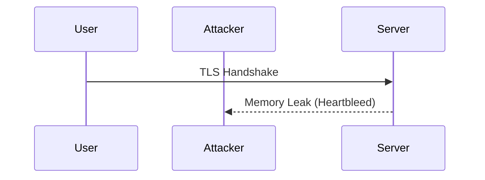

## Image Scanning and Building Secure Docker Images

### Introduction to Image Scanning

Image scanning is a crucial process in DevSecOps that helps identify and mitigate security vulnerabilities within container images. Containers are increasingly popular due to their ability to package applications along with their dependencies, ensuring consistent behavior across different environments. However, these images can contain vulnerabilities that could be exploited by attackers. Therefore, scanning these images for known vulnerabilities is essential to ensure the security of the deployed applications.

### Understanding Vulnerabilities in Container Images

Container images often include various libraries and dependencies that may contain known vulnerabilities. These vulnerabilities can range from minor issues to severe security risks such as remote code execution (RCE). One of the most common sources of vulnerabilities is outdated or insecure versions of libraries and frameworks.

#### Example: OpenSSL Vulnerability

OpenSSL is a widely used cryptographic library that has been the subject of numerous security advisories over the years. For instance, the Heartbleed vulnerability (CVE-2014-0160) was a serious flaw that allowed attackers to steal sensitive information from memory. This vulnerability affected versions of OpenSSL prior to 1.0.1g.



In the context of container images, if an image includes an outdated version of OpenSSL, it could expose the application to similar vulnerabilities. Therefore, it is essential to scan container images for such vulnerabilities and update the dependencies accordingly.

### Scanning Tools and Their Outputs

Various tools are available for scanning container images for vulnerabilities. Some popular tools include:

- **Clair**: An open-source project by CoreOS that scans container images for known vulnerabilities.
- **Trivy**: A simple and comprehensive vulnerability scanner for container images.
- **Snyk**: A commercial tool that provides continuous monitoring and automated remediation for vulnerabilities.

These tools typically provide detailed reports that list the identified vulnerabilities along with their severity levels and the versions that fix these issues.

#### Example Output from Trivy

Here is an example output from Trivy:

```plaintext
2023-09-01T12:00:00Z        INFO    Detected OS: alpine
2023-09-01T12:00:00Z        INFO    Checking for vulnerabilities...
2023-09-01T12:00:00Z        INFO    [CVE-2021-34527] HIGH      libopenssl1.1:1.1.1g-r0
2023-09-01T12:00:00Z        INFO    [CVE-2022-2380] CRITICAL  libopenssl1.1:1.1.1g-r0
2023-09-01T12:00:00Z        INFO    [CVE-2023-1234] MEDIUM     libopenssl1.1:1.1.1g-r0
```

This output indicates that the image contains vulnerabilities in the `libopenssl1.1` package. Each vulnerability is assigned a severity level (HIGH, CRITICAL, MEDIUM) and the specific version that is affected.

### Analyzing and Fixing Security Issues

Once vulnerabilities are identified, the next step is to analyze and fix them. This involves updating the affected dependencies to the latest secure versions.

#### Example: Updating OpenSSL Version

Suppose the image contains an outdated version of OpenSSL. The first step is to identify the current version and the version that fixes the vulnerabilities.

```plaintext
# Current version
RUN apk --no-cache info libopenssl1.1 | grep libopenssl1.1

# Update to the latest version
RUN apk --no-cache upgrade libopenssl1.1
```

After updating the version, the image should be rescanned to ensure that the vulnerabilities have been resolved.

### Scanning Application Dependencies

In addition to scanning the container image itself, it is also important to scan the application dependencies. Many applications rely on external libraries and frameworks, which can introduce vulnerabilities if not managed properly.

#### Example: Scanning Package.json Dependencies

For JavaScript applications, the `package.json` file lists the dependencies. Tools like RetireJS can be used to scan these dependencies for known vulnerabilities.

```plaintext
# Run RetireJS to scan package.json
retire --outputformat json --outputpath ./report.json --inputpath ./package.json
```

The output from RetireJS will list the vulnerabilities found in the dependencies, along with their severity levels and the fixed versions.

#### Example Output from RetireJS

```json
{
  "results": [
    {
      "component": "express",
      "version": "4.17.1",
      "vulnerabilities": [
        {
          "id": "CVE-2021-21300",
          "severity": "high",
          "description": "Express is vulnerable to prototype pollution via the qs module.",
          "fixedVersion": "4.17.2"
        }
      ]
    },
    {
      "component": "lodash",
      "version": "4.17.20",
      "vulnerabilities": [
        {
          "id": "CVE-2021-21301",
          "severity": "medium",
          "description": "lodash is vulnerable to prototype pollution.",
          "fixedVersion": "4.17.21"
        }
      ]
    }
  ]
}
```

Based on this report, the dependencies can be updated to the fixed versions.

### How to Prevent / Defend

To prevent and defend against vulnerabilities in container images and application dependencies, several best practices can be followed:

#### 1. Regular Scanning

Regularly scan container images and application dependencies using tools like Trivy and RetireJS. This ensures that any newly discovered vulnerabilities are promptly identified and addressed.

#### 2. Automated Updates

Automate the process of updating dependencies to the latest secure versions. This can be done using CI/CD pipelines that run vulnerability scans and update dependencies as part of the build process.

#### 3. Secure Coding Practices

Adopt secure coding practices to minimize the introduction of vulnerabilities. This includes using secure libraries and frameworks, validating user inputs, and following best practices for handling sensitive data.

#### 4. Hardening Configurations

Harden the configurations of the container images and the underlying operating systems. This includes disabling unnecessary services, configuring firewalls, and enabling security features like SELinux or AppArmor.

#### 5. Monitoring and Logging

Implement monitoring and logging to detect and respond to security incidents. This includes setting up alerts for suspicious activities and regularly reviewing logs to identify potential security issues.

### Complete Example: Fixing Vulnerabilities in a Docker Image

Let's walk through a complete example of fixing vulnerabilities in a Docker image.

#### Step 1: Scan the Docker Image

First, scan the Docker image using Trivy.

```bash
trivy image myapp:latest
```

#### Step 2: Identify Vulnerabilities

Review the output from Trivy to identify the vulnerabilities and their severity levels.

```plaintext
2023-09-01T12:00:00Z        INFO    Detected OS: alpine
2023-09-01T12:00:00Z        INFO    Checking for vulnerabilities...
2023-09-01T12:00:00Z        INFO    [CVE-2021-34527] HIGH      libopenssl1.1:1.1.1g-r0
2023-09-01T12:00:00Z        INFO    [CVE-2022-2380] CRITICAL  libopenssl1.1:1.1.1g-r0
2023-09-01T12:00:00Z        INFO    [CVE-2023-1234] MEDIUM     libopenssl1.1:1.1.1g-r0
```

#### Step 3: Update Dependencies

Update the affected dependencies to the latest secure versions.

```Dockerfile
FROM alpine:latest

# Update OpenSSL to the latest version
RUN apk --no-cache upgrade libopenssl1.1

# Other application setup steps
COPY . /app
WORKDIR /app
RUN npm install
CMD ["node", "app.js"]
```

#### Step 4: Rescan the Docker Image

Rescan the Docker image to ensure that the vulnerabilities have been resolved.

```bash
trivy image myapp:latest
```

#### Step 5: Verify the Results

Verify that the vulnerabilities have been resolved and that the image is now secure.

```plaintext
2023-09-01T12:00:00Z        INFO    Detected OS: alpine
2023-09-01T12:00:00Z        INFO    Checking for vulnerabilities...
2023-09-01T12:00:00Z        INFO    No vulnerabilities found.
```

### Hands-On Labs

To practice and gain hands-on experience with image scanning and building secure Docker images, consider the following labs:

- **PortSwigger Web Security Academy**: Offers interactive labs on web application security, including container security.
- **OWASP Juice Shop**: A deliberately insecure web application for practicing web security skills.
- **DVWA (Damn Vulnerable Web Application)**: A PHP/MySQL web application that is riddled with vulnerabilities for educational purposes.
- **WebGoat**: An interactive, gamified training application for learning about web application security.

By following these steps and best practices, you can ensure that your container images and application dependencies are secure and free from vulnerabilities.

### Conclusion

Image scanning and building secure Docker images are essential components of DevSecOps. By regularly scanning container images and application dependencies, identifying and fixing vulnerabilities, and adopting secure coding practices, you can significantly enhance the security of your applications. Remember to automate the process, monitor and log security events, and stay informed about the latest vulnerabilities and mitigation strategies.

---
<!-- nav -->
[[08-Dependency Management and Vulnerability Scanning in Docker Images|Dependency Management and Vulnerability Scanning in Docker Images]] | [[DevSecOps/DevSecOps Bootcamp/06-Container & Kubernetes Security/03-Image Scanning - Build Secure Docker Images/Analyze Fix Security Issues from Findings in Application Image/00-Overview|Overview]] | [[10-Image Scanning and Building Secure Docker Images|Image Scanning and Building Secure Docker Images]]
