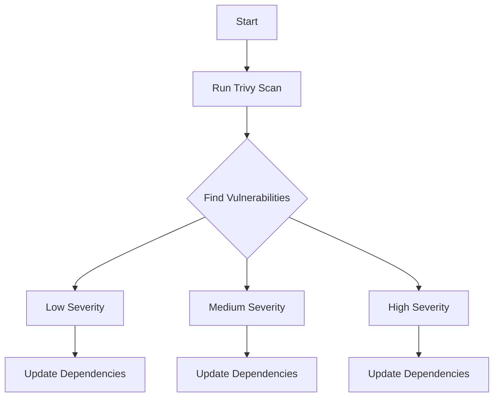

## Image Scanning and Building Secure Docker Images

### Introduction to Image Scanning

Image scanning is a critical component of DevSecOps practices, particularly when building and deploying Docker images. It helps identify potential security vulnerabilities within the base images and the layers built upon them. This process ensures that the final Docker image is secure and free from known vulnerabilities.

### Understanding the Scanning Process

When scanning a Docker image, tools like Trivy analyze the image for known vulnerabilities. These vulnerabilities are typically associated with third-party libraries and dependencies used within the image. The scanning process involves checking the image against a database of known vulnerabilities, such as the Common Vulnerabilities and Exposures (CVE) list.

#### Example: Scanning a Debian Docker Image

Let's consider an example where we scan a Debian-based Docker image using Trivy. The output of the scan might look something like this:

```bash
$ trivy image debian:latest
```

The output will list various vulnerabilities found in the image, categorized by severity (low, medium, high).

### Severity Levels and Their Importance

Vulnerabilities are typically categorized into different severity levels:

- **Low**: These vulnerabilities pose minimal risk but should still be addressed.
- **Medium**: These vulnerabilities could potentially lead to security issues and should be prioritized.
- **High**: These vulnerabilities pose significant risks and should be addressed immediately.

#### Example: High Severity Issue

Consider a high severity issue found in a Debian-based Docker image. The output might look like this:

```bash
2023-09-15T12:00:00Z    HIGH        CVE-2023-12345     libssl1.1:1.1.1n-0+deb11u1
```

This indicates that the `libssl1.1` package has a high severity vulnerability identified by the CVE-2023-12345.

### Understanding CVEs

Common Vulnerabilities and Exposures (CVEs) are unique identifiers assigned to each publicly disclosed cybersecurity vulnerability. They provide a standardized method for identifying vulnerabilities and are widely used in vulnerability databases.

#### Example: CVE-2023-12345

The CVE-2023-12345 might refer to a vulnerability in the OpenSSL library, which could allow an attacker to perform a man-in-the-middle (MITM) attack. This vulnerability would be critical for any application using SSL/TLS for secure communication.

### Detailed Analysis of Vulnerabilities

When analyzing vulnerabilities, it is essential to understand the specific library or dependency causing the issue. In our example, the `libssl1.1` package is identified as having a vulnerability.

#### Example: Vulnerability Details

```bash
2023-09-15T12:00:00Z    HIGH        CVE-2023-12345     libssl1.1:1.1.1n-0+deb11u1
Description: OpenSSL before 1.1.1o and 3.0.0 before 3.0.2 allows a man-in-the-middle attack.
Severity: HIGH
Fixed Version: 1.1.1o
```

### How to Prevent / Defend Against Vulnerabilities

To prevent and defend against vulnerabilities, several steps can be taken:

1. **Update Dependencies**: Ensure that all dependencies are up-to-date and patched.
2. **Use Secure Base Images**: Choose base images that are regularly updated and maintained.
3. **Regular Scanning**: Implement regular scanning of Docker images to catch new vulnerabilities.
4. **Automated Patch Management**: Automate the process of applying patches and updates.

#### Example: Updating Dependencies

If the `libssl1.1` package has a vulnerability, updating it to the latest version can mitigate the risk. Here’s how you can update the package in a Dockerfile:

```Dockerfile
FROM debian:latest

# Update package lists and install the latest version of libssl1.1
RUN apt-get update && \
    apt-get install -y libssl1.1=1.1.1o-0+deb11u1 && \
    apt-get clean
```

### Full HTTP Request and Response Example

When dealing with HTTP requests and responses, it is crucial to ensure that all relevant headers are properly configured to enhance security.

#### Example: HTTP Request and Response

```http
GET /api/v1/data HTTP/1.1
Host: example.com
User-Agent: curl/7.74.0
Accept: */*
Authorization: Bearer <token>
Content-Type: application/json
```

```http
HTTP/1.1 200 OK
Date: Fri, 15 Sep 2023 12:00:00 GMT
Server: Apache/2.4.41 (Ubuntu)
Content-Type: application/json
Content-Length: 123
Connection: close

{
  "data": {
    "id": 1,
    "name": "John Doe"
  }
}
```

### Explanation of Headers

- **Authorization**: Used to pass authentication credentials.
- **Content-Type**: Specifies the media type of the resource.
- **Content-Length**: Indicates the size of the body in bytes.

### Real-World Examples and Breaches

Recent real-world examples include the Log4j vulnerability (CVE-2021-44228), which affected numerous applications and services. This vulnerability allowed attackers to execute arbitrary code on the server, leading to widespread exploitation.

#### Example: Log4j Vulnerability

The Log4j vulnerability (CVE-2021-44228) was a critical remote code execution vulnerability in the Apache Log4j logging utility. This vulnerability was exploited in numerous attacks, including the exploitation of the Log4Shell vulnerability.

### Mermaid Diagrams

Mermaid diagrams can help visualize the scanning process and the flow of requests and responses.

#### Example: Scanning Process Diagram



### Hands-On Labs

For hands-on practice, consider using the following labs:

- **PortSwigger Web Security Academy**: Offers a variety of labs focused on web application security.
- **OWASP Juice Shop**: A deliberately insecure web application for security training.
- **DVWA (Damn Vulnerable Web Application)**: A PHP/MySQL web application that is riddled with vulnerabilities.

### Conclusion

Building secure Docker images requires a thorough understanding of image scanning and the ability to address vulnerabilities effectively. By following best practices and using tools like Trivy, developers can ensure that their Docker images are secure and free from known vulnerabilities. Regular scanning and updating of dependencies are key to maintaining a secure environment.

---
<!-- nav -->
[[09-Image Scanning and Building Secure Docker Images Part 1|Image Scanning and Building Secure Docker Images Part 1]] | [[DevSecOps/DevSecOps Bootcamp/06-Container & Kubernetes Security/03-Image Scanning - Build Secure Docker Images/Analyze Fix Security Issues from Findings in Application Image/00-Overview|Overview]] | [[DevSecOps/DevSecOps Bootcamp/06-Container & Kubernetes Security/03-Image Scanning - Build Secure Docker Images/Analyze Fix Security Issues from Findings in Application Image/11-Practice Questions & Answers|Practice Questions & Answers]]
